# Dynamic output and default markdown for migrate-metadata / match-function / get-function

## 1. Default to markdown (not JSON)

**Problem:** The CLI forces `format=json` for every tool call in `_call_raw`, so users see raw JSON (e.g. huge disassembly/callers/callees blobs) unless they pass `-f markdown` or similar.

**Change:** In [src/agentdecompile_cli/cli.py](src/agentdecompile_cli/cli.py), in `_call_raw` (around line 658), change:

```python
payload.setdefault("format", "json")
```

to:

```python
payload.setdefault("format", "markdown")
```

**Effect:** All CLI-invoked tools (including migrate-metadata, match-function, get-function) will request markdown from the server by default. The server already converts tool JSON to markdown when `format != "json"` (see [tool_providers.py](src/agentdecompile_cli/mcp_server/tool_providers.py) around 2079–2084 via `render_tool_response`). Users who need machine-readable output can still pass `-f json`.

**Note:** The existing comment in `_call_raw` says the CLI needs JSON for "shell/json/xml/table modes". After this change, when the user does not pass `-f`, the server will return markdown and `format_output(result, _fmt(ctx))` will receive that markdown (as text). Ensure `format_output(..., "text")` handles string content appropriately (likely already does). If the CLI has a "table" or "xml" mode that parses the tool result, those will only work when the user explicitly requests JSON (`-f json`), which is acceptable.

---

## 2. Dynamic detail based on result count

**Idea:** When there is only one (or few) result(s), show more callers, callees, and disassembly; when there are many results, cap them so output stays usable.

**2.1 get-function: optional caps on callers/callees**

**File:** [src/agentdecompile_cli/mcp_server/providers/dissect.py](src/agentdecompile_cli/mcp_server/providers/dissect.py)

- **Schema:** Add two optional parameters to the tool inputSchema:
  - `maxCallers` (integer, optional, no default) – cap number of callers returned; omit = no cap.
  - `maxCallees` (integer, optional, no default) – cap number of callees returned; omit = no cap.
- **Handler:** In `_handle`, read `max_callers = self._get_int(args, "maxcallers", default=None)` and `max_callees = self._get_int(args, "maxcallees", default=None)`.
- **Collectors:** Change `_collect_callers` and `_collect_callees` to accept an optional `limit` argument and use `list(islice(iterator, limit))` when limit is not None (otherwise return full list as today). Call them from `_handle` as `_collect_callers(target, max_callers)` and `_collect_callees(target, max_callees)`.

**2.2 match-function (and migrate-metadata): pass dynamic limits into get-function**

**File:** [src/agentdecompile_cli/mcp_server/providers/getfunction.py](src/agentdecompile_cli/mcp_server/providers/getfunction.py)

- **Result count:**
  - **Single-function match** (`_handle_match_cross_program` called for one function): result count = `len(target_paths)` (number of target programs we return one result per).
  - **Bulk (migrate-metadata):** When iterating over many source functions, each call to `_handle_match_cross_program` is for one source function and `len(target_paths)` results. To reflect "we're in a bulk run with many total results", pass an extra context: e.g. `detail_result_count = len(identifiers) * len(targets)` (or `len(target_paths)` for that call, if we prefer per-call consistency). So in the bulk loop, call `_handle_match_cross_program(..., detail_result_count=len(identifiers) * len(targets))` and in single-function path call with `detail_result_count=None` (then use `len(target_paths)` inside).
- **Tier function:** Add a small helper, e.g. `_detail_limits(result_count: int) -> tuple[int | None, int | None, int]` returning `(max_callers, max_callees, max_instructions)`. Suggested tiers:
  - `result_count <= 1`: (200, 200, 2000) – full detail.
  - `result_count <= 10`: (50, 50, 500).
  - `result_count <= 50`: (20, 20, 200).
  - else: (5, 5, 80).
  Use `None` for callers/callees to mean "no cap" only when result_count <= 1; otherwise use the numbers above.
- **Enrichment call:** Where match-function calls get-function for enrichment (around 799–806), build the payload with:
  - `result_count = detail_result_count if detail_result_count is not None else len(target_paths)` (or pass `target_paths` and a `bulk_total` flag; same idea).
  - `max_callers, max_callees, max_instructions = _detail_limits(result_count)`.
  - Add to the get-function payload: `"maxCallers": max_callers` (omit if None), `"maxCallees": max_callees` (omit if None), `"maxInstructions": max_instructions`.
- **Signature change:** `_handle_match_cross_program` should accept an optional parameter (e.g. `detail_result_count: int | None = None`). In the bulk loop, pass `detail_result_count = len(identifiers) * len(targets)` (or a similar estimate). Single-function path does not pass it (or passes None).

**2.3 get-function direct calls (user invokes get-function once)**

No change: when the user calls get-function directly, they do not pass `maxCallers`/`maxCallees`, so behavior remains unlimited callers/callees and existing maxInstructions (2000) / maxRefs (200). Dynamic limits apply only when get-function is invoked internally by match-function/migrate-metadata.

---

## 3. Summary of files and edits


| Area                 | File                                                                         | Edits                                                                                                                                                                                                                                                                                           |
| -------------------- | ---------------------------------------------------------------------------- | ----------------------------------------------------------------------------------------------------------------------------------------------------------------------------------------------------------------------------------------------------------------------------------------------- |
| Default format       | [cli.py](src/agentdecompile_cli/cli.py)                                      | In `_call_raw`: `payload.setdefault("format", "markdown")`.                                                                                                                                                                                                                                     |
| get-function caps    | [dissect.py](src/agentdecompile_cli/mcp_server/providers/dissect.py)         | Schema: add `maxCallers`, `maxCallees`. Handler: read them; pass limit into `_collect_callers`/`_collect_callees`; collectors use `islice` when limit set.                                                                                                                                      |
| Match/migrate detail | [getfunction.py](src/agentdecompile_cli/mcp_server/providers/getfunction.py) | Add `_detail_limits(result_count)`. Add optional `detail_result_count` to `_handle_match_cross_program`; in bulk loop pass `len(identifiers)*len(targets)`. In enrichment block compute limits from result count and pass `maxCallers`, `maxCallees`, `maxInstructions` into get-function call. |


---

## 4. Optional: CLI display format

If desired, the default **display** format (`_DEFAULT_OUTPUT_FORMAT = "text"`) could be set to `"markdown"` in [cli.py](src/agentdecompile_cli/cli.py) so that when the server returns markdown, the CLI treats it as markdown. This is secondary to requesting markdown from the server; the main fix is the `_call_raw` change above.

---

## 5. Mermaid: flow after changes

```mermaid
flowchart LR
  subgraph cli [CLI]
    A[User runs migrate-metadata] --> B["_call_raw: format=markdown"]
    B --> C[Server: match-function]
  end
  subgraph server [Server]
    C --> D[Match handler / bulk loop]
    D --> E["result_count = len(targets) or bulk estimate"]
    E --> F["_detail_limits(result_count)"]
    F --> G["get-function with maxCallers, maxCallees, maxInstructions"]
    G --> H[dissect: cap callers/callees/instructions]
    H --> I[JSON response]
    I --> J["format != json → render_tool_response → markdown"]
  end
  J --> K[CLI prints markdown]
```




