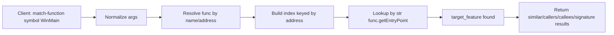

# Fix match-function indexing and parameter handling

## Problem summary

1. **"Function not indexed for matching"** – Every `match-function` call (WinMain, 0x004041f0, FUN_00408b90, map, etc.) fails with this error. The index is built on-the-fly in `[getfunction.py](src/agentdecompile_cli/mcp_server/providers/getfunction.py)` and keyed by `id(func)`. In PyGhidra/JPype, the same Ghidra function can be represented by different Python proxy instances, so the function resolved by name/address has a different `id()` than any entry in the index. Lookup therefore always fails.
2. **Parameter naming** – The registry and CLI advertise `functionIdentifier` and the GetFunction schema uses `function` / `addressOrSymbol`. The base helper `_get_address_or_symbol` already includes `functionidentifier` but not `function`; adding `function` ensures `"function": "WinMain"` is accepted.
3. **Cross-binary (targetProgramPaths)** – Docs and registry advertise `targetProgramPaths` for matching across programs (e.g. K1 vs TSL). The current implementation only supports **intra-program** matching (same binary). Callers get no feedback when they pass `targetProgramPaths`.

---

## Root cause (index)

- Index build (lines 353–374): iterates `fm.getFunctions(True)`, stores features in `by_identity[id(func)]`, and uses the same `id(func)` in `by_caller` / `by_callee`.
- Lookup (lines 454–456): `target_feature = match_index.by_identity.get(id(func))`. The `func` here comes from `_resolve_function(func_id)`, which can return a different proxy for the same Ghidra function, so `id(func)` is not in `by_identity`.

**Fix:** Key the index by **stable function entry address** (e.g. `str(func.getEntryPoint())`) instead of `id(func)`, so resolution by name or address finds the same index entry.

---

## Implementation plan

### 1. Key match index by address in getfunction.py

**File:** [src/agentdecompile_cli/mcp_server/providers/getfunction.py](src/agentdecompile_cli/mcp_server/providers/getfunction.py)

- **Dataclass `_FunctionMatchIndex`** (lines 40–46): Change `by_identity` from `dict[int, _FunctionMatchFeature]` to `dict[str, _FunctionMatchFeature]` (key = address string). Change `by_caller` and `by_callee` from `dict[str, set[int]]` to `dict[str, set[str]]` (sets of addresses).
- `**_get_match_index**` (lines 336–386): Use `addr_str = str(func.getEntryPoint())` as the key; set `by_identity[addr_str] = feature`, and add `addr_str` (not `id(func)`) to `by_caller`/`by_callee` sets.
- `**_handle_match` – "similar" mode** (lines 453–467, 471–477): Resolve `target_feature` with `match_index.by_identity.get(str(func.getEntryPoint()))`. Use a `candidate_addrs: set[str]` instead of `candidate_ids`; discard by address; build `candidate_addrs` from by_caller/by_callee and from signature_candidates by address; iterate `for addr in candidate_addrs` and look up `feature = match_index.by_identity.get(addr)`.
- `**_handle_match` – "signature" mode** (line 434): Replace `if feature.function != func` with a comparison by address, e.g. `if feature.address != str(func.getEntryPoint())`, so signature-mode filtering does not depend on object identity.

No change to "callers" or "callees" modes (they do not use the index).

### 2. Add "function" to _get_address_or_symbol

**File:** [src/agentdecompile_cli/mcp_server/tool_providers.py](src/agentdecompile_cli/mcp_server/tool_providers.py)

- In `_get_address_or_symbol` (lines 925–934), add `"function"` to the `_get_str` key list so that callers passing `"function": "WinMain"` (as in the GetFunction tool schema) are accepted.

### 3. Handle targetProgramPaths in match-function

**File:** [src/agentdecompile_cli/mcp_server/providers/getfunction.py](src/agentdecompile_cli/mcp_server/providers/getfunction.py)

- At the start of `_handle_match`, after resolving the program, check for `targetProgramPaths` (normalized key e.g. `targetprogrampaths`) via `_get_str` or `_get` for an array. If present and non-empty, return a clear error (e.g. `ActionableError` or structured `ValueError`) stating that cross-program matching is not yet implemented and suggesting single-program modes (similar, callers, callees, signature) without `targetProgramPaths`. This avoids silent ignore and sets expectations for K1-vs-TSL use cases.

### 4. Optional: Improve error message when function not in index

- After the address-key fix, the only remaining case for "Function not indexed for matching" would be if the resolved function’s address were not in the index (e.g. external or newly created). The current message is acceptable; optionally clarify it to mention “address” (e.g. “Function not in match index (address …). Ensure the function is in the current program and not external.”). Low priority.

---

## Flow (after fix)

- Index key is now **address string**; same logical function always maps to the same key regardless of Python proxy identity.
- If client sends `targetProgramPaths`, they get an explicit “not implemented” response instead of wrong or confusing behavior.

---

## Testing

- **Unit:** Add or extend a test that builds the index and looks up a function by the same name/address (e.g. in a test program or mock) and verifies the lookup succeeds and returns the expected feature. Optionally test that two resolutions of the same function (e.g. by name and by address) both find the same index entry.
- **Regression:** Run existing match-function–related tests (e.g. in `test_e2e_exhaustive_tool_contracts.py`) to ensure no breakage.
- **Manual:** Run `match-function` with `programPath`, `function`/`functionIdentifier`/`symbol` (e.g. WinMain), and no `targetProgramPaths`; confirm results instead of “Function not indexed for matching”. Then call with `targetProgramPaths` set and confirm the clear “not implemented” message.

---

## Files to change

| File                                                                                                                     | Changes                                                                                                                                             |
| ------------------------------------------------------------------------------------------------------------------------ | --------------------------------------------------------------------------------------------------------------------------------------------------- |
| [src/agentdecompile_cli/mcp_server/providers/getfunction.py](src/agentdecompile_cli/mcp_server/providers/getfunction.py) | Index keyed by address; by_identity/by_caller/by_callee use address strings; targetProgramPaths check and error; signature mode compare by address. |
| [src/agentdecompile_cli/mcp_server/tool_providers.py](src/agentdecompile_cli/mcp_server/tool_providers.py)               | Add `"function"` to `_get_address_or_symbol` key list.                                                                                              |

No schema or registry changes required for the index fix or the "function" alias. Documenting cross-program as “not yet implemented” in TOOLS_LIST.md or tool description is optional.