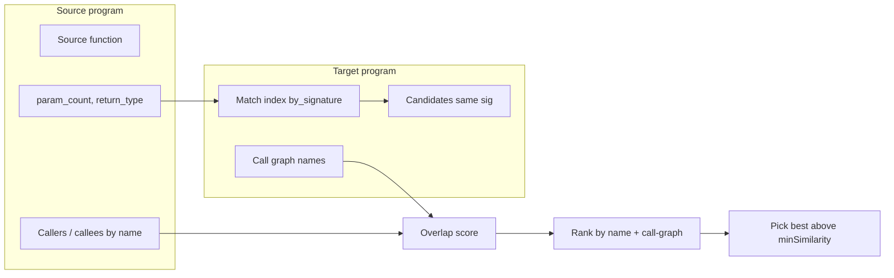

# Match-function: Cross-binary matching without byte comparison

## Rephrasing the critique (in our own words)

The feedback is saying that **any approach that matches functions across binaries by comparing raw bytes or instruction sequences is a bad idea**:

- **Call sites and addresses** almost never match between compilations: most CALLs are relative, so reordering or layout changes alter instruction bytes entirely.
- **Register usage** is compiler-dependent; only a few registers (e.g. ECX/EAX for `this`/return) are somewhat stable; the rest vary with allocation.
- **Stack layout** is fragile: one extra parameter or local changes pushes and all downstream ESP/EBP offsets, so instruction bytes change even when logic is identical.
- **Related but different programs** (e.g. KOTOR 1 vs KOTOR 2) share logic but differ in compilation; small source/compiler differences produce large byte-level differences.

The example shows the **same logical snippet** (get parameter, call `CVirtualMachine::StackPopInteger`, test result, branch): in KOTOR 1 it uses `mov ecx, [ds:...]` then `lea eax,[esp+0x10]` and `je`; in KOTOR 2 it uses `lea eax,[ebp-0x4]`, then sets `ecx`, different call address, and `jne` with a different target. So **bytes lack context, vary between versions, and hide more reliable signals** such as **call paths** (who calls whom) and **logical flow** (same callees, same control-flow role). The conclusion: matching should rely on **call graph, signature, and structural/semantic features**, not on byte or instruction-byte comparison.

---

## Current state: match-function and migrate-metadata

### match-function (cross-program)

**Location:** [src/agentdecompile_cli/mcp_server/providers/getfunction.py](src/agentdecompile_cli/mcp_server/providers/getfunction.py)

- **No byte or instruction-level matching.** Implementation uses only:
  - **Signature** for candidate set: `(param_count, return_type)` from `getParameterCount()` and `getReturnType()`.
  - **Name** for scoring: exact name match = 1.0, same signature but different name = 0.7.
- **Call graph is not used in cross-program mode.** The match index (`_FunctionMatchIndex`) already has `callers` and `callees` (function **names**) per function, built in `_get_match_index()` from `getCallingFunctions()` / `getCalledFunctions()`. These are used only in **single-program** "similar" mode to rank by overlap; in `_handle_match_cross_program()` (lines 789–797) candidates come only from `by_signature.get(sig_key)` and score is name vs 0.7 only.
- **Consequence:** When the same function has different names in two binaries (e.g. one has a symbol, the other `FUN_...`), or many functions share the same signature, the matcher gets multiple 0.7 candidates and picks one arbitrarily (first that passes `score > best_score`). So we can **wrongly** match to a different function that happens to have the same param count and return type.

### migrate-metadata

**Location:** Same provider; [getfunction.py](src/agentdecompile_cli/mcp_server/providers/getfunction.py) `_handle_migrate_metadata` (lines 1010–1015).

- **migrate-metadata** = match-function in **bulk**: it strips the function identifier and calls `_handle_match()`, which then iterates over all (or a limited set of) source function identifiers and runs `_handle_match_cross_program()` for each. So it uses the **same** matching logic (signature + name only; no call-graph in cross-program).

### Documentation mismatch

- [TOOLS_LIST.md](TOOLS_LIST.md) (around lines 921–923) states that match-function uses **"fingerprints"** and **ChromaDB** for matching. The implementation does **not** use ChromaDB or any byte/instruction fingerprints; ChromaDB in the repo is used for semantic search elsewhere, not for match-function. This should be corrected.

---

## Best way to match despite differing assembly (research summary)

- **Avoid:** Byte hashes, instruction-byte comparison, address-dependent or layout-dependent features (they change across compilations/builds).
- **Use (in order of robustness):**
  1. **Call graph (caller/callee names)**
    Callee and caller **names** (e.g. `CVirtualMachine::StackPopInteger`) are often stable across builds and even across related binaries (same engine). Use them to **rank** or **disambiguate** among same-signature candidates: prefer the target function whose call-graph neighborhood (callees/callers) best matches the source.
  2. **Signature as filter**
    Keep `(param_count, return_type)` (and optionally full signature string) as the candidate filter; then apply call-graph (and optionally structural/semantic) scoring.
  3. **Structural/semantic features (optional, for harder cases)**
    Industry tools (BinDiff, Diaphora, QBinDiff) use CFG-based hashes (e.g. MD-index, Weisfeiler–Lehman), semantic flow graphs, or decompiler-based similarity. Ghidra provides **BSim** (behavioral feature vectors, LSH, stable across recompilation). The repo already has [src/agentdecompile_cli/ghidrecomp/bsim.py](src/agentdecompile_cli/ghidrecomp/bsim.py) for **generating** BSim signatures; they are not used by match-function. Optionally, match-function could:
     Use BSim correlation (or a BSim DB) as an optional mode or tie-breaker, or
     Use a simpler structural signal (e.g. number of callees/callers, or normalized callee name set overlap) if BSim is too heavy for the default path.

So the **consistent workaround** for scenarios like the KOTOR example is: **do not rely on bytes;** use **signature + call-graph (names)** to find the right function when names differ; optionally add **BSim or CFG/structural similarity** for ambiguous or heavily optimized pairs.

---

## Recommended direction (plan)

1. **Correct TOOLS_LIST.md**
  - Remove the claim that match-function uses "fingerprints" and ChromaDB. Describe actual behavior: signature `(param_count, return_type)` + name (1.0/0.7), and (after implementation) call-graph-based disambiguation.
2. **Use call-graph in cross-program matching**
  - In `_handle_match_cross_program()`, after getting `candidates = target_index.by_signature.get(sig_key, [])`:
    - Build a **source** set of callee/caller **names** from the source function (already available if we build a one-off feature or reuse the source program’s index).
    - For each candidate, compute overlap of **callee names** and **caller names** with the source (e.g. Jaccard or count of shared names).
    - Combine with current score: e.g. `score = name_score (1.0 or 0.7) + alpha * call_graph_overlap` (or use call-graph overlap only when name doesn’t match, to break ties among 0.7 candidates).
  - Ensure both programs have a match index when doing cross-program (source index may be needed for source’s callers/callees; target index already exists). Use the same `_FunctionMatchFeature` idea: source function’s callers/callees by **name** (no addresses).
3. **Disambiguation when multiple candidates have same signature**
  - When several targets have the same (param_count, return_type), **rank** by call-graph overlap (and optionally by name match first). Pick the best-ranked candidate above `minSimilarity` instead of the first 0.7.
4. **Optional: BSim or structural tie-breaker**
  - If call-graph overlap is still insufficient (e.g. many identical call patterns), consider:
  - **BSim:** Run BSim correlation between source and target program (or query an existing BSim DB) and use the top BSim match as a tie-breaker or optional mode when `minSimilarity` is low or when explicitly requested (e.g. `mode: "semantic"`).
  - This can be a follow-up; the main gain is call-graph in cross-program.
5. **Docs and prompts**
  - In Bridge Builder (or comparative RE) prompts, state explicitly that matching is **not** byte-based; it uses **signature, name, and call graph (and optionally BSim)** so it works across different compilations and related binaries (e.g. KOTOR 1 vs KOTOR 2).
  - Add a short note in AGENTS.md or a doc that cross-binary matching relies on call paths and logical flow, not instruction bytes.

---

## Architecture sketch (cross-program with call-graph)

---

## Files to touch (summary)

| Change                                                                                 | File(s)                                                                                                                                                                                                  |
| -------------------------------------------------------------------------------------- | -------------------------------------------------------------------------------------------------------------------------------------------------------------------------------------------------------- |
| Fix TOOLS_LIST description (no fingerprints/ChromaDB; add call-graph once implemented) | [TOOLS_LIST.md](TOOLS_LIST.md)                                                                                                                                                                           |
| Add call-graph scoring and disambiguation in cross-program match                       | [src/agentdecompile_cli/mcp_server/providers/getfunction.py](src/agentdecompile_cli/mcp_server/providers/getfunction.py) (`_handle_match_cross_program`, possibly helper to get source call-graph names) |
| Optional: BSim integration as tie-breaker or mode                                      | [getfunction.py](src/agentdecompile_cli/mcp_server/providers/getfunction.py), [ghidrecomp/bsim.py](src/agentdecompile_cli/ghidrecomp/bsim.py) (if needed)                                                |
| Document that matching is signature + call graph (no bytes)                            | Bridge Builder / comparative prompt in [prompt_providers.py](src/agentdecompile_cli/mcp_server/prompt_providers.py); optional [AGENTS.md](AGENTS.md) or docs                                             |

No byte or instruction-level matching is required; the improvement is to **use the call graph that the index already has** in cross-program mode and to **correct the docs** so users and agents do not assume fingerprints/bytes are in use.