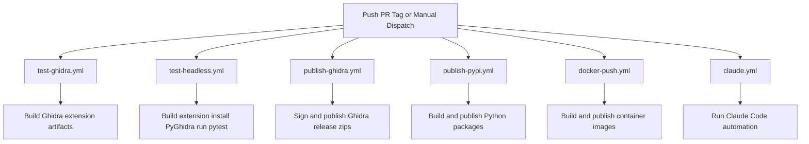

# GitHub Actions CI Workflows

This document summarizes the GitHub Actions workflows that currently ship with AgentDecompile.



## Workflow Inventory

### `test-ghidra.yml`

- Purpose: validate the Gradle-based Ghidra extension build.
- Triggers: push and pull request activity targeting `main` or `develop`.
- Matrix: `ubuntu-latest` x Ghidra `12.0` and `latest`.
- Runtime: Java 21, Gradle 8.14, Xvfb, downloaded Ghidra installation.
- Output: extension build artifacts uploaded from each matrix job.

This workflow is the narrow extension-build check. It does not run the full Python test suite.

### `test-headless.yml`

- Purpose: exercise the Python and PyGhidra test stack in CI.
- Triggers: push and pull request activity targeting `main` or `develop`, plus manual `workflow_dispatch`.
- Matrix: `ubuntu-latest` and `macos-latest` x Ghidra `12.0` and `latest`.
- Runtime: Java 21, Python 3.10, Gradle 8.14, `uv`, downloaded Ghidra installation.
- Test command: `uv run pytest tests/ -v --timeout=180 --tb=short --junitxml=test-results.xml`.

The workflow builds the extension, installs it into the downloaded Ghidra directory, installs PyGhidra from that same installation, and then runs the Python test suite. That makes it the closest CI approximation of the supported headless runtime.

### `publish-ghidra.yml`

- Purpose: build, sign, and attach Ghidra distribution archives to GitHub releases.
- Triggers: release publication and manual `workflow_dispatch`.
- Runtime: Java 21 with Gradle-based extension packaging.
- Output: signed Ghidra extension zip artifacts uploaded to the corresponding release.

### `publish-pypi.yml`

- Purpose: build Python distributions and publish them to TestPyPI or PyPI.
- Triggers: manual `workflow_dispatch` and release or tag driven publishing.
- Runtime: Python 3.12 with build and publishing tooling.
- Output: source distribution and wheel, published package artifacts, and release-attached signatures for tag builds.

### `docker-push.yml`

- Purpose: build and publish the container images maintained by this repository.
- Triggers: tag-driven release flow and manual dispatch.
- Output: multi-image Docker builds covering the AIO, MCP-only, Ghidra, and Ghidra BSIM server variants.
- Platforms: workflow is set up for multi-architecture publishing, including `amd64` and `arm64` image variants where configured.

### `claude.yml`

- Purpose: run repository automation driven by Claude Code on supported GitHub events.
- Triggers: issue comments, pull request reviews, and related events that include `@claude`.

## Matrix Strategy

### Extension Build Matrix

```text
OS:      ubuntu-latest
Ghidra:  12.0, latest
Jobs:    2
```

### Headless Test Matrix

```text
OS:      ubuntu-latest, macos-latest
Ghidra:  12.0, latest
Jobs:    4
```

Both test workflows disable fail-fast so the full matrix completes even when one configuration fails early.

## Local Reproduction

Use the commands below when you want to approximate the CI steps locally.

### Reproduce the extension build

```bash
gradle clean buildExtension
```

### Reproduce the headless test flow

```bash
export GHIDRA_INSTALL_DIR=/path/to/ghidra
uv sync
uv pip install "$GHIDRA_INSTALL_DIR/Ghidra/Features/PyGhidra/pypkg"
uv run pytest tests/ -v --timeout=180 --tb=short
```

If you want to mirror `test-headless.yml` more closely, also build the extension and install the generated zip into the local Ghidra `Extensions` directory before running the tests.

## Practical Notes

- CI still validates both sides of the project: Gradle-built Ghidra artifacts and the Python MCP runtime.
- User-facing documentation focuses on the Python and MCP entry points, but the repository still ships and tests the packaged Ghidra extension in CI.
- `AGENTS.md` remains the best place for contributor-facing lint, test, and build commands.

### For Contributors

1. **Run tests locally before pushing**

  For extension build validation:
   ```bash
   gradle buildExtension
   ```

   For Python/Headless:
   ```bash
   uv sync
   uv run pytest tests/ -v
   ```

2. **Use draft PRs for work-in-progress** to avoid unnecessary CI runs

3. **Check CI status before requesting review**

4. **Add tests for new features** - both unit tests (matched to test type) and integration tests

### For Maintainers

1. **Review all CI results** before merging PRs

2. **Monitor workflow performance** and matrix configuration

3. **Update workflows when**:
   - New Ghidra version released
   - New Python version support needed
   - Dependencies updated
   - Build/test infrastructure changes

4. **Keep this documentation updated** when changing workflows

## Troubleshooting CI

### Workflow doesn't trigger

**Check**:
- Branch name matches trigger pattern (main, develop)
- File changes match any path filters
- Workflow file syntax is valid YAML

### Tests pass locally but fail in CI

**Common causes**:
- Environment differences (OS, versions, paths)
- Missing dependencies in CI workflow
- Timeout too short
- Race conditions in parallel tests

**Debug steps**:
1. Compare workflow environment with local setup
2. Check Ghidra/Java/Python versions match
3. Add logging/debugging to test code
4. Increase timeout values if needed
5. Use GitHub workflow dispatch to test specific branches

### Very long CI times

**Optimization**:
1. Reduce matrix size if not needed
2. Use caching for gradle/pip dependencies
3. Combine related steps
4. Profile slow tests and optimize

## Monitoring

### Workflow Status Badge

Add to README:
```markdown


```

### GitHub Notifications

GitHub sends notifications on:
- Workflow failures (to committer)
- Status changes (if repo is watched)

Configure in GitHub → Settings → Notifications

## References

- [GitHub Actions Documentation](https://docs.github.com/en/actions)
- [setup-ghidra Action](https://github.com/antoniovazquezblanco/setup-ghidra)
- [Gradle Actions](https://github.com/gradle/actions)
- [PyGhidra Documentation](https://github.com/dod-cyber-crime-center/pyghidra)
- [uv Package Manager](https://docs.astral.sh/uv/)
