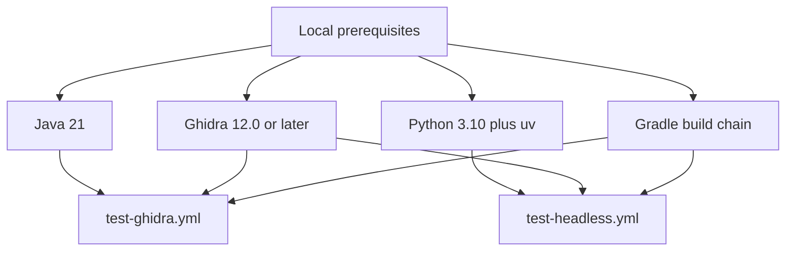

# GitHub Actions Workflow Setup

This document explains how the repository's GitHub Actions workflows are structured and what you need locally to reproduce them.



## Workflow Files

The repository currently defines these workflow files in `.github/workflows/`:

- `test-ghidra.yml`: validates the packaged Ghidra extension build.
- `test-headless.yml`: runs the Python and PyGhidra test suite.
- `publish-ghidra.yml`: builds, signs, and publishes Ghidra release artifacts.
- `publish-pypi.yml`: builds and publishes the Python package.
- `docker-push.yml`: builds and publishes the maintained container images.
- `claude.yml`: runs Claude Code automation for supported GitHub events.

## Local Environment Requirements

To reproduce the test workflows locally, match the same core toolchain they use:

- Java 21.
- Python 3.10 for the main test path.
- `uv` for dependency management and test execution.
- Ghidra 12.0 or newer, with `GHIDRA_INSTALL_DIR` pointing at the installation.
- Gradle support for the extension packaging steps.

The headless workflow is not Python-only in CI. It still builds the packaged Ghidra extension first, then installs PyGhidra from the downloaded Ghidra tree, and only then runs `pytest`.

## Reproducing the Main Workflows

### Extension build validation

```bash
gradle clean buildExtension
```

That is the core step exercised by `test-ghidra.yml` before artifact upload.

### Headless MCP test flow

```bash
export GHIDRA_INSTALL_DIR=/path/to/ghidra
uv sync
uv pip install "$GHIDRA_INSTALL_DIR/Ghidra/Features/PyGhidra/pypkg"
uv run pytest tests/ -v --timeout=180 --tb=short
```

If you are debugging CI parity, also install the generated extension zip into the local Ghidra `Extensions` directory first, because `test-headless.yml` performs that installation step.

## Workflow Intent

- `test-ghidra.yml` is the fast packaging check.
- `test-headless.yml` is the main runtime validation path for the Python MCP stack.
- `publish-ghidra.yml` and `publish-pypi.yml` split release publication by artifact type.
- `docker-push.yml` publishes the containerized deployment variants.

## Common Failure Modes

- Missing or incorrect `GHIDRA_INSTALL_DIR` causes PyGhidra installation or runtime failures.
- Java version drift can break Gradle or Ghidra startup.
- Local runs that skip the extension build can differ from CI behavior.
- Slow or integration-heavy tests may require the same timeout budget used in CI.

## References

- `AGENTS.md` for the contributor-facing test, lint, and build commands used in this repository.
- `.github/CI_WORKFLOWS.md` for the current workflow-by-workflow summary.
