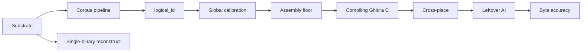

# Concepts

Shared domain vocabulary for this project — entities, named processes, and status concepts with project-specific meaning. Seeded with core domain vocabulary, then accretes as ce-compound and ce-compound-refresh process learnings; direct edits are fine. Glossary only, not a spec or catch-all.

## Binary-as-context substrate

### Substrate
The product surface that turns opaque compiled/packaged artifacts into navigable, provenance-anchored evidence agents can compose — distinct from any single recovery pipeline.

### Dismantling
Breaking delivery formats (installers, archives, app trees, binaries) into inspectable layout trees and extracted members without claiming recovered source identity.

### Acquisition bundle
A fingerprint-keyed evidence pack of address-keyed facts and conflicts from acquisition; queryable as advisory context, not as verified recovery.

### Claim boundary
An explicit statement on an artifact or tool response that limits what may be asserted (for example advisory layout vs compile+objdiff verified). Claim tiers are product policy; acceptance gates are caller-chosen.

### Matching recovery (recipe)
An optional operator path that inventorizes, synthesizes candidates, and proves functions with compile+objdiff. Useful when chosen; not the charter of the substrate.

### Corpus pipeline
The main multi-binary recovery path: extract facts → bind `logical_id` → global calibration → scaffolding (assembly floor) → readable C (`ghidra-bulk`) → propagation (`cross-place`) → targeted AI on leftovers → parity (objdiff). Source is copied only after compile. Machine-code wrappers are not source. Never decompile the same logical function twice. Skip a step when its receipt or Ghidra analysis already exists.

### logical_id
The shared identity of one function across every registered build. Addresses differ; the logical object does not. Propagation and skip-existing keys use this id, not a per-binary address.

### Global calibration
Solving compiler versions, optimization flags, calling conventions, and global struct layouts once for the corpus, before per-function recovery. Distinct from `corpus calibrate`, which only sweeps matcher score and margin.

### Assembly floor
A linking donor workspace with one file per function. Exact inline assembly stands in until compiling C replaces it. A linked image here is not byte identity.

### Debug donor
The registered binary that still carries STABS or DWARF source paths. It owns the workspace folder layout. Other binaries inherit that layout through identity bindings.

### Skip-if-done
Do not redo a step whose receipt or Ghidra state already exists. Opening an analyzed project uses the functions already there. `analyze-program` runs only when that program has no analysis yet. `--force` is the retry.

### Portable signature
The evidence that should find the same `logical_id` on every registered build. Preference: debug/STABS name + compilation unit, then strings/constants/imports + decompiled shape (`match_engine`), then BSim, then a unique byte window. A workbench "signature" that is just the first C prototype line is not this.

### Byte-window search
Copy a short unique instruction run from one image and hunt it in another. That is how a person finds a function by hand. The matcher does not start there (`match_engine` compares no raw bytes and no absolute addresses). A hook host may use a recorded window (`expected_bytes`) to resolve or verify a site when the VA is missing or stale.

### Leftover
A bound `logical_id` that still has assembly on disk, already tried C or failed compile, and has no `real_c`. Targeted AI and `genproject --leftover-only` only. Not a second pass over recovered source.

### Hook pack
An export from the corpus store (`corpus.export-hookpack`) that a Phasor-shaped host can load: logical site names, the preferred signature family, per-build addresses only as a cache. Game-specific names live in the pack, not in the resolver.

### Reconstruct funnel
The one-shot reconstruct / CRITICAL_PATH stage chain for a single binary. Useful as a recipe; the corpus pipeline is how a set of binaries is recovered together.

## Flagged ambiguities

- "'Recovery' had been used for both the whole product and the matching recipe — prefer Substrate for the product motif and Matching recovery for the recipe track."

Return: [USAGE.md](USAGE.md) · [docs/INDEX.md](docs/INDEX.md)
