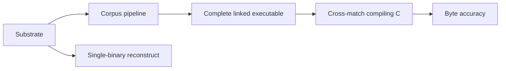

# Concepts

Shared domain vocabulary for this project — entities, named processes, and status concepts with project-specific meaning. Seeded with core domain vocabulary, then accretes as ce-compound and ce-compound-refresh process learnings; direct edits are fine. Glossary only, not a spec or catch-all.

## Binary-as-context substrate

### Substrate
The product surface that turns opaque compiled/packaged artifacts into navigable, provenance-anchored evidence agents can compose — distinct from any single recovery pipeline.

### Dismantling
Breaking delivery formats (installers, archives, app trees, binaries) into inspectable layout trees and extracted members without claiming recovered source identity.

### Acquisition bundle
A fingerprint-keyed evidence pack of address-keyed facts and conflicts from acquisition; queryable as advisory context, not as verified recovery.

### Claim boundary
An explicit statement on an artifact or tool response that limits what may be asserted (for example advisory layout vs compile+objdiff verified). Claim tiers are product policy; acceptance gates are caller-chosen.

### Matching recovery (recipe)
An optional operator path that inventorizes, synthesizes candidates, and proves functions with compile+objdiff. Powerful when chosen; not the charter of the substrate.

### Corpus pipeline
The main multi-binary recovery path: extract → identify → merge knowledge → generate projects → recover source → apply cross-build → compile → verify byte accuracy. Source is copied only after compile. Machine-code wrappers are not source.

### Debug donor
The registered binary that still carries STABS or DWARF source paths. It owns the workspace folder layout. Other binaries inherit that layout through identity bindings.

### Reconstruct funnel
The one-shot reconstruct / CRITICAL_PATH stage chain for a single binary. Useful as a recipe; the corpus pipeline is how a set of binaries is recovered together.

## Flagged ambiguities

- "'Recovery' had been used for both the whole product and the matching recipe — prefer Substrate for the product motif and Matching recovery for the recipe track."
