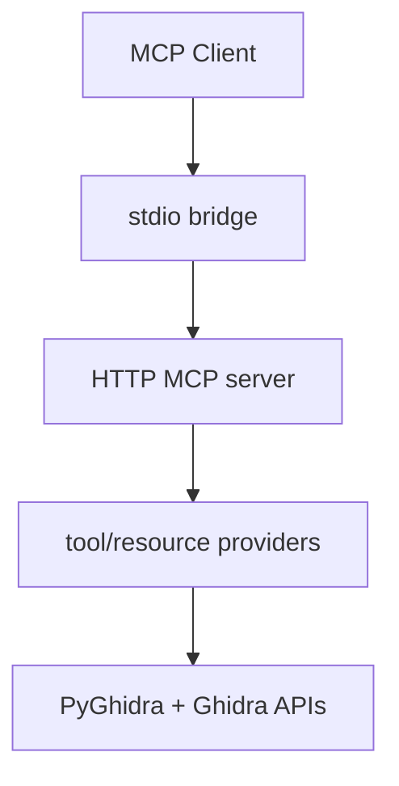

# Contributing to AgentDecompile

Thanks for helping improve AgentDecompile.

## Contents

- [How to Contribute](#how-to-contribute)
- [Development Setup](#development-setup)
- [Project Layout](#project-layout)
- [Architecture](#architecture)
- [Adding a Tool](#adding-a-tool)
- [Testing](#testing)
- [Style](#style)
- [Debugging](#debugging)

---

## How to Contribute

1. Fork the repository.
2. Create a feature branch.
3. Implement and test your change.
4. Open a pull request with a clear summary.

---

## Development Setup

### Prerequisites

- Python 3.10+
- Ghidra 12+
- `uv` (recommended)
- Git

### Install

```bash
git clone https://github.com/bolabaden/AgentDecompile.git
cd AgentDecompile
uv sync
```

Set your Ghidra location:

```bash
export GHIDRA_INSTALL_DIR=/path/to/ghidra
```

---

## Project Layout

- `src/agentdecompile_cli/` — CLI, server, providers, resources, utilities
- `tests/` — pytest unit/integration/e2e coverage
- `docs/` — user and workflow documentation
- `vendor/` — upstream reference implementations used for parity checks

---

## Architecture

AgentDecompile exposes Ghidra capabilities through a Python MCP server.



### Runtime flow

1. `agentdecompile_cli` initializes PyGhidra and project context.
2. The MCP server starts on HTTP transport.
3. The stdio bridge proxies MCP requests to HTTP.
4. Providers execute operations and return structured results.

---

## Adding a Tool

1. Add or extend a provider in `src/agentdecompile_cli/mcp_server/providers/`.
2. Register mode/handler entries in that provider.
3. Wire provider exposure through the provider manager.
4. Add tests in `tests/` for happy-path and error-path behavior.
5. Update docs if schema, modes, or response shape changed.

---

## Testing

Run focused tests first, then broader suites.

```bash
uv run pytest tests/test_provider_*.py -v
uv run pytest tests/test_mcp_tools.py -v
uv run pytest tests/ -v
```

Use markers when needed:

```bash
uv run pytest -m "not slow" -v
```

---

## Style

- Follow PEP 8 and existing local conventions.
- Keep changes narrow and task-focused.
- Prefer reusable helpers over duplicated logic.
- Preserve normalization behavior for tool and argument names.

---

## Debugging

Useful environment flags:

- `AGENT_DECOMPILE_PROJECT_PATH=/path/to/project.gpr`
- `AGENT_DECOMPILE_MCP_SERVER_URL=http://host:port`

Quick local run:

```bash
uv run agentdecompile-cli --help
```

---

## Pull Request Checklist

- [ ] Scope is minimal and intentional
- [ ] Tests pass locally
- [ ] Docs reflect behavioral changes
- [ ] Tool schema and normalization behavior stay consistent
