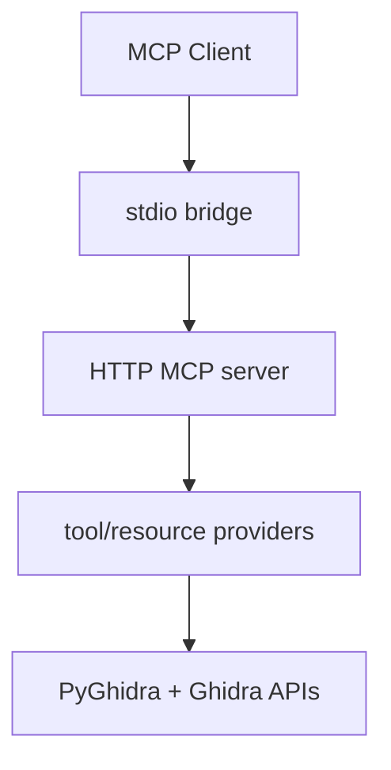
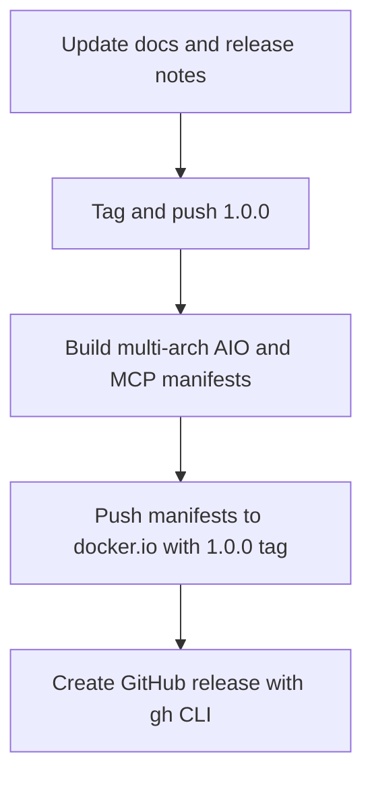

# Contributing to AgentDecompile

Thanks for helping improve AgentDecompile.

## Contents

- [How to Contribute](#how-to-contribute)
- [Development Setup](#development-setup)
- [Project Layout](#project-layout)
- [Architecture](#architecture)
- [Adding a Tool](#adding-a-tool)
- [Testing](#testing)
- [Style](#style)
- [Debugging](#debugging)
- [Release Process](#release-process)

---

## How to Contribute

1. Fork the repository.
2. Create a feature branch.
3. Implement and test your change.
4. Open a pull request with a clear summary.

---

## Development Setup

### Prerequisites

- Python 3.10+
- Ghidra 12+
- `uv` (recommended)
- Git

### Install

```bash
git clone https://github.com/bolabaden/AgentDecompile.git
cd AgentDecompile
uv sync
```

Set your Ghidra location:

```bash
export GHIDRA_INSTALL_DIR=/path/to/ghidra
```

---

## Project Layout

- `src/agentdecompile_cli/` — CLI, server, providers, resources, utilities
- `tests/` — pytest unit/integration/e2e coverage
- `docs/` — user and workflow documentation
- `vendor/` — upstream reference implementations used for parity checks

---

## Architecture

AgentDecompile exposes Ghidra capabilities through a Python MCP server.



### Runtime flow

1. `agentdecompile_cli` initializes PyGhidra and project context.
2. The MCP server starts on HTTP transport.
3. The stdio bridge proxies MCP requests to HTTP.
4. Providers execute operations and return structured results.

---

## Adding a Tool

1. Add or extend a provider in `src/agentdecompile_cli/mcp_server/providers/`.
2. Register mode/handler entries in that provider.
3. Wire provider exposure through the provider manager.
4. Add tests in `tests/` for happy-path and error-path behavior.
5. Update docs if schema, modes, or response shape changed.

---

## Primary vs Legacy tool names

- The project maintains a curated default advertised tool-name set (what the server exposes by default and what `agentdecompile-cli tool --list-tools` returns).
- The canonical tool list in `src/agentdecompile_cli/registry.py` documents all supported tool names; many additional names are legacy compatibility forwards and synonyms.
- Policy: prefer adding or updating the default advertised tool name and its schema first, then document any legacy aliases as forwards in `TOOLS_LIST.md` when needed for compatibility.
- Legacy names remain callable for backwards compatibility. To re-advertise the full legacy surface during testing or compatibility modes, set either `AGENTDECOMPILE_SHOW_LEGACY_TOOLS=1` or `AGENTDECOMPILE_ENABLE_LEGACY_TOOLS=1` in your environment.
- When submitting changes that add or remove tool names, update `TOOLS_LIST.md` and run `helper_scripts/generate_tools_list.py` and the tools-doc parity tests.


## Testing

Run focused tests first, then broader suites.

```bash
uv run pytest tests/test_provider_*.py -v
uv run pytest tests/test_mcp_tools.py -v
uv run pytest tests/ -v
```

Use markers when needed:

```bash
uv run pytest -m "not slow" -v
```

---

## Style

- Follow PEP 8 and existing local conventions.
- Keep changes narrow and task-focused.
- Prefer reusable helpers over duplicated logic.
- Preserve normalization behavior for tool and argument names.

---

## Debugging

Useful environment flags:

- `AGENT_DECOMPILE_PROJECT_PATH=/path/to/project.gpr`
- `AGENT_DECOMPILE_MCP_SERVER_URL=http://host:port`

Quick local run:

```bash
uv run agentdecompile-cli --help
```

---

## Release Process

All project release identifiers must use plain semver format like `1.0.0` (never with a leading `v`).



1. Create and push the release tag:

```bash
git tag 1.0.0
git push origin 1.0.0
```

2. Build multi-arch images with Podman manifests:

```bash
podman build --platform linux/amd64,linux/arm64 -f Dockerfile.aio --manifest bolabaden/agentdecompile-aio:1.0.0 .
podman build --platform linux/amd64,linux/arm64 -f Dockerfile --manifest bolabaden/agentdecompile-mcp:1.0.0 .
```

3. Push both manifests to Docker Hub under `1.0.0`:

```bash
podman manifest push --all bolabaden/agentdecompile-aio:1.0.0 docker://docker.io/bolabaden/agentdecompile-aio:1.0.0
podman manifest push --all bolabaden/agentdecompile-mcp:1.0.0 docker://docker.io/bolabaden/agentdecompile-mcp:1.0.0
```

4. Create the GitHub release using `gh`:

```bash
gh release create 1.0.0 --title "AgentDecompile 1.0.0" --notes-file RELEASE_NOTES_1.0.0.md
```

Recommended release notes structure in `RELEASE_NOTES_1.0.0.md`:

- Heading: `# AgentDecompile 1.0.0`
- Highlights: major capabilities, compatibility guarantees, and notable fixes.
- Containers:
  - `docker.io/bolabaden/agentdecompile-aio:1.0.0`
  - `docker.io/bolabaden/agentdecompile-mcp:1.0.0`
- Installation/upgrade snippets for CLI and containers.

---

## Pull Request Checklist

- [ ] Scope is minimal and intentional
- [ ] Tests pass locally
- [ ] Docs reflect behavioral changes
- [ ] Tool schema and normalization behavior stay consistent
