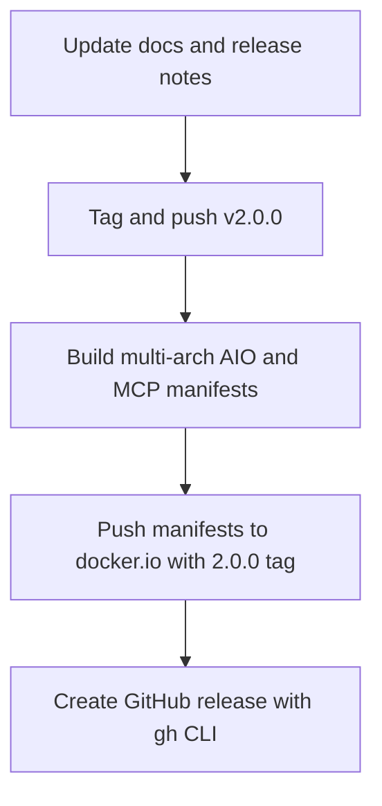

# Contributing to AgentDecompile

Thanks for helping improve AgentDecompile.

## Contents

- [Contributing to AgentDecompile](#contributing-to-agentdecompile)
  - [Contents](#contents)
  - [How to Contribute](#how-to-contribute)
  - [Development Setup](#development-setup)
    - [Prerequisites](#prerequisites)
    - [Install](#install)
  - [Project Layout](#project-layout)
  - [Architecture](#architecture)
    - [Entrypoints](#entrypoints)
    - [Runtime flow](#runtime-flow)
    - [Static call graph artifacts](#static-call-graph-artifacts)
  - [Adding a Tool](#adding-a-tool)
  - [Primary vs Legacy tool names](#primary-vs-legacy-tool-names)
  - [Testing](#testing)
  - [Style](#style)
  - [Debugging](#debugging)
    - [Operational patterns contributors should preserve](#operational-patterns-contributors-should-preserve)
  - [Release Process](#release-process)
  - [Pull Request Checklist](#pull-request-checklist)

---

## How to Contribute

1. Fork the repository.
2. Create a feature branch.
3. Implement and test your change.
4. Open a pull request with a clear summary.

---

## Development Setup

### Prerequisites

- Python 3.10+
- Ghidra 12+
- `uv` (recommended)
- Git

### Install

```bash
git clone https://github.com/bolabaden/AgentDecompile.git
cd AgentDecompile
uv sync
```

Set your Ghidra location:

```bash
export GHIDRA_INSTALL_DIR=/path/to/ghidra
```

---

## Project Layout

- `src/agentdecompile_cli/` — CLI, server, providers, resources, utilities
- `tests/` — pytest unit/integration/e2e coverage
- `docs/` — user, workflow, and architecture documentation
- `docs/generated/` — machine-generated static call graph and entrypoint reachability artifacts
- `vendor/` — upstream reference implementations used for parity checks

---

## Architecture

AgentDecompile exposes Ghidra capabilities through a Python MCP server, but the repo actually contains four distinct runtime planes that share the same provider layer.

```mermaid
flowchart TD
  subgraph ConsoleScripts[Console scripts]
    CLI1[agentdecompile / agentdecompile-cli]
    CLI2[agentdecompile-mcp / mcp-agentdecompile]
    CLI3[agentdecompile-server]
    CLI4[agentdecompile-proxy]
  end

  CLI1 --> A[HTTP client CLI]
  CLI2 --> B[stdio MCP launcher]
  CLI3 --> C[local PyGhidra MCP server]
  CLI4 --> D[proxy MCP server]

  A --> E[AgentDecompileMcpClient]
  B --> F[local runtime bootstrap]
  C --> G[tool and resource providers]
  D --> H[forward to remote backend]
  F --> G
  E --> I[/mcp or /mcp/message]
  H --> I
  G --> J[PyGhidra + Ghidra APIs]
```

### Entrypoints

| Script | Target | Role |
| --- | --- | --- |
| `agentdecompile` / `agentdecompile-cli` | `agentdecompile_cli.cli:cli_entry_point` | Main HTTP client CLI |
| `agentdecompile-mcp` / `mcp_agentdecompile` / `mcp-agentdecompile` | `agentdecompile_cli.__main__:main` | MCP stdio launcher |
| `agentdecompile-server` | `agentdecompile_cli.server:main` | Local PyGhidra-backed MCP server |
| `agentdecompile-proxy` | `agentdecompile_cli.server:proxy_main` | Proxy-only MCP forwarder |

### Runtime flow

1. `agentdecompile_cli.server:main` initializes PyGhidra, project paths, and the provider managers when running locally.
2. `agentdecompile_cli.__main__:main` serves the stdio MCP path and can either bootstrap local runtime state or connect to an existing backend.
3. `agentdecompile_cli.cli:cli_entry_point` prefers HTTP transport, but when no explicit backend target was requested it can auto-start a local MCP server or fall back to in-process local execution.
4. `agentdecompile_cli.server:proxy_main` forwards tools, resources, and prompts to an existing MCP backend without starting local PyGhidra.
5. Tool providers execute the actual operations and return structured responses through the MCP server layer.

### Static call graph artifacts

The repository includes machine-generated source graph artifacts so contributors can reason about the runtime without manually tracing every entrypoint.

- `docs/SRC_ENTRYPOINTS_CALL_GRAPH.md` is the readable overview and links to the generated files.
- `docs/generated/src_static_call_graph.json` contains the raw static inventory of modules, definitions, imports, decorators, and call sites.
- `docs/generated/src_static_call_graph_full.mmd` is the exhaustive Mermaid graph.
- `docs/generated/src_static_call_graph_summary.json` records the top-level hotspot counts.
- `docs/generated/src_entrypoint_reachability.json` shows reachability slices from each packaged entry function.

Current generated summary:

- `76` Python modules under `src/agentdecompile_cli`
- `1444` discovered classes, functions, and methods
- `12016` call sites total
- `4873` package-internal call sites before deduplication
- `3150` deduplicated internal caller-to-callee edges in the full Mermaid graph
- `84` Click command or group functions in `agentdecompile_cli.cli`

---

## Adding a Tool

1. Add or extend a provider in `src/agentdecompile_cli/mcp_server/providers/`.
2. Register mode/handler entries in that provider.
3. Wire provider exposure through the provider manager.
4. Add tests in `tests/` for happy-path and error-path behavior.
5. Update docs if schema, modes, or response shape changed.

---

## Primary vs Legacy tool names

- The project maintains a curated default advertised tool-name set (what the server exposes by default and what `agentdecompile-cli tool --list-tools` returns).
- The canonical tool list in `src/agentdecompile_cli/registry.py` documents all supported tool names; many additional names are legacy compatibility forwards and synonyms.
- Policy: prefer adding or updating the default advertised tool name and its schema first, then document any legacy aliases as forwards in `TOOLS_LIST.md` when needed for compatibility.
- Legacy names remain callable for backwards compatibility. To re-advertise the full legacy surface during testing or compatibility modes, set either `AGENTDECOMPILE_SHOW_LEGACY_TOOLS=1` or `AGENTDECOMPILE_ENABLE_LEGACY_TOOLS=1` in your environment.
- When submitting changes that add or remove tool names, update `TOOLS_LIST.md` and run the doc sync scripts, then verify generator output:
  - **`helper_scripts/reorder_tools_list_canonical.py`** — reorders the **Canonical Tool Docs** section and TOC to match `registry.TOOLS` (`Tool` enum order); drops headings not in `TOOLS`; inserts stubs for new tools. Run this after changing the enum or when docs drift from the registry order.
  - **`helper_scripts/generate_tools_list.py`** — refreshes **Overloads** blocks (and related merges); stdout must report `MATCH_EXACT True` against the current `TOOLS_LIST.md`.


## Testing

Run focused tests first, then broader suites.

```bash
uv run pytest -m unit -v
uv run pytest tests/ -v --timeout=120
uv run pytest tests/test_e2e_cancelled_profile.py -v --timeout=300 -s
```

Use markers when needed:

```bash
uv run pytest -m "not slow" -v
```

For the profiled cancelled-timeout reproduction suite, run:

```bash
uv run pytest tests/test_e2e_cancelled_profile.py -v --timeout=300 -s
```

The suite starts a local subprocess-backed server, imports a deterministic duplicated fixture corpus, records Python cProfile output, and emits a JFR dump for the embedded PyGhidra JVM.

**Manual E2E (shared/local checkout–checkin, `sync-project`, MCP restart):** See **[docs/e2e_shared_local_checkout_sync.md](docs/e2e_shared_local_checkout_sync.md)** for the full runbook. With Ghidra Server and `agentdecompile-server` running, use `scripts/e2e_checkout_sync_plan_runner.ps1`. Prefer **`-Phase shared_plus_sync`** for one `tool-seq` that runs open → import → three edit cycles → `sync-project` pull/push (same MCP session; avoids losing `project_data` before sync). Other phases: `shared`, `restart_assert`, `sync`, `local_full`, `restart_local_assert`, `all`, `all_local`. Use **`-AnalyzeAfterImport`** if `list-functions` / rename targets need analysis. **`-ContinueOnError`** forwards `tool-seq --continue-on-error` (runs all steps; CLI still exits non-zero if any step failed). **`tool-seq`** also counts steps as failed when the MCP text payload contains markdown **`## Error`** (blockquote-style) or **`## Modification conflict`**, even if **`isError`** is false. Override `-ProgramPath`, `-FunCycle1`, `-LabelAddress`, `-FunCycle3` from `list-project-files` / `list-functions` if your binary differs from `sort.exe`.

Authoritative commands are also listed in `AGENTS.md`:

- `uv run ruff check --no-fix src/ tests/`
- `uv run pytest tests/ -v --timeout=120`
- `uv run pytest -m unit -v`
- `uv build`

---

## Style

- Follow PEP 8 and existing local conventions.
- Keep changes narrow and task-focused.
- Prefer reusable helpers over duplicated logic.
- Preserve normalization behavior for tool and argument names.

---

## Debugging

Useful environment flags:

- `AGENT_DECOMPILE_PROJECT_PATH=/path/to/project.gpr`
- `AGENT_DECOMPILE_MCP_SERVER_URL=http://host:port`

Quick local run:

```bash
uv run agentdecompile-cli --help
```

### Operational patterns contributors should preserve

When changing CLI routing, transport logic, project opening, or shared-server handling, keep these validated behaviors stable unless the PR intentionally changes them:

- `/mcp` remains the canonical MCP HTTP endpoint; `/mcp/message` remains compatibility.
- Fresh CLI invocations are session-isolated; `tool-seq` is the supported state-preserving path.
- Shared-server authentication failures should surface both high-level wrapper context and underlying adapter cause where available.
- Tool guidance responses (for example no-active-program cases) may be returned as normal tool content; tests should assert payload contract rather than assuming transport-level failure.
- Convenience CLI commands and raw-tool calls can expose different option shapes; docs and tests should reflect the public command surface.
- Local version-control probes can produce semantic errors in content (`checkout-program`, `checkin-program`) while transport and outer tool call status remain successful.
- Local import flows should not unexpectedly require shared-server connectivity in follow-up local inspection paths unless shared mode is explicitly requested.

When touching any of the above, update all of:

1. `README.md` runtime/usage sections.
2. `USAGE.md` command and failure-state sections.
3. `examples/usage_validation.ipynb` validation logic and summary output.
4. Focused tests in `tests/` that lock expected behavior.

---

## Release Process

All project release identifiers must use semver `2.0.0` and Git tag format like `v2.0.0`.


```mermaid
flowchart TD
  A[Update docs and release notes] --> B[Tag and push v2.0.0]
  B --> C[Build multi-arch AIO and MCP manifests]
  C --> D[Push manifests to docker.io with 2.0.0 tag]
  D --> E[Create GitHub release with gh CLI]
```

1. Create and push the release tag:

```bash
git tag v2.0.0
git push origin v2.0.0
```

2. Build multi-arch images with Podman manifests:

```bash
podman build --platform linux/amd64,linux/arm64 -f Dockerfile.aio --manifest bolabaden/agentdecompile-aio:2.0.0 .
podman build --platform linux/amd64,linux/arm64 -f Dockerfile --manifest bolabaden/agentdecompile-mcp:2.0.0 .
```

3. Push both manifests to Docker Hub under `2.0.0`:

```bash
podman manifest push --all bolabaden/agentdecompile-aio:2.0.0 docker://docker.io/bolabaden/agentdecompile-aio:2.0.0
podman manifest push --all bolabaden/agentdecompile-mcp:2.0.0 docker://docker.io/bolabaden/agentdecompile-mcp:2.0.0
```

4. Create the GitHub release using `gh`:

```bash
gh release create v2.0.0 --title "AgentDecompile 2.0.0" --notes-file RELEASE_NOTES_2.0.0.md
```

Recommended release notes structure in `RELEASE_NOTES_2.0.0.md`:

- Heading: `# AgentDecompile 2.0.0`
- Highlights: major capabilities, compatibility guarantees, and notable fixes.
- Containers:
  - `docker.io/bolabaden/agentdecompile-aio:2.0.0`
  - `docker.io/bolabaden/agentdecompile-mcp:2.0.0`
- Installation/upgrade snippets for CLI and containers.

---

## Pull Request Checklist

- [ ] Scope is minimal and intentional
- [ ] Tests pass locally
- [ ] Docs reflect behavioral changes
- [ ] Tool schema and normalization behavior stay consistent
