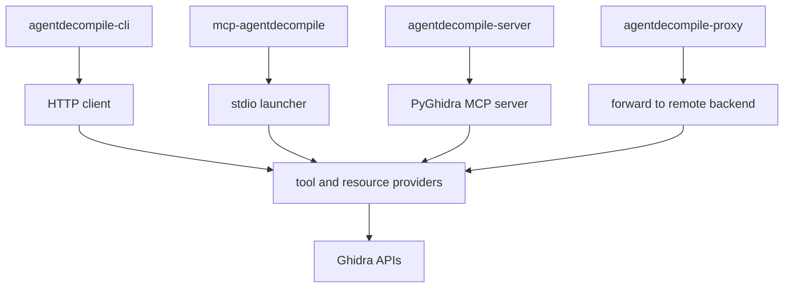

# Contributing

Thanks for pitching in. This file covers setup, tests, and how we add MCP tools.

## Getting started

1. Fork the repo and create a branch.
2. Install dependencies (see below).
3. Make your change and add tests where behavior changed.
4. Open a PR with a short summary of what and why.

## Development setup

**Requirements:** Python 3.10+, Ghidra 12+, Git. [uv](https://docs.astral.sh/uv/) is recommended.

```bash
git clone https://github.com/bolabaden/agentdecompile.git
cd agentdecompile
uv sync --dev
export GHIDRA_INSTALL_DIR=/path/to/ghidra
```

## Layout

| Path | What |
|------|------|
| `src/agentdecompile_cli/` | CLI, HTTP server, tool providers, MCP utilities |
| `src/agentdecompile_recovery/` | Source recovery / reconstruct pipeline |
| `tests/` | pytest unit, integration, e2e |
| `docs/` | User and architecture docs |
| `docs/generated/` | Generated call-graph artifacts (do not hand-edit) |
| `vendor/` | Upstream reference code for parity checks |

**Git note:** `.gitignore` matches `agentdecompile*/`, so new files under `src/agentdecompile_cli/` are ignored until force-added: `git add -f src/agentdecompile_cli/path/to/file.py`.

## Architecture (short)

Four entry points share the same tool provider layer:


```mermaid
flowchart TD
  CLI[agentdecompile-cli] --> HTTP[HTTP client]
  MCP[mcp-agentdecompile] --> STDIO[stdio launcher]
  SRV[agentdecompile-server] --> LOCAL[PyGhidra MCP server]
  PRX[agentdecompile-proxy] --> FWD[forward to remote backend]
  HTTP --> PROV[tool and resource providers]
  STDIO --> PROV
  LOCAL --> PROV
  FWD --> PROV
  PROV --> GH[Ghidra APIs]
```

| Script | Role |
|--------|------|
| `agentdecompile-cli` | HTTP client; can auto-start local server if no backend given |
| `mcp-agentdecompile` | stdio MCP for desktop clients |
| `agentdecompile-server` | Local PyGhidra-backed MCP server |
| `agentdecompile-proxy` | Forward tools/resources to a remote MCP URL |

Static call graphs for navigation: [docs/SRC_ENTRYPOINTS_CALL_GRAPH.md](docs/SRC_ENTRYPOINTS_CALL_GRAPH.md) and files under `docs/generated/`.

Agent-specific notes: [AGENTS.md](AGENTS.md).

## Adding a tool

1. Implement handler in `src/agentdecompile_cli/mcp_server/providers/`.
2. Register in the provider and in `registry.py` if new.
3. Add unit tests (happy path + common errors).
4. Update [TOOLS_LIST.md](TOOLS_LIST.md) if schema or behavior changed.

Run doc sync after registry changes:

```bash
uv run python helper_scripts/reorder_tools_list_canonical.py
uv run python helper_scripts/generate_tools_list.py   # stdout should report MATCH_EXACT True
```

## Tool naming

- **Advertised by default:** 66 tools (70 canonical minus 4 GUI-only hidden). See `agentdecompile-cli tool --list-tools`.
- **Legacy aliases** stay callable but hidden unless `AGENTDECOMPILE_SHOW_LEGACY_TOOLS=1` or `AGENTDECOMPILE_ENABLE_LEGACY_TOOLS=1`.
- Prefer updating the canonical kebab-case name and schema first; document aliases in TOOLS_LIST when needed.

## Testing

```bash
uv run ruff check --no-fix src/ tests/
uv run pytest -m unit -v
uv run pytest tests/ -v --timeout=120
uv build
```

CI on PRs to `master` runs `.github/workflows/test-unit.yml` (ruff + unit tests, no Ghidra).

Analysis gate changes should pass:

```bash
uv run pytest tests/test_program_analysis_gate.py tests/test_tool_providers_analysis_gate.py -m unit -q
```

Skip slow tests: `uv run pytest -m "not slow" -v`.

**E2E (shared checkout/sync):** [docs/e2e_shared_local_checkout_sync.md](docs/e2e_shared_local_checkout_sync.md) and `scripts/e2e_checkout_sync_plan_runner.ps1`.

## Style

- PEP 8 and existing patterns in the file you're editing.
- Keep PRs focused.
- Tool and argument names must accept snake_case, kebab-case, and camelCase via `get_argument_variations()`.

## Behavior to preserve

When changing CLI routing, sessions, or shared-server auth, keep these stable unless the PR intentionally changes them:

- `/mcp` is canonical; `/mcp/message` is legacy compat.
- Standalone CLI calls are separate sessions; use `tool-seq` to chain stateful steps.
- Shared-server auth errors should include the underlying Ghidra message when possible.
- Tool guidance (e.g. "No program loaded") may return with `isError: false` — tests should assert payload content.
- Convenience subcommands and raw `tool` mode may differ in flag names.

If you change any of the above, update README.md, USAGE.md, and tests that lock the contract.

## Releases

Tags use plain semver (`1.0.0`, no leading `v`).

```bash
git tag 1.0.0 && git push origin 1.0.0
podman build --platform linux/amd64,linux/arm64 -f Dockerfile --manifest bolabaden/agentdecompile-mcp:1.0.0 .
podman manifest push --all bolabaden/agentdecompile-mcp:1.0.0 docker://docker.io/bolabaden/agentdecompile-mcp:1.0.0
gh release create 1.0.0 --title "AgentDecompile 1.0.0" --notes-file RELEASE_NOTES_1.0.0.md
```

See existing release notes for container tags and upgrade snippets.

## PR checklist

- [ ] Scope matches the description
- [ ] `ruff check` and relevant tests pass
- [ ] Docs updated if user-visible behavior changed
- [ ] Tool schemas and argument normalization stay consistent
