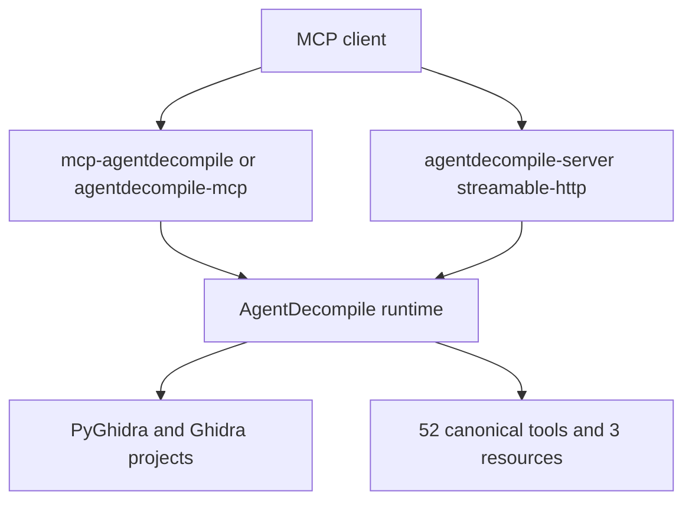

# AgentDecompile - Your AI Companion for Ghidra

> AI-powered code analysis and reverse engineering, directly inside Ghidra.

**AgentDecompile** bridges the gap between Ghidra and modern Artificial Intelligence. It allows you to chat with your binaries, automating the tedious parts of reverse engineering so you can focus on the logic that matters.

Built on the open standard [Model Context Protocol (MCP)](https://modelcontextprotocol.io), AgentDecompile turns Ghidra into an intelligent agent that can read, understand, and explain code for you.



## Why AgentDecompile?

Reverse engineering is hard. There are thousands of functions, cryptic variable names, and complex logic flows. AgentDecompile helps you make sense of it all by letting you ask plain English questions about your target code.

- **Ask Questions**: "Where is the main loop?", "Find all encryption functions", "What does this variable do?"
- **Automate Analysis**: Let the AI rename variables, comment functions, and map out code structures for you.
- **Smart Context**: Unlike generic chat bots, AgentDecompile actually sees your code. It reads the decompiled output, checks cross-references, and understands the program structure just like a human analyst would.

It's designed to be your pair programmer for assembly and decompiled code.

## What Can It Do?

You can ask AgentDecompile to perform complex tasks:

- **"Analyze this entire binary and summarize what it does."**
- **"Find where the user password is checked."**
- **"Rename all these variables to something meaningful."**
- **"Draw a diagram of this class structure."**
- **"Write a Python script to solve this CTF challenge."**

It works by giving the AI specific "tools" to interact with Ghidra—reading memory, listing functions, checking references—so it gets real, ground-truth data from your project.

## Installation

For standard local usage, AgentDecompile runs as a Python MCP server, so you do not need to manually install a Ghidra Java extension.

### Option 1: Use the published CLI against a running server (no local install)

```bash
uvx --from git+https://github.com/bolabaden/agentdecompile agentdecompile-cli --server-url http://YOUR_SERVER:8080/ tool --list-tools
```

Requires [uv](https://docs.astral.sh/uv/) (`pip install uv` or `curl -LsSf https://astral.sh/uv/install.sh | sh`).

### Option 2: Install from source

```bash
git clone https://github.com/bolabaden/agentdecompile.git
cd agentdecompile
pip install -e .
agentdecompile-cli --server-url http://YOUR_SERVER:8080/ tool --list-tools
```

### Option 3: Docker (run the server)

**Published image (no build required):**

```bash
# HTTP server mode (matches docker-compose agentdecompile-mcp service)
docker run --rm \
  --add-host host.docker.internal:host-gateway \
  -p 8080:8080 \
  docker.io/bolabaden/agentdecompile-mcp:latest
```

The MCP server starts on port 8080 at `http://localhost:8080/mcp/message`. Connect with any MCP client or the CLI using `--server-url http://localhost:8080/`.

```bash
# Build from source and run with docker-compose
docker compose up -d
```

## Usage

AgentDecompile runs as an MCP server so you can connect an AI client (Claude Desktop, IDE extensions, etc.) to Ghidra.

### Getting started

**Run with default (stdio, local project):**

```bash
uv run mcp-agentdecompile
# or: uvx --from git+https://github.com/bolabaden/agentdecompile mcp-agentdecompile
```

With no arguments, the launcher starts a local MCP server over stdio and uses a default project directory. Your MCP client (e.g. Claude Desktop) talks to it via stdio.

**Docker stdio (for MCP clients that spawn a process, e.g. VS Code, Claude Desktop):**

```bash
docker run --rm -i \
  --add-host host.docker.internal:host-gateway \
  --entrypoint /ghidra/venv/bin/agentdecompile-server \
  docker.io/bolabaden/agentdecompile-mcp:latest \
  -t stdio
```

Use `-p 8080:8080` and omit `--entrypoint`/`-t stdio` for HTTP server mode (`streamable-http` is the default).

### Project creation and opening

- **Basic:** Run `mcp-agentdecompile` or `agentdecompile-server` with no project options; a default project directory is used (see env `AGENT_DECOMPILE_PROJECT_PATH`).
- **Custom path/name:** Use `--project-path` and `--project-name` with the server (e.g. `agentdecompile-server --project-path ~/analysis/my_study --project-name my_study`).
- **Multiple projects:** Use different `--project-path` / `--project-name` per run.
- **Existing Ghidra project:** Pass a `.gpr` file: `--project-path /path/to/existing.gpr`. The server uses that project; name is derived from the file.

### Transports

| Transport | How to use | Typical use |
|-----------|------------|-------------|
| **stdio** | Default for `mcp-agentdecompile`; no `-t` needed. | Claude Desktop, IDE MCP clients that spawn a process. |
| **streamable-http** | `agentdecompile-server -t streamable-http` (and optional `-p` / `-o` for port/host). | Browser-based or HTTP clients; CLI client in another terminal. |
| **sse** | `agentdecompile-server -t sse`. | SSE-capable MCP clients. |

The Python MCP server accepts MCP HTTP requests at `http://<host>:<port>/mcp/message` and `http://<host>:<port>/mcp`.
Trailing-slash variants of those two paths also work because the server strips the trailing slash before matching.
The bare root URL `http://<host>:<port>/` is not an MCP endpoint on the server; it only works in AgentDecompile's own client helpers because they normalize a base URL to `/mcp/message` before connecting.
The Python CLI either runs the MCP server directly (default) or connects to an existing server via `--server-url` (connect mode).

Proxy mode (forward to a remote MCP backend; no local Ghidra/JVM). Use the **agentdecompile-proxy** command only:

```bash
agentdecompile-proxy --backend-url http://***:8080 --transport streamable-http --host 127.0.0.1 --port 8081
# or set AGENT_DECOMPILE_MCP_SERVER_URL / AGENTDECOMPILE_MCP_SERVER_URL and run: agentdecompile-proxy -t streamable-http
```

This exposes a local MCP endpoint at `http://127.0.0.1:8081/mcp/message` and forwards all tools/resources/prompts to the remote backend. **agentdecompile-server** is always a local instance (PyGhidra/JVM); it does not accept proxy options.

### CLI client

For a command-line interface to a **running** server (no new Ghidra process per command):

1. **Start the server** (one terminal), e.g. HTTP so the CLI can connect:

   ```bash
  agentdecompile-server -t streamable-http --project-path ./projects
   ```

2. **Use the CLI** (another terminal):

   ```bash
  # Discover available commands
  agentdecompile-cli --help

  # List available MCP tools
  agentdecompile-cli tool --list-tools

  # Call a tool directly by name
  agentdecompile-cli tool open-project '{"path":"/path/to/binary"}'
   ```

Install the CLI with the same package (`uv sync` or `pip install -e .`); entry points: `agentdecompile-cli`, `agentdecompile`. Use `--host`, `--port`, or `--server-url` if the server is not on `127.0.0.1:8080`. To call a tool by name: `agentdecompile-cli tool <name> '<json-args>'`; list valid names: `agentdecompile-cli tool --list-tools`. See [TOOLS_LIST.md](TOOLS_LIST.md) for the full tool reference.

HTTP request diagnostics are disabled by default in CLI/server output. Use `--verbose` (or `-v`) to enable transport-level request logs during troubleshooting.

Shared Ghidra connection flags are accepted with or without the `ghidra-` prefix in CLI/server entrypoints. For example, `--server-host` and `--ghidra-server-host` are equivalent (same for `port`, `username`, `password`, and `repository`).

#### Shared server quick usage (concise)

The examples below use the published Git source install form and redact sensitive values.

```powershell
# 1) Open a program from a Ghidra shared repository
uvx --from git+https://github.com/bolabaden/agentdecompile agentdecompile-cli --server-url http://***:8080/ open --server_host "$AGENT_DECOMPILE_GHIDRA_SERVER_HOST" --server_port "$AGENT_DECOMPILE_GHIDRA_SERVER_PORT" --server_username "$AGENT_DECOMPILE_GHIDRA_SERVER_USERNAME" --server_password "$AGENT_DECOMPILE_GHIDRA_SERVER_PASSWORD" /K1/k1_win_gog_swkotor.exe

# concise output
mode: shared-server
serverConnected: True
repository: Odyssey
programCount: 26
checkedOutProgram: /K1/k1_win_gog_swkotor.exe

# 2) List files in the shared repository
uvx --from git+https://github.com/bolabaden/agentdecompile agentdecompile-cli --server-url http://***:8080/ list project-files

# concise output
folder: /
count: 26
source: shared-server-session

# 3) List a small function sample
uvx --from git+https://github.com/bolabaden/agentdecompile agentdecompile-cli --server-url http://***:8080/ get-functions --program_path /K1/k1_win_gog_swkotor.exe

# concise output
count: 5
totalMatched: 24242
hasMore: True

# 4) Search symbols by name
uvx --from git+https://github.com/bolabaden/agentdecompile agentdecompile-cli --server-url http://***:8080/ search-symbols --program_path /K1/k1_win_gog_swkotor.exe --query main

# concise output
query: main
count: 5
totalMatched: 58
hasMore: True

# 5) Find references to a symbol
uvx --from git+https://github.com/bolabaden/agentdecompile agentdecompile-cli --server-url http://***:8080/ references to --binary /K1/k1_win_gog_swkotor.exe --target WinMain

# concise output
mode: to
target: 004041f0
count: 1

# 6) Get current program metadata
uvx --from git+https://github.com/bolabaden/agentdecompile agentdecompile-cli --server-url http://***:8080/ get-current-program --program_path /K1/k1_win_gog_swkotor.exe

# concise output
loaded: True
name: swkotor.exe
language: x86:LE:32:default
compiler: windows
functionCount: 24591

# 7) Raw tool mode examples
uvx --from git+https://github.com/bolabaden/agentdecompile agentdecompile-cli --server-url http://***:8080/ tool list-imports '{"programPath":"/K1/k1_win_gog_swkotor.exe","limit":5}'
uvx --from git+https://github.com/bolabaden/agentdecompile agentdecompile-cli --server-url http://***:8080/ tool list-exports '{"programPath":"/K1/k1_win_gog_swkotor.exe","limit":5}'

# concise output
mode: imports
count: 5
totalImports: 350
mode: exports
count: 1
totalExports: 1
```

Tip: use `agentdecompile-cli tool --list-tools` to see server-advertised tool names. Use `agentdecompile-cli --help` and `agentdecompile-cli tool -h` to discover command/options.

For shared Ghidra server workflows (`open --ghidra-server-host ... --ghidra-server-port ...`), you can set defaults once with environment variables:

```bash
export AGENT_DECOMPILE_GHIDRA_SERVER_HOST='<set-in-user-env>'
export AGENT_DECOMPILE_GHIDRA_SERVER_PORT='<set-in-user-env>'
export AGENT_DECOMPILE_GHIDRA_SERVER_USERNAME='<set-in-user-env>'
export AGENT_DECOMPILE_GHIDRA_SERVER_PASSWORD='<set-in-user-env>'
export AGENT_DECOMPILE_GHIDRA_SERVER_REPOSITORY='<set-in-user-env>'
```

Then `agentdecompile-cli --server-url http://***:8080/ open /K1/k1_win_gog_swkotor.exe` will automatically use those shared-server values.

### Docker and volume mapping

Map a directory of binaries into the container so the server can import and analyze them:

```bash
mkdir -p ./binaries
cp /path/to/your/binaries/* ./binaries/

# HTTP server mode with binary volume
docker run --rm \
  --add-host host.docker.internal:host-gateway \
  -v "$(pwd)/binaries:/binaries" \
  -p 8080:8080 \
  docker.io/bolabaden/agentdecompile-mcp:latest

# stdio mode with binary volume (for VS Code / Claude Desktop)
docker run --rm -i \
  --add-host host.docker.internal:host-gateway \
  -v "$(pwd)/binaries:/binaries" \
  --entrypoint /ghidra/venv/bin/agentdecompile-server \
  docker.io/bolabaden/agentdecompile-mcp:latest \
  -t stdio
```

### VS Code / Cursor

Create a workspace-local `.vscode/mcp.json` if you want reusable launch targets. A minimal starting point looks like this:

```json
{
  "servers": {
    "agentdecompile-docker": {
      "type": "stdio",
      "command": "docker",
      "args": [
        "run", "--rm", "-i",
        "--add-host", "host.docker.internal:host-gateway",
        "-e", "AGENTDECOMPILE_HTTP_GHIDRA_SERVER_HOST=${input:ad-http-ghidra-server-host}",
        "-e", "AGENTDECOMPILE_HTTP_GHIDRA_SERVER_PORT=${input:ad-http-ghidra-server-port}",
        "-e", "AGENTDECOMPILE_HTTP_GHIDRA_SERVER_REPOSITORY=${input:ad-http-ghidra-server-repository}",
        "-e", "AGENTDECOMPILE_GHIDRA_USERNAME=${input:ghidra-username}",
        "-e", "AGENTDECOMPILE_GHIDRA_PASSWORD=${input:ghidra-password}",
        "--entrypoint", "/ghidra/venv/bin/agentdecompile-server",
        "docker.io/bolabaden/agentdecompile-mcp:latest",
        "-t", "stdio"
      ]
    },
    "agentdecompile-local": {
      "type": "stdio",
      "command": "uv",
      "args": ["run", "mcp-agentdecompile"]
    },
    "agentdecompile-http": {
      "type": "http",
      "url": "http://127.0.0.1:8080/mcp/message"
    }
  }
}
```

Typical entries:

| Entry | When to use |
|-------|-------------|
| `agentdecompile-local` | Local binary analysis — no shared Ghidra server, no credentials needed. |
| `agentdecompile-shared` | Shared Ghidra project — add environment variables or client prompts for your Ghidra username and password. |
| `agentdecompile-http` | Connect to an **already-running** HTTP server at `http://127.0.0.1:8080/mcp/message`. Start it first with `agentdecompile-server -t streamable-http`. |
| `agentdecompile-proxy` | Forward to a **remote** MCP backend (no local Ghidra). Configure with `AGENT_DECOMPILE_MCP_SERVER_URL` or `AGENTDECOMPILE_MCP_SERVER_URL` and run the `agentdecompile-proxy` command (stdio or `-t streamable-http`). |

If you add an `inputs` block for `agentdecompile-shared`, VS Code or Cursor can prompt for `${input:ghidra-username}` and `${input:ghidra-password}` at launch time instead of storing credentials in the repo.

To start the HTTP server for `agentdecompile-http`:

```bash
# Local project
agentdecompile-server -t streamable-http

# Proxy to a remote MCP backend (use agentdecompile-proxy, not agentdecompile-server)
agentdecompile-proxy --backend-url http://***:8080 --transport streamable-http
```

### Claude Desktop

Add AgentDecompile to `claude_desktop_config.json` so Claude uses the MCP server:

**Using stdio (spawns server on each chat):**

```json
{
  "mcpServers": {
    "AgentDecompile": {
      "command": "mcp-agentdecompile",
      "args": [],
      "env": {
        "GHIDRA_INSTALL_DIR": "/path/to/ghidra",
        "AGENT_DECOMPILE_PROJECT_PATH": "/path/to/writable/project/dir"
      }
    }
  }
}
```

**Using an already-running server (connect mode):**

```json
{
  "mcpServers": {
    "AgentDecompile": {
      "command": "mcp-agentdecompile",
      "args": ["--server-url", "http://127.0.0.1:8080/"],
      "env": {
        "GHIDRA_INSTALL_DIR": "/path/to/ghidra"
      }
    }
  }
}
```

On Windows use forward slashes or escaped backslashes in paths.

### API and tools (overview)

AgentDecompile exposes 52 canonical MCP tools (see `src/agentdecompile_cli/registry.py`) and 3 resources:

- **36 tools** are advertised by default.
- Compatibility aliases remain callable but are hidden by default; set `AGENTDECOMPILE_ENABLE_LEGACY_TOOLS=1` or `AGENTDECOMPILE_SHOW_LEGACY_TOOLS=1` to re-advertise them.
- Canonical MCP tool names use **kebab-case** (for example `open-project`, `get-current-program`, `search-symbols`). JSON argument keys use camelCase (for example `programPath`, `serverHost`). Many CLI-generated subcommands expose `--snake_case` options and some hand-written commands also accept hyphenated aliases.

- Resources: `ghidra://programs`, `ghidra://static-analysis-results`, `ghidra://agentdecompile-debug-info`
- Representative tools: `open-project`, `import-binary`, `list-functions`, `decompile-function`, `get-current-program`, `get-references`, `search-symbols`, `inspect-memory`, `manage-function-tags`, `get-call-graph`, `remove-program-binary`

Live local server contract note: the default advertised surface is currently 36 tools. Hidden compatibility tools such as `manage-comments` remain callable through raw MCP/CLI routes, and the `switch-project` alias still resolves to `open-project` even though it is not advertised.

Use `agentdecompile-cli tool --list-tools` to view the live advertised set from your running server, `agentdecompile-cli alias <tool-name>` to inspect compatibility mappings, and [TOOLS_LIST.md](TOOLS_LIST.md) for the maintained reference.

### Connection options

| Mode | How to connect | Endpoint / transport |
|------|-----------------|----------------------|
| **stdio** | MCP client spawns `mcp-agentdecompile` or `agentdecompile-mcp` | stdio JSON-RPC |
| **streamable-http** | Client connects to `agentdecompile-server -t streamable-http` | `http://localhost:8080/mcp/message` |
| **proxy mode** | Run `agentdecompile-proxy` (with `--backend-url` or env) to forward to a remote backend | Local stdio or HTTP endpoint forwarding to remote MCP |

**CLI (stdio):** Configure your MCP client to use `mcp-agentdecompile` (e.g. `claude mcp add AgentDecompile -- mcp-agentdecompile`).

- **Default behavior (local spawn):** starts local PyGhidra/JVM, launches Python MCP server, then bridges stdio to it.
- **Connect mode (no local runtime startup):** pass `--server-url http://host:port` (or set `AGENT_DECOMPILE_MCP_SERVER_URL`) to connect directly to an already-running Python MCP server (headless Docker or standalone).
- **Proxy mode:** run **agentdecompile-proxy** with `--backend-url http://host:port` (or set `AGENT_DECOMPILE_MCP_SERVER_URL` / `AGENTDECOMPILE_MCP_SERVER_URL`) to expose local stdio or HTTP that forwards to a remote MCP backend. Do not use agentdecompile-server for proxy; it is local-only.

### Remote access

AgentDecompile does not include SSH or WebSocket transport. To allow remote MCP access: (1) run a Python-hosted MCP server bound to `0.0.0.0` (env `AGENT_DECOMPILE_HOST=0.0.0.0`); (2) open the chosen port on the firewall; (3) point clients at `http://{remote_ip}:{port}/mcp/message` or use `--server-url http://{remote_ip}:{port}` in CLI connect mode.

**Note:** `AGENT_DECOMPILE_GHIDRA_SERVER_USERNAME` and `AGENT_DECOMPILE_GHIDRA_SERVER_PASSWORD` are for **Ghidra Server** (shared project repositories), not for authenticating to the MCP server itself.

### Docker

The project Dockerfile fetches **Ghidra from the official [NationalSecurityAgency/ghidra](https://github.com/NationalSecurityAgency/ghidra) GitHub repository** at build time. By default it uses the latest release; to pin a version set the build arg or env var `GHIDRA_VERSION` (e.g. `12.0.3`) when building.

### Environment variables

| Variable | Purpose | CLI argument equivalent |
|----------|---------|-------------------------|
| `AGENT_DECOMPILE_BACKEND_URL` | Remote MCP backend URL for **agentdecompile-proxy** only. | `agentdecompile-proxy --backend-url` |
| `GHIDRA_INSTALL_DIR` | Path to Ghidra installation (required for CLI/build). | None (environment/config only) |
| `AGENT_DECOMPILE_MCP_SERVER_URL` | Connect/proxy target (`http(s)://host:port[/mcp/message]`). For **agentdecompile-proxy**: backend URL (env or `--mcp-server-url`). For **agentdecompile-cli** connect mode: server to connect to. | `agentdecompile-proxy --mcp-server-url`; `agentdecompile-cli --server-url` |
| `AGENT_DECOMPILE_PROJECT_PATH` | Path to a `.gpr` project file or a directory to use as the local Ghidra project location. Accepts `AGENTDECOMPILE_PROJECT_PATH` as an alias. | `agentdecompile-server --project-path` |
| `AGENT_DECOMPILE_PROJECT_NAME` | Name for the local Ghidra project when using a directory-backed project (ignored when `PROJECT_PATH` points to a `.gpr` file). Defaults to the current working directory name. Accepts `AGENTDECOMPILE_PROJECT_NAME` as an alias. | `agentdecompile-server --project-name` |
| `AGENT_DECOMPILE_HOST` | Standalone headless MCP server bind host (default `127.0.0.1`; Docker commonly `0.0.0.0`). | `agentdecompile-server --host` |
| `AGENT_DECOMPILE_PORT` | Standalone headless MCP server bind port (default `8080`). | `agentdecompile-server --port` |
| `AGENT_DECOMPILE_GHIDRA_SERVER_USERNAME` | Ghidra Server username (shared projects). | `agentdecompile-server --ghidra-server-username`; `agentdecompile-cli --ghidra-server-username` |
| `AGENT_DECOMPILE_GHIDRA_SERVER_PASSWORD` | Ghidra Server password (shared projects). | `agentdecompile-server --ghidra-server-password`; `agentdecompile-cli --ghidra-server-password` |
| `AGENT_DECOMPILE_GHIDRA_SERVER_HOST` | Ghidra Server host (reference). | `agentdecompile-server --ghidra-server-host`; `agentdecompile-cli --ghidra-server-host` |
| `AGENT_DECOMPILE_GHIDRA_SERVER_PORT` | Ghidra Server port (default 13100). | `agentdecompile-server --ghidra-server-port`; `agentdecompile-cli --ghidra-server-port` |
| `AGENT_DECOMPILE_GHIDRA_SERVER_REPOSITORY` | Default Ghidra shared repository name for shared-server workflows. | `agentdecompile-server --ghidra-server-repository`; `agentdecompile-cli --ghidra-server-repository` |

Compact alias compatibility: `AGENTDECOMPILE_GHIDRA_SERVER_HOST/PORT/USERNAME/PASSWORD/REPOSITORY` are accepted and normalized automatically for launchers that emit no-underscore variants.

### Shared project authentication

When opening a `.gpr` file connected to a Ghidra Server, authentication may be required. Provide credentials via the `open` tool parameters (`serverUsername`, `serverPassword`) or the environment variables above; tool parameters override env. Local projects do not need credentials. If shared-project open or authentication fails, set the env vars or pass parameters. For troubleshooting, see [CONTRIBUTING.md](CONTRIBUTING.md) (Ghidra Project Authentication Implementation).

### Structures (manage-structures)

The current `manage-structures` provider supports `parse`, `validate`, `create`, `add_field`, `modify_field`, `modify_from_c`, `info`, `list`, `apply`, `delete`, and `parse_header`. For precise structure definitions, use `parse_header` or `modify_from_c` with a full C definition. See [TOOLS_LIST.md](TOOLS_LIST.md) for the maintained command reference.

## License

This project is licensed under the **GNU Affero General Public License v3.0 (AGPL-3.0)**. See [LICENSE](LICENSE) for details. AGPL-3.0 is a strong copyleft license that also requires offering source to users who interact with the software over a network (e.g. SaaS). 

## Contributing

We welcome contributions! Please see [CONTRIBUTING.md](CONTRIBUTING.md) for how to get involved.
