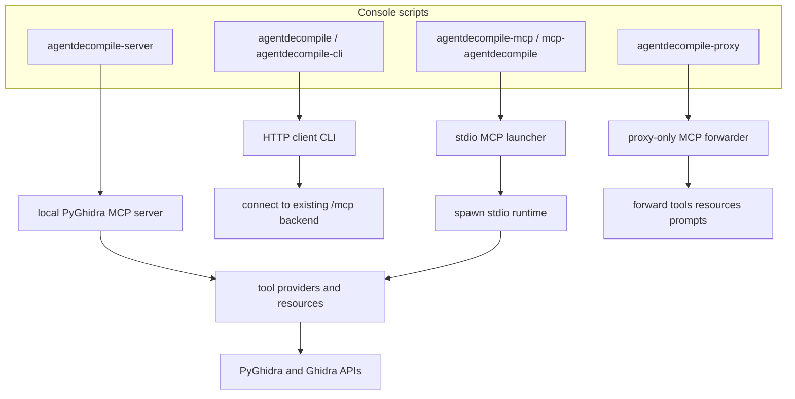

# AgentDecompile - Your AI Companion for Ghidra

> AI-powered code analysis and reverse engineering, directly inside Ghidra.

**AgentDecompile** bridges the gap between Ghidra and modern Artificial Intelligence. It allows you to chat with your binaries, automating the tedious parts of reverse engineering so you can focus on the logic that matters.

Built on the open standard [Model Context Protocol (MCP)](https://modelcontextprotocol.io), AgentDecompile turns Ghidra into an intelligent agent that can read, understand, and explain code for you.


## Session-Validated Commands

The commands below were exercised during the current documentation and validation session. They are intentionally listed separately from the generic examples so readers can see the exact command shapes that were actually used.

```powershell
# Published Docker image, stdio transport, explicit server entrypoint
docker run --rm -i \
  --add-host host.docker.internal:host-gateway \
  --entrypoint /ghidra/venv/bin/agentdecompile-server \
  docker.io/bolabaden/agentdecompile-mcp:latest \
  -t stdio

# Local-checkout CLI validation through the module entrypoint used in this session
$env:PYTHONPATH='src'
C:/GitHub/agentdecompile/.venv/Scripts/python.exe -m agentdecompile_cli.cli --server-url http://127.0.0.1:8097 tool-seq '[{"name":"open","arguments":{"path":"LocalRepo","serverHost":"127.0.0.1","serverPort":13100,"serverUsername":"<redacted>","serverPassword":"<redacted>","format":"json"}},{"name":"list-project-files","arguments":{"format":"json"}},{"name":"import-binary","arguments":{"path":"C:/GitHub/agentdecompile/tests/fixtures/test_x86_64","enableVersionControl":true,"format":"json"}},{"name":"list-project-files","arguments":{"format":"json"}},{"name":"remove-program-binary","arguments":{"programPath":"test_x86_64","confirm":true,"format":"json"}},{"name":"list-project-files","arguments":{"format":"json"}}]'
```

Equivalent user-facing local-checkout form:

```powershell
uv run agentdecompile-cli --server-url http://127.0.0.1:8097 tool-seq '[{"name":"open","arguments":{"path":"LocalRepo","serverHost":"127.0.0.1","serverPort":13100,"serverUsername":"<redacted>","serverPassword":"<redacted>","format":"json"}},{"name":"list-project-files","arguments":{"format":"json"}},{"name":"import-binary","arguments":{"path":"C:/GitHub/agentdecompile/tests/fixtures/test_x86_64","enableVersionControl":true,"format":"json"}},{"name":"list-project-files","arguments":{"format":"json"}},{"name":"remove-program-binary","arguments":{"programPath":"test_x86_64","confirm":true,"format":"json"}},{"name":"list-project-files","arguments":{"format":"json"}}]'
```

Validated behaviors from these commands:

- The published Docker image responds correctly in stdio mode.
- `tool-seq` preserves state inside one CLI invocation.
- Shared-repository open, project listing, import, and removal flows were exercised from a local checkout.

## Field-Proven Operational Patterns

The validation logs and notebook runs show stable patterns that are useful when diagnosing issues quickly.

### 1) MCP URL normalization is intentional

- Prefer `http://host:port/mcp` in docs and tooling.
- The CLI accepts base URLs and normalizes to MCP endpoints, but `/mcp` keeps intent explicit.
- `/mcp/message` remains a compatibility path; `/api/mcp` is not supported.

### 2) CLI invocations are stateless unless you use `tool-seq`

- Fresh `agentdecompile-cli` commands start fresh MCP sessions.
- If a command needs loaded-program state, either:
  - include `program_path`/`programPath` so the backend can reopen the target, or
  - use `tool-seq` to preserve open-then-query state in one invocation.

### 3) Shared-server auth failures have a recognizable signature

- Typical failure text includes both wrapper and adapter exceptions.
- Most common fingerprint: `NotConnectedException` plus nested `FailedLoginException`.
- Treat this as credentials/repository access mismatch first, not an MCP transport failure.

### 4) Tool-level failures can still arrive as successful MCP envelopes

- Some tools return guidance markdown (for example `No program loaded`) with `isError: False`.
- For automation, prefer tool `format: json` where supported and inspect payload fields directly.
- Local version-control probes (`checkout-status`, `checkout-program`, `checkin-program`) may report domain errors in content while the outer call itself succeeds.

### 5) Local workflows can be pulled into shared-server resolution

- Terminal validation showed local import succeeded, then follow-up resolution attempted shared-server connect (`127.0.0.1:13100`) for later steps.
- If this appears, inspect effective shared-server env vars and explicit tool arguments before assuming import/open failed.

### 6) Option shape can differ between convenience commands and raw tool mode

- Convenience commands may not expose every raw argument (for example dashed variants such as `--max-results` on some commands).
- Use `agentdecompile-cli <command> -h` for that command surface.
- Use `agentdecompile-cli tool <name> '{...}'` when you need exact MCP payload control.

## Why AgentDecompile?

Reverse engineering is hard. There are thousands of functions, cryptic variable names, and complex logic flows. AgentDecompile helps you make sense of it all by letting you ask plain English questions about your target code.

- **Ask Questions**: "Where is the main loop?", "Find all encryption functions", "What does this variable do?"
- **Automate Analysis**: Let the AI rename variables, comment functions, and map out code structures for you.
- **Smart Context**: Unlike generic chat bots, AgentDecompile actually sees your code. It reads the decompiled output, checks cross-references, and understands the program structure just like a human analyst would.

It's designed to be your pair programmer for assembly and decompiled code.

## What Can It Do?

You can ask AgentDecompile to perform complex tasks:

- **"Analyze this entire binary and summarize what it does."**
- **"Find where the user password is checked."**
- **"Rename all these variables to something meaningful."**
- **"Draw a diagram of this class structure."**
- **"Write a Python script to solve this CTF challenge."**

It works by giving the AI specific "tools" to interact with Ghidra—reading memory, listing functions, checking references—so it gets real, ground-truth data from your project.

## Runtime Surfaces

AgentDecompile ships several entrypoints so you can run it as a local stdio MCP server, an HTTP MCP server, a proxy, or a CLI client against an already-running backend.



### Exhaustive architecture (src/agentdecompile_cli)

The following diagram maps the full structure of `src/agentdecompile_cli/`: entry points, bridge/executor, registry, launcher, MCP server core, all tool and resource providers, Ghidra integration, utilities, and external integrations. Arrows indicate dependency and data flow.

```mermaid
flowchart TB
  subgraph Entry["Entry points"]
    E1["cli.py — Click CLI (HTTP client)"]
    E2["__main__.py — MCP stdio entry"]
    E3["server.main — HTTP server"]
    E4["server.proxy_main — Proxy"]
  end

  subgraph Bridge["Bridge & execution"]
    B1["bridge.py — MCP session fix, AgentDecompileMcpClient, AgentDecompileStdioBridge, RawMcpHttpBackend"]
    B2["executor.py — get_client, run_async, DynamicToolExecutor, URL normalization"]
  end

  subgraph Reg["Registry (central)"]
    R1["registry.py — Tool enum, TOOLS, TOOL_PARAMS, normalize_identifier, resolve_tool_name, ToolRegistry"]
  end

  subgraph Launch["Launcher & context"]
    L1["launcher.py — ProgramInfo, PyGhidraContext, AgentDecompileLauncher, init_agentdecompile_context"]
    L2["context.py — compatibility shim"]
    L3["project_manager.py — ProjectManager (.agentdecompile/projects)"]
  end

  subgraph ServerCore["MCP server core"]
    S1["server.py — PythonMcpServer, ServerConfig, FastAPI, StreamableHTTPSessionManager"]
    S2["tool_providers.py — ToolProvider base, ToolProviderManager, UnifiedToolProviderManager, register_all_providers"]
    S3["resource_providers.py — ResourceProvider base, ResourceProviderManager"]
    S4["auth.py — AuthConfig, AuthContext, AuthMiddleware, CURRENT_AUTH_CONTEXT"]
    S5["session_context.py — SessionContext, SessionContextStore, CURRENT_MCP_SESSION_ID, grace period reaper"]
    S6["prompt_providers.py — list_prompts, _PROMPTS"]
    S7["conflict_store.py — PendingModification, get/remove conflicts"]
    S8["auto_match_worker.py — auto match-function propagation"]
  end

  subgraph ToolProv["Tool providers (21 classes)"]
    T0["ToolProvider base — HANDLERS, list_tools, call_tool, _get_program, _get helpers"]
    T1["bookmarks — BookmarkToolProvider"]
    T2["callgraph — CallGraphToolProvider"]
    T3["comments — CommentToolProvider"]
    T4["conflict_resolution — ConflictResolutionToolProvider"]
    T5["constants — ConstantSearchToolProvider"]
    T6["data — DataToolProvider"]
    T7["dataflow — DataFlowToolProvider"]
    T8["datatypes — DataTypeToolProvider"]
    T9["decompiler — DecompilerToolProvider"]
    T10["dissect — GetFunctionAioToolProvider"]
    T11["functions — FunctionToolProvider"]
    T12["getfunction — GetFunctionToolProvider, _FunctionMatchFeature, _FunctionMatchIndex"]
    T13["import_export — ImportExportToolProvider"]
    T14["memory — MemoryToolProvider"]
    T15["project — ProjectToolProvider"]
    T16["prompts — PromptToolProvider"]
    T17["script — ScriptToolProvider"]
    T18["search_everything — SearchEverythingToolProvider"]
    T19["strings — StringToolProvider"]
    T20["structures — StructureToolProvider"]
    T21["suggestions — SuggestionToolProvider"]
    T22["symbols — SymbolToolProvider"]
    T23["vtable — VtableToolProvider"]
    T24["xrefs — CrossReferencesToolProvider"]
    TC["_collectors — iter_items, collect_function_comments, collect_constants"]
  end

  subgraph ResProv["Resource providers (4 classes)"]
    R0["ResourceProvider base — list_resources, read_resource"]
    R2["programs — ProgramListResource (ghidra://programs)"]
    R3["debug_info — DebugInfoResource (ghidra://debug-info)"]
    R4["static_analysis — StaticAnalysisResultsResource (ghidra://static-analysis-results)"]
    R5["analysis_dump — AnalysisDumpResource"]
  end

  subgraph GhidraLayer["Ghidra integration"]
    G1["tools/wrappers.py — GhidraTools (find_function, decompile_function, list_strings, search_code)"]
    G2["ghidrecomp/decompile.py — decompile, DecompileTool"]
    G3["ghidrecomp/callgraph.py — CallGraph, gen_callgraph, Mermaid"]
    G4["ghidrecomp/sast.py — Semgrep/CodeQL, SARIF, preprocess_c_files"]
    G5["ghidrecomp/utility.py — analyze_program, apply_gdt, get_pdb, set_pdb, save_program_as_gzf"]
    G6["tools/decompile_tool.py — DecompileTool"]
    G7["tools/callgraph_tool.py — CallGraphTool"]
  end

  subgraph Models["Models & config"]
    M1["models.py — Pydantic: DecompiledFunction, ProgramInfo, SymbolInfo, etc."]
    M2["config/config_manager.py — ConfigManager, ConfigChangeListener"]
  end

  subgraph Utils["mcp_utils"]
    U1["address_util — AddressUtil (parse/format hex)"]
    U2["symbol_util — SymbolUtil (name/address resolution)"]
    U3["memory_util — MemoryUtil (read bytes, inspect)"]
    U4["program_lookup_util — ProgramLookupUtil, ProgramValidationException"]
    U5["schema_util — SchemaUtil, SchemaBuilder (MCP JSON schema)"]
    U6["debug_logger — DebugLogger"]
    U7["service_registry — AgentDecompileInternalServiceRegistry"]
  end

  subgraph Ext["External"]
    X1["PyGhidra / JVM (ghidra.* APIs)"]
    X2["MCP SDK (mcp.server.Server, StreamableHTTPSessionManager)"]
    X3["FastAPI / Uvicorn"]
    X4["chromadb (optional semantic search)"]
    X5["Ghidra Server (shared projects)"]
  end

  E1 --> B1
  E1 --> B2
  E2 --> B1
  E3 --> L1
  E4 --> B1
  B1 --> B2
  B1 --> R1
  B2 --> R1
  L1 --> L3
  L1 --> B2
  L1 --> S1
  L1 --> X1
  L2 -.-> L1
  S1 --> S2
  S1 --> S3
  S1 --> S4
  S1 --> S5
  S1 --> S6
  S1 --> X2
  S1 --> X3
  S2 --> R1
  S2 --> T0
  S2 --> S7
  S2 --> S8
  S3 --> R0
  S3 --> S2
  T0 --> R1
  T1 --> T0
  T2 --> T0
  T3 --> T0
  T4 --> T0
  T5 --> T0
  T6 --> T0
  T7 --> T0
  T8 --> T0
  T9 --> T0
  T10 --> T0
  T11 --> T0
  T12 --> T0
  T13 --> T0
  T14 --> T0
  T15 --> T0
  T16 --> T0
  T17 --> T0
  T18 --> T0
  T19 --> T0
  T20 --> T0
  T21 --> T0
  T22 --> T0
  T23 --> T0
  T24 --> T0
  T1 --> TC
  T3 --> TC
  T5 --> TC
  T11 --> TC
  T12 --> TC
  T13 --> TC
  T15 --> TC
  T19 --> TC
  T22 --> TC
  T2 --> G1
  T9 --> G1
  T11 --> G1
  T12 --> G1
  T13 --> G1
  T15 --> G1
  T17 --> G1
  T19 --> G1
  T22 --> G1
  T24 --> G1
  T1 --> U1
  T1 --> U2
  T2 --> U1
  T3 --> U1
  T6 --> U3
  T9 --> U1
  T11 --> U1
  T11 --> U2
  T12 --> U1
  T12 --> U2
  T13 --> U1
  T13 --> U4
  T14 --> U3
  T15 --> U4
  T19 --> U1
  T22 --> U2
  T24 --> U1
  T24 --> U2
  R0 --> S5
  R2 --> S5
  R3 --> S5
  R3 --> S4
  R4 --> S5
  R5 --> S5
  G1 --> M1
  G1 --> U1
  G1 --> G2
  G1 --> G3
  G1 --> G5
  G1 --> X1
  G2 --> G6
  G3 --> G7
  G2 --> G5
  G3 --> G5
  G4 --> G5
  G5 --> X1
  S5 --> U4
  S2 --> S5
  S3 --> S5
  L1 --> M2
  L1 --> X4
  L1 --> X5
  T15 --> X5
  T13 --> X5
```



**Request path (tools/call):** HTTP → auth/session middleware → MCP Server `call_tool` → ToolProviderManager.call_tool → normalize name via registry → provider.call_tool → HANDLERS dispatch → GhidraTools / ProgramInfo / mcp_utils → response_formatter → TextContent.

**Request path (resources/read):** HTTP → read_resource(uri) → ResourceProviderManager → provider.read_resource (e.g. DebugInfoResource, ProgramListResource).

**Session:** Middleware sets CURRENT_MCP_SESSION_ID (and auth); tools use get_current_mcp_session_id() → SessionContextStore.get_or_create(session_id) → SessionContext (open_programs, active_program_key). Program resolution is by programPath (or active) via session’s open_programs; ProgramLookupUtil for shared projects.

Current source-graph inventory from `src/agentdecompile_cli`:

- `76` Python modules
- `1444` discovered classes, functions, and methods
- `84` Click command or group functions in the CLI surface
- `3150` deduplicated internal caller-to-callee edges in the generated Mermaid graph

Primary runtime entrypoints:

| Script | Target | Role |
| --- | --- | --- |
| `agentdecompile` / `agentdecompile-cli` | `agentdecompile_cli.cli:cli_entry_point` | Main HTTP client CLI |
| `agentdecompile-mcp` / `mcp_agentdecompile` / `mcp-agentdecompile` | `agentdecompile_cli.__main__:main` | MCP stdio launcher |
| `agentdecompile-server` | `agentdecompile_cli.server:main` | Local PyGhidra-backed MCP server |
| `agentdecompile-proxy` | `agentdecompile_cli.server:proxy_main` | Proxy-only MCP forwarder |

If you want the deeper static map instead of the quick overview, see [docs/SRC_ENTRYPOINTS_CALL_GRAPH.md](docs/SRC_ENTRYPOINTS_CALL_GRAPH.md), [docs/generated/src_static_call_graph_summary.json](docs/generated/src_static_call_graph_summary.json), and [docs/generated/src_entrypoint_reachability.json](docs/generated/src_entrypoint_reachability.json).

## Installation

For standard local usage, AgentDecompile runs as a Python MCP server, so you do not need to manually install a Ghidra Java extension.

### Option 1: Use the published CLI against a running server (no local install)

```bash
uvx --from git+https://github.com/bolabaden/agentdecompile agentdecompile-cli --server-url http://YOUR_SERVER:8080/ tool --list-tools
```

Requires [uv](https://docs.astral.sh/uv/) (`pip install uv` or `curl -LsSf https://astral.sh/uv/install.sh | sh`).

### Option 2: Install from source

```bash
git clone https://github.com/bolabaden/agentdecompile.git
cd agentdecompile
pip install -e .
agentdecompile-cli --server-url http://YOUR_SERVER:8080/ tool --list-tools
```

### Option 3: Docker (run the server)

**Published image (no build required):**

```bash
# HTTP server mode (matches docker-compose agentdecompile-mcp service)
docker run --rm \
  --add-host host.docker.internal:host-gateway \
  -p 8080:8080 \
  docker.io/bolabaden/agentdecompile-mcp:latest
```

The MCP server starts on port 8080 with the canonical streamable-HTTP endpoint at `http://localhost:8080/mcp`, the compatibility endpoint at `http://localhost:8080/mcp/message`, the API index at `http://localhost:8080/`, and Swagger UI at `http://localhost:8080/docs`. Connect with any MCP client or the CLI using `--server-url http://localhost:8080/`.

### Web UI

AgentDecompile also ships a browser UI for direct human interaction outside MCP clients and the CLI. It is launched automatically alongside the existing MCP/server entrypoints: `agentdecompile-mcp`, `mcp_agentdecompile`, `mcp-agentdecompile`, `agentdecompile-server`, and `agentdecompile-proxy`.

```bash
uv run agentdecompile-server -t streamable-http /path/to/binary
```

By default the web UI binds to `http://127.0.0.1:8002/` and targets the backend created by the command you launched. For proxy mode, it points at the proxied MCP endpoint automatically:

```bash
uv run agentdecompile-proxy --backend-url http://127.0.0.1:8080/mcp -t streamable-http
```

The web UI includes live tool execution with JSON argument editing, canonical tool-surface reference data, prompt browsing and rendering, resource browsing, and a documentation hub with Ghidra docking and Java Swing API links.

Environment variables:

- `AGENT_DECOMPILE_WEBUI_PORT` or `AGENTDECOMPILE_WEBUI_PORT`: Web UI bind port. Default `8002`.
- `AGENT_DECOMPILE_WEBUI_HOST` or `AGENTDECOMPILE_WEBUI_HOST`: Web UI bind host. Default `127.0.0.1`.
- `AGENT_DECOMPILE_WEBUI_ENABLED` or `AGENTDECOMPILE_WEBUI_ENABLED`: Set to `0`, `false`, `no`, or `off` to disable the sidecar.
- `AGENT_DECOMPILE_WEBUI_BACKEND_URL` or `AGENTDECOMPILE_WEBUI_BACKEND_URL`: Optional override for the backend URL the sidecar targets.

Prefer pointing MCP clients and examples at `http://localhost:8080/mcp`. The CLI also accepts the base server URL and normalizes it for you. `http://localhost:8080/` and `http://localhost:8080/api` are metadata/index routes, not alternate MCP transport paths, and `/api/mcp` is not supported.

```bash
# Build from source and run with docker-compose
docker compose up -d
```

## Usage

AgentDecompile runs as an MCP server so you can connect an AI client (Claude Desktop, IDE extensions, etc.) to Ghidra.

### Getting started

**Run with default (stdio, local project):**

```bash
uv run mcp-agentdecompile
# or: uvx --from git+https://github.com/bolabaden/agentdecompile mcp-agentdecompile
```

With no arguments, the launcher starts a local MCP server over stdio and uses a default project directory. Your MCP client (e.g. Claude Desktop) talks to it via stdio.

**Docker stdio (for MCP clients that spawn a process, e.g. VS Code, Claude Desktop):**

```bash
docker run --rm -i \
  --add-host host.docker.internal:host-gateway \
  --entrypoint /ghidra/venv/bin/agentdecompile-server \
  docker.io/bolabaden/agentdecompile-mcp:latest \
  -t stdio
```

Use `-p 8080:8080` and omit `--entrypoint`/`-t stdio` for HTTP server mode (`streamable-http` is the default).

### Project creation and opening

- **Basic:** Run `mcp-agentdecompile` or `agentdecompile-server` with no project options; a default project directory is used (see env `AGENT_DECOMPILE_PROJECT_PATH`).
- **Custom path/name:** Use `--project-path` and `--project-name` with the server (e.g. `agentdecompile-server --project-path ~/analysis/my_study --project-name my_study`).
- **Multiple projects:** Use different `--project-path` / `--project-name` per run.
- **Existing Ghidra project:** Pass a `.gpr` file: `--project-path /path/to/existing.gpr`. The server uses that project; name is derived from the file.

### Transports

| Transport | How to use | Typical use |
|-----------|------------|-------------|
| **stdio** | Default for `mcp-agentdecompile`; no `-t` needed. | Claude Desktop, IDE MCP clients that spawn a process. |
| **streamable-http** | `agentdecompile-server -t streamable-http` (and optional `-p` / `-o` for port/host). | Browser-based or HTTP clients; CLI client in another terminal. |
| **sse** | `agentdecompile-server -t sse`. | SSE-capable MCP clients. |

The Python MCP server accepts MCP HTTP requests at `http://<host>:<port>/mcp` and `http://<host>:<port>/mcp/message`.
`/mcp` is the canonical streamable-HTTP endpoint and should be the default in docs, scripts, and MCP client configs.
`/mcp/message` remains the compatibility path for clients that still target the legacy message endpoint.
`http://<host>:<port>/` and `http://<host>:<port>/api` both return the API index metadata, while the interactive docs live at `http://<host>:<port>/docs`.
Trailing-slash variants of the MCP paths also work because the server strips the trailing slash before matching, but `/api/mcp` is not part of the supported surface.
The Python CLI either runs the MCP server directly (default) or connects to an existing server via `--server-url` (connect mode).

Proxy mode (forward to a remote MCP backend; no local Ghidra/JVM). Use the **agentdecompile-proxy** command only:

```bash
agentdecompile-proxy --backend-url http://***:8080 --transport streamable-http --host 127.0.0.1 --port 8081
# or set AGENT_DECOMPILE_MCP_SERVER_URL / AGENTDECOMPILE_MCP_SERVER_URL and run: agentdecompile-proxy -t streamable-http
```

This exposes a local MCP endpoint at `http://127.0.0.1:8081/mcp` with compatibility at `http://127.0.0.1:8081/mcp/message`, and forwards all tools/resources/prompts to the remote backend. **agentdecompile-server** is always a local instance (PyGhidra/JVM); it does not accept proxy options.

### CLI client

For a command-line interface to a **running** server (no new Ghidra process per command):

1. **Start the server** (one terminal), e.g. HTTP so the CLI can connect:

   ```bash
  agentdecompile-server -t streamable-http --project-path ./projects
   ```

2. **Use the CLI** (another terminal):

   ```bash
  # Discover available commands
  agentdecompile-cli --help

  # List available MCP tools
  agentdecompile-cli tool --list-tools

  # Call a tool directly by name
  agentdecompile-cli tool open '{"path":"/path/to/binary"}'
   ```

Install the CLI with the same package (`uv sync` or `pip install -e .`); entry points: `agentdecompile-cli`, `agentdecompile`. Use `--host`, `--port`, or `--server-url` if the server is not on `127.0.0.1:8080`. To call a tool by name: `agentdecompile-cli tool <name> '<json-args>'`; list valid names: `agentdecompile-cli tool --list-tools`. See [TOOLS_LIST.md](TOOLS_LIST.md) for the full tool reference.

HTTP request diagnostics are disabled by default in CLI/server output. Use `--verbose` (or `-v`) to enable transport-level request logs during troubleshooting.

Shared Ghidra connection flags are accepted with or without the `ghidra-` prefix in CLI/server entrypoints. For example, `--server-host` and `--ghidra-server-host` are equivalent (same for `port`, `username`, `password`, and `repository`).

#### Shared server quick usage (concise)

The examples below use the published Git source install form and redact sensitive values. They prefer the explicit `/mcp` endpoint even though the CLI also accepts a base URL such as `http://***:8080/`.

```powershell
# 1) Open a program from a Ghidra shared repository
uvx --from git+https://github.com/bolabaden/agentdecompile agentdecompile-cli --server-url http://***:8080/mcp open --server_host "$AGENT_DECOMPILE_GHIDRA_SERVER_HOST" --server_port "$AGENT_DECOMPILE_GHIDRA_SERVER_PORT" --server_username "$AGENT_DECOMPILE_GHIDRA_SERVER_USERNAME" --server_password "$AGENT_DECOMPILE_GHIDRA_SERVER_PASSWORD" /K1/k1_win_gog_swkotor.exe

# concise output
mode: shared-server
serverConnected: True
repository: Odyssey
programCount: 26
checkedOutProgram: /K1/k1_win_gog_swkotor.exe

# 2) List files in the shared repository
uvx --from git+https://github.com/bolabaden/agentdecompile agentdecompile-cli --server-url http://***:8080/mcp list project-files

# concise output
folder: /
count: 26
source: shared-server-session

# sample entries
/K1
/K1/k1_win_gog_swkotor.exe

# 3) Get current program metadata without depending on a prior CLI session
uvx --from git+https://github.com/bolabaden/agentdecompile agentdecompile-cli --server-url http://***:8080/mcp get-current-program --program_path /K1/k1_win_gog_swkotor.exe

# concise output
loaded: True
name: swkotor.exe
language: x86:LE:32:default
compiler: windows
functionCount: 24591

# 4) Search symbols by name
uvx --from git+https://github.com/bolabaden/agentdecompile agentdecompile-cli --server-url http://***:8080/mcp search-symbols --program_path /K1/k1_win_gog_swkotor.exe --query main

# concise output
query: main
count: 5
totalMatched: 58
hasMore: True

# 5) Inspect a concrete function discovered from the symbol search
uvx --from git+https://github.com/bolabaden/agentdecompile agentdecompile-cli --server-url http://***:8080/mcp get-functions --program_path /K1/k1_win_gog_swkotor.exe --identifier WinMain

# concise output
identifier: WinMain
address: 004041f0
name: WinMain

# 6) Find references to a symbol
uvx --from git+https://github.com/bolabaden/agentdecompile agentdecompile-cli --server-url http://***:8080/mcp references to --binary /K1/k1_win_gog_swkotor.exe --target WinMain

# concise output
mode: to
target: 004041f0
count: 1

# 7) Raw tool mode examples
uvx --from git+https://github.com/bolabaden/agentdecompile agentdecompile-cli --server-url http://***:8080/mcp tool list-imports '{"programPath":"/K1/k1_win_gog_swkotor.exe","limit":5}'
uvx --from git+https://github.com/bolabaden/agentdecompile agentdecompile-cli --server-url http://***:8080/mcp tool list-exports '{"programPath":"/K1/k1_win_gog_swkotor.exe","limit":5}'

# concise output
mode: imports
count: 5
totalImports: 350
mode: exports
count: 1
totalExports: 1
```

Those commands were re-verified against a live remote deployment during shared-server debugging. The important behavioral points were that `/mcp` is the stable transport path, `list project-files` can bootstrap a fresh shared session from the shared-server env vars, `search-symbols --query main` returns `WinMain` in this sample, and `get-current-program --program_path ...` can reopen the requested shared program in a fresh CLI session.

Tip: use `agentdecompile-cli tool --list-tools` to see server-advertised tool names. Use `agentdecompile-cli --help` and `agentdecompile-cli tool -h` to discover command/options.

For shared Ghidra server workflows (`open --ghidra-server-host ... --ghidra-server-port ...`), you can set defaults once with environment variables:

```bash
export AGENT_DECOMPILE_GHIDRA_SERVER_HOST='<set-in-user-env>'
export AGENT_DECOMPILE_GHIDRA_SERVER_PORT='<set-in-user-env>'
export AGENT_DECOMPILE_GHIDRA_SERVER_USERNAME='<set-in-user-env>'
export AGENT_DECOMPILE_GHIDRA_SERVER_PASSWORD='<set-in-user-env>'
export AGENT_DECOMPILE_GHIDRA_SERVER_REPOSITORY='<set-in-user-env>'
```

Then `agentdecompile-cli --server-url http://***:8080/mcp open /K1/k1_win_gog_swkotor.exe` will automatically use those shared-server values.

### Docker and volume mapping

Map a directory of binaries into the container so the server can import and analyze them:

```bash
mkdir -p ./binaries
cp /path/to/your/binaries/* ./binaries/

# HTTP server mode with binary volume
docker run --rm \
  --add-host host.docker.internal:host-gateway \
  -v "$(pwd)/binaries:/binaries" \
  -p 8080:8080 \
  docker.io/bolabaden/agentdecompile-mcp:latest

# stdio mode with binary volume (for VS Code / Claude Desktop)
docker run --rm -i \
  --add-host host.docker.internal:host-gateway \
  -v "$(pwd)/binaries:/binaries" \
  --entrypoint /ghidra/venv/bin/agentdecompile-server \
  docker.io/bolabaden/agentdecompile-mcp:latest \
  -t stdio
```

### VS Code / Cursor

Create a workspace-local `.vscode/mcp.json` if you want reusable launch targets. A minimal starting point looks like this:

```json
{
  "servers": {
    "agentdecompile-docker": {
      "type": "stdio",
      "command": "docker",
      "args": [
        "run", "--rm", "-i",
        "--add-host", "host.docker.internal:host-gateway",
        "-e", "AGENTDECOMPILE_HTTP_GHIDRA_SERVER_HOST=${input:ad-http-ghidra-server-host}",
        "-e", "AGENTDECOMPILE_HTTP_GHIDRA_SERVER_PORT=${input:ad-http-ghidra-server-port}",
        "-e", "AGENTDECOMPILE_HTTP_GHIDRA_SERVER_REPOSITORY=${input:ad-http-ghidra-server-repository}",
        "-e", "AGENTDECOMPILE_GHIDRA_USERNAME=${input:ghidra-username}",
        "-e", "AGENTDECOMPILE_GHIDRA_PASSWORD=${input:ghidra-password}",
        "--entrypoint", "/ghidra/venv/bin/agentdecompile-server",
        "docker.io/bolabaden/agentdecompile-mcp:latest",
        "-t", "stdio"
      ]
    },
    "agentdecompile-local": {
      "type": "stdio",
      "command": "uv",
      "args": ["run", "mcp-agentdecompile"]
    },
    "agentdecompile-http": {
      "type": "http",
      "url": "http://127.0.0.1:8080/mcp"
    }
  }
}
```

Typical entries:

| Entry | When to use |
|-------|-------------|
| `agentdecompile-local` | Local binary analysis — no shared Ghidra server, no credentials needed. |
| `agentdecompile-shared` | Shared Ghidra project — add environment variables or client prompts for your Ghidra username and password. |
| `agentdecompile-http` | Connect to an **already-running** HTTP server at `http://127.0.0.1:8080/mcp`. Start it first with `agentdecompile-server -t streamable-http`. |
| `agentdecompile-proxy` | Forward to a **remote** MCP backend (no local Ghidra). Configure with `AGENT_DECOMPILE_MCP_SERVER_URL` or `AGENTDECOMPILE_MCP_SERVER_URL` and run the `agentdecompile-proxy` command (stdio or `-t streamable-http`). |

If you add an `inputs` block for `agentdecompile-shared`, VS Code or Cursor can prompt for `${input:ghidra-username}` and `${input:ghidra-password}` at launch time instead of storing credentials in the repo.

To start the HTTP server for `agentdecompile-http`:

```bash
# Local project
agentdecompile-server -t streamable-http

# Proxy to a remote MCP backend (use agentdecompile-proxy, not agentdecompile-server)
agentdecompile-proxy --backend-url http://***:8080 --transport streamable-http
```

### Claude Desktop

Add AgentDecompile to `claude_desktop_config.json` so Claude uses the MCP server:

**Using stdio (spawns server on each chat):**

```json
{
  "mcpServers": {
    "AgentDecompile": {
      "command": "mcp-agentdecompile",
      "args": [],
      "env": {
        "GHIDRA_INSTALL_DIR": "/path/to/ghidra",
        "AGENT_DECOMPILE_PROJECT_PATH": "/path/to/writable/project/dir"
      }
    }
  }
}
```

**Using an already-running server (connect mode):**

```json
{
  "mcpServers": {
    "AgentDecompile": {
      "command": "mcp-agentdecompile",
      "args": ["--server-url", "http://127.0.0.1:8080/"],
      "env": {
        "GHIDRA_INSTALL_DIR": "/path/to/ghidra"
      }
    }
  }
}
```

On Windows use forward slashes or escaped backslashes in paths.

### API and tools (overview)

AgentDecompile exposes 53 canonical MCP tools (see `src/agentdecompile_cli/registry.py`) and 3 resources:

- **37 tools** are advertised by default.
- Compatibility aliases remain callable but are hidden by default; set `AGENTDECOMPILE_ENABLE_LEGACY_TOOLS=1` or `AGENTDECOMPILE_SHOW_LEGACY_TOOLS=1` to re-advertise them.
- Canonical MCP tool names use **kebab-case** (for example `open`, `get-current-program`, `search-symbols`). JSON argument keys use camelCase (for example `programPath`, `serverHost`). Many CLI-generated subcommands expose `--snake_case` options and some hand-written commands also accept hyphenated aliases.

- Resources: `ghidra://programs`, `ghidra://static-analysis-results`, `ghidra://agentdecompile-debug-info`
- Representative tools: `open`, `import-binary`, `list-functions`, `decompile-function`, `get-current-program`, `get-references`, `search-symbols`, `inspect-memory`, `manage-function-tags`, `get-call-graph`, `remove-program-binary`, `resolve-modification-conflict` (when a modifying tool reports a conflict)

Live local server contract note: the default advertised surface is currently 37 tools. Hidden compatibility tools such as `manage-comments` remain callable through raw MCP/CLI routes, and the `switch-project` alias still resolves to `open` even though it is not advertised.

Use `agentdecompile-cli tool --list-tools` to view the live advertised set from your running server, `agentdecompile-cli alias <tool-name>` to inspect compatibility mappings, and [TOOLS_LIST.md](TOOLS_LIST.md) for the maintained reference.

#### Modification conflicts (two-step flow)

Tools that modify project data (e.g. `manage-symbols` rename, `manage-function` rename/set prototype, `manage-comments` set, `manage-structures` create/apply, `apply-data-type`, `manage-bookmarks` set) do **not** overwrite existing *custom* (user-defined) data immediately. If the change would overwrite custom data—such as a symbol name you already set, an existing comment, or a structure that already exists—the tool returns a **conflict** response with a unique `conflictId` and a udiff-style markdown summary. To complete the change you must call **`resolve-modification-conflict`** with that `conflictId` and `resolution=overwrite` (to apply) or `resolution=skip` (to discard). If there is no existing custom data at the target (e.g. a default name like `FUN_004173b0`), the modifying tool succeeds in one step. See [AGENTS.md](AGENTS.md#modification-conflicts-two-step-flow) and [TOOLS_LIST.md](TOOLS_LIST.md#resolve-modification-conflict) for details.

### Connection options

| Mode | How to connect | Endpoint / transport |
|------|-----------------|----------------------|
| **stdio** | MCP client spawns `mcp-agentdecompile` or `agentdecompile-mcp` | stdio JSON-RPC |
| **streamable-http** | Client connects to `agentdecompile-server -t streamable-http` | `http://localhost:8080/mcp` |
| **proxy mode** | Run `agentdecompile-proxy` (with `--backend-url` or env) to forward to a remote backend | Local stdio or HTTP endpoint forwarding to remote MCP |

**CLI (stdio):** Configure your MCP client to use `mcp-agentdecompile` (e.g. `claude mcp add AgentDecompile -- mcp-agentdecompile`).

- **Default behavior (local spawn):** starts local PyGhidra/JVM, launches Python MCP server, then bridges stdio to it.
- **Connect mode (no local runtime startup):** pass `--server-url http://host:port` (or set `AGENT_DECOMPILE_MCP_SERVER_URL`) to connect directly to an already-running Python MCP server (headless Docker or standalone).
- **Proxy mode:** run **agentdecompile-proxy** with `--backend-url http://host:port` (or set `AGENT_DECOMPILE_MCP_SERVER_URL` / `AGENTDECOMPILE_MCP_SERVER_URL`) to expose local stdio or HTTP that forwards to a remote MCP backend. Do not use agentdecompile-server for proxy; it is local-only.

### Remote access

AgentDecompile does not include SSH or WebSocket transport. To allow remote MCP access: (1) run a Python-hosted MCP server bound to `0.0.0.0` (env `AGENT_DECOMPILE_HOST=0.0.0.0`); (2) open the chosen port on the firewall; (3) point clients at `http://{remote_ip}:{port}/mcp` or use `--server-url http://{remote_ip}:{port}` in CLI connect mode.

**Note:** `AGENT_DECOMPILE_GHIDRA_SERVER_USERNAME` and `AGENT_DECOMPILE_GHIDRA_SERVER_PASSWORD` are for **Ghidra Server** (shared project repositories), not for authenticating to the MCP server itself.

### Docker

The project Dockerfile fetches **Ghidra from the official [NationalSecurityAgency/ghidra](https://github.com/NationalSecurityAgency/ghidra) GitHub repository** at build time. By default it uses the latest release; to pin a version set the build arg or env var `GHIDRA_VERSION` (e.g. `12.0.3`) when building.

### Environment variables

| Variable | Purpose | CLI argument equivalent |
|----------|---------|-------------------------|
| `AGENT_DECOMPILE_BACKEND_URL` | Remote MCP backend URL for **agentdecompile-proxy** only. | `agentdecompile-proxy --backend-url` |
| `GHIDRA_INSTALL_DIR` | Path to Ghidra installation (required for CLI/build). | None (environment/config only) |
| `AGENT_DECOMPILE_MCP_SERVER_URL` | Connect/proxy target (`http(s)://host:port[/mcp]` or `[/mcp/message]`). For **agentdecompile-proxy**: backend URL (env or `--mcp-server-url`). For **agentdecompile-cli** connect mode: server to connect to. | `agentdecompile-proxy --mcp-server-url`; `agentdecompile-cli --server-url` |
| `AGENT_DECOMPILE_PROJECT_PATH` | Path to a `.gpr` project file or a directory to use as the local Ghidra project location. Accepts `AGENTDECOMPILE_PROJECT_PATH` as an alias. | `agentdecompile-server --project-path` |
| `AGENT_DECOMPILE_PROJECT_NAME` | Name for the local Ghidra project when using a directory-backed project (ignored when `PROJECT_PATH` points to a `.gpr` file). Defaults to the current working directory name. Accepts `AGENTDECOMPILE_PROJECT_NAME` as an alias. | `agentdecompile-server --project-name` |
| `AGENT_DECOMPILE_HOST` | Standalone headless MCP server bind host (default `127.0.0.1`; Docker commonly `0.0.0.0`). | `agentdecompile-server --host` |
| `AGENT_DECOMPILE_PORT` | Standalone headless MCP server bind port (default `8080`). | `agentdecompile-server --port` |
| `AGENT_DECOMPILE_WEBUI_HOST` | AgentDecompile web UI bind host (default `127.0.0.1`). Accepts `AGENTDECOMPILE_WEBUI_HOST` as an alias. | Sidecar bind host |
| `AGENT_DECOMPILE_WEBUI_PORT` | AgentDecompile web UI bind port (default `8002`). Accepts `AGENTDECOMPILE_WEBUI_PORT` as an alias. | Sidecar bind port |
| `AGENT_DECOMPILE_WEBUI_ENABLED` | Enable or disable automatic web UI sidecar startup. Accepts `AGENTDECOMPILE_WEBUI_ENABLED`, `AGENT_DECOMPILE_WEBUI`, and `AGENTDECOMPILE_WEBUI` as aliases. Falsy values: `0`, `false`, `no`, `off`. | Automatic sidecar toggle |
| `AGENT_DECOMPILE_WEBUI_BACKEND_URL` | Optional MCP HTTP backend URL override for the sidecar instead of the auto-detected local/proxy endpoint. Accepts `AGENTDECOMPILE_WEBUI_BACKEND_URL` as an alias. | Sidecar backend override |
| `AGENT_DECOMPILE_GHIDRA_SERVER_USERNAME` | Ghidra Server username (shared projects). | `agentdecompile-server --ghidra-server-username`; `agentdecompile-cli --ghidra-server-username` |
| `AGENT_DECOMPILE_GHIDRA_SERVER_PASSWORD` | Ghidra Server password (shared projects). | `agentdecompile-server --ghidra-server-password`; `agentdecompile-cli --ghidra-server-password` |
| `AGENT_DECOMPILE_GHIDRA_SERVER_HOST` | Ghidra Server host (reference). | `agentdecompile-server --ghidra-server-host`; `agentdecompile-cli --ghidra-server-host` |
| `AGENT_DECOMPILE_GHIDRA_SERVER_PORT` | Ghidra Server port (default 13100). | `agentdecompile-server --ghidra-server-port`; `agentdecompile-cli --ghidra-server-port` |
| `AGENT_DECOMPILE_GHIDRA_SERVER_REPOSITORY` | Default Ghidra shared repository name for shared-server workflows. | `agentdecompile-server --ghidra-server-repository`; `agentdecompile-cli --ghidra-server-repository` |
| `AGENTDECOMPILE_AUTO_MATCH_PROPAGATE` | When set to `1` or `true`, after function-modifying tools (rename, set prototype/tags/comments) the server runs match-function to other binaries. HTTP equivalent: `X-AgentDecompile-Auto-Match-Propagate`. | None (env or header only) |
| `AGENTDECOMPILE_AUTO_MATCH_TARGET_PATHS` | Optional comma-separated program paths for auto propagation. If unset, other open programs in the session are used. HTTP equivalent: `X-AgentDecompile-Auto-Match-Target-Paths`. | None (env or header only) |
| `AGENTDECOMPILE_AUTO_CHECKIN` | When set to `1` or `true`, the server automatically runs checkin-program (no path) after any modifying tool succeeds. Shared/versioned programs are checked in to the server; local projects are saved to disk. **checkin-program** is then hidden from the advertised tool list. | None (env only) |

Compact alias compatibility: `AGENTDECOMPILE_GHIDRA_SERVER_HOST/PORT/USERNAME/PASSWORD/REPOSITORY` are accepted and normalized automatically for launchers that emit no-underscore variants.

### Shared project authentication

When opening a `.gpr` file connected to a Ghidra Server, authentication may be required. Provide credentials via the `open` tool parameters (`serverUsername`, `serverPassword`) or the environment variables above; tool parameters override env. Local projects do not need credentials. If shared-project open or authentication fails, set the env vars or pass parameters. For troubleshooting, see [CONTRIBUTING.md](CONTRIBUTING.md) (Ghidra Project Authentication Implementation).

#### HTTP header mapping for shared-server requests

When you call the HTTP MCP endpoint directly, the shared-server environment variables map to request fields like this:

| Environment variable | HTTP equivalent | Notes |
|----------|---------|---------|
| `AGENT_DECOMPILE_MCP_SERVER_URL` | Request URL | This is the MCP endpoint itself, typically `http://host:port/mcp`. It is not sent as a header. |
| `AGENT_DECOMPILE_GHIDRA_SERVER_HOST` | `X-Ghidra-Server-Host` | Shared Ghidra server host. |
| `AGENT_DECOMPILE_GHIDRA_SERVER_PORT` | `X-Ghidra-Server-Port` | Shared Ghidra server port, usually `13100`. |
| `AGENT_DECOMPILE_GHIDRA_SERVER_REPOSITORY` | `X-Ghidra-Repository` | Shared repository name. |
| `AGENT_DECOMPILE_GHIDRA_SERVER_USERNAME` + `AGENT_DECOMPILE_GHIDRA_SERVER_PASSWORD` | `Authorization: Basic <base64(username:password)>` | Preferred credential form for direct HTTP clients. |
| `AGENT_DECOMPILE_GHIDRA_SERVER_USERNAME` | `X-Agent-Server-Username` | Accepted credential alias header. |
| `AGENT_DECOMPILE_GHIDRA_SERVER_PASSWORD` | `X-Agent-Server-Password` | Accepted credential alias header. |
| `AGENT_DECOMPILE_GHIDRA_SERVER_REPOSITORY` | `X-Agent-Server-Repository` | Accepted repository alias header. The CLI sends both repository headers. |
| `AGENTDECOMPILE_AUTO_MATCH_PROPAGATE` | `X-AgentDecompile-Auto-Match-Propagate` | Enable auto match-function propagation for this request. Value: `1`, `true`, or `yes` (case-insensitive). |
| `AGENTDECOMPILE_AUTO_MATCH_TARGET_PATHS` | `X-AgentDecompile-Auto-Match-Target-Paths` | Comma-separated program paths for auto propagation; overrides env and session defaults when sent. |

The HTTP client should also send these transport headers:

| Header | Value |
|--------|-------|
| `Content-Type` | `application/json` |
| `Accept` | `application/json, text/event-stream` |
| `Mcp-Session-Id` | Only on follow-up requests after the server returns a session ID. |

Credential precedence for raw HTTP requests is:

1. `Authorization: Basic ...`
2. `X-Agent-Server-Username` + `X-Agent-Server-Password`

Repository precedence is:

1. `X-Ghidra-Repository`
2. `X-Agent-Server-Repository`

Example direct HTTP request:

```bash
curl -X POST http://127.0.0.1:8080/mcp \
  -H "Content-Type: application/json" \
  -H "Accept: application/json, text/event-stream" \
  -H "Authorization: Basic <base64(username:password)>" \
  -H "X-Ghidra-Server-Host: ghidra.example.com" \
  -H "X-Ghidra-Server-Port: 13100" \
  -H "X-Ghidra-Repository: Odyssey" \
  -d '{"jsonrpc":"2.0","id":1,"method":"initialize","params":{"protocolVersion":"2025-11-25","capabilities":{},"clientInfo":{"name":"curl","version":"1.0"}}}'
```

### Tools List

 - See [TOOLS_LIST.md](TOOLS_LIST.md) for the maintained command reference.

### Shared/local checkout, persistence, sync-project (E2E)

Step-by-step runbook (three checkout/edit/checkin cycles, MCP restart asserts, `sync-project` pull/push): **[docs/e2e_shared_local_checkout_sync.md](docs/e2e_shared_local_checkout_sync.md)**. PowerShell automation: `scripts/e2e_checkout_sync_plan_runner.ps1` (use **`-Phase shared_plus_sync`** for open + cycles + sync in one MCP session).

## License

This project is licensed under the **GNU Affero General Public License v3.0 (AGPL-3.0)**. See [LICENSE](LICENSE) for details. AGPL-3.0 is a strong copyleft license that also requires offering source to users who interact with the software over a network (e.g. SaaS). 

## Contributing

We welcome contributions! Please see [CONTRIBUTING.md](CONTRIBUTING.md) for how to get involved.
