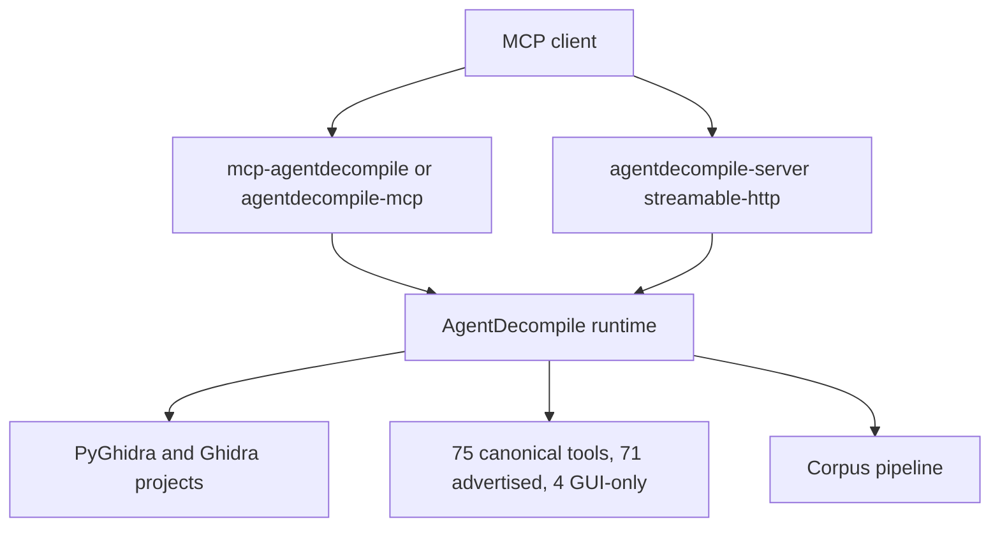

# AgentDecompile

**Connect AI to Ghidra**

Run an MCP server that talks to your Ghidra project. List functions, decompile code, rename symbols, and recover source you can rebuild.

AgentDecompile exposes live Ghidra state through the open [Model Context Protocol (MCP)](https://modelcontextprotocol.io), so agents work from functions, references, memory, and decompilation instead of guessing from filenames.

[Quick start](#installation) · [Usage guide](USAGE.md) · [Tool list](TOOLS_LIST.md) · [Docs site](https://bodecloud.github.io/AgentDecompile/) · [Doc index](docs/INDEX.md)


```mermaid
flowchart TD
  A[MCP client] --> B[mcp-agentdecompile or agentdecompile-mcp]
  A --> C[agentdecompile-server streamable-http]
  B --> D[AgentDecompile runtime]
  C --> D
  D --> E[PyGhidra and Ghidra projects]
  D --> F[75 canonical tools, 71 advertised, 4 GUI-only]
  D --> G[Corpus pipeline]
```

## What it does

1. **Analyze with agents** — MCP tools read live Ghidra state (functions, xrefs, memory, decompilation) instead of guessing from file names.
2. **Recover rebuildable C** — The reconstruct pipeline only promotes functions that compile and pass objdiff with zero differences. Everything else stays in advisory folders with honest labels.
3. **Run your way** — Stdio for desktop MCP clients, HTTP at `/mcp` for scripts and remote use, optional browser UI when you start the server locally.

A finished dashboard job is not a match. Verified means compile plus objdiff 0.

Source lives at [github.com/bodencrouch/AgentDecompile](https://github.com/bodencrouch/AgentDecompile). The published container image is still `docker.io/bolabaden/agentdecompile-mcp`. The Pages site is [bodecloud.github.io/AgentDecompile](https://bodecloud.github.io/AgentDecompile/).

## Installation

Pick one start path. Use **stdio** if your editor or Claude Desktop will spawn the server. Use **HTTP** if you want a URL you can point the CLI or another client at. Use **Docker** if you want Ghidra and the server in one image.

### 1. Stdio (desktop MCP clients)

```bash
uv run mcp-agentdecompile
# or, without a local checkout:
uvx --from git+https://github.com/bodencrouch/AgentDecompile mcp-agentdecompile
```

Success: the MCP client stays connected and can call `tools/list`.

### 2. HTTP / uvx

```bash
uv run agentdecompile-server -t streamable-http
# or:
uvx --from git+https://github.com/bodencrouch/AgentDecompile agentdecompile-server -t streamable-http
```

The MCP endpoint is `http://127.0.0.1:8080/mcp`. `/` and `/api` are metadata only. `/api/mcp` is not supported.

```bash
uv run agentdecompile-cli --server-url http://127.0.0.1:8080/mcp tool --list-tools
```

Success: the CLI prints the advertised tool list.

From source:

```bash
git clone https://github.com/bodencrouch/AgentDecompile.git
cd AgentDecompile
uv sync
export GHIDRA_INSTALL_DIR=/path/to/ghidra
```

### 3. Docker

```bash
docker run --rm \
  --add-host host.docker.internal:host-gateway \
  -p 8080:8080 \
  docker.io/bolabaden/agentdecompile-mcp:latest
```

Then point a client at `http://127.0.0.1:8080/mcp`. For a client that spawns stdio:

```bash
docker run --rm -i \
  --add-host host.docker.internal:host-gateway \
  --entrypoint /ghidra/venv/bin/agentdecompile-server \
  docker.io/bolabaden/agentdecompile-mcp:latest \
  -t stdio
```

.NET/IL decompilation needs [ilspycmd](https://github.com/icsharpcode/ILSpy) separately (`dotnet tool install -g ilspycmd`). It is not a pip extra.

## First-run environment

| Variable | Purpose |
|----------|---------|
| `GHIDRA_INSTALL_DIR` | Local Ghidra install (source checkouts) |
| `AGENT_DECOMPILE_MCP_SERVER_URL` | CLI connect URL, usually `http://127.0.0.1:8080/mcp` |
| `AGENT_DECOMPILE_GHIDRA_SERVER_HOST` / `_PORT` / `_USERNAME` / `_PASSWORD` | Ghidra Server (shared repos) only — not MCP HTTP auth |

HTTP examples in this README bind `127.0.0.1`. Do not set `AGENT_DECOMPILE_HOST=0.0.0.0` without `AGENT_DECOMPILE_AUTH_ENABLED` and a firewall. See [docs/MCP_CONFIGURATION_SECURITY.md](docs/MCP_CONFIGURATION_SECURITY.md).

The full env-var and HTTP-header catalog lives in [USAGE.md](USAGE.md).

## Corpus recovery

For more than one build, use `agentdecompile-corpus`. Register each binary. Mark the STABS/DWARF build as `--donor`. Recover a function once on the easy build, then propagate. Do not re-analyze a Ghidra program that already has analysis. A green dashboard label is not proof.

```bash
uv run agentdecompile-corpus init --id my-corpus --out target/corpus.json
uv run agentdecompile-corpus add-binary --corpus target/corpus.json \
  --id debug-build --path /path/to/debug-binary --debug stabs --donor
uv run agentdecompile-corpus run --corpus target/corpus.json \
  --snapshot-dir target/extracts --work-dir target/corpus-run --stop-after compile
```

`--stop-after compile` stops after donor C compiles. It is not a byte match. The workbench is `/dashboard` on the same HTTP server as `/mcp` (default 8080).

The optional Vite interface on port 5174 opens with a project manager. Both interfaces provide the same Code Browser, recovery commands, evidence, and jobs. See the [interface guide](src/agentdecompile_recovery/corpus/dashboard/frontend/README.md) for startup, project preparation, and Ghidra reversing workflows.

Cross-build identity is a `logical_id`, not a virtual address. After the store has bindings:

```bash
uv run agentdecompile-corpus export-hookpack --db target/corpus.sqlite --out target/hookpack.json
```

That pack is what a Phasor-shaped host loads. Per-build addresses in it are a cache.

Contract: [docs/CORPUS_PIPELINE.md](docs/CORPUS_PIPELINE.md). Bet: [STRATEGY.md](STRATEGY.md). Single-binary reconstruct (not the default): [docs/CRITICAL_PATH.md](docs/CRITICAL_PATH.md).

## Next

- Day-to-day CLI, sessions, Web UI, and failures: [USAGE.md](USAGE.md)
- Tool parameters: [TOOLS_LIST.md](TOOLS_LIST.md)
- Windows / Podman: [docs/Podman-Windows-Complete-Setup-Guide.md](docs/Podman-Windows-Complete-Setup-Guide.md)
- Security reports: [SECURITY.md](SECURITY.md)
- Vocabulary: [CONCEPTS.md](CONCEPTS.md)
- Full map: [docs/INDEX.md](docs/INDEX.md)

CLI command recipes belong in USAGE. This file only changes when install or start-path text changes.

## License

GNU Affero General Public License v3.0. See [LICENSE](LICENSE).

## Contributing

See [CONTRIBUTING.md](CONTRIBUTING.md).
