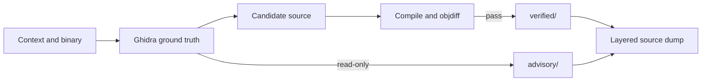

# AgentDecompile Strategy

## Problem

Reverse engineers juggle binaries, Ghidra projects, partial decompilations, notes, and half-finished source trees. Nothing ties them together with a check you can rebuild against. Format conversions lose detail. "Looks right in the decompiler" is not the same as "compiles to the same object."

## Approach

Recovery is a pipeline: pull in context, treat Ghidra and the binary inventory as ground truth, generate candidate C, and only promote what survives compile + objdiff (or an equivalent hard gate). Exports say what is **verified** (objdiff zero) vs **advisory** (Ghidra decompilation, sketches, etc.).

One product name: **AgentDecompile**. Recovery runs from this repo only — not from the archived Mizuchi tree ([MIZUCHI_ARCHIVE.md](docs/MIZUCHI_ARCHIVE.md)).

## Users

**Primary:** People doing matching decompilation on Windows/game PEs (and similar ELF/Mach-O targets) who want rebuildable C, not just pseudocode.

**Secondary:** Agent authors wiring MCP into RE workflows — they need stable Ghidra sessions and a recovery loop that fixes candidates instead of dumping unverified text.

## Metrics

| Metric | What we measure |
|--------|-----------------|
| Verified function parity | Share of inventoried functions at objdiff 0; ladder targets **1% → 5% → 20%** (not "90% recovered" as a near-term claim) |
| Context merge yield | Artifacts from acquisition that actually update labels/data/functions |
| One-shot slice success | Bounded run produces compilable source with correct claim labels |
| False-claim rate | Promoted artifacts that fail a stronger audit later — should go down |
| Agent loop completion | Autonomous repair cycles end in verified match or a named failure, not silence |
| Stage wall-time | Seconds per stage on a cold full run (`stage-timings.json`); speed must not come from skipping functions or reusing stale receipts |

## Work tracks

### Context fusion

Single path to merge notes, partial source, Ghidra exports, and project files into the active recovery target.

### Ghidra MCP reliability

Session-stable PyGhidra MCP/CLI with real analysis gates so agents and humans see the same program state.

### Matching recovery

Compiler-profile corpus, relocation-aware objects, candidate generation, vacuum/repair loop. Default `agentdecompile-reconstruct` runs **enrich-before-decompile** (names/types/RTTI/module-map via PyGhidra) before source generation; operators can pass `--skip-enrichment` for inventory/match-only runs. Scale with match cache (skip proven zero-diff unless `--force-rematch`) and parallel Wine/MSVC workers. Record stage timings.

### Multi-format export

Asm, C/C++, higher-level views, hex packages — each tagged verified or advisory. Default one-shot output: layered dump (`--dump-source`) with `verified/` (objdiff 0 only), `advisory/ghidra/`, and `Port/CODE/` (readability-gated; noise-stripped). Port readability is advisory — never a proof claim.

### One-shot performance (U1–U5 completed)

Shared Ghidra analysis, higher default decompile threads, digest-gated dump/match, and fail-closed objdiff landed in PR #140. Living plan (completed; backlog G14–G16): [docs/plans/2026-07-24-perf-recovery-one-shot-living-plan.md](docs/plans/2026-07-24-perf-recovery-one-shot-living-plan.md). Remaining scale work: per-worker Wine prefixes, synth wall-time/compile cache, SSD work-dir guidance — without skipping inventory or reusing stale receipts.

## Out of scope

- Calling byte emitters, `.incbin`, or copied target bytes "recovered source"
- Treating decompiler output or LLM text as proof without compile/objdiff
- Near-term whole-binary semantic parity claims (e.g. 90% of one game binary in one shot)
- Second product brands (Mizuchi/ReconKit) or recovery from `~/Workspaces/Mizuchi`
- Rematching objdiff-0 functions without `--force-rematch`
- Presenting last week's match JSONL or dump as today's fresh run when the task was to produce source

## Positioning

**One line:** Binaries and messy RE context in; verified, rebuildable source out — not pretty pseudocode.

**Message:** Ghidra-backed ground truth, autonomous matching recovery, and honest labels on every export.
