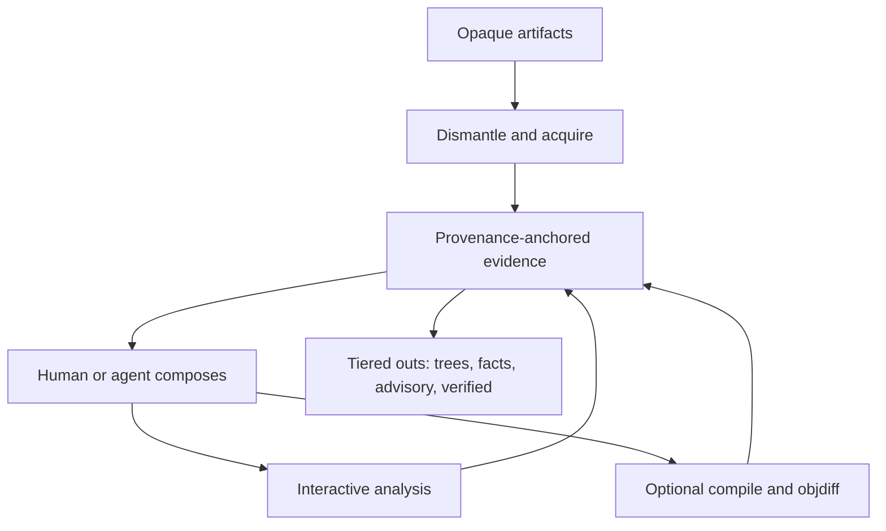

# AgentDecompile Strategy

Charter and motif live in [VISION.md](VISION.md). This file is the near-term investment map under that charter — not a second north star.

## Problem

Compiled and packaged software arrives as opaque artifacts. Agents and reverse engineers need that reality as **rich, citeable context** — layouts, sections, resources, analysis state, and (when wanted) rebuildable candidates — without hallucinated identity or a single forced recovery ritual.

## Approach

**Substrate first.** Acquire and dismantle delivery formats into navigable trees and provenance-anchored evidence; expose interactive Ghidra/MCP primitives and optional hard oracles (compile, objdiff) that agents compose. Matching recovery is a **powerful recipe** on top of that substrate, not the product identity.

One product name: **AgentDecompile**. Recovery runs from this repo only — not from the archived donor tree ([UPSTREAM_DONOR_ARCHIVE.md](docs/UPSTREAM_DONOR_ARCHIVE.md)).

## Users

**Primary:** Agents and operators who need binary/package fluency — open installers and images like source trees, follow provenance, and optionally chase rebuildable parity.

**Secondary:** Matching-decompilation operators on PE/ELF/Mach-O targets who want compile+objdiff honesty when they choose that bar.

## Metrics

| Metric | What we measure |
|--------|-----------------|
| Context yield | Authoritative, agent-usable structure/facts produced from opaque input |
| Provenance coverage | Share of emitted symbols/facts with intact origin citations |
| Dismantle fidelity | Navigability of section / package / install / resource layouts |
| Partial usefulness | Incomplete runs still leave actionable trees and honest claims |
| Verified function parity | Share of inventoried functions at objdiff 0 when that bar is in play; ladder **1% → 5% → 20%** |
| False-claim rate | Promoted artifacts failing stronger audit later — should go down |
| Agent loop completion | Cycles end in a named useful outcome — not hang or silence |
| Stage wall-time | Cold-run stage seconds when running recovery recipes — without skipping inventory or reusing stale receipts as fresh |

## Work tracks

### Acquisition and dismantling

Unpackers, section/resource trees, package/install layouts, fingerprint-keyed acquisition bundles — first-class capabilities. MCP peers in this substrate slice: `export-context`, `acquisition-query`. `acquire` remains CLI/recovery until a follow-up elevates it.

### Context fusion

Merge notes, partial source, Ghidra exports, and project knowledge by address with conflict retention; propose ≠ apply ([CONTEXT_FUSION.md](docs/CONTEXT_FUSION.md)).

### Ghidra MCP reliability

Session-stable PyGhidra MCP/CLI with real analysis gates so agents and humans share program state. Prefer primitives on the curated surface; mega-routers optional.

### Matching recovery (recipe track)

Compiler-profile corpus, relocation-aware objects, candidate generation, vacuum/repair loop. `agentdecompile-reconstruct` remains the operator one-shot recipe (enrich-before-decompile by default; `--skip-enrichment` for inventory/match-only). Scale with match cache and parallel workers. Record stage timings. **Do not treat this track as the only valid use of the product.**

### Multi-format export

Asm, C/C++, higher-level views, hex packages — each tagged verified or advisory; layered dumps with claims documentation.

### One-shot performance (U1–U5 completed)

Shared Ghidra analysis, digest-gated dump/match, fail-closed objdiff (PR #140). Living plan backlog G14–G16: [docs/plans/2026-07-24-perf-recovery-one-shot-living-plan.md](docs/plans/2026-07-24-perf-recovery-one-shot-living-plan.md).

## Out of scope

- Calling byte emitters, `.incbin`, or copied target bytes "recovered source"
- Treating decompiler output or LLM text as proof without an explicit hard check when a proof claim is made
- Forcing every agent task through the reconstruct critical-path ritual
- Near-term whole-binary semantic parity marketing claims
- Second product brands or recovery from archived donor checkouts
- Rematching objdiff-0 functions without `--force-rematch`
- Presenting stale artifacts as fresh run output when production of new context was requested
- Hardcoding commercial product identities into generic defaults — profiles derive from format and stem

## Positioning

**One line:** Compiled reality as agent-native context — structured, citeable, partially useful immediately, fully honest always.

**Message:** Dismantle and fuse evidence first; compose analysis and optional verification; never blur claim tiers.
