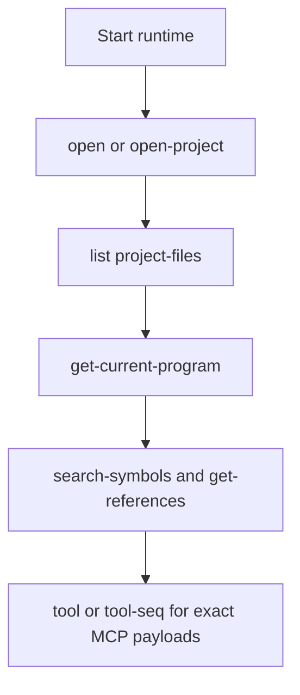
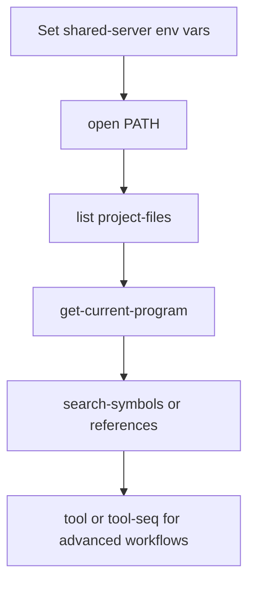

# AgentDecompile Usage Guide



This guide keeps only the current command surface. Historical output captures were removed so the examples stay aligned with the live CLI and server help.

Note: If you want to run from a local clone of the repository instead of using `git+https://github.com/bolabaden/agentdecompile`, use:

```bash
uvx --from /path/to/agentdecompile/ --with-editable /path/to/agentdecompile/ agentdecompile-cli ...
uvx --from /path/to/agentdecompile/ --with-editable /path/to/agentdecompile/ agentdecompile-server ...
uvx --from /path/to/agentdecompile/ --with-editable /path/to/agentdecompile/ agentdecompile-proxy ...
```

## Shared constants

```text
Base server URL: http://***:8080/
Preferred MCP endpoint: http://***:8080/mcp
Program path: /K1/k1_win_gog_swkotor.exe
```

Notes:

- The HTTP server exposes `/mcp` as the canonical streamable-HTTP endpoint and `/mcp/message` as the compatibility endpoint. `/` and `/api` return API index metadata, `/docs` serves Swagger UI, and `/api/mcp` is not supported.
- Add `--verbose` to `agentdecompile-cli`, `agentdecompile-server`, `agentdecompile-proxy`, or `mcp-agentdecompile` when you need transport diagnostics.
- Shared-server connection flags accept both `--ghidra-server-*` and `--server-*` spellings on the hand-written commands.

## Commands Exercised In This Session

These are the command shapes actually used while validating the current docs and transport behavior in this conversation.

```powershell
# Published Docker image in stdio mode
docker run --rm -i \
  --add-host host.docker.internal:host-gateway \
  --entrypoint /ghidra/venv/bin/agentdecompile-server \
  docker.io/bolabaden/agentdecompile-mcp:latest \
  -t stdio

# Local-checkout CLI sequence used to verify shared-repository and project lifecycle behavior
$env:PYTHONPATH='src'
C:/GitHub/agentdecompile/.venv/Scripts/python.exe -m agentdecompile_cli.cli --server-url http://127.0.0.1:8097 tool-seq '[{"name":"open-project","arguments":{"path":"LocalRepo","serverHost":"127.0.0.1","serverPort":13100,"serverUsername":"<redacted>","serverPassword":"<redacted>","format":"json"}},{"name":"list-project-files","arguments":{"format":"json"}},{"name":"import-binary","arguments":{"path":"C:/GitHub/agentdecompile/tests/fixtures/test_x86_64","enableVersionControl":true,"format":"json"}},{"name":"list-project-files","arguments":{"format":"json"}},{"name":"remove-program-binary","arguments":{"programPath":"test_x86_64","confirm":true,"format":"json"}},{"name":"list-project-files","arguments":{"format":"json"}}]'
```

Equivalent CLI entrypoint if you want the same behavior through the published command instead of `python -m`:

```powershell
uv run agentdecompile-cli --server-url http://127.0.0.1:8097 tool-seq '[{"name":"open-project","arguments":{"path":"LocalRepo","serverHost":"127.0.0.1","serverPort":13100,"serverUsername":"<redacted>","serverPassword":"<redacted>","format":"json"}},{"name":"list-project-files","arguments":{"format":"json"}},{"name":"import-binary","arguments":{"path":"C:/GitHub/agentdecompile/tests/fixtures/test_x86_64","enableVersionControl":true,"format":"json"}},{"name":"list-project-files","arguments":{"format":"json"}},{"name":"remove-program-binary","arguments":{"programPath":"test_x86_64","confirm":true,"format":"json"}},{"name":"list-project-files","arguments":{"format":"json"}}]'
```

## 1. Start the runtime

### Local stdio runtime

```bash
uvx --from git+https://github.com/bolabaden/agentdecompile mcp-agentdecompile
```

### HTTP server

```bash
uvx --from git+https://github.com/bolabaden/agentdecompile agentdecompile-server -t streamable-http --project-path ./agentdecompile_projects
```

### Proxy mode (forward to remote MCP; use agentdecompile-proxy only)

```bash
uvx --from git+https://github.com/bolabaden/agentdecompile agentdecompile-proxy --backend-url http://***:8080 -t streamable-http --host 127.0.0.1 --port 8081
```

Or set `AGENT_DECOMPILE_MCP_SERVER_URL` or `AGENTDECOMPILE_MCP_SERVER_URL` and run `agentdecompile-proxy -t streamable-http`. **agentdecompile-server** is always local (PyGhidra) and does not accept proxy options.

## 2. Shared-server environment variables

### Linux

```bash
export AGENT_DECOMPILE_GHIDRA_SERVER_HOST="<set-in-user-env>"
export AGENT_DECOMPILE_GHIDRA_SERVER_PORT="13100"
export AGENT_DECOMPILE_GHIDRA_SERVER_USERNAME="<set-in-user-env>"
export AGENT_DECOMPILE_GHIDRA_SERVER_PASSWORD="<set-in-user-env>"
export AGENT_DECOMPILE_GHIDRA_SERVER_REPOSITORY="<set-in-user-env>"
```

### PowerShell

```powershell
$Env:AGENT_DECOMPILE_GHIDRA_SERVER_HOST = "<set-in-user-env>"
$Env:AGENT_DECOMPILE_GHIDRA_SERVER_PORT = "13100"
$Env:AGENT_DECOMPILE_GHIDRA_SERVER_USERNAME = "<set-in-user-env>"
$Env:AGENT_DECOMPILE_GHIDRA_SERVER_PASSWORD = "<set-in-user-env>"
$Env:AGENT_DECOMPILE_GHIDRA_SERVER_REPOSITORY = "<set-in-user-env>"
```

Shared-server note:

- Do not set `AGENT_DECOMPILE_PROJECT_PATH` or `AGENT_DECOMPILE_PROJECT_NAME` in the same stdio/server entry when the goal is to connect directly to a shared Ghidra repository on launch.
- If both the local-project env vars and the shared-server env vars are present, the runtime may treat the launch as an explicit local project request first.
- For editor configs, prefer separate entries such as `agentdecompile-local` and `agentdecompile-shared` instead of one mixed env block.
- If you are testing workspace edits, do not use `uvx --from git+https://github.com/bolabaden/agentdecompile ...` because that launches the packaged GitHub build, not your local checkout.
- To exercise the local checkout, use `uv run agentdecompile-server ...`, `uv run agentdecompile-cli ...`, or `uvx --from /path/to/agentdecompile --with-editable /path/to/agentdecompile ...`.

## 2a. Local project configuration

Set the local Ghidra project directory and project name via environment variable or CLI argument. Neither is required for basic use — the server defaults to an `agentdecompile_projects` subdirectory with project name `my_project`.

| What | Env var | CLI arg | Notes |
|------|---------|---------|-------|
| Project directory or `.gpr` file | `AGENT_DECOMPILE_PROJECT_PATH` (alias: `AGENTDECOMPILE_PROJECT_PATH`) | `--project-path <path>` | Pass a `.gpr` file to open an existing Ghidra project; pass a directory to create/use a directory-backed project. |
| Project name | `AGENT_DECOMPILE_PROJECT_NAME` (alias: `AGENTDECOMPILE_PROJECT_NAME`) | `--project-name <name>` | Ignored when `--project-path` / `AGENT_DECOMPILE_PROJECT_PATH` points to a `.gpr` file. Defaults to the working directory name. |

### Linux

```bash
# Use a specific project directory
export AGENT_DECOMPILE_PROJECT_PATH="/home/user/ghidra-projects/my-analysis"
export AGENT_DECOMPILE_PROJECT_NAME="my-analysis"
uvx --from git+https://github.com/bolabaden/agentdecompile agentdecompile-server -t streamable-http

# Or use an existing .gpr file (project name is inferred from the file)
export AGENT_DECOMPILE_PROJECT_PATH="/home/user/ghidra-projects/my-analysis.gpr"
uvx --from git+https://github.com/bolabaden/agentdecompile agentdecompile-server -t streamable-http
```

### PowerShell

```powershell
# Use a specific project directory
$Env:AGENT_DECOMPILE_PROJECT_PATH = "C:\GhidraProjects\my-analysis"
$Env:AGENT_DECOMPILE_PROJECT_NAME = "my-analysis"
uvx --from git+https://github.com/bolabaden/agentdecompile agentdecompile-server -t streamable-http

# Or use an existing .gpr file (project name is inferred from the file)
$Env:AGENT_DECOMPILE_PROJECT_PATH = "C:\GhidraProjects\my-analysis.gpr"
uvx --from git+https://github.com/bolabaden/agentdecompile agentdecompile-server -t streamable-http
```

### CLI args (inline)

```bash
agentdecompile-server -t streamable-http \
  --project-path /home/user/ghidra-projects/my-analysis \
  --project-name my-analysis

# Existing .gpr file — --project-name is ignored
agentdecompile-server -t streamable-http \
  --project-path /home/user/ghidra-projects/my-analysis.gpr
```

## 3. Current CLI workflows

### Open a program

```powershell
uvx --from git+https://github.com/bolabaden/agentdecompile agentdecompile-cli --server-url http://***:8080/ open /K1/k1_win_gog_swkotor.exe
```

Equivalent raw tool call:

```powershell
uvx --from git+https://github.com/bolabaden/agentdecompile agentdecompile-cli --server-url http://***:8080/ tool open-project '{"path":"/K1/k1_win_gog_swkotor.exe"}'
```

### List project files

```powershell
agentdecompile-cli --server-url http://***:8080/ list project-files
```

### Verify the active program

```powershell
uvx --from git+https://github.com/bolabaden/agentdecompile agentdecompile-cli --server-url http://***:8080/ get-current-program --program_path /K1/k1_win_gog_swkotor.exe
```

### Search symbols

```powershell
uvx --from git+https://github.com/bolabaden/agentdecompile agentdecompile-cli --server-url http://***:8080/ search-symbols --program_path /K1/k1_win_gog_swkotor.exe --query SaveGame
```

If you specifically need the legacy alias for parity testing, use raw tool mode:

```powershell
uvx --from git+https://github.com/bolabaden/agentdecompile agentdecompile-cli --server-url http://***:8080/ tool search-symbols-by-name '{"programPath":"/K1/k1_win_gog_swkotor.exe","query":"SaveGame","limit":20}'
```

### References to and from a target

```powershell
uvx --from git+https://github.com/bolabaden/agentdecompile agentdecompile-cli --server-url http://***:8080/ references to --binary /K1/k1_win_gog_swkotor.exe --target WinMain
uvx --from git+https://github.com/bolabaden/agentdecompile agentdecompile-cli --server-url http://***:8080/ references from --binary /K1/k1_win_gog_swkotor.exe --target 0x004b58a0
```

### List imports and exports

```powershell
uvx --from git+https://github.com/bolabaden/agentdecompile agentdecompile-cli --server-url http://***:8080/ list imports --binary /K1/k1_win_gog_swkotor.exe
uvx --from git+https://github.com/bolabaden/agentdecompile agentdecompile-cli --server-url http://***:8080/ list exports --binary /K1/k1_win_gog_swkotor.exe
```

### Read MCP resources

```powershell
uvx --from git+https://github.com/bolabaden/agentdecompile agentdecompile-cli --server-url http://***:8080/ resource programs
uvx --from git+https://github.com/bolabaden/agentdecompile agentdecompile-cli --server-url http://***:8080/ resource static-analysis
uvx --from git+https://github.com/bolabaden/agentdecompile agentdecompile-cli --server-url http://***:8080/ resource debug-info
```

### Run a sequence of tool calls in one session

```powershell
$steps = '[{"name":"open-project","arguments":{"path":"/K1/k1_win_gog_swkotor.exe"}},{"name":"get-current-program","arguments":{"programPath":"/K1/k1_win_gog_swkotor.exe"}},{"name":"get-references","arguments":{"programPath":"/K1/k1_win_gog_swkotor.exe","target":"WinMain","direction":"to","limit":10}}]'
uvx --from git+https://github.com/bolabaden/agentdecompile agentdecompile-cli --server-url http://***:8080/ tool-seq $steps
```

This is the supported way to keep state inside one CLI invocation.

## 3a. Terminal-validated local JSON contracts

The contracts below were re-validated against a real `agentdecompile-server -t streamable-http` process using `tests/fixtures/test_x86_64` before the strict E2E assertions were written.

- Default live MCP advertisement is **36 tools**.
- Hidden-but-callable legacy tools still work through raw MCP and curated CLI commands; for example `manage-comments` is callable even though it is not in the default `tools/list` output.
- `switch-project` remains accepted as a compatibility alias and currently routes to `open-project`, but it is intentionally not advertised.
- Local JSON `list-functions` returns a `results` array, not `functions`.
- Local JSON `open-project` and `import-binary` are similar but not identical: `open-project` returns `operation`, while `import-binary` returns `action` plus `success`, `language`, and `compiler` fields.
- On the current local sample fixture, `change-processor` fails with a `ProgramDB.setLanguage(...)` overload error and leaves the active program unchanged in terminal validation. That observed failure is captured in `examples/mcp_responses/local_live_contract_test_x86_64.json`.

The repository now includes an **experimental** grouped local terminal-contract suite at `tests/test_e2e_local_terminal_contracts.py`. It is based on terminal-validated observations and is intended for opt-in harness work (`AGENTDECOMPILE_ENABLE_EXPERIMENTAL_LOCAL_CONTRACTS=1`) while the Windows pytest subprocess path is still being hardened. The existing `tests/test_e2e_project_lifecycle.py` suite continues to cover the exact read-only markdown contracts for function/reference/import/export inspection.

See `tests/test_e2e_local_terminal_contracts.py` and `examples/mcp_responses/local_live_contract_test_x86_64.json` for the captured contract reference used by the suite.

### Shared repository quick sequence with uvx

Use this when you want an install-free command chain against a shared repository MCP server.

The CLI accepts either a base server URL or an MCP endpoint URL. The examples below use `--mcp-server-url http://host:port/mcp/` explicitly so the transport path is visible in copy-pasteable commands.

If you are validating a local code change, replace these `uvx --from ...` commands with `uv run ...` from the local repository, or use `uvx --from /path/to/agentdecompile --with-editable /path/to/agentdecompile ...`, so the terminal run actually exercises your modified code.



Set shared repository defaults first:

```powershell
$Env:AGENT_DECOMPILE_GHIDRA_SERVER_HOST = "<ghidra-server-host>"
$Env:AGENT_DECOMPILE_GHIDRA_SERVER_PORT = "13100"
$Env:AGENT_DECOMPILE_GHIDRA_SERVER_USERNAME = "<ghidra-username>"
$Env:AGENT_DECOMPILE_GHIDRA_SERVER_PASSWORD = "<ghidra-password>"
$Env:AGENT_DECOMPILE_GHIDRA_SERVER_REPOSITORY = "<repository-name>"
```

Open a program from the shared repository:

```powershell
uvx --from git+https://github.com/bolabaden/agentdecompile agentdecompile-cli --mcp-server-url http://***:8080/mcp/ open --server_host "$Env:AGENT_DECOMPILE_GHIDRA_SERVER_HOST" --server_port "$Env:AGENT_DECOMPILE_GHIDRA_SERVER_PORT" --server_username "$Env:AGENT_DECOMPILE_GHIDRA_SERVER_USERNAME" --server_password "$Env:AGENT_DECOMPILE_GHIDRA_SERVER_PASSWORD" /K1/k1_win_gog_swkotor.exe
```

List available project files:

```powershell
uvx --from git+https://github.com/bolabaden/agentdecompile agentdecompile-cli --mcp-server-url http://***:8080/mcp/ list project-files
```

Observed live result during this session included `/K1` and `/K1/k1_win_gog_swkotor.exe` from a fresh shared-session bootstrap.

Verify the active program:

```powershell
uvx --from git+https://github.com/bolabaden/agentdecompile agentdecompile-cli --mcp-server-url http://***:8080/mcp/ get-current-program --program_path /K1/k1_win_gog_swkotor.exe
```

Observed live result during this session:

```text
loaded: True
name: swkotor.exe
language: x86:LE:32:default
compiler: windows
functionCount: 24591
```

Inspect a concrete function after discovery:

```powershell
uvx --from git+https://github.com/bolabaden/agentdecompile agentdecompile-cli --mcp-server-url http://***:8080/mcp/ get-functions --program_path /K1/k1_win_gog_swkotor.exe --identifier WinMain
```

Observed live result during this session:

```text
identifier: WinMain
address: 004041f0
name: WinMain
```

Search symbols:

```powershell
uvx --from git+https://github.com/bolabaden/agentdecompile agentdecompile-cli --mcp-server-url http://***:8080/mcp/ search-symbols --program_path /K1/k1_win_gog_swkotor.exe --query main
```

Observed live result during this session:

```text
query: main
totalMatched: 58
sampleHit: WinMain
```

Trace references:

```powershell
uvx --from git+https://github.com/bolabaden/agentdecompile agentdecompile-cli --mcp-server-url http://***:8080/mcp/ references to --binary /K1/k1_win_gog_swkotor.exe --target WinMain
uvx --from git+https://github.com/bolabaden/agentdecompile agentdecompile-cli --mcp-server-url http://***:8080/mcp/ references from --binary /K1/k1_win_gog_swkotor.exe --target 0x004b58a0
```

Use raw tool mode when you need exact MCP payload control:

```powershell
uvx --from git+https://github.com/bolabaden/agentdecompile agentdecompile-cli --mcp-server-url http://***:8080/mcp/ tool list-imports '{"programPath":"/K1/k1_win_gog_swkotor.exe","limit":5}'
uvx --from git+https://github.com/bolabaden/agentdecompile agentdecompile-cli --mcp-server-url http://***:8080/mcp/ tool list-exports '{"programPath":"/K1/k1_win_gog_swkotor.exe","limit":5}'
```

Notes:

- Fresh CLI invocations create fresh MCP sessions. `get-functions`, `search-symbols`, `references`, and `get-current-program` can reopen the requested program when `--program_path` is provided together with shared-server env vars.
- `list project-files` on a fresh session requires a backend built from this revision or newer so it can bootstrap the shared repository index from shared-server env vars.
- The live remote path re-verified in this session was `http://170.9.241.140:8080/mcp`; keep `/mcp` in docs and client configs even though the CLI can also normalize a base URL.
- If shared-server authentication fails, the CLI now reports both the wrapper exception and the underlying Ghidra adapter error when the backend is running this revision or newer.

Keep state inside one CLI invocation when you need a strict open-then-query flow:

```powershell
uvx --from git+https://github.com/bolabaden/agentdecompile agentdecompile-cli --mcp-server-url http://***:8080/mcp/ tool-seq '[{"name":"open-project","arguments":{"path":"/K1/k1_win_gog_swkotor.exe"}},{"name":"get-current-program","arguments":{"programPath":"/K1/k1_win_gog_swkotor.exe"}}]'
```

## 4. Raw MCP HTTP example

The documented MCP request paths are `/mcp` and `/mcp/message` (with optional trailing slash). `/mcp` is the primary streamable-HTTP endpoint. `/` and `/api` expose the API index metadata, `/docs` serves the Swagger UI, and `/api/mcp` is not a valid MCP route. Send requests after your client performs the normal MCP `initialize` handshake.

Example `tools/call` payload:

```json
{
  "jsonrpc": "2.0",
  "id": 101,
  "method": "tools/call",
  "params": {
    "name": "get-references",
    "arguments": {
      "programPath": "/K1/k1_win_gog_swkotor.exe",
      "target": "WinMain",
      "direction": "to",
      "limit": 25
    }
  }
}
```

### Response format

Tool responses are returned as Markdown-formatted text by default. To receive raw JSON instead, include `"format": "json"` in the tool's `arguments`. This is useful for automated pipelines that parse structured data.

Error responses for unresolvable program paths are returned as raw JSON (with `"success": false`) even in Markdown mode.

## 5. Tool naming guidance

- Prefer canonical tool names from [TOOLS_LIST.md](TOOLS_LIST.md).
- Use `agentdecompile-cli tool --list-tools` to inspect the currently advertised set.
- Use `agentdecompile-cli alias <tool-name>` when you need to understand compatibility forwards.
- Prefer `search-symbols` for new docs and workflows; `search-symbols-by-name` remains a compatibility alias.
- Prefer `open-project` in raw tool mode and `open` in the convenience CLI command set.

## 6. Common failure states

Typical tool errors include a `nextSteps` array. Follow those steps before broad retries.

When a tool cannot resolve the requested program path, the error is returned as raw JSON even in the default Markdown mode:

```json
{
  "success": false,
  "error": "Program path '...' was provided but could not be resolved/opened ...",
  "context": {
    "state": "program-resolution-failed",
    "requestedProgramPath": "...",
    "prerequisiteCalls": [...]
  },
  "nextSteps": [
    "Call `list-project-files` to discover the exact program path.",
    "Call `import-binary` to import if the file is not yet in the project."
  ]
}
```

Authentication and server errors follow the same shape:

```json
{
  "success": false,
  "error": "Authentication failed for user@host:13100: ...",
  "context": {
    "state": "authentication-failed",
    "tool": "open-project"
  },
  "nextSteps": [
    "Verify serverUsername/serverPassword and retry open-project.",
    "If credentials are correct, verify server reachability and repository access."
  ]
}
```

## 7. Related docs

- `README.md` for installation and transport overview.
- `docs/MCP_AGENTDECOMPILE_USAGE.md` for MCP client configuration.
- `docs/IMPORT_EXPORT_GUIDE.md` for import and export workflows.
