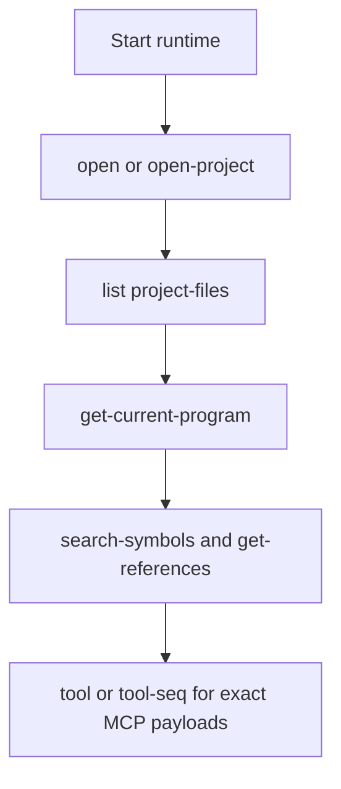

# AgentDecompile Usage Guide



This guide keeps only the current command surface. Historical output captures were removed so the examples stay aligned with the live CLI and server help.

## Shared constants

```text
Server URL: http://***:8080/
MCP endpoint: http://***:8080/mcp/message
Program path: /K1/k1_win_gog_swkotor.exe
```

Notes:

- The HTTP server accepts `/mcp/message` as the canonical endpoint and also accepts `/` and `/mcp` for compatibility.
- Add `--verbose` to `agentdecompile-cli`, `agentdecompile-server`, or `mcp-agentdecompile` when you need transport diagnostics.
- Shared-server connection flags accept both `--ghidra-server-*` and `--server-*` spellings on the hand-written commands.

## 1. Start the runtime

### Local stdio runtime

```bash
uv run mcp-agentdecompile
```

### HTTP server

```bash
uv run agentdecompile-server -t streamable-http --project-path ./agentdecompile_projects
```

### Proxy mode

```bash
uv run agentdecompile-server --backend-url http://***:8080 -t streamable-http --host 127.0.0.1 --port 8081
```

## 2. Shared-server environment variables

### Linux

```bash
export AGENT_DECOMPILE_GHIDRA_SERVER_HOST="<set-in-user-env>"
export AGENT_DECOMPILE_GHIDRA_SERVER_PORT="13100"
export AGENT_DECOMPILE_GHIDRA_SERVER_USERNAME="<set-in-user-env>"
export AGENT_DECOMPILE_GHIDRA_SERVER_PASSWORD="<set-in-user-env>"
export AGENT_DECOMPILE_GHIDRA_SERVER_REPOSITORY="<set-in-user-env>"
```

### PowerShell

```powershell
$Env:AGENT_DECOMPILE_GHIDRA_SERVER_HOST = "<set-in-user-env>"
$Env:AGENT_DECOMPILE_GHIDRA_SERVER_PORT = "13100"
$Env:AGENT_DECOMPILE_GHIDRA_SERVER_USERNAME = "<set-in-user-env>"
$Env:AGENT_DECOMPILE_GHIDRA_SERVER_PASSWORD = "<set-in-user-env>"
$Env:AGENT_DECOMPILE_GHIDRA_SERVER_REPOSITORY = "<set-in-user-env>"
```

## 3. Current CLI workflows

### Open a program

```powershell
agentdecompile-cli --server-url http://***:8080/ open /K1/k1_win_gog_swkotor.exe
```

Equivalent raw tool call:

```powershell
agentdecompile-cli --server-url http://***:8080/ tool open-project '{"path":"/K1/k1_win_gog_swkotor.exe"}'
```

### List project files

```powershell
agentdecompile-cli --server-url http://***:8080/ list project-files
```

### Verify the active program

```powershell
agentdecompile-cli --server-url http://***:8080/ get-current-program --program_path /K1/k1_win_gog_swkotor.exe
```

### Search symbols

```powershell
agentdecompile-cli --server-url http://***:8080/ search-symbols --program_path /K1/k1_win_gog_swkotor.exe --query SaveGame --limit 20
```

If you specifically need the legacy alias for parity testing, use raw tool mode:

```powershell
agentdecompile-cli --server-url http://***:8080/ tool search-symbols-by-name '{"programPath":"/K1/k1_win_gog_swkotor.exe","query":"SaveGame","limit":20}'
```

### References to and from a target

```powershell
agentdecompile-cli --server-url http://***:8080/ references to --binary /K1/k1_win_gog_swkotor.exe --target WinMain --limit 25
agentdecompile-cli --server-url http://***:8080/ references from --binary /K1/k1_win_gog_swkotor.exe --target 0x004b58a0 --limit 100
```

### List imports and exports

```powershell
agentdecompile-cli --server-url http://***:8080/ list imports --binary /K1/k1_win_gog_swkotor.exe
agentdecompile-cli --server-url http://***:8080/ list exports --binary /K1/k1_win_gog_swkotor.exe
```

### Read MCP resources

```powershell
agentdecompile-cli --server-url http://***:8080/ resource programs
agentdecompile-cli --server-url http://***:8080/ resource static-analysis
agentdecompile-cli --server-url http://***:8080/ resource debug-info
```

### Run a sequence of tool calls in one session

```powershell
$steps = '[{"name":"open-project","arguments":{"path":"/K1/k1_win_gog_swkotor.exe"}},{"name":"get-current-program","arguments":{"programPath":"/K1/k1_win_gog_swkotor.exe"}},{"name":"get-references","arguments":{"programPath":"/K1/k1_win_gog_swkotor.exe","target":"WinMain","direction":"to","limit":10}}]'
agentdecompile-cli --server-url http://***:8080/ tool-seq $steps
```

This is the supported way to keep state inside one CLI invocation.

## 4. Raw MCP HTTP example

When you need to call the MCP endpoint directly, send requests to `http://host:port/mcp/message` after your client performs the normal MCP `initialize` handshake.

Example `tools/call` payload:

```json
{
  "jsonrpc": "2.0",
  "id": 101,
  "method": "tools/call",
  "params": {
    "name": "get-references",
    "arguments": {
      "programPath": "/K1/k1_win_gog_swkotor.exe",
      "target": "WinMain",
      "direction": "to",
      "limit": 25
    }
  }
}
```

## 5. Tool naming guidance

- Prefer canonical tool names from [TOOLS_LIST.md](TOOLS_LIST.md).
- Use `agentdecompile-cli tool --list-tools` to inspect the currently advertised set.
- Use `agentdecompile-cli alias <tool-name>` when you need to understand compatibility forwards.
- Prefer `search-symbols` for new docs and workflows; `search-symbols-by-name` remains a compatibility alias.
- Prefer `open-project` in raw tool mode and `open` in the convenience CLI command set.

## 6. Common failure states

Typical tool errors include a `nextSteps` array. Follow those steps before broad retries. Example shape:

```json
{
  "success": false,
  "error": "Authentication failed for user@host:13100: ...",
  "context": {
    "state": "authentication-failed",
    "tool": "open-project"
  },
  "nextSteps": [
    "Verify serverUsername/serverPassword and retry open-project.",
    "If credentials are correct, verify server reachability and repository access."
  ]
}
```

## 7. Related docs

- `README.md` for installation and transport overview.
- `docs/MCP_AGENTDECOMPILE_USAGE.md` for MCP client configuration.
- `docs/IMPORT_EXPORT_GUIDE.md` for import and export workflows.
- `usage_structure.md` for the short shared-repository command chain.
