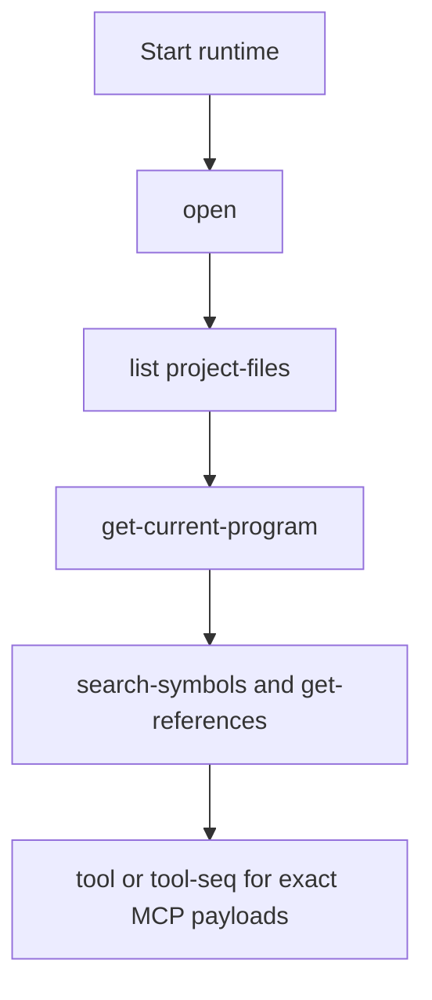

# AgentDecompile Usage Guide

Install and first start live in [README.md](README.md). This page is the day-to-day operator manual. New CLI command recipes land here first.


```mermaid
flowchart TD
  A[Start runtime] --> B[open]
  B --> C[list project-files]
  C --> D[get-current-program]
  D --> E[search-symbols and get-references]
  E --> F[tool or tool-seq for exact MCP payloads]
```

If you run from a local clone instead of the published repo:

```bash
git clone https://github.com/bolabaden/agentdecompile
uvx --from /path/to/agentdecompile/ --with-editable ./agentdecompile agentdecompile-cli ...
uvx --from /path/to/agentdecompile/ --with-editable ./agentdecompile agentdecompile-server ...
uvx --from /path/to/agentdecompile/ --with-editable ./agentdecompile agentdecompile-proxy ...
```

## Endpoints

- Canonical MCP HTTP: `http://127.0.0.1:8080/mcp`
- Compatibility: `http://127.0.0.1:8080/mcp/message`
- `/` and `/api` return API index metadata
- `/docs` is Swagger UI
- `/api/mcp` is not supported

Prefer `--mcp-server-url http://127.0.0.1:8080/mcp` in examples. The CLI also accepts the base URL and normalizes it. Explicit `--server-url`, `--host`, or `--port` stay authoritative and fail instead of being ignored.

When you do not pass an explicit backend, the CLI treats unreachable default or env URLs as recoverable: reuse a cached local server, auto-start one, or fall back to in-process local execution.

## Sessions

Each standalone CLI command is a fresh session unless you use `tool-seq`.

When no `mcp-session-id` (or session cookie) is sent, the server uses a single default session. Sequential CLI runs can reuse that session. For multi-session or multi-user use, send a distinct session id.

**Session IDs are not authentication.** Do not treat `mcp-session-id` or the default session as access control. Protocol rules: [docs/session-handling.md](docs/session-handling.md).

`tool-seq` counts a step as failed (and exits non-zero) if any text part contains markdown `## Error` with a blockquote, or `## Modification conflict`, even when the MCP envelope has `isError: false`.

Add `--verbose` on the CLI, server, or proxy when you need transport diagnostics.

## Workbench

The operator UI is `/dashboard` on the same HTTP server as `/mcp`. Default: `http://127.0.0.1:8080/dashboard`.

```bash
uv run agentdecompile-server -t streamable-http
```

Open an already-analyzed Ghidra project and use the functions already there. Do not call `analyze-program` unless that program has no analysis yet. `force=true` is the retry.

`AGENT_DECOMPILE_WEBUI_*` still starts an optional sidecar if you set it. Corpus recovery does not use that port.

## Shared Ghidra Server

Do not set `AGENT_DECOMPILE_PROJECT_PATH` in the same launch when the goal is a shared repository. Prefer separate editor entries for local vs shared.

```bash
export AGENT_DECOMPILE_GHIDRA_SERVER_HOST="YOUR_GHIDRA_HOST"
export AGENT_DECOMPILE_GHIDRA_SERVER_PORT="13100"
export AGENT_DECOMPILE_GHIDRA_SERVER_USERNAME="<set-in-user-env>"
export AGENT_DECOMPILE_GHIDRA_SERVER_PASSWORD="<set-in-user-env>"
export AGENT_DECOMPILE_GHIDRA_SERVER_REPOSITORY="<set-in-user-env>"
```

Those credentials authenticate Ghidra Server, not the MCP HTTP listener. See [docs/MCP_CONFIGURATION_SECURITY.md](docs/MCP_CONFIGURATION_SECURITY.md).

## Workflows

Public fixture: `tests/fixtures/test_x86_64`. Other examples use `/path/to/binary`.

### Open, list, inspect

```bash
uv run agentdecompile-cli --server-url http://127.0.0.1:8080/mcp \
  tool-seq '[{"name":"open","arguments":{"path":"tests/fixtures/test_x86_64"}},{"name":"list-project-files","arguments":{}},{"name":"get-current-program","arguments":{}}]'
```

Convenience forms (same session only if you use `tool-seq`):

```bash
uv run agentdecompile-cli --server-url http://127.0.0.1:8080/mcp open tests/fixtures/test_x86_64
uv run agentdecompile-cli --server-url http://127.0.0.1:8080/mcp list project-files
uv run agentdecompile-cli --server-url http://127.0.0.1:8080/mcp search-symbols --query main
uv run agentdecompile-cli --server-url http://127.0.0.1:8080/mcp get-functions --identifier main
```

### Import and export

```bash
uv run agentdecompile-cli import-binary /path/to/binary
uv run agentdecompile-cli tool export '{"programPath":"/path/to/binary","outputPath":"./analysis.sarif","format":"sarif"}'
```

Full parameter guide: [docs/IMPORT_EXPORT_GUIDE.md](docs/IMPORT_EXPORT_GUIDE.md).

### Context pieces

Extra notes, dumps, and archives merge by address. They stay advisory until objdiff. See [docs/CONTEXT_FUSION.md](docs/CONTEXT_FUSION.md).

### Fast triage

1. `agentdecompile-cli --mcp-server-url http://127.0.0.1:8080/mcp tool --list-tools`
2. `list project-files`
3. `get-current-program`
4. Use `tool-seq` when state must survive
5. Shared-server auth failures: check `AGENT_DECOMPILE_GHIDRA_SERVER_*` before retry loops
6. If local import succeeded but later errors mention `127.0.0.1:13100`, check whether shared-server env leaked into a local path

## Failure states

| Symptom | Check | Next |
|---------|-------|------|
| `No program loaded` | Did `open` / `import-binary` run in this session? | Use `tool-seq` or pass `programPath` |
| Shared-server `NotConnectedException` plus `FailedLoginException` | Host, port, username, password, repo | [docs/MCP_CONFIGURATION_SECURITY.md](docs/MCP_CONFIGURATION_SECURITY.md) |
| Tool content has `## Error` but process exit is 0 | Payload text, not transport | Treat payload as authoritative |
| Convenience flag missing | `agentdecompile-cli <command> -h` | Use raw `tool` for exact MCP keys |
| Local VC probe looks like success | Content may still say checkout failed | Trust payload semantics |
| Empty SARIF | `analyzeAfterImport` | Re-import or analyze first |

Typical unresolved-program payload:

```json
{
  "success": false,
  "error": "Program path '...' was provided but could not be resolved/opened ...",
  "nextSteps": [
    "Call `list-project-files` to discover the exact program path.",
    "Call `import-binary` to import if the file is not yet in the project."
  ]
}
```

## Environment variables

`AGENTDECOMPILE_*` aliases mirror the `AGENT_DECOMPILE_*` names below.

| Variable(s) | Scope | Purpose |
|----------|---------|---------|
| `GHIDRA_INSTALL_DIR` | Runtime | Path to Ghidra |
| `AGENT_DECOMPILE_BACKEND_URL` | Runtime | Remote MCP backend for proxy |
| `AGENT_DECOMPILE_MCP_SERVER_URL` | Runtime/CLI | MCP URL for CLI connect and proxy |
| `AGENT_DECOMPILE_SERVER_URL` | Runtime/CLI | Legacy server URL alias |
| `AGENT_DECOMPILE_MCP_SERVER_HOST`, `AGENT_DECOMPILE_MCP_SERVER_PORT` | Runtime/CLI | Host/port when composing MCP URLs |
| `AGENT_DECOMPILE_HOST` | Runtime | MCP HTTP bind host |
| `AGENT_DECOMPILE_PORT` | Runtime | MCP HTTP bind port |
| `AGENT_DECOMPILE_PROJECT_PATH` | Runtime/CLI | Local project or `.gpr` |
| `AGENT_DECOMPILE_PROJECT_NAME` | Runtime/CLI | Local project name |
| `AGENT_DECOMPILE_DEFAULT_PROJECT_DIR` | Runtime | Default project directory |
| `AGENT_DECOMPILE_GHIDRA_SERVER_HOST`, `AGENT_DECOMPILE_HTTP_GHIDRA_SERVER_HOST`, `AGENT_DECOMPILE_SERVER_HOST`, `AGENT_DECOMPILE_GHIDRA_HOST` | Runtime/CLI | Shared Ghidra host |
| `AGENT_DECOMPILE_GHIDRA_SERVER_PORT`, `AGENT_DECOMPILE_HTTP_GHIDRA_SERVER_PORT`, `AGENT_DECOMPILE_SERVER_PORT`, `AGENT_DECOMPILE_GHIDRA_PORT` | Runtime/CLI | Shared Ghidra port |
| `AGENT_DECOMPILE_GHIDRA_SERVER_USERNAME`, `AGENT_DECOMPILE_SERVER_USERNAME`, `AGENT_DECOMPILE_GHIDRA_USERNAME` | Runtime/CLI | Shared Ghidra username |
| `AGENT_DECOMPILE_GHIDRA_SERVER_PASSWORD`, `AGENT_DECOMPILE_SERVER_PASSWORD`, `AGENT_DECOMPILE_GHIDRA_PASSWORD` | Runtime/CLI | Shared Ghidra password |
| `AGENT_DECOMPILE_GHIDRA_SERVER_REPOSITORY`, `AGENT_DECOMPILE_HTTP_GHIDRA_SERVER_REPOSITORY`, `AGENT_DECOMPILE_REPOSITORY`, `AGENT_DECOMPILE_GHIDRA_REPOSITORY` | Runtime/CLI | Shared repository name |
| `AGENT_DECOMPILE_AUTH_ENABLED` | Runtime | Require MCP HTTP auth |
| `AGENT_DECOMPILE_TLS_CERT`, `AGENT_DECOMPILE_TLS_KEY` | Runtime | TLS paths for HTTPS |
| `AGENT_DECOMPILE_PYGHIDRA_VMARGS` | Runtime/tests | Extra JVM args |
| `AGENT_DECOMPILE_CLI_OP_TIMEOUT` | CLI | Per-tool timeout |
| `AGENT_DECOMPILE_MCP_BIND_TIMEOUT` | Runtime | Bind timeout |
| `AGENT_DECOMPILE_SESSION_GRACE_PERIOD` | Runtime | Session cleanup grace |
| `AGENT_DECOMPILE_DEBUG` | Runtime | Debug logging |
| `AGENT_DECOMPILE_TOOL_SURFACE` | Runtime | `full`, `curated`, or `legacy` |
| `AGENT_DECOMPILE_DISABLE_TOOLS` | Runtime | Comma-separated hide list |
| `AGENT_DECOMPILE_ENABLE_TOOLS` | Runtime | Explicit allow-list |
| `AGENT_DECOMPILE_ENABLE_LEGACY_TOOLS`, `AGENT_DECOMPILE_SHOW_LEGACY_TOOLS` | Runtime | Re-advertise aliases |
| `AGENT_DECOMPILE_AUTO_CHECKIN` | Runtime | Auto check-in after setters |
| `AGENT_DECOMPILE_AUTO_MATCH_PROPAGATE` | Runtime | Auto `match-function` after setters |
| `AGENT_DECOMPILE_AUTO_MATCH_TARGET_PATHS` | Runtime | Propagation targets |
| `AGENT_DECOMPILE_JVM_EPOCH` | Runtime | Force shared-session refresh |
| `AGENT_DECOMPILE_LOCAL_MODE` | CLI | Force local-mode CLI |
| `AGENT_DECOMPILE_PROGRAM_PATH` | CLI | Default program path |
| `AGENT_DECOMPILE_PROGRAM` | CLI | Legacy program alias |
| `AGENT_DECOMPILE_BINARY_NAME` | CLI | Default `binaryName` |
| `AGENT_DECOMPILE_WEBUI_ENABLED`, `AGENT_DECOMPILE_WEBUI` | Runtime | Optional leftover sidecar on/off. Workbench is `/dashboard` on 8080. |
| `AGENT_DECOMPILE_WEBUI_HOST` | Runtime | Leftover sidecar bind host |
| `AGENT_DECOMPILE_WEBUI_PORT` | Runtime | Leftover sidecar bind port |
| `AGENT_DECOMPILE_WEBUI_BACKEND_URL` | Runtime | Leftover sidecar backend override |
| `AGENT_DECOMPILE_TEST_SERVER_URL` | Tests | External live server |
| `AGENT_DECOMPILE_STRESS_COPIES_PER_SEED` | Tests | Stress fixture copies |
| `AGENT_DECOMPILE_PROFILE_DIR` | Tests | Profile output dir |
| `AGENT_DECOMPILE_PROFILE_ANALYZER` | Tests | Analyzer script path |
| `AGENT_DECOMPILE_PROFILE_SEARCH_EVERYTHING` | Tests | Search profiling |

### HTTP headers for shared-server requests

| Environment variable | HTTP equivalent |
|----------|---------|
| `AGENT_DECOMPILE_GHIDRA_SERVER_HOST` | `X-Ghidra-Server-Host` |
| `AGENT_DECOMPILE_GHIDRA_SERVER_PORT` | `X-Ghidra-Server-Port` |
| `AGENT_DECOMPILE_GHIDRA_SERVER_REPOSITORY` | `X-Ghidra-Repository` |
| `AGENT_DECOMPILE_GHIDRA_SERVER_USERNAME` + password | `Authorization: Basic <base64>` |
| same username / password | `X-Agent-Server-Username` / `X-Agent-Server-Password` |

Credential precedence: `Authorization: Basic` then the `X-Agent-Server-*` pair. Never hardcode passwords in `mcp.json`.

## Naming

Canonical MCP tool names are kebab-case. JSON keys are camelCase. Convenience CLI flags are not always 1:1 with raw tool keys. Use `-h` or `agentdecompile-cli alias <tool-name>`. Prefer `search-symbols` over `search-symbols-by-name`. Prefer `open` over `switch-project`.

Modifying tools may return a `conflictId`. Complete the change with `resolve-modification-conflict`. Do not retry the same setter to force overwrite.

## Related docs

- [README.md](README.md) — install and start paths
- [docs/INDEX.md](docs/INDEX.md) — hub
- [docs/CORPUS_PIPELINE.md](docs/CORPUS_PIPELINE.md) — multi-binary recovery
- [docs/IMPORT_EXPORT_GUIDE.md](docs/IMPORT_EXPORT_GUIDE.md) — import/export
- [docs/MCP_CONFIGURATION_SECURITY.md](docs/MCP_CONFIGURATION_SECURITY.md) — bind, auth, `mcp.json`
- [docs/session-handling.md](docs/session-handling.md) — session id rules
- [CONCEPTS.md](CONCEPTS.md) — vocabulary
- [docs/CONTEXT_FUSION.md](docs/CONTEXT_FUSION.md) — merge notes and address-keyed conflicts
- [TOOLS_LIST.md](TOOLS_LIST.md) — tool parameters

### React workbench and optional Vite frontend

The MCP HTTP server serves the production React application at `/dashboard`, without a Node runtime. See [frontend development and verification](src/agentdecompile_recovery/corpus/dashboard/frontend/README.md). The optional Vite process uses port **5174** and `AGENTDECOMPILE_BACKEND` to select its MCP backend; both serving modes use the same application and state.
