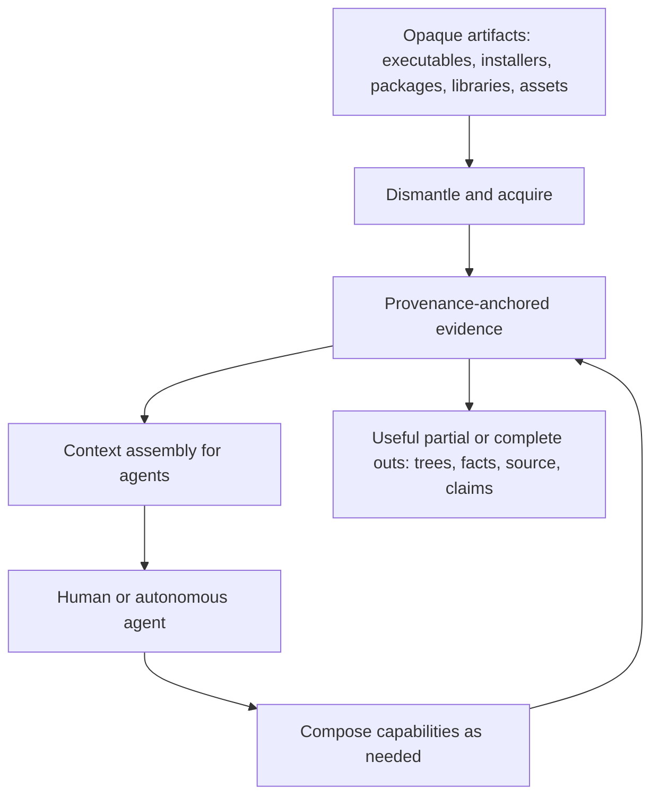

# VISION.md — AgentDecompile Intent, Purpose, and Role

**Audience:** founders, stakeholders, orchestrators, and agents who need to represent *why this codebase exists* — not how any particular line of it works today.  
**Not for:** end-user READMEs, API reference, runbooks, or status dashboards.  
**Character:** aspirational and contractual. Describes goals, expectations, and claim boundaries. Does not inventory defects, name modules, prescribe pipelines, or hardcode product identities.

---

## 1. Motif

**Work with compiled binary data as rich, high-quality context that an agent can understand almost as seamlessly as straight source code.**

That is the permanent center of gravity. Everything else — extraction, lifting, decompilation, matching, verification, packaging, agent loops — exists to serve it.

AgentDecompile is a **context substrate for machine code and packaged software**, not a single-purpose decompiler and not a fixed recovery funnel. It turns opaque artifacts into structured, provenance-anchored evidence that language models and humans can reason over fluently. Verification and rebuildability are the strongest forms of that evidence — not the only forms, and not the only valid uses of the system.

---

## 2. Charter

AgentDecompile exists to close the gap between **binaries as opaque blobs** and **binaries as intelligible working material**.

The system should let even a small model move — with assistance from tooling, retrieval, and structure — between source, binary, and recovered understanding. Full automated round-tripping of arbitrary applications is a multi-decade horizon: exhaustive, meticulous, and never finished. The durable bet is the **design**: a substrate where every partial capability is immediately useful, accretes over time, and never requires the whole machine to be complete before any of it pays off.

**One product name. One honesty model. An open capability surface.**

| Surface | Role |
|---|---|
| **Acquisition and dismantling** | Unpack, section, rip, and layout opaque delivery formats into inspectable trees and facts. |
| **Analysis and lifting** | Decompile, disassemble, type, name, and relate code with citations back to bytes. |
| **Interactive RE** | Stable sessions so agents and operators share the same program state. |
| **Recovery and verification** | Optional, powerful loops that turn candidates into rebuildable claims when the caller wants that bar. |
| **Context assembly** | Progressive, budgeted, provenance-preserving presentation so models work from evidence instead of inventing it. |

**North star:** compiled reality in; agent-usable understanding out — as seamless as source, as honest as the bytes allow.

---

## 3. The Problem

Reverse engineering and agentic tooling both fail in the same place: **context without authority**.

Common failure modes:

- **Hallucinated identity** — models invent names, types, and origins because the chain from a local variable back to a stack slot, an address, a section, a resource, or a package payload was severed.
- **Flat dumps** — decompiler text or hex thrown at a model with no structure, no citations, no conflicts retained.
- **Hard-coded funnels** — “always decompile → always synthesize → always gate” policies baked into the product so agents cannot compose for their actual task.
- **All-or-nothing recovery** — if one-shot full source is unavailable, the run is treated as worthless instead of producing usable trees, facts, and partial lifts.
- **Forgotten packaging** — real software arrives as installers, packages, multi-part payloads, plugin bundles, and resource forests; treating only the main executable as the problem throws away most of the product.

AgentDecompile’s answer is architectural: **make the binary world legible, structured, and cite-able**, then let agents decide what to do with it.

---

## 4. What “Seamless and Robust” Means

**Seamless** means an agent can treat dismantled binaries, live analysis, and recovered source fragments as ordinary working context — browsing layouts, asking about symbols, following provenance, assembling prompts — without learning a brittle ritual or being forced through a privileged pipeline.

**Robust** means missing tools, unsupported formats, incomplete lifts, or failed stages **narrow the evidence and lower the claim tier**; they do not blank the run, invent facts, or make the rest of the substrate unusable.

Partial implementations must always be useful in some way. A section dump with resources, an installer destination tree, a typed function with unresolved callers, an advisory decompile next to a verified neighbor — all are legitimate products of the system.

---

## 5. Dismantling as First-Class Context

A large share of real work is not “decompile this function.” It is **open the delivery artifact and make its internal world navigable**.

AgentDecompile should be excellent at dismantling opaque software into recognizable structural layouts — the same kinds of trees operators already produce by hand with unpackers and rippers. These layouts are generic; product names are never part of the design.

Illustrative structure families (not an exhaustive catalog, not product-specific):

| Family | What the agent should see |
|---|---|
| **Object / image sections** | Named segments and overlays (code, data, relocs, exports, resources, certificates, overlay blobs) as a filesystem-like tree rooted at the image. |
| **Installer and payload trees** | Destination-shaped directories (`install root`, shared/common areas, plugin dirs), staged files, scripts, and docs — as if the package had already been laid down. |
| **Package and product graphs** | Distribution metadata, bills of materials, compressed payloads, component packages, localized resources, and nested archives — recursively openable. |
| **Application and plugin layouts** | Program roots, system/helper libraries, fonts, documentation, presets, themes, scripts, data tables, and plugin/component bundles in their natural hierarchy. |
| **Resource forests** | Icons, manifests, version info, UI assets, samples, and embedded content typed and placed, not left as anonymous blobs. |
| **Companion and sidecar material** | Guides, licenses, drivers, redistributables, and related installers kept as related context for the same product surface. |

Dismantling is not a side quest. **Layout is context.** An agent that can walk an install tree, open a resource directory, and then dive into a binary’s sections is already operating closer to source-tree fluency than one that only sees a single decompile pane.

Acquisition tools — extractors, unpackers, rippers, transpilers, IL/bytecode lifters, debug-info parsers, signature matchers, decompilers — register through one open interface. Adding a new source of truth must not require rewriting the product’s control flow.

---

## 6. Provenance Against Hallucination

The industry failure mode AgentDecompile refuses to inherit: **forgetting where a fact came from**.

Every useful claim an agent sees — a variable name, a type, a string, a resource path, a module boundary, a candidate source line — should answer:

1. **Where** in the artifact (address, section, package path, payload member)?  
2. **Which tool or witness** produced it?  
3. **How confident** is the system, and what conflicts exist?

Provenance is a data-model property, not a prompting tip. When the chain breaks, models confabulate. When the chain is retained — address-keyed, tool-attributed, conflict-retaining — even small models can stay grounded because they are not being asked to invent the world, only to navigate and transform it.

**Ground truth is the assembly and the bytes.** Notes, curated projects, decompiler output, and model proposals are witnesses that attach to that ground truth. They never replace it silently.

---

## 7. Agent-Directed Composition

Agents (and operators) compose the substrate as they see fit.

The design must **not** hardcode a single gate sequence or privilege one recovery story as the only valid path. Capabilities are independently addressable: dismantle, inventory, enrich, decompile, search, mutate analysis state, compile, compare objects, repair, dump trees, assemble prompts. Callers choose the policy.

That includes powerful **imperative** tooling — live analysis engines, compilers, object differs, permuters, and similar — exposed as richly configurable, introspectable capabilities with stable contracts. The agent orchestrates; the tools execute. Configuration around those tools should be deep and honest, not papered over by a one-size-fits-all workflow.

**Claim tiers stay non-negotiable; acceptance thresholds are the caller’s.**  
Verified, advisory, context-hint, and byte-authoritative meanings never blur. Whether a given task *requires* a hard verify step is a policy choice, not a product religion.

---

## 8. Round-Trip Horizon

The long-horizon invariant is **source → binary → source** (and the reverse) for arbitrary applications: compile with ease, recover with provenance, and eventually close the loop with confidence proportional to evidence.

That horizon is multi-decade because real software is exhaustively rich: native and managed code, installers, plugins, resources, drivers, scripts, data. AgentDecompile advances it by making every intermediate form — section trees, package graphs, typed inventories, advisory lifts, verified functions — a durable, usable stepping stone rather than a failed attempt at perfection.

Forward compilation and object-level comparison belong in the architecture because they are oracles for reverse understanding. They are not mandatory for every question an agent asks.

---

## 9. Context, Prompt, and Agent Engineering

Difficulty should live in **tooling and context design**, not in requiring frontier-scale models.

The product should use everything known to be effective in:

- **Context engineering** — progressive disclosure, evidence graphs, retrieval of related functions and layouts, budgeting, conflict surfaces.  
- **Prompt engineering** — structured, cite-able bundles; exemplars grounded in measured neighbors; no unverifiable assertions dressed as facts.  
- **Agentic tooling** — session-stable tools, flexible arguments, named terminals, repair loops, background work, MCP-native workflows.

If a small model with excellent binary context outperforms a large model staring at an unprovenanced dump, the design is working.

---

## 10. Users and Stakeholders

### Primary

People and agents who need to **understand, dismantle, recover, or rebuild** software from compiled and packaged forms — native apps, plugins, installers, libraries — and who need context that stays honest to the bytes.

### Secondary

Authors wiring agents into reverse-engineering and recovery workflows. They need composable capabilities, stable sessions, and outputs that remain useful when the hardest gates are not in play.

### Broader

Future maintainers of recovered trees, researchers of agent-native RE, and anyone who needs per-artifact provenance so downstream work does not inherit silent lies.

---

## 11. Product Identity

**One line:** Binary reality as agent-native context — structured, citeable, partially useful immediately, fully honest always.

**What AgentDecompile is:**

- A substrate that makes compiled and packaged software legible to agents almost like source.  
- A comprehensive acquisition and dismantling layer for real delivery formats.  
- An analysis and recovery surface agents can compose without a hardcoded ritual.  
- An honesty model that never promotes bytes or guesses as proven source.

**What AgentDecompile is not:**

- A decompiler skin or pretty-printer.  
- A product-specific unpacker farm hardcoded to named commercial titles.  
- A single mandatory verify funnel that voids all other uses.  
- A byte-emitter or blob packager dressed as recovery.  
- A promise of near-term whole-application one-shot perfection.

---

## 12. Success Model

Success is **legibility under authority**.

Movement is good when agents can:

1. Open opaque artifacts into navigable structural layouts.  
2. See facts with provenance instead of orphaned names.  
3. Use partial lifts productively without waiting for total recovery.  
4. Optionally drive candidates through compile-and-compare when rebuildable truth is the goal.  
5. Stop with named outcomes and correct claim labels — never silent failure or inflated coverage.

### Claim layers (durable)

| Layer | Meaning |
|---|---|
| **Verified** | Survived the caller-selected hard proof (e.g. object-level match) — ladder-eligible when that proof is in force. |
| **Advisory** | Lifted or inferred — valuable, never proof. |
| **Context hint** | Names, notes, curated or debug-info witnesses — advisory until proven. |
| **Byte authoritative** | Copied target bytes — not recovered source; never promoted as authored recovery. |

Readability is a first-class goal. Readability never implies parity.

---

## 13. Design Principles (Durable)

1. **Binary-as-context is the motif** — seamlessness with compiled reality is the point.  
2. **Provenance always** — every fact knows where it came from; no orphan symbols.  
3. **Dismantling is core** — layouts, sections, packages, and resources are first-class context.  
4. **Compose, don’t funnel** — no hardcoded single gate sequence; agents choose policy.  
5. **Partial work must pay** — incomplete coverage still yields usable trees and facts.  
6. **Claim tiers never blur** — acceptance policy is configurable; honesty is not.  
7. **Ground truth over narrative** — bytes and live analysis beat stories and models.  
8. **Imperative tools, deep config** — analysis engines, compilers, differers, and peers are powerful because they are exact; expose that power.  
9. **Engineer for small models** — put difficulty in context and tools.  
10. **Fail loud, degrade graceful** — named stops; missing pieces narrow evidence, they don’t invent it.  
11. **One product, one honesty model** — interactive, dismantling, and recovery share the same epistemology.  
12. **Round-trip is the horizon** — design for decades of accretion, not a single heroic dump.

---

## 14. Strategic Work Tracks (Intent)

These name investment themes, not a delivery checklist and not a privileged order of gates.

- **Acquisition breadth** — unpackers, rippers, section and resource extractors, package openers, managed/IL lifters, debug-info ingest.  
- **Structural legibility** — consistent trees and manifests for sections, install layouts, packages, plugins, and assets.  
- **Evidence and provenance** — address- and path-keyed facts, conflict retention, citation in every agent-facing bundle.  
- **Interactive analysis reliability** — session-stable tooling so agents see real program state.  
- **Composable rhardcodesecovery** — candidate generation, repair, and optional hard verification as capabilities, not as the only story.  
- **Context assembly** — retrieval, budgeting, progressive disclosure, prompt-ready evidence packs.  
- **Honest export** — layered outs with claim documentation; useful dumps even when verification is out of scope for the run.

---

## 15. Scope Boundaries

- Do not hardcode commercial product identities into generic defaults; profiles and layouts derive from formats and structure.  
- Do not treat decompiler text or model prose as proof without an explicit hard check when a proof claim is made.  
- Do not call byte copies or embedded blobs recovered source.  
- Do not require full one-shot recovery for the system to be useful.  
- Do not force every task through a single verify ritual.  
- Do not present stale artifacts as fresh work when production of new context was requested.  
- Do not silently overwrite contested analysis state.

Risk acknowledged: no industrial binary is fully understood in one automatic pass. The vision embraces **accretion and honest partials** over theatrical completeness.

---

## 16. Metrics That Matter (Strategic)

| Metric | What it measures |
|---|---|
| Context yield | How much authoritative, agent-usable structure and fact a run produces from opaque input. |
| Provenance coverage | Share of emitted symbols/facts with intact origin citations. |
| Dismantle fidelity | Correctness and navigability of section, package, install, and resource layouts. |
| Partial usefulness | Whether incomplete runs still leave operators/agents with actionable trees and claims. |
| False-claim rate | Promoted artifacts that fail stronger audit later — must fall. |
| Verified parity (when in play) | Share of inventoried functions at the chosen hard proof bar. |
| Agent loop completion | Cycles end in a named useful outcome — not hang or silence. |
| Small-model leverage | Task success attributable to context/tooling quality rather than raw model size. |

---

## 17. Long-Horizon Vision

When the substrate matures, AgentDecompile should feel like this:

- An agent opens a packaged application the way it opens a repo: layouts first, then code, then proof where needed.  
- Every name and type still knows its byte origin.  
- Extractors and lifters plug in without rewriting the world.  
- Partial recovery is normal and valuable; full round-trip is approached asymptotically.  
- Small models work because the context is excellent.  
- Other tools connect models to decompilers; AgentDecompile connects models to **compiled reality without lying**.

The codebase succeeds when it is cited as the reference for **how to give agents binary fluency** — seamless, robust, provenance-true, and useful at every stage of incompleteness.

---

## 18. Using This Document

- **Stakeholder representation:** Sections 1–5 and 11–17 state *what we are building and why*.  
- **Anti-hallucination contract:** Section 6 defines *why facts must cite bytes*.  
- **Composition contract:** Section 7 defines *how agents may use the system without hardcoded funnels*.  
- **Drift detection:** If a change hard-codes product identities, severs provenance, forces a single gate ritual, voids partial usefulness, or blurs claim tiers — it violates this vision regardless of passing tests.

Implementation details, module maps, open defect lists, and measured snapshots belong elsewhere. This file answers: **What was AgentDecompile meant to become, and what obligations does that place on everyone who touches it?**

---

*End of VISION.md*
