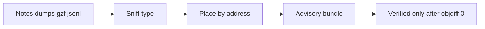

# Context puzzle-piece fusion

AgentDecompile treats extra inputs as **puzzle pieces** for a target binary: sniff type, extract address-keyed facts when possible, register the bundle by target fingerprint, and keep everything advisory until objdiff.

## One mental model

Pass extra files after the binary, or as repeatable `--context` paths, or as MCP `contextPaths`. Pieces are merged and deduped. A later run on the same target can reuse the registered acquisition bundle without re-passing paths.

CLI how-to: [USAGE.md](../USAGE.md). Single-binary reconstruct: [CRITICAL_PATH.md](./CRITICAL_PATH.md).

## What gets integrated

| Kind | Sniff | Placement rule |
|------|-------|----------------|
| C/C++ dump | `source-dump` | Function bodies with a recoverable address → facts + `advisory/context-seeds/` |
| Notes (md/txt/…) | `notes` | Kept as context items; become facts only if name/address present |
| JSON / JSONL | structured | Imported as facts when rows have addresses |
| Ghidra `.gzf` / project snapshot | `ghidra` | Headless acquisition export (unlocked snapshot required for live projects) |
| Directory | recursive text scan | Same as mixed files inside |

**No address guesswork:** pieces without a canonical address stay **unplaced** evidence. Conflicting names at the same address are retained as conflicts—nothing is auto-picked.

## What you see

After acquire, look at:

- `acquisition/placement.json` — placed / unplaced / conflicts / skipped
- `acquisition/propose-labels.json` — address-keyed rename proposals (ready / conflict); **not applied**
- `advisory/context-seeds/` — ugly-dump cleanup seeds (not verified)
- `status` MCP / recovery status → `contextFusion` + `proposeLabels` summary

Context never increments the proof ladder. Seeds and propose-labels are `advisory-decompiler` / context-hint until compile+objdiff accepts them into `verified/`.

### Applying proposed labels (opt-in)

1. Inspect `acquisition/propose-labels.json` (or status `proposeLabels`).
2. For each `status: ready` row, call MCP `rename-function` / `manage-symbols` at `address` with `proposedName`.
3. If the tool returns a `conflictId`, call `resolve-modification-conflict` with `overwrite` or `skip`.
4. Never auto-pick among `status: conflict` rows (same address, disagreeing names).

Propose ≠ apply. Nothing silently renames Ghidra.

## Mid-run add another piece

Re-run reconstruct on the same `--work-dir` with `--resume` and the new file. That creates a new acquisition snapshot and merges into the target fingerprint without deleting `verified/`.

## Not in v1

- Silent bulk rename into an open Ghidra program (use `manage-function` + conflict resolution)
- Inventing VAs for unplaced notes via embeddings

Return: [USAGE.md](../USAGE.md) · [INDEX.md](./INDEX.md)
