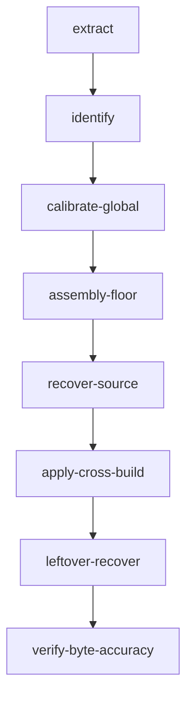

# Corpus pipeline

**Audience:** operators and agents who will recover more than one binary.  
**Reading level:** a 16-year-old who can compile C.

## What this is

You give AgentDecompile a list of binaries. It treats them as one corpus. It
extracts functions, binds the same function across builds to one `logical_id`,
calibrates compiler and layout once, links a donor tree (assembly floor),
replaces assembly with compiling Ghidra C, copies that C onto siblings, then
spends agent compute only on leftovers. Later it compares compiled output to
the shipped bytes. A dashboard light is not proof.

Do not decompile the same logical function twice. Do not re-analyze a Ghidra
program that already has analysis. Open that project and use what is there.



Identity matching (`identify`) is not source copy. It is also not "paste a nearby instruction run into the other binary." Debug names, compilation unit, strings/constants, and BSim bind first; a unique byte window is last. Source copy (`apply-cross-build`) is after donor C compiles. `analyze-program` runs only when that program has no analysis yet. `export-hookpack` writes those identities for a Phasor-shaped host.

## Priorities

1. Know which functions match (`logical_id`). Skip Ghidra analyze when the
   program already has it.
2. Calibrate compiler, ABI, and global layouts once.
3. One donor tree links (assembly floor). That is not byte identity.
4. Replace assembly with compiling Ghidra C. Keep assembly on failure.
5. Cross-place that C onto siblings.
6. Targeted AI only on leftovers.
7. Compare compiled output to each shipped binary. `real_c` and byte-accuracy
   are two different scores.

## Commands

```bash
uv run agentdecompile-corpus init --id my-corpus --out target/corpus.json
uv run agentdecompile-corpus add-binary --corpus target/corpus.json \
  --id debug-build --path /path/to/debug-binary --debug stabs --donor
uv run agentdecompile-corpus add-binary --corpus target/corpus.json \
  --id release-build --path /path/to/release-binary
uv run agentdecompile-corpus run --corpus target/corpus.json \
  --snapshot-dir target/extracts --work-dir target/corpus-run \
  --stop-after compile
# Leftover AI is a later stage. Do not pass --llm to skip the floor.
uv run agentdecompile-corpus run --corpus target/corpus.json \
  --snapshot-dir target/extracts --work-dir target/corpus-run \
  --stop-after leftover-recover
```

`--stop-after compile` stays accepted. It means stop after donor C compile
(`recover-source`), not after the assembly-floor link. Use
`apply-cross-build` when compiling C exists. Use `verify-byte-accuracy`
only when you are ready to compare bytes. Use `--force` only when you mean
to redo analysis or C-replace.

```bash
uv run agentdecompile-corpus export-hookpack --db target/corpus.sqlite --out target/hookpack.json
```

`agentdecompile-reconstruct corpus …` is the same CLI. Identity work uses
`init-store`, `apply-stabs`, `logical-build`, `match-pair`, `merge-parts`.
Project emit uses `genproject` and `ingest-recovered`. Compile Ghidra C with
`ghidra-bulk` (default `--mode compile-only`; `--mode semantic` refuses
invented layout). Copy compiling C onto bound siblings with `cross-place`.
The dashboard that used to live on 8791 is `/dashboard` on the MCP HTTP server.
Run work from that overview (and from a function or binary page): the same
cataloged `agentdecompile-corpus` and MCP tools as the CLI. There is no
separate actions page. Recovery and job logs live on Overview. Functions,
logical identities, review, relationships, and builds share one browse page
at `/dashboard/functions` (live search, configurable page size including All).

```bash
uv run agentdecompile-corpus extract-stabs --binary /path/to/mach-o --id debug-build \
  --out-dir target/extracts
```

That writes `{id}.functions.json` from Mach-O STABS (`N_SO` / `N_FUN`), which
is the donor layout. Identity matching uses the kotorxid multi-signal scorer
when extract rows carry strings/constants/structure; otherwise it falls back
to name+size. Ghidra C is normalized before compile: HighFunction / p-code /
ClangTokenGroup facts, then Clang AST passes (SCRIBE-style). `--mode semantic`
refuses invented layout or ABI. `--mode compile-only` (default) may still
use `GhidraBlob`, `ghidra_call()`, and diagnostic stubs so the knowledge-db
compile-rate baseline does not regress. Compile rate is not byte-accuracy.

## Rules you cannot skip

- Names: human, then STABS, then symbols, then Ghidra, then placeholders.
  A placeholder never replaces a better name.
- `__asm`, naked functions, `_emit`, and `.byte` bodies are not recovered
  source. They do not get copied.
- Identity matching (which function is which) is not the same as copying
  source. Source copy waits for compile.
- Do not re-run `analyze-program` on a program that already has analysis.
  Opening an existing project reuses that analysis.
- Live pages share the MCP HTTP server (default 8080): `/dashboard` (was
  :8791), `/atlas` (was :5173), `/report` (was :3000). Their labels do
  not complete a stage.

## Browser pages (same port as `/mcp`)

The same HTTP listener serves `/app`, `/dashboard`, `/atlas`, `/report`, and
`/mcp`. Set `AGENT_DECOMPILE_CORPUS_DB`, `AGENT_DECOMPILE_CORPUS_WORK_DIR`,
`AGENT_DECOMPILE_ATLAS_PROJECT_ROOT`, and optionally
`AGENT_DECOMPILE_REPORT_HTML` when you want live data. Empty pages are
honest, not complete. Old 8791 / 5173 / 3000 processes are leftovers.

Stage table: [corpus/README.md](corpus/README.md).
