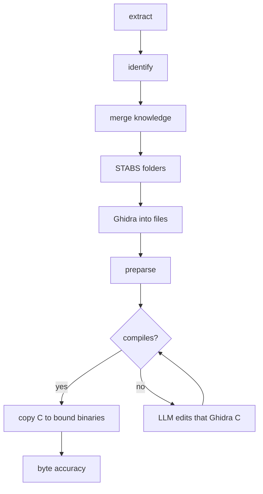

# Corpus pipeline

**Audience:** operators and agents who will recover more than one binary.  
**Reading level:** a 16-year-old who can compile C.

## What this is

You give AgentDecompile a list of binaries. It treats them as one corpus. It
extracts functions, decides which functions are the same function on different
builds, builds a source tree from debug paths, writes readable C, compiles that
C, and only then copies compiling C onto the other builds. Later it compares
the compiled output to the shipped bytes. A dashboard light is not proof.



Identity matching (`identify`) is not source copy. Source copy (`apply-cross-build`) is after compile.

## Priorities

1. One binary that still has STABS or DWARF file names must compile and **link
   to a complete executable**.
2. Cross-match that compiling C onto the other binaries.
3. Compare compiled output to each shipped binary. Real C and byte-accuracy
   are two different scores.
4. Call graphs, live UI, and more binaries.

## Commands

```bash
uv run agentdecompile-corpus init --id my-corpus --out target/corpus.json
uv run agentdecompile-corpus add-binary --corpus target/corpus.json \
  --id debug-build --path /path/to/debug-binary --debug stabs --donor
uv run agentdecompile-corpus add-binary --corpus target/corpus.json \
  --id release-build --path /path/to/release-binary
uv run agentdecompile-corpus run --corpus target/corpus.json \
  --snapshot-dir target/extracts --work-dir target/corpus-run \
  --stop-after compile
# After preparse, units that still fail compile can be edited once.
# Each LLM call is given `agentdecompile-cli get-function` text for that unit
# (needs AGENTDECOMPILE_MCP_SERVER_URL or a running local CLI session).
uv run agentdecompile-corpus run --corpus target/corpus.json \
  --snapshot-dir target/extracts --work-dir target/corpus-run \
  --stop-after compile --llm
```

`--stop-after compile` is the default. That is priority 1. Use
`apply-cross-build` when the executable exists. Use `verify-byte-accuracy`
only when you are ready to compare bytes.

`agentdecompile-reconstruct corpus …` is the same CLI.

```bash
uv run agentdecompile-corpus extract-stabs --binary /path/to/mach-o --id debug-build \
  --out-dir target/extracts
```

That writes `{id}.functions.json` from Mach-O STABS (`N_SO` / `N_FUN`), which
is the donor layout. Identity matching uses the kotorxid multi-signal scorer
when extract rows carry strings/constants/structure; otherwise it falls back
to name+size. Ghidra C is flattened (templates, `__thiscall`, CONCAT/SUB)
before compile.

## Rules you cannot skip

- Names: human, then STABS, then symbols, then Ghidra, then placeholders.
  A placeholder never replaces a better name.
- `__asm`, naked functions, `_emit`, and `.byte` bodies are not recovered
  source. They do not get copied.
- Identity matching (which function is which) is not the same as copying
  source. Source copy waits for compile.
- Ports 8791 (dashboard) and 5173 (Decomp Atlas) may stay up. Their labels
  do not complete a stage.

See also [docs/corpus/README.md](corpus/README.md).
