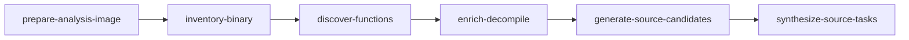

# Recovery critical path

Packed Windows PE targets use a **bounded checkpoint loop** inside `agentdecompile-reconstruct`. There is no separate `acquire` or `vacuum` CLI — use reconstruct flags instead.

ELF targets (format detected from the binary) use `.eh_frame` as the authoritative inventory denominator, then a single PyGhidra enrich+decompile session, optional reference-corpus naming, evidence-based module mapping, and native clang/objdiff verification.

Run recovery from **AgentDecompile only**. Mizuchi is archived: [UPSTREAM_DONOR_ARCHIVE.md](UPSTREAM_DONOR_ARCHIVE.md).

## Pipeline



These names are the valid PE critical-path `--stop-after` checkpoints. After checkpoints you can run autonomous repair with:

```bash
uv run agentdecompile-reconstruct <target> --work-dir <dir> --autonomous --autonomous-max-functions 1
```

That is not a `--stop-after` stage and there is no standalone `vacuum` command.

| Stage | Receipt | Purpose |
|-------|---------|---------|
| `prepare-analysis-image` | `analysis-target.json` | Unpack when required, or record toolchain block |
| `inventory-binary` | `binary-inventory.json` / function inventory | Sections, imports, symbols, FDE boundaries for ELF |
| `discover-functions` | `function-candidates.json` | Function list (denominator for proof ladder) |
| `enrich-decompile` | `facts/enrich-receipt.json` | PyGhidra names/types/modules before sourcegen (default on; `--skip-enrichment` to opt out) |
| (post-enrich) | `facts/readability-repair-queue.json` | Advisory ranked queue of Port gate failures for MCP rename / re-enrich |
| (report) | `facts/proof-target-queue.json` | Ranked unverified functions for objdiff proof scale-up (`functionsToNextRung` from `proof-ladder.json`) |
| (autonomous) | `state/readability-repair-run.json` | MCP tool-seq execution when queue head lacks a source task; may unblock campaign after rename + enrich refresh |
| (autonomous) | `state/agent-closure-run.json` | Context apply + symbol provenance stages before proof campaign |
| (autonomous) | `state/context-apply-run.json` | MCP apply of ready `acquisition/propose-labels.json` rows |
| (autonomous) | `state/near-miss-repair-run.json` | Bounded permuter pass after campaign near-miss (`sourceShapeSearch`) |
| (autonomous) | `facts/symbol-provenance.json` | Advisory ELF DWARF function names for enrich (PE PDB deferred) |
| (autonomous) | `state/mcp-tool-seq-last.json` | Last MCP tool-seq invocation debug receipt |
| (autonomous) | `state/mismatch-class-last.json` | Latest objdiff mismatch class + routed playbook for near-miss repair |
| (autonomous) | `state/proof-campaign.json` | Named outcome per proof-scale session: accepts, near-misses, budget-stop |
| (autonomous) | `state/proof-campaign-loop.json` | Bounded multi-campaign summary when `--autonomous-max-campaigns` > 1 |
| (autonomous) | `state/proof-campaign-history.jsonl` | One row per campaign iteration inside a loop |
| `generate-source-candidates` | `source-generation/summary.json` | Decompiler-fact tasks |
| `synthesize-source-tasks` | `source-synthesis/summary.json` | Compile + objdiff verification |

## Generic dump walkthrough

Work from the AgentDecompile repo root. Pass any PE or ELF path (or install directory). Profile work dirs are derived from binary format + stem unless you override `--profile`.

```bash
TARGET=/path/to/game-or-tool/binary
WORK=target/agentdecompile-reconstruct/example-run
DUMP=target/source-dump

# 1) Unpack/inventory (once)
uv run agentdecompile-reconstruct "$TARGET" \
  --stop-after discover-functions \
  --work-dir "$WORK"

# 2) Resume, match/synth, dump
uv run agentdecompile-reconstruct "$TARGET" \
  --resume \
  --work-dir "$WORK" \
  --dump-source "$DUMP"

# 3) Rebuild dump from existing receipts only
uv run agentdecompile-reconstruct "$TARGET" \
  --dump-source-only \
  --dump-source "$DUMP" \
  --ghidra-facts "$WORK/unpack/facts/function-facts.jsonl" \
  --work-dir "$WORK"

# 4) Force rematch of cached zero-diff functions
uv run agentdecompile-reconstruct "$TARGET" \
  --resume --work-dir "$WORK" \
  --force-rematch
```

For PE/MSVC verification, pass `--vc-root` and `--source-synthesis-wineprefix` when using Wine/MSVC. ELF profiles default to native `clang` and do not require Wine.

### What the dump reads

`run_dump_source` loads match summaries as follows:

**Fresh mode (default):**

1. `<work-dir>/source-synthesis/{accepted,code-slice-matches,source-shape-matches}.jsonl`
2. `<work-dir>/{trivial,reloc-wrapper}-matches/summary.jsonl` when present under this work dir
3. Paths listed in `<work-dir>/export-summaries.txt` (one absolute `.jsonl` per line)
4. Facts only from work-dir (`source-generation/`, `acquisition/`, `facts/`, `batch-decompile/`, `unpack/facts/`) or explicit `--ghidra-facts`

When `state.json` (or `analysis-target.json`) carries an `analysisBinarySha256`, auto-discovered summaries/facts must include a matching digest on at least one row. Unmarked or mismatched leftovers are skipped. Use `--dump-allow-leftovers`, explicit `--ghidra-facts`, or `export-summaries.txt` to opt in.

Wall times for pipeline stages and `dump-source` share `<work-dir>/stage-timings.json`.

**Operator leftovers** (`--dump-allow-leftovers` or `--dump-source-only`):

- Also auto-load `target/*-trivial-matches/summary.jsonl`, `target/*-reloc-wrapper-matches/summary.jsonl`, and `target/*-ghidra-merged-decomp.jsonl` siblings
- Digest gating is disabled

**Layers:** `--dump-layers verified,port` (default) skips per-function `advisory/ghidra/` shards; add `advisory` when you want them.

### Dump layout

```text
target/source-dump/
  README.md
  MANIFEST.json
  CLAIMS.md
  Port/CODE/...          # readable modules (start here)
  verified/              # full-object proofs
  verified/code-slice/   # slice proofs (still verified, not advisory)
  advisory/ghidra/       # Ghidra decomp — not proof
```

### Rules

- Match cache skips rematch only on exact `(targetSha256, entry, sourceSha256, compilerProfile, compilerLane)` hits.
- Do not rematch proven zero-diff functions unless you pass `--force-rematch`.
- Never promote inline asm, `_emit`, `.incbin`, or byte-copy sources into `verified/`.
- Names, types, and module paths are advisory unless objdiff reports `differences==0`.

## Proof-scale smoke (swkotor)

Bounded live validation for the **1% proof ladder rung** on `swkotor.exe`. Requires a work dir that has completed through `report` (proof-target queue and proof-ladder receipts present). PE MSVC verification needs `--vc-root` and `--source-synthesis-wineprefix` when using Wine.

```bash
TARGET=/path/to/swkotor.exe
WORK=target/agentdecompile-reconstruct/swkotor

# Once per work dir (if not already at report)
uv run agentdecompile-reconstruct "$TARGET" \
  --work-dir "$WORK" \
  --resume \
  --stop-after report

# Proof-scale smoke (adjust N/M to functionsToNextRung)
uv run agentdecompile-reconstruct "$TARGET" \
  --work-dir "$WORK" \
  --resume \
  --autonomous \
  --autonomous-max-functions 5 \
  --autonomous-max-campaigns 3 \
  --workers 4
```

**Pass criteria (either):**

1. **Accept** — `state/proof-campaign-loop.json` shows `totalAccepts > 0` and `verified/` gains objdiff-zero receipts; `proof-ladder.json` numerator increases.
2. **Named terminal** — loop receipt `status` is one of `near-miss`, `readability-blocked`, `bridge-failed`, `empty-queue`, or `budget-stop`, with `claimBoundary` set and per-iteration rows in `state/proof-campaign-history.jsonl`.

**Read after smoke:** `proof-ladder.json` (numerator, `functionsToNextRung`), `facts/proof-target-queue.json` (`nearMissRetryCount`, top entries with `nearMissBestDifference`), and `state/proof-campaign-loop.json` (`bestDifference`, `numeratorDelta`). Near-miss metadata never counts toward the numerator.

## Soft-fail (Steamless / mono)

When PE unpack fails, `analysis-target.json` gets `status: blocked` and `terminalStatus: blocked:toolchain`. Install Steamless at the default path or pass `--steamless-cli`.
