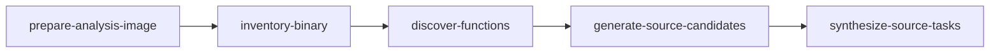

# PE critical path (Phase 5b)

Packed Windows PE targets (swkotor-class) use a **bounded checkpoint loop** inside `agentdecompile-reconstruct`. There is no separate `acquire` or `vacuum` CLI — use reconstruct flags instead.

Run recovery from **AgentDecompile only**. Mizuchi is archived: [MIZUCHI_ARCHIVE.md](MIZUCHI_ARCHIVE.md).

## Pipeline




These five names are the only valid `--stop-after` values. After checkpoints you can run autonomous repair with:

```bash

uv run agentdecompile-reconstruct <target> --work-dir <dir> --autonomous --autonomous-max-functions 1
```


That is not a `--stop-after` stage and there is no standalone `vacuum` command.

| Stage | Receipt | Purpose |
|-------|---------|---------|
| `prepare-analysis-image` | `analysis-target.json` | Steamless unpack, or record toolchain block |
| `inventory-binary` | `binary-inventory.json` | Sections, imports, symbols |
| `discover-functions` | `function-candidates.json` | Function list (denominator for proof ladder) |
| `generate-source-candidates` | `source-generation/summary.json` | Decompiler-fact tasks |
| `synthesize-source-tasks` | `source-synthesis/summary.json` | Compile + objdiff verification |

## swkotor dump walkthrough

Work from the AgentDecompile repo root.

Packed Steam builds need **Steamless** before stage 1. Default path: `target/steamless-release/extracted/Steamless.CLI.exe`. Override with `--steamless-cli`. Without it, stage 1 records `blocked:toolchain` (see [Soft-fail](#soft-fail-steamless--mono)).

Example binary on the reference host:

`/run/media/brunner56/MyBook/SteamLibrary/steamapps/common/swkotor/swkotor.exe`

```bash

SWKOTOR=/run/media/brunner56/MyBook/SteamLibrary/steamapps/common/swkotor/swkotor.exe
WORK=target/agentdecompile-reconstruct/swkotor-dump-fastpath

# 1) Unpack + inventory (once)
uv run agentdecompile-reconstruct "$SWKOTOR" \
  --stop-after discover-functions \
  --work-dir "$WORK"

# 2) Resume, match/synth, dump (MSVC via Wine)
uv run agentdecompile-reconstruct "$SWKOTOR" \
  --resume \
  --work-dir "$WORK" \
  --source-synthesis msvc \
  --dump-source target/swkotor-source-dump \
  --vc-root <msvc8> \
  --source-synthesis-wineprefix <prefix>

# 3) Rebuild dump from existing receipts only
uv run agentdecompile-reconstruct "$SWKOTOR" \
  --dump-source-only \
  --dump-source target/swkotor-source-dump \
  --ghidra-facts target/swkotor-ghidra-facts-local.jsonl \
  --work-dir "$WORK"

# 4) If parallel Wine workers flake, retry with one worker
uv run agentdecompile-reconstruct "$SWKOTOR" \
  --resume --work-dir "$WORK" \
  --source-synthesis msvc \
  --vc-root <msvc8> \
  --source-synthesis-wineprefix <prefix> \
  --workers 1

# 5) Force rematch of cached zero-diff functions
uv run agentdecompile-reconstruct "$SWKOTOR" \
  --resume --work-dir "$WORK" \
  --source-synthesis msvc \
  --force-rematch
```


`--vc-root` and `--source-synthesis-wineprefix` apply when `--source-synthesis msvc` (default mode is `clang`). Dump-only runs do not need them.

### What the dump reads

`run_dump_source` loads match summaries as follows:

**Fresh mode (default):**

1. `<work-dir>/source-synthesis/{accepted,code-slice-matches,source-shape-matches}.jsonl`
2. `<work-dir>/swkotor-*-matches/summary.jsonl` (only if this run wrote them under work-dir)
3. Paths listed in `<work-dir>/export-summaries.txt` (one absolute `.jsonl` per line) — always accepted
4. Facts only from work-dir (`source-generation/`, `acquisition/`, `facts/`, `batch-decompile/`) or explicit `--ghidra-facts`

When `state.json` (or `analysis-target.json`) carries an `analysisBinarySha256`, auto-discovered summaries/facts must include a matching `targetSha256` / `analysisBinarySha256` on at least one row. Unmarked or mismatched leftovers are skipped. Use `--dump-allow-leftovers`, explicit `--ghidra-facts`, or `export-summaries.txt` to opt in.

Wall times for pipeline stages and `dump-source` share `<work-dir>/stage-timings.json`.

**Operator leftovers** (`--dump-allow-leftovers` or `--dump-source-only`):

- Also auto-load `target/swkotor-*-matches/summary.jsonl` siblings and `target/swkotor-ghidra-merged-decomp.jsonl`
- Digest gating is disabled

Match rows should include `sourceText` and `sourceSha256`. The dump prefers embedded text so it does not open hundreds of `candidate.c` files. Path-only rows still parse for compatibility.

**Layers:** `--dump-layers verified,port` (default) skips per-function `advisory/ghidra/` shards; add `advisory` when you want them. Fresh runs must produce decompile/match/synth in this execution — `--dump-source-only` / leftovers are not a shortcut for new proofs.

Do not rely on Mizuchi paths. Copy receipts into the locations above or list them in `export-summaries.txt`.

### Dump layout

```text

target/swkotor-source-dump/
  README.md
  MANIFEST.json
  CLAIMS.md
  Port/CODE/...          # readable modules (start here)
  verified/              # full-object proofs
  verified/code-slice/   # slice proofs (still verified, not advisory)
  advisory/ghidra/       # Ghidra decomp — not proof
```


**Reading order**

- `Port/CODE/game/swmain/ghidra_decompiled.cpp` — main readable surface
- `Port/CODE/**/matched_*.cpp` — objdiff-proven units (often small thunks)
- `verified/` — proof archive; `advisory/ghidra/` — readability only

### After a dump

Exit code zero does not mean proofs were included. Check:

1. `dump-source.json` / printed `summaries` lists the JSONL you expected
2. `MANIFEST.json` has `matchedCount` / `verifiedShardCount` > 0 when you expected matches
3. `rejectedByteEmitters` if you care about asm/incbin rejection
4. `Port/CODE/.../ghidra_decompiled.cpp` has one module banner and one Authority banner per function

`matchedCount == 0` with empty `summaries` means no proofs were in scope — not a successful match pass.

See also `target/swkotor-source-dump/README.md`.

### Rules

- Match cache skips rematch only on `(entry, sourceSha256)` hits. Changed source at the same entry always re-verifies.
- Do not rematch proven zero-diff functions unless you pass `--force-rematch`.
- `--workers` parallelizes compile/objdiff. Shared `WINEPREFIX` can occasionally cause false mismatches (never false proofs). Use `--workers 1` to retry flaky functions.
- Never promote inline asm, `_emit`, `.incbin`, or byte-copy sources into `verified/`.

## Soft-fail (Steamless / mono)

When unpack fails, `analysis-target.json` gets `status: blocked` and `terminalStatus: blocked:toolchain`. `critical-path.json` reports `readiness: blocked:toolchain`. Install Steamless at the default path or pass `--steamless-cli`.

## Next actions

`critical-path.json` → `nextActions` lists follow-ups the orchestrator will not run automatically:

| Action | When ready |
|--------|------------|
| `synthesize-source-tasks` | Candidates exist; objdiff/clang or Wine toolchain available |
| `vacuum-seed` | `source-generation/tasks.jsonl` exists — use `reconstruct --autonomous` |
| `profile-corpus` | Verified examples under `<work-dir>/verified/` (run dir, not the public dump tree) |
| `reloc-slice` | PE inventory + per-function object helpers |
| `slice-verify` | ELF/Mach-O candidates; runs at `discover-functions` |
| `apply-propose-labels` | Rows in `acquisition/propose-labels.json`; apply via MCP + conflict flow |

Ready actions do not count toward the proof ladder — only objdiff accepts in receipts do.

## Claims

Critical-path readiness is orchestration metadata. Public claims stay on measured ladder rungs (1% / 5% / 20% of inventoried functions at objdiff 0). Do not say "90% recovered" without defining the claim class.
