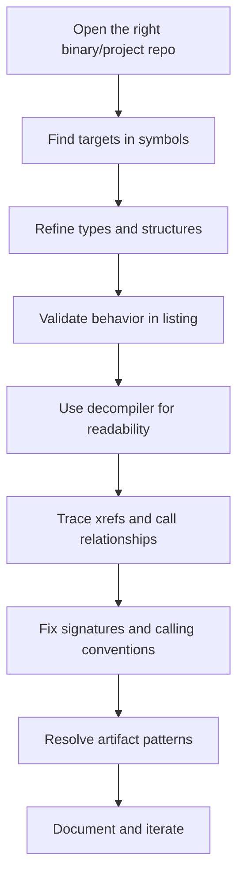

# Ghidra Reverse Engineering Guide (Community Walkthrough)

## Purpose

This guide turns a long-form walkthrough into a practical reference for day-to-day reverse engineering in Ghidra. It follows the same progression used in the walkthrough: how to orient yourself in a project, find behavior, validate it in assembly, improve decompilation quality, and handle difficult edge cases.

The source walkthrough uses a heavily annotated **Windows GOG KotOR 1** binary, but the methods apply broadly to native binaries.

## Analysis Flow at a Glance

---

## 1) Start With Project Context

In the walkthrough, each Ghidra project repository represents a separate executable variant. On shared servers, repositories are commonly organized by platform and version (for example Android, iOS, macOS, GOG, Xbox).

### Why this matters

- Different variants can have different layouts, symbols, and compiler behavior.
- Address-based assumptions do not safely transfer across versions.
- Type/signature quality can vary significantly by repository maturity.

### Practical baseline from the walkthrough

- Demo target: **Windows GOG KotOR 1 executable**.
- This repository had substantial prior labeling and type work.

---

## 2) Understand the Code Browser as Layered Views

The walkthrough treats the Code Browser as several coordinated views of the same program state:

1. **Symbol Tree** for discovery and hierarchy browsing.
2. **Data Type Manager** for type truth you control.
3. **Listing** for machine-code ground truth.
4. **Decompiler** for readability and fast navigation.
5. Supporting tools (call trees, memory map, bookmarks, symbol table, functions view, scripting surfaces).

A reliable workflow moves across these views repeatedly instead of staying in only one panel.

---

## 3) Use Symbol Views to Locate Behavior Quickly

## 3.1 Symbol Tree: first-pass discovery

Use Symbol Tree as the default entry point when you are trying to find where behavior lives.

You can search across:

- Classes
- Namespaces
- Functions
- Labels
- Imports
- Exports
- Variables and globals

In the presentation framing, imports are commonly DLL-linked symbols and exports often include entry-related exported functions for the binary.

Classes in the Symbol Tree also expose nested members via dropdown/expand controls, which makes it useful for browsing all known symbols under a class once you find the right namespace.

### Walkthrough examples

- Class-centric search using creature naming (`CSWS creature`) to enumerate member behavior.
- Broad search terms like `enable` to find related toggles and variables.

Regex and advanced filters are available, but basic text search handles a large portion of daily work.

## 3.2 Symbol Table and Functions View: precision filtering

When Symbol Tree browsing is too broad, move to tabular views:

- **Symbol Table**: filtering/sorting for large-scale symbol triage.
- **Functions View**: function-focused metadata filtering.

Walkthrough details shown in practice:

- Very large symbol corpus (about 155k labeled entries in that environment).
- Filter-driven triage of functions with undefined parameters (small remaining backlog shown).

---

## 4) Build Better Types to Improve Everything Downstream

## 4.1 Data Type Manager fundamentals

The Data Type Manager includes:

- Structures
- Unions
- Enums
- TypeDefs
- Function types/definitions/signatures
- Pointers (often hidden by default)

Archives shown in the walkthrough:

- Binary-specific archive (main analysis archive)
- Windows headers archive
- Built-in type archive

Use this view whenever your question is “how is this laid out in memory?” because it is where field names, offsets, and structure composition become inspectable and editable.

## 4.2 High-impact type operations

1. Edit structures and label fields by offset.
2. Replace magic numbers with enums.
3. Add/repair function definitions.
4. Use unions when compiler/optimizer emits multiple valid views.
5. Use **Find Uses Of** to propagate understanding through call sites.

### Walkthrough examples

- Resource internal representation modeled as union to support two interpretations:
  - 4-integer view
  - 16-character view
- Enum usage for game-effect or categorical IDs.
- `Find Uses` as a way to validate type choices against real usage.

---

## 5) Trust the Listing First

The walkthrough is explicit: assembly in the Listing is authoritative; decompiler output is inferred. It also frames Listing as your primary working interface for confirming true program behavior.

## 5.1 Listing anatomy

Each listing row gives machine-level context:

- Address
- Raw bytes
- Decoded instruction

Labels can be function starts, but many are also internal branch targets used to express control flow.

## 5.2 Core listing workflow

1. Navigate by double-clicking labels/symbols.
2. Follow conditional jumps and branch targets.
3. Open instruction details when operand semantics are unclear.
4. Validate assumptions here before adjusting high-level types.

The deck also emphasizes Listing-native features as a practical toolkit: quick navigation, address labeling, xrefs, and in-place data typing.

## 5.3 Retyping data in place

When analysis leaves bytes undefined or poorly typed, clear and retype directly in listing (for example to string/pointer/struct pointer). This often improves decompiler output immediately.

## 5.4 Navigation controls used in practice

Quick-jump controls can move through:

- Next/previous function
- Next/previous label
- Next undefined region
- Next instruction

A practical note from the walkthrough: “next undefined” often lands in padding/no-op regions (for example repeated `0x90`).

---

## 6) Cross-References Drive Program Understanding

Xrefs are central to proving how code and data are used.

Use xrefs for:

- Function callers/callees
- Global and static data reads/writes
- Imported/exported symbol usage

### Working loop

1. Find candidate symbol.
2. Open xrefs.
3. Jump to meaningful usage site.
4. Confirm behavior in listing, then interpret in decompiler.

This loop is one of the highest-value habits in reverse engineering.

---

## 7) Use the Decompiler as a Fast Interpretation Layer

Decompiler output is useful for speed and readability, but should be validated against listing.

## 7.1 Behavior to remember

- Decompiler follows the currently selected function.
- Selecting data regions may not change decompiler pane until a function context is selected.
- Double-click navigation inside pseudocode is efficient for traversal.

## 7.2 Common edit actions from the walkthrough environment

- Rename symbols/variables/functions (`L` in shown keymap)
- Edit function signatures (`;` in shown keymap)
- Adjust namespace/class ownership through rename flow

## 7.3 UI notes called out

- Unreachable code toggle can be useful in specific cases.
- Refresh action may not visibly alter output in many common scenarios.

---

## 8) Function Signatures and Calling Conventions

Function metadata directly affects decompiler quality and correctness.

A function model includes:

- Name and address
- Calling convention
- Return type
- Parameters and storage
- Namespace/class ownership
- Optional properties (varargs, inline, thunk, custom storage, call-fixup)

## 8.1 x86 conventions emphasized in the walkthrough

### cdecl

- Common in C-style/library contexts.
- Caller performs stack cleanup.

### stdcall

- Callee performs stack cleanup.
- Cleanup size can appear directly in return instruction (for example `ret 8`).

### fastcall

- Register-first parameter strategy.
- Less common in the demonstrated target; often appears in specific compiler/library patterns.

### thiscall

- `this` usually in `ECX`.
- Additional parameters commonly stack-based.
- Cleanup behavior should be verified in listing for the specific compiler output.

Walkthrough nuance: behavior observed in that codebase varied with whether stack parameters existed, so direct assembly confirmation was emphasized.

## 8.2 Return behavior caveat

- Scalar returns generally use `EAX` in 32-bit x86.
- Even `void`-typed functions still leave machine state in registers; in optimized paths, residual register state can be consumed later.

---

## 9) Custom Storage for Non-Standard Cases

Default ABI inference is not always enough.

## 9.1 Typical trigger

x87 floating-point flows (for example `float10`) can violate ordinary return assumptions.

## 9.2 Required modeling pattern

- Represent floating return in `ST0` when appropriate.
- Keep integer return/storage modeling when call sites also consume integer outputs.

## 9.3 Mixed-result example pattern from walkthrough

Float-to-long conversion scenarios can involve both integer-result usage and floating stack residue usage in nearby optimized logic. Custom return/storage definitions can reduce noisy artifacts in callers.

---

## 10) Structures, Class Layout, and Vtable Work

## 10.1 Structures

Structure quality determines decompiler readability.

- Named fields replace opaque offset expressions.
- Unknown members remain generic placeholders until resolved.
- Field naming should be guided by repeated usage evidence, not guesswork.

## 10.2 Vtables and virtual dispatch

Vtables are arrays of function pointers for virtual calls.

Typical dispatch pattern:

1. Load object’s vtable pointer.
2. Index/call slot at offset.
3. Pass instance context and call parameters.

A practical pattern noted in the walkthrough: early slots often include destructor-like behavior, but class-specific layouts differ.

## 10.3 Inheritance limitations in tooling

The walkthrough highlights difficult cases where parent-owned vtable type definitions do not cleanly represent child extensions. Common result:

- Unlabeled tail slots
- Ambiguous function-pointer fields
- Decompiler noise around virtual calls

## 10.4 Manual virtual-slot resolution workflow

1. Identify indirect call (`code *` style decompile pattern).
2. Determine concrete object type.
3. Open the class vtable data.
4. Compute slot address (`vtable_base + offset`, example shown with `+0x24`).
5. Resolve target function.
6. Back-propagate name/signature to improve all call sites.

---

## 11) Template Patterns You Will Encounter

The walkthrough names several recurring template families:

- `CExoArrayList<T>`
- `CExoLinkedList<T>`
- Resource-helper template variants
- Function-holder style template families
- Safe-pointer style wrappers
- Occasional standard-library vector usage

## 11.1 Array lists

Described as consistent and relatively easy to model in the demonstrated target:

- Data pointer
- Size
- Capacity

When `T` is already a pointer, pointer-to-pointer cases appear naturally.

## 11.2 Linked lists

Described as much less transparent in decompile output due to generic internals and weaker automatic type binding.

## 11.3 Resource helpers

Resource helper templates can encode both type information and resource-ID semantics useful for enum alignment and interpretation checks.

---

## 12) Scripting and Automation Surfaces

## 12.1 Console usage patterns

Jython console examples shown:

- `currentProgram`
- `currentAddress`
- Querying function at current address
- Small convenience operations (for example quick numeric/hex conversions)

## 12.2 Script Manager usage

Used for one-off and batch corrections, including signature/return-type cleanup workflows.

## 12.3 Runtime direction

Walkthrough notes a shift away from Jython toward PyGhidra in newer workflows.

Related Code Browser surfaces called out in the presentation include Script Manager and Console; together with Jython/PyGhidra they form the practical automation/tooling stack for quick probes and repeatable batch edits.

---

## 13) Common Artifact Patterns and What They Usually Mean

## 13.1 `extraout_*`

Typical causes:

- Return width/type mismatch
- Incorrect signature model
- Missing custom storage
- Optimizer behavior that ABI modeling does not represent cleanly

Seen forms include `extraout_EAX`, `extraout_ECX`, and `extraout_ST0`, plus concat-style expressions caused by partial register-width reasoning.

## 13.2 Volatile-register reuse edge case

The walkthrough demonstrates compiler reuse of a volatile register across a short callee when no overwrite occurs. This can produce decompiler artifacts even when machine behavior is valid.

## 13.3 Stack-parameter overwrite pattern

Optimized functions may reuse argument stack slots for different semantics later in a function. Ghidra can then produce contradictory types and cast-heavy output. This remains a known difficult class of issue.

## 13.4 `unaff_*` propagation

Often appears near unresolved indirect calls (especially untyped virtual calls) where cleanup/return behavior is unknown. One unresolved call can degrade downstream variable reasoning across many lines.

---

## 14) Practical Remediation Order

When pseudocode quality is poor, this order usually gives the fastest improvement:

1. Identify uncertain call edges (especially indirect/virtual calls).
2. Resolve function target/signature/calling convention.
3. Correct return/storage models (including custom storage if needed).
4. Repair nearby structures/enums driving field/constant interpretation.
5. Re-check listing and xrefs to validate each correction.

---

## 15) Supporting Panels Worth Keeping Open

- **Function Call Trees** for inbound/outbound context.
- **Memory Map** for section awareness (`.text`, `.rdata`, data/resource regions).
- **Bookmarks** for temporary investigation anchors.
- **Symbol Table** for filtered bulk triage.
- **Functions View** for convention/size/signature-oriented searching.

The presentation also notes that Code Browser has many additional plugins beyond these, so this list should be treated as the high-value baseline rather than a complete inventory.

---

## 16) Team Workflow Guidance

In shared reversing projects:

- Consistent naming compounds value over time.
- Struct and enum hygiene improves velocity and reduces repeated effort.
- Virtual-call cleanup yields outsized readability gains in C++ binaries.
- Scripted maintenance prevents drift and accelerates repetitive fixes.

---

## 17) Known Limits and Working Expectations

Some rough edges are normal:

- Deep inheritance can outgrow clean vtable typing.
- Template-heavy binaries can resist automatic clarity.
- Optimizer patterns can produce stubborn artifact variables.
- Not every cast/noise issue has a clean one-click fix.

Goal: reliable behavioral understanding and reproducible annotations, not perfect pseudocode aesthetics.

---

## 18) Quick Reference Glossary

- **Xref**: location that references a symbol/function/data item.
- **Thunk**: redirect/wrapper function that forwards control.
- **Calling convention**: rules for argument passing, return location, and cleanup.
- **Custom storage**: explicit register/stack mapping overriding default ABI inference.
- **`extraout_*`**: decompiler variable indicating ambiguous extra register/FPU flow.
- **`unaff_*`**: value entering flow without proven write/restore in current model.
- **Vtable**: table of virtual-function pointers used for runtime dispatch.
- **`thiscall`**: x86 instance-method convention with `this` typically in `ECX`.
- **`ST0`**: top register in x87 floating-point stack.

---

## 19) Suggested Daily Loop

1. Find symbols.
2. Trace xrefs.
3. Validate listing behavior.
4. Improve types and signatures.
5. Resolve indirect/virtual calls.
6. Re-check decompiler output.
7. Record assumptions and unresolved items.

Repeat until behavior is stable and documented.

---

## Source Note

This guide is derived from [docs/TRANSCRIPT.md](docs/TRANSCRIPT.md) and the companion slide deck [docs/from_video/ghidra_presentation_1.pdf](docs/from_video/ghidra_presentation_1.pdf), reorganized into a single continuous reference while preserving the walkthrough’s concrete examples, caveats, and workflow patterns.
