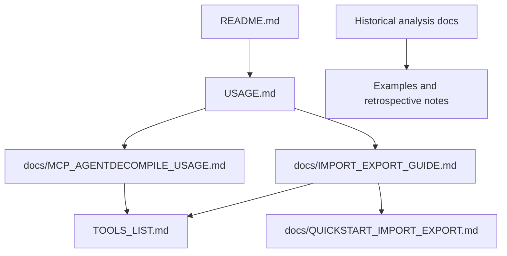

# AgentDecompile Documentation Index

This index now reflects the files that actually exist in the repository. References to the removed `IMPLEMENTATION_COMPLETE.md` have been replaced with the current guides and source-of-truth files.

## Current doc map

### Core runtime docs

1. [../README.md](../README.md)
  - Installation, transports, environment variables, editor integration.
2. [../USAGE.md](../USAGE.md)
  - Current CLI and raw MCP usage.
3. [./MCP_AGENTDECOMPILE_USAGE.md](./MCP_AGENTDECOMPILE_USAGE.md)
  - MCP client configuration and protocol-facing setup.

### Import and export docs

1. [./QUICKSTART_IMPORT_EXPORT.md](./QUICKSTART_IMPORT_EXPORT.md)
  - Fast-path examples for `import-binary`, `export`, and `resource static-analysis`.
2. [./IMPORT_EXPORT_GUIDE.md](./IMPORT_EXPORT_GUIDE.md)
  - Detailed reference for supported formats, parameters, and workflow choices.
3. [../TOOLS_LIST.md](../TOOLS_LIST.md)
  - Canonical tool reference for `import-binary`, `export`, `checkout-program`, `checkout-status`, and related compatibility aliases.

### Internal and contributor docs

1. [../CONTRIBUTING.md](../CONTRIBUTING.md)
  - Dev setup, testing, release process, and tool-doc sync workflow.
2. [./e2e_shared_local_checkout_sync.md](./e2e_shared_local_checkout_sync.md)
  - Manual E2E: shared vs local `.gpr` checkout/checkin, MCP restart persistence, `sync-project`, PowerShell runner (`scripts/e2e_checkout_sync_plan_runner.ps1`).
3. [../src/CLAUDE.md](../src/CLAUDE.md)
  - Source layout and architecture overview.
4. [../src/agentdecompile_cli/CLAUDE.md](../src/agentdecompile_cli/CLAUDE.md)
  - Registry, provider, and normalization rules.

### MCP debugging (agent skill)

- [../.cursor/skills/mcp-debugging/](../.cursor/skills/mcp-debugging/) — MCP debug CLIs, meta-debug loop, workflows, and Claude-oriented prompts. Invoke via `/mcp-debugging` or from AGENTS.md.

### Historical and example docs

The following files are useful research artifacts, examples, or retrospectives rather than current operational guides:

- `docs/EXECUTE_SCRIPT_01_K1.md`
- `docs/EXECUTE_SCRIPT_02_TSL.md`
- `docs/KOTOR_SAVELOAD_TOOL_ANALYSIS.md`
- `docs/SUBAGENT*.md`
- `docs/TARGET_RESULT_INACCURATE.md`
- `examples/kotor_examples/*.md`
- `examples/mcp_responses/mcp_tools_list.md`
- `RELEASE_NOTES_1.0.0.md`

Those files should be read as examples, snapshots, or historical notes unless they explicitly say otherwise.

## Source of truth

When docs and prose disagree, use the code and tests:

- `src/agentdecompile_cli/registry.py` for canonical tool names, aliases, and parameters.
- `src/agentdecompile_cli/cli.py` for convenience commands and CLI help text.
- `src/agentdecompile_cli/server.py` and `src/agentdecompile_cli/__main__.py` for server and stdio runtime options.
- `helper_scripts/reorder_tools_list_canonical.py` (canonical section order vs `registry.TOOLS`) and `helper_scripts/generate_tools_list.py` (run and confirm `MATCH_EXACT True`) for keeping `TOOLS_LIST.md` aligned with the registry.

## Quick navigation

- Need installation or client setup: open [../README.md](../README.md).
- Need current CLI examples: open [../USAGE.md](../USAGE.md).
- Need MCP/editor config details: open [./MCP_AGENTDECOMPILE_USAGE.md](./MCP_AGENTDECOMPILE_USAGE.md).
- Need import/export specifics: open [./IMPORT_EXPORT_GUIDE.md](./IMPORT_EXPORT_GUIDE.md).
- Need the fastest import/export examples: open [./QUICKSTART_IMPORT_EXPORT.md](./QUICKSTART_IMPORT_EXPORT.md).
- Need shared/local checkout + sync manual E2E: open [./e2e_shared_local_checkout_sync.md](./e2e_shared_local_checkout_sync.md).
- Debugging MCP servers / self-healing: use skill `/mcp-debugging` or open [../.cursor/skills/mcp-debugging/](../.cursor/skills/mcp-debugging/).
