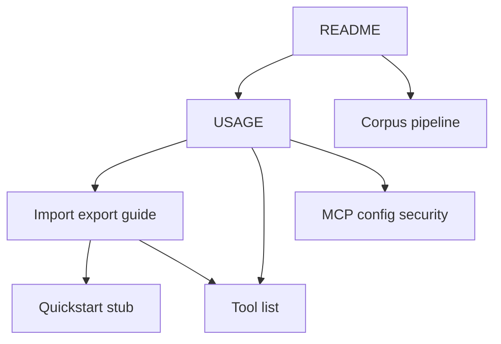

# AgentDecompile Documentation Index

```mermaid
flowchart TD
  A[README] --> B[USAGE]
  B --> D[Import export guide]
  D --> E[Quickstart stub]
  B --> F[Tool list]
  D --> F
  B --> G[MCP config security]
  A --> H[Corpus pipeline]
```

## Current doc map

### Start here

1. [../README.md](../README.md) — install, three start paths, first-run env
2. [../USAGE.md](../USAGE.md) — CLI, HTTP MCP, sessions, Web UI, failures
3. [../TOOLS_LIST.md](../TOOLS_LIST.md) — tool parameters and aliases

### Recovery

1. [../STRATEGY.md](../STRATEGY.md) — current bet
2. [./CORPUS_PIPELINE.md](./CORPUS_PIPELINE.md) — multi-binary default
3. [./corpus/README.md](./corpus/README.md) — stage table
4. [./plans/2026-09-08-0156-feat-recovery-pipeline-ladder-plan.md](./plans/2026-09-08-0156-feat-recovery-pipeline-ladder-plan.md) — implementation plan
5. [./CRITICAL_PATH.md](./CRITICAL_PATH.md) — single-binary reconstruct

### Import, security, sessions

1. [./QUICKSTART_IMPORT_EXPORT.md](./QUICKSTART_IMPORT_EXPORT.md) — stub → guide
2. [./IMPORT_EXPORT_GUIDE.md](./IMPORT_EXPORT_GUIDE.md) — formats and parameters
3. [../SECURITY.md](../SECURITY.md) — vulnerability reporting
4. [./MCP_CONFIGURATION_SECURITY.md](./MCP_CONFIGURATION_SECURITY.md) — bind, MCP HTTP auth, `mcp.json`
5. [./session-handling.md](./session-handling.md) — session id rules

### Explanation

1. [../CONCEPTS.md](../CONCEPTS.md) — vocabulary
2. [./CONTEXT_FUSION.md](./CONTEXT_FUSION.md) — merge notes by address
3. [../VISION.md](../VISION.md) — charter
4. [../METHODOLOGY.md](../METHODOLOGY.md) — principles and current mechanisms
5. [../STRATEGY.md](../STRATEGY.md) — near-term map

### Contributor hops

1. [../CONTRIBUTING.md](../CONTRIBUTING.md)
2. [./e2e_shared_local_checkout_sync.md](./e2e_shared_local_checkout_sync.md)
3. [../CLAUDE.md](../CLAUDE.md) — root pointer
4. [../src/CLAUDE.md](../src/CLAUDE.md)
5. [../src/agentdecompile_cli/CLAUDE.md](../src/agentdecompile_cli/CLAUDE.md)
6. [../GEMINI.md](../GEMINI.md)
7. [../tests/README.md](../tests/README.md)
8. [../examples/README.md](../examples/README.md)
9. [./plans/README.md](./plans/README.md) — living vs frozen plans
10. [./solutions/README.md](./solutions/README.md) — documented learnings
11. [./prototypes/README.md](./prototypes/README.md)
12. [./audits/README.md](./audits/README.md)

### Agent skills

- [../skills/README.md](../skills/README.md) — catalog
- [../skills/mcp-debugging/](../skills/mcp-debugging/) — MCP debug
- [../skills/tiered-re-analysis/](../skills/tiered-re-analysis/) — Tier 0–3 routing
- [../skills/source-recovery/](../skills/source-recovery/) — reconstruct / corpus honesty

## Source of truth

When docs and prose disagree, use the code and tests:

- `src/agentdecompile_cli/registry.py` for tool names, aliases, and parameters
- `src/agentdecompile_cli/cli.py` for convenience commands
- `helper_scripts/generate_tools_list.py` for keeping [TOOLS_LIST.md](../TOOLS_LIST.md) aligned

## Quick navigation

- Installation: [../README.md](../README.md)
- CLI examples: [../USAGE.md](../USAGE.md)
- Import/export: [./IMPORT_EXPORT_GUIDE.md](./IMPORT_EXPORT_GUIDE.md)
- Shared/local checkout E2E: [./e2e_shared_local_checkout_sync.md](./e2e_shared_local_checkout_sync.md)
