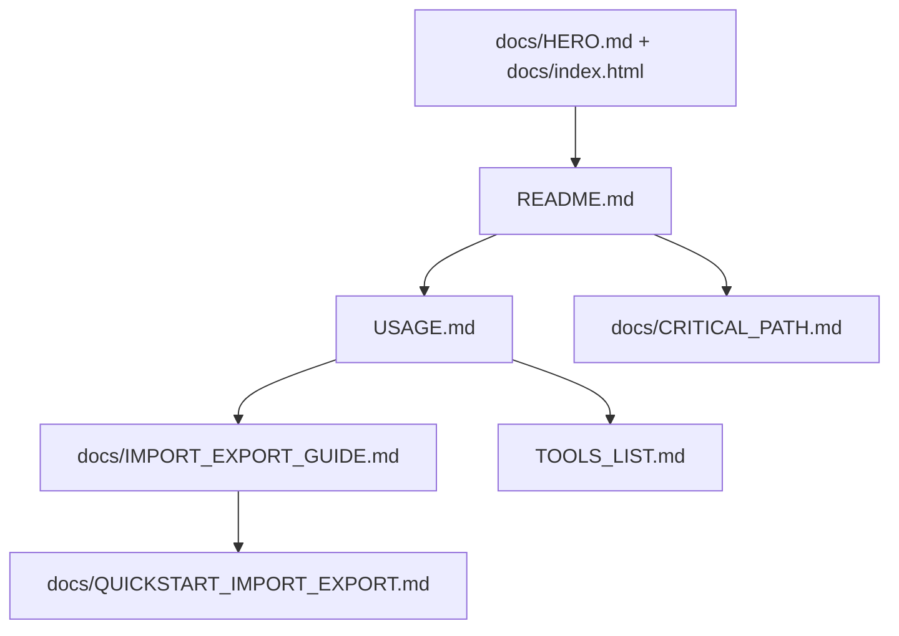

# AgentDecompile Documentation Index

```mermaid

flowchart TD
  H[docs/HERO.md + docs/index.html] --> A[README.md]
  A --> B[USAGE.md]
  B --> D[docs/IMPORT_EXPORT_GUIDE.md]
  D --> E[docs/QUICKSTART_IMPORT_EXPORT.md]
  B --> F[TOOLS_LIST.md]
  A --> G[docs/CRITICAL_PATH.md]
```

Start with the hero copy and landing page, then drill into guides as needed.

## Start here

1. [HERO.md](./HERO.md) — plain-language intro (headline, positioning, where copy lives)
2. [index.html](./index.html) — GitHub Pages landing (enable Pages → `/docs` on the default branch)
3. [../README.md](../README.md) — install, transports, environment variables, editor setup
4. [../USAGE.md](../USAGE.md) — CLI and raw MCP usage with examples

## Import and export

1. [./QUICKSTART_IMPORT_EXPORT.md](./QUICKSTART_IMPORT_EXPORT.md) — fast examples for `import-binary`, `export`, and static analysis
2. [./IMPORT_EXPORT_GUIDE.md](./IMPORT_EXPORT_GUIDE.md) — formats, parameters, workflow choices
3. [../TOOLS_LIST.md](../TOOLS_LIST.md) — canonical tool reference

## Recovery

1. [./CRITICAL_PATH.md](./CRITICAL_PATH.md) — reconstruct walkthrough and dump layout
2. [../STRATEGY.md](../STRATEGY.md) — product direction and proof ladder targets

## Contributor docs

1. [../CONTRIBUTING.md](../CONTRIBUTING.md) — dev setup, testing, releases
2. [./e2e_shared_local_checkout_sync.md](./e2e_shared_local_checkout_sync.md) — shared vs local checkout manual E2E
3. [../src/CLAUDE.md](../src/CLAUDE.md) — source layout
4. [../src/agentdecompile_cli/CLAUDE.md](../src/agentdecompile_cli/CLAUDE.md) — registry and provider rules

## Agent skills

- [../.cursor/skills/mcp-debugging/](../.cursor/skills/mcp-debugging/) — MCP debug CLIs and workflows (`/mcp-debugging`)
- [../.cursor/skills/tiered-re-analysis/](../.cursor/skills/tiered-re-analysis/) — route Tier 0–3 tools before defaulting to Ghidra MCP
- [./solutions/architecture-patterns/tiered-re-analysis-knowledgebase.md](./solutions/architecture-patterns/tiered-re-analysis-knowledgebase.md) — full routing matrix

## Documented solutions

Compound learnings live under [./solutions/](./solutions/README.md) with YAML frontmatter. Search by tag before changing `src/agentdecompile_cli/`.

## Historical and example docs

These are snapshots or research notes, not current runbooks:

- `docs/EXECUTE_SCRIPT_01_K1.md`, `docs/EXECUTE_SCRIPT_02_TSL.md`
- `docs/KOTOR_SAVELOAD_TOOL_ANALYSIS.md`, `docs/SUBAGENT*.md`
- `examples/kotor_examples/*.md`, `examples/mcp_responses/mcp_tools_list.md`
- `RELEASE_NOTES_1.0.0.md`

## Source of truth

When docs disagree with behavior, trust code and tests:

- `src/agentdecompile_cli/registry.py` — tool names, aliases, parameters
- `src/agentdecompile_cli/cli.py` — CLI commands and help text
- `helper_scripts/generate_tools_list.py` — keep `TOOLS_LIST.md` aligned with the registry

## Quick navigation

| Need | Open |
|------|------|
| Plain intro / site copy | [HERO.md](./HERO.md), [index.html](./index.html) |
| Install or client setup | [README.md](../README.md) |
| CLI examples | [USAGE.md](../USAGE.md) |
| Import/export | [IMPORT_EXPORT_GUIDE.md](./IMPORT_EXPORT_GUIDE.md) |
| Source recovery | [CRITICAL_PATH.md](./CRITICAL_PATH.md) |
| Shared checkout E2E | [e2e_shared_local_checkout_sync.md](./e2e_shared_local_checkout_sync.md) |
| MCP debugging | `/mcp-debugging` skill |
