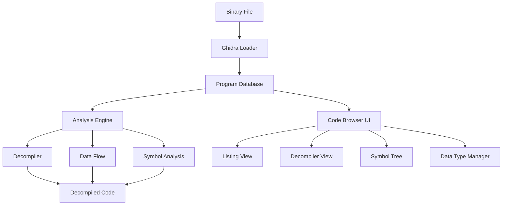
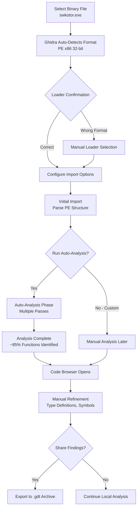
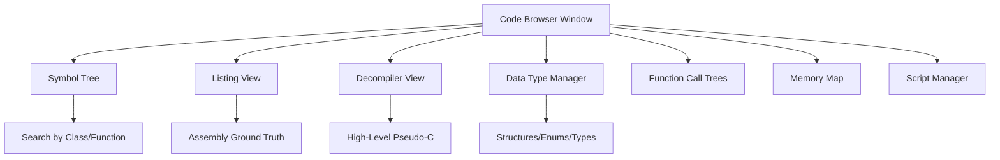
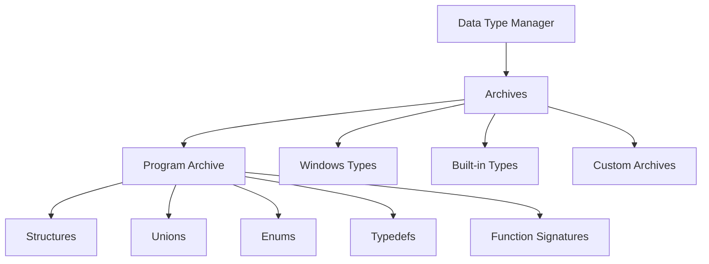
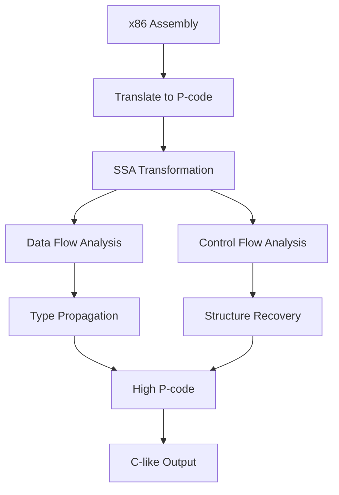
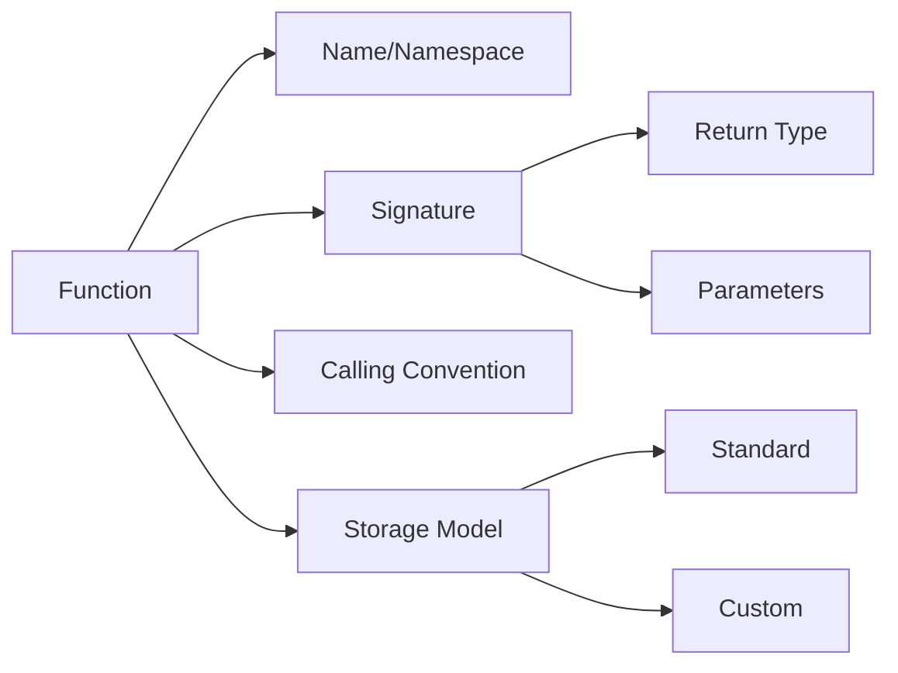
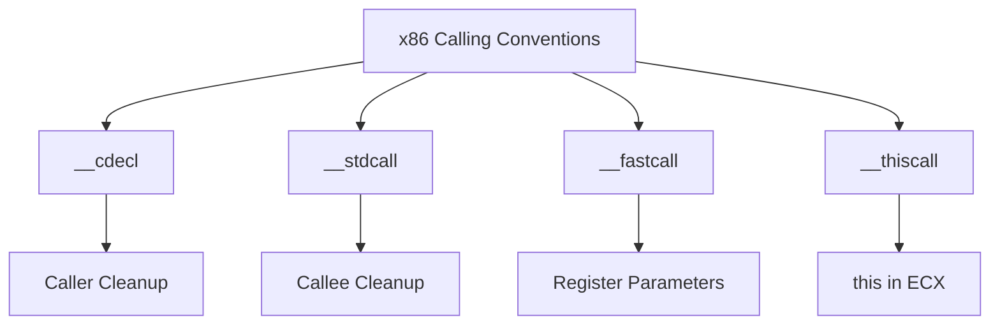
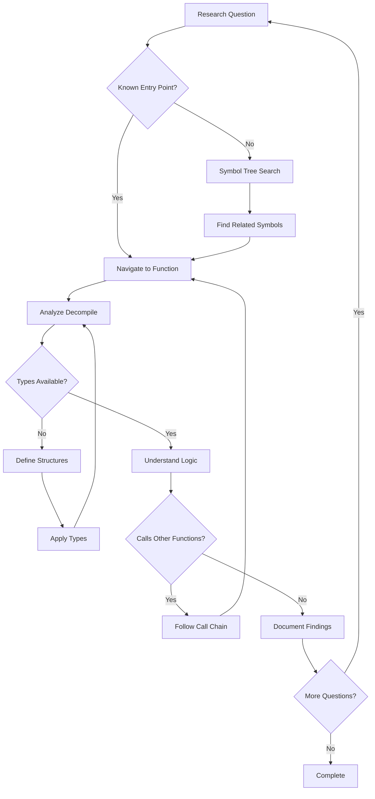

# Ghidra Reverse Engineering Guide for KotOR Analysis

**A practitioner's deep dive into static binary analysis with Ghidra, focused on analyzing Star Wars: Knights of the Old Republic (KotOR) game binaries**

*By [th3w1zard1/OldRepublicDevs] and [LaneDibello/OpenKotOR] | Updated February 2026*

---

## Table of Contents

1. [Introduction](#introduction)
2. [Ghidra Architecture Overview](#ghidra-architecture-overview)
3. [Project Setup and Repository Management](#project-setup-and-repository-management)
4. [The Code Browser: Your Primary Workspace](#the-code-browser-your-primary-workspace)
5. [Symbol Tree: The Entry Point for Analysis](#symbol-tree-the-entry-point-for-analysis)
6. [Data Type Manager: Structuring Memory](#data-type-manager-structuring-memory)
7. [The Listing View: Ground Truth](#the-listing-view-ground-truth)
8. [Decompiler View: High-Level Reconstruction](#decompiler-view-high-level-reconstruction)
9. [Function Analysis Deep Dive](#function-analysis-deep-dive)
10. [Calling Conventions: x86 Focus](#calling-conventions-x86-focus)
11. [Custom Storage and Non-Standard Patterns](#custom-storage-and-non-standard-patterns)
12. [Structures and Memory Layout](#structures-and-memory-layout)
13. [Virtual Tables (vtables) and C++ Dispatch](#virtual-tables-vtables-and-c-dispatch)
14. [Template Classes and Container Types](#template-classes-and-container-types)
15. [Common Decompiler Artifacts and Anti-Patterns](#common-decompiler-artifacts-and-anti-patterns)
16. [Practical Analysis Workflow](#practical-analysis-workflow)
17. [Scripting and Automation](#scripting-and-automation)
18. [Additional Tools and Resources](#additional-tools-and-resources)
19. [References and Further Reading](#references-and-further-reading)

---

## Introduction

### Purpose and Scope

This guide provides a comprehensive, production-ready framework for performing reverse engineering on the Star Wars: Knights of the Old Republic (KotOR) game binaries using Ghidra, the NSA's open-source software reverse engineering (SRE) framework. While the examples and workflows are KotOR-specific, the principles, techniques, and mental models apply broadly to any x86 Windows executable compiled with Microsoft Visual C++ 2003-era optimizations.

### What Makes This Guide Different

Unlike introductory Ghidra tutorials, this guide:

- **Assumes production constraints**: You're analyzing a 1.5MB+ stripped binary with aggressive compiler optimizations
- **Focuses on patterns, not just tools**: You'll learn to recognize compiler idioms, vtable dispatch patterns, and template instantiation artifacts
- **Bridges assembly and decompiled C++**: Every high-level construct is traced back to its x86 representation
- **Addresses real limitations**: Ghidra's vtable support, template handling, and optimizer artifacts are discussed candidly with workarounds
- **Provides decision frameworks**: When to trust decompiled output, when to write custom storage definitions, when to accept "good enough" analysis

### Prerequisites

- **Assembly fundamentals**: x86 instruction set, registers (EAX, ECX, ESP, EBP), stack frames, calling conventions
- **C++ knowledge**: Classes, inheritance, virtual functions, templates, STL containers
- **Reverse engineering basics**: Familiarity with concepts like cross-references (xrefs), control flow graphs, data flow analysis
- **Ghidra installation**: Version 10.x or later (examples use 11.x/12.x features)

### Target Audience

This guide is designed for:

- **Game modders** seeking to understand engine internals for patches, mods, or restoration projects
- **Security researchers** analyzing closed-source Windows binaries with similar characteristics
- **Reverse engineering students** wanting a real-world case study beyond CTF challenges
- **Tool developers** building automation/plugins for Ghidra workflows

---

## Ghidra Architecture Overview

### High-Level Architecture



Ghidra operates as a database-backed analysis framework. When you import a binary:

1. **Loading Phase**: The loader ([source](https://github.com/NationalSecurityAgency/ghidra/tree/master/Ghidra/Features/Base/src/main/java/ghidra/app/util/bin/format)) parses the executable format (PE, ELF, Mach-O) and populates the initial program database
2. **Analysis Phase**: Auto-analysis runs multiple passes ([analysis documentation](https://github.com/NationalSecurityAgency/ghidra/tree/master/Ghidra/Features/Base/src/main/java/ghidra/app/plugin/core/analysis)) to:
   - Identify functions (function boundary detection)
   - Recover stack frames and parameter signatures
   - Infer data types from usage patterns
   - Build cross-reference graphs (code ↔ code, code ↔ data)
3. **Decompilation Phase**: The decompiler ([decompiler source](https://github.com/NationalSecurityAgency/ghidra/tree/master/Ghidra/Features/Decompiler/src/decompile/cpp)) translates machine code into pseudo-C representation using:
   - P-code intermediate representation
   - SSA (Static Single Assignment) transformations
   - Type propagation heuristics
   - High-level control flow reconstruction

### Key Concepts

**Program Database**: All analysis results (functions, symbols, types, comments, bookmarks) are stored in a versioned, transactional database. This enables:
- Incremental analysis (add new findings without reanalyzing everything)
- Collaborative workflows (server-based shared repositories)
- Undo/redo for all operations

**P-code**: Ghidra's register-transfer language ([P-code specification](https://github.com/NationalSecurityAgency/ghidra/blob/master/Ghidra/Features/Decompiler/src/main/doc/decompileplugin.xml)). Every instruction set (x86, ARM, MIPS) is translated to P-code before decompilation. This architecture-agnostic IR enables:
- Unified decompilation logic across platforms
- Emulation support (Ghidra's emulator runs P-code)
- Custom instruction set support via SLEIGH processor specifications

**SLEIGH**: Domain-specific language for describing instruction semantics ([SLEIGH documentation](https://github.com/NationalSecurityAgency/ghidra/tree/master/Ghidra/Features/Decompiler/src/main/doc)). KotOR's x86 instructions are defined in `x86.slaspec`, covering:
- Instruction encoding/decoding
- P-code translation rules
- Register semantics
- Calling convention defaults

---

## Project Setup and Repository Management

### Understanding Ghidra Projects and Repositories

A Ghidra **project** is fundamentally a container for one or more **program databases**, which Ghidra calls **repositories** (or "repos"). Each repository represents a single executable binary that you're analyzing. Understanding this distinction is crucial when working with KotOR, as the game has been released across multiple platforms and versions, each with its own binary characteristics.

**Key Concept**: When you double-click a repository in the Ghidra project browser, it opens the **Code Browser** for that specific binary, loading all the analysis data, symbols, types, and annotations associated with that executable.


*Figure 1: The Ghidra project browser showing multiple repositories organized by platform and version. This is your entry point for selecting which binary to analyze.*

### Real-World Organization: The KotOR Ghidra Server

In production reverse engineering environments, particularly for large collaborative projects like KotOR decompilation, teams organize repositories systematically on a **Ghidra Server**. This is the actual structure used by the KotOR reverse engineering community:

```
Ghidra Server Repository Structure:
├── Android_v1.0/              # Android port (ARM architecture)
├── iOS_v2.1/                  # iOS mobile version (ARM64)
├── MacOS_Steam/               # Mac Steam release (x86_64 or ARM64 M1)
├── Amazon_Games/              # Amazon Games Store distribution
├── GOG_Windows_v1.03b/        # ⭐ PRIMARY FOCUS - Most heavily analyzed
├── Xbox_Original/             # Original Xbox (PowerPC architecture)
├── Xbox_360_BC/               # Xbox 360 backwards compatibility version
├── Steam_Windows_v1.00/       # Initial Steam release (older binary)
├── Steam_Windows_v1.03/       # Patched Steam version
└── Shared_Libraries/          # Common DLLs (msvcr71.dll, kernel32.dll)
```

**Why GOG Windows v1.03b is the Primary Analysis Target**:

The Windows GOG version (`swkotor.exe` from GOG.com) is "the most heavily reverse engineered binary" for several practical reasons:

1. **Debug Symbol Remnants**: Early GOG releases occasionally retained partial debug symbols or had less aggressive symbol stripping than retail builds, making initial analysis significantly easier

2. **Community Focus**: The PC modding community is the largest and most active, creating strong incentive to understand the Windows executable first

3. **Build Stability**: The GOG 1.03b build is more stable than early Steam releases, which had various compatibility issues and multiple patch cycles

4. **x86 32-bit Simplicity**: Compared to ARM (mobile) or PowerPC (Xbox), x86 32-bit is better documented and has more mature Ghidra support

5. **Extensive Labeling**: As mentioned in the analysis, this repository has been "very heavily labeled and analyzed," meaning thousands of functions, structures, and variables have been manually identified, creating a knowledge base for cross-referencing with other platform versions

### Creating a Structured Project for Multi-Platform Analysis

For KotOR analysis (or any multi-platform reverse engineering), organize your Ghidra project with this hierarchy:

```
KotOR_ReverseEngineering_Project/
│
├── Windows_Builds/
│   ├── GOG_v1.03b_Primary/       # Main analysis target
│   ├── Steam_v1.00/              # Original Steam release
│   ├── Steam_v1.03/              # Patched Steam version
│   └── Retail_CD_v1.00/          # Original retail CD release
│
├── Console_Builds/
│   ├── Xbox_Original/            # PowerPC architecture
│   ├── Xbox_360_BC/              # Backwards compatibility layer
│   └── Switch_Port/              # Modern Nintendo Switch port
│
├── Mobile_Builds/
│   ├── Android_v1.0/             # ARM Android
│   ├── iOS_v2.1/                 # ARM64 iOS
│   └── iOS_v3.0/                 # Updated iOS build
│
├── Mac_Builds/
│   ├── MacOS_Steam_Intel/        # x86_64 Mac version
│   └── MacOS_Steam_M1/           # ARM64 Apple Silicon
│
└── Shared_Archives/
    ├── KotOR_Common_Structures.gdt    # Shared types archive
    ├── MSVC_Runtime_v7.gdt            # MSVC 2003 runtime types
    └── Windows_API_Subset.gdt         # Windows API subset used
```

**Best Practices for Multi-Repository Projects**:

1. **Version Control Integration**: While Ghidra has built-in version control, consider also maintaining separate notes/documentation in Git describing major findings per repository

2. **Shared Type Archives (.gdt files)**: Export common structures like `CExoArrayList<T>`, `CExoString`, `CSWSObject` to a shared archive. When you identify a structure in the GOG Windows build, you can import that type definition into the iOS or Xbox repositories, maintaining consistency across platforms

3. **Cross-Platform Symbol Synchronization**: When you identify a function in the Windows build (e.g., `CSWSCreature::ApplyDamage`), search for the same logic patterns in other platform binaries and apply the same symbol names. This creates a unified understanding across architectures

4. **Server-Based Collaboration** ([Ghidra Server setup guide](https://github.com/NationalSecurityAgency/ghidra/tree/master/Ghidra/Features/GhidraServer)): For team projects, Ghidra Server enables:
   - **Concurrent analysis**: Multiple analysts work on the same binary simultaneously
   - **Granular locking**: File-level or function-level checkout prevents conflicts
   - **Merge capabilities**: When conflicts arise, Ghidra provides merge tools similar to Git
   - **Change history**: Track who made which annotations and when

### Repository Metadata and Management

Each Ghidra repository stores rich metadata about the binary:

- **Architecture**: x86, x86-64, ARM, ARM64, PowerPC, MIPS
- **Compiler**: MSVC, GCC, Clang, CodeWarrior (Xbox)
- **Language ID**: Used for processor specification (x86:LE:32:default for KotOR Windows)
- **Loader**: PE, ELF, Mach-O, RAW
- **Analysis state**: Percentage of functions analyzed, number of defined data types
- **Custom analyzer history**: Which analyzers were run and when

**Viewing Repository Information**:
```
Code Browser → File → Project Info → Program Info
```

This shows the complete history of analysis passes, loader settings, and binary characteristics.

### Import Workflow: From Binary to Analysis-Ready Repository

The process of importing a binary into Ghidra and preparing it for analysis follows a structured workflow with multiple decision points:



#### Step 1: Import `swkotor.exe` - The Primary KotOR Binary

When importing the KotOR Windows GOG executable (`swkotor.exe`, approximately 1.5 MB):

**Automatic Detection**:
- **Format**: Portable Executable (PE) - Windows executable format
- **Architecture**: x86 (IA-32) 32-bit
- **Byte Order**: Little Endian (LE)
- **Language ID**: `x86:LE:32:default`
- **Compiler Signature**: MSVC 7.0 (Visual Studio .NET 2003)
  - Identifiable by specific CRT function patterns
  - Uses `msvcr71.dll` runtime library
  - Characteristic prologue/epilogue patterns

**File Format Details** (PE Structure):
```
PE Header:
├── DOS Header (MZ signature)
├── DOS Stub (legacy compatibility)
├── PE Signature (PE\0\0)
├── COFF Header
│   ├── Machine Type: IMAGE_FILE_MACHINE_I386 (0x014C)
│   ├── Number of Sections: 6
│   └── Time Date Stamp: [Build timestamp]
├── Optional Header
│   ├── Magic: PE32 (0x010B)
│   ├── Entry Point RVA: [WinMain address]
│   ├── Image Base: 0x00400000 (typical Windows default)
│   └── Section Alignment: 0x1000 (4KB)
└── Section Table
    ├── .text   (executable code)
    ├── .rdata  (read-only data, vtables)
    ├── .data   (initialized global data)
    ├── .bss    (uninitialized data)
    ├── .rsrc   (embedded resources)
    └── .reloc  (relocation table)
```

#### Step 2: Import Options Configuration

**Critical Import Settings for KotOR**:

```
Import Options Dialog:
┌─────────────────────────────────────────┐
│ ✅ Load External Libraries               │
│    (Imports: kernel32.dll, user32.dll,  │
│     msvcr71.dll, etc.)                   │
│                                          │
│ ✅ Apply Entry Point Signature           │
│    (Identifies WinMain pattern)          │
│                                          │
│ ✅ Create Default Memory Blocks          │
│    (Maps .text, .data, .rdata sections)  │
│                                          │
│ ✅ Parse Debug Info (if present)         │
│    (PDB files rare in release builds)    │
│                                          │
│ ❌ Load Resources                        │
│    (Can bloat analysis; load manually   │
│     if examining UI elements)            │
└─────────────────────────────────────────┘
```

**Why These Matter**:

- **Load External Libraries**: Ghidra will load type definitions for Windows API calls (e.g., `CreateFileA`, `ReadFile`, `malloc`). This automatically types parameters in disassembly when KotOR calls these functions

- **Apply Entry Point Signature**: Locates `WinMain` or `WinMainCRTStartup`, the Windows application entry point, and marks it as a function to begin analysis

- **Create Default Memory Blocks**: Maps the PE sections (`.text`, `.data`, etc.) to virtual memory addresses starting at the image base (typically `0x00400000`)

#### Step 3: Auto-Analysis Configuration

Ghidra's auto-analysis consists of multiple **analyzers** that run in sequence or parallel. For KotOR (`swkotor.exe`), recommended analyzer settings:

**✅ ESSENTIAL ANALYZERS** ([full list](https://github.com/NationalSecurityAgency/ghidra/blob/master/Ghidra/Features/Base/src/main/doc/analysis.html)):

| Analyzer | Purpose | Impact on KotOR |
|----------|---------|----------------|
| **ASCII Strings** | Identifies UTF-8/ASCII strings in `.rdata` and `.data` | Locates 10,000+ game strings (dialog, item names, script references) |
| **Call Convention ID** | Infers calling conventions (`__thiscall`, `__cdecl`, `__stdcall`) | Critical for C++ class methods (90%+ are `__thiscall`) |
| **Decompiler Parameter ID** | Infers function parameters from data flow | Reconstructs function signatures, dramatically improves decompiler output |
| **Function Start Search** | Identifies function prologues (e.g., `push ebp; mov ebp, esp`) | Finds ~8,000+ functions in `swkotor.exe` |
| **Stack** | Analyzes stack frame creation/destruction | Enables accurate local variable identification |
| **Windows x86 PE RTTI Analyzer** | Parses MSVC Run-Time Type Information (RTTI) structures | **CRITICAL**: Recovers C++ class names (`CSWSCreature`, `CExoArrayList`, etc.) |
| **x86 Constant Reference Analyzer** | Identifies references to constants, strings, globals | Links magic numbers to data (e.g., `0x1770` → `EFFECT_ENTANGLE`) |
| **Reference** | Builds cross-reference database (xrefs) | Enables "Find References To" for any symbol |

**❌ DISABLE THESE FOR KOTOR**:

| Analyzer | Why Disable |
|----------|-------------|
| **Aggressive Instruction Finder** | Creates false positives in data sections, treating data bytes as instructions |
| **Non-Returning Functions** | Can incorrectly mark functions as non-returning if auto-analysis misinterprets control flow |
| **Shared Return Calls** | Unreliable for optimized MSVC binaries |

**Analysis Time**: For `swkotor.exe` (~1.5 MB), auto-analysis takes approximately **15-30 minutes** on a modern system, resulting in:
- ~8,000 functions identified
- ~155,000 symbols labeled (in heavily analyzed versions)
- ~2,000 structures/types defined
- ~85% analysis coverage (percentage of bytes understood)

#### Step 4: Post-Import Verification

After import and auto-analysis, verify the repository is ready:

1. **Check Entry Point**:
   ```
   Navigate → Go To → Entry Point (or press 'G', type 'entry')
   ```
   You should land at `WinMain` or `WinMainCRTStartup`

2. **Verify Imports Loaded**:
   ```
   Symbol Tree → Imports → KERNEL32.DLL
   ```
   Should show 50+ imported Windows API functions

3. **Inspect Analysis Coverage**:
   ```
   File → Project Info → Program Info
   ```
   Look for "Analyzed Percentage" - should be 70-90% for initial pass

4. **Sample Function Check**:
   Search Symbol Tree for "CSWSCreature" or other known KotOR class names. If found, RTTI analysis succeeded

---

### Working with the Code Browser: Initial Orientation

Once the repository is imported and analyzed, double-clicking it opens the **Code Browser** - Ghidra's primary analysis interface.


*Figure 2: The Ghidra Code Browser for the Windows GOG version of KotOR 1, showing the multi-pane layout with Symbol Tree (left), Listing (center), and Decompiler (right). This is the primary workspace for all reverse engineering tasks.*

**What You're Looking At**:

The Code Browser is a heavily customized IDE-like interface with 5 primary regions:

1. **Left Panel** (Symbol Tree & Data Type Manager):
   - **Top**: Symbol Tree - hierarchical view of all named entities
   - **Bottom**: Data Type Manager - structures, enums, typedefs

2. **Center Panel** (Listing View):
   - Assembly instructions with addresses, bytes, and annotations
   - This is "ground truth" - the actual machine code

3. **Right Panel** (Decompiler View):
   - Pseudo-C/C++ reconstruction of the selected function
   - Heuristic-based, not always accurate

4. **Bottom Panel** (Auxiliary Tools):
   - Function Call Trees (incoming/outgoing calls)
   - Console output (for scripts)
   - Bookmarks

5. **Top Toolbar**:
   - Navigation buttons (Next/Previous Function, Label, Undefined, etc.)
   - Analysis controls
   - Search tools

**Initial Navigation Practice**:

Try these exercises in your newly imported KotOR repository:

1. **Press 'G'** (Go To) → Type `WinMain` → Enter
   - Lands at the Windows application entry point
   
2. **Press 'F'** (Next Function)
   - Cycles to the next identified function
   
3. **Press 'L'** (Label Search)
   - Opens search dialog for any symbol/label

4. **Click any address in Listing** → Right-click → **Show References To**
   - Shows all xrefs (cross-references) to that location

**Understanding "Most Heavily Analyzed"**:

The narrator states the GOG Windows build is "very heavily labeled and analyzed right now." What does this mean in practice?

In a **freshly imported** repository:
- ~8,000 functions, most named `FUN_00401234` (address-based default names)
- ~500 structures defined (auto-generated from RTTI if available)
- Minimal comments or bookmarks

In a **heavily analyzed** repository (after hundreds of hours of manual work):
- ~8,000 functions, **~3,000+ manually named** (e.g., `CSWSCreature::ApplyDamage`, `CExoArrayList<>::Add`)
- ~2,000+ structures defined and **fully typed** (all fields named, typed, commented)
- ~50,000+ comments explaining complex logic
- ~500+ bookmarks marking important locations
- Shared type archives exported for use in other platform repos

This is the difference between raw analysis and production-ready reverse engineering artifacts.

---

## The Code Browser: Your Primary Workspace

### Interface Layout



The Code Browser is a multi-pane IDE-like interface. For KotOR analysis, the recommended layout:

**Left Panel**:
- Symbol Tree (top)
- Data Type Manager (bottom)

**Center Panel**:
- Listing View (assembly + annotations)

**Right Panel**:
- Decompiler View

**Bottom Panel**:
- Function Call Trees (incoming/outgoing calls)
- Console/Script Output
- Bookmarks

**Workflow Philosophy**: Start in Symbol Tree for discovery → validate in Listing → refine types in Data Type Manager → interpret in Decompiler.

### Window Management Tips

- **Linked Cursor**: Enable "Coupled Cursor" so clicking in Listing auto-updates Decompiler
- **Multi-Window**: Open multiple Code Browser instances for side-by-side comparison (e.g., comparing two function implementations)
- **Snapshot Comparisons**: Use "Program Diff" plugin to compare two versions of KotOR

---

## Symbol Tree: The Entry Point for Analysis

### Overview

The Symbol Tree ([implementation](https://github.com/NationalSecurityAgency/ghidra/tree/master/Ghidra/Features/Base/src/main/java/ghidra/app/plugin/core/symboltree)) is a hierarchical view of all named entities in the binary:

```
Symbol Tree
├── Imports
│   ├── KERNEL32.DLL
│   │   ├── CreateFileA
│   │   ├── ReadFile
│   │   └── ...
│   ├── MSVCR71.DLL
│   │   ├── malloc
│   │   ├── free
│   │   └── ...
│   └── USER32.DLL
├── Exports
│   └── WinMain
├── Functions
│   ├── Global Functions
│   └── Namespaced Functions
├── Classes
│   ├── CSWSCreature
│   │   ├── Constructor
│   │   ├── Destructor
│   │   ├── AddHitPoints
│   │   ├── GetHitPoints
│   │   └── ... (200+ methods)
│   ├── CSWSObject
│   ├── CExoArrayList<T>
│   └── ...
├── Labels
│   ├── g_AppManager
│   ├── g_pMainGame
│   └── ...
└── Namespaces
    ├── std
    └── ...
```

### Search Strategies

#### 1. Class-Based Discovery

**Scenario**: You want to understand creature stat management.

**Approach**:
```
Symbol Tree Search: "CSWSCreature"
Results:
- CSWSCreature (class namespace)
  ├── SetSTR (set strength)
  ├── GetSTR (get strength)
  ├── SetDEX (set dexterity)
  ├── GetDEX
  └── ... (all methods prefixed with class name or in class namespace)
```

In heavily analyzed builds, class methods are organized under their class namespace. In stripped builds, you may need to use naming patterns:

```
# Mangled names in stripped builds
?SetSTR@CSWSCreature@@QAEXH@Z  // void CSWSCreature::SetSTR(int)
```

Ghidra's MSVC demangler ([source](https://github.com/NationalSecurityAgency/ghidra/blob/master/Ghidra/Features/MicrosoftDemangler/src/main/java/ghidra/app/plugin/core/demangler/)) parses these automatically if present.

#### 2. Functionality-Based Discovery

**Scenario**: You want to find all "enable/disable" flags.

**Approach**:
```
Symbol Tree Search: "enable"
Results:
- g_EnableShadows (global)
- g_EnableBeams (global)
- EnableAI (function)
- DisableAI (function)
```

**Case Study from Transcript**: The narrator searches for "enable" and discovers global flags controlling rendering subsystems. These are typically in the `.data` section and initialized at startup.

#### 3. Regex and Advanced Filters

**Scenario**: Find all getter methods across all classes.

**Approach**:
```
Symbol Tree → Filters → Enable Regex
Pattern: "^Get[A-Z].*"
```

This would match `GetHitPoints`, `GetName`, `GetPosition`, etc.

**Symbol Table Plugin**: For more advanced queries, use the Symbol Table window (Window → Symbol Table):
- Filter by type (function, label, class)
- Filter by source (user-defined, imported, analysis-inferred)
- Filter by namespace
- Export results to CSV

---

## Data Type Manager: Structuring Memory

### Architecture



The Data Type Manager ([implementation](https://github.com/NationalSecurityagency/ghidra/tree/master/Ghidra/Framework/SoftwareModeling/src/main/java/ghidra/program/model/data)) is the central repository for all type information. For KotOR:

### Archives

1. **swkotor.exe** (Program Archive)
   - All custom game engine types
   - Example: `CSWSCreature`, `CExoArrayList<CSWSObject*>`, `CResGFF`

2. **windows_vs12_32.gdt** (Platform Archive)
   - Windows API types (HWND, DWORD, LPSTR, etc.)
   - Auto-loaded based on PE imports

3. **generic_clib.gdt** (C Standard Library)
   - stdio, stdlib types (FILE, size_t, etc.)

4. **msvc_cpp_std.gdt** (C++ Standard Library)
   - std::vector, std::string, etc.
   - Note: KotOR uses custom containers, not STL

### Structure Editor Workflow

**Example: Analyzing `CSWSObject`**

The transcript walks through opening the `CSWSObject` structure. Here's the detailed workflow:

1. **Open Structure**:
   ```
   Data Type Manager → swkotor.exe → CodeTypes → CSWSObject (double-click)
   ```

2. **Structure Editor Panes**:
   ```
   ┌─ CSWSObject ───────────────────────────────────────┐
   │ Name: CSWSObject                                    │
   │ Description: Base class for all server-side objects │
   │ Size: 0x2C (44 bytes)                               │
   ├─────────────────────────────────────────────────────┤
   │ Offset | Type            | Name         | Comment   │
   ├────────┼─────────────────┼──────────────┼───────────┤
   │ 0x00   │ CSWSObject_vtbl*│ __vftable    │ vtable ptr│
   │ 0x04   │ uint            │ m_nObjectID  │ Unique ID │
   │ 0x08   │ uint16          │ m_nObjectType│ Type enum │
   │ 0x0A   │ uint16          │ m_nPadding   │ Alignment │
   │ 0x0C   │ CExoLocString   │ m_sName      │ Obj name  │
   │ 0x20   │ CExoLocString   │ m_sDescription│ Desc     │
   │ ...    │ ...             │ ...          │ ...       │
   └─────────────────────────────────────────────────────┘
   ```

3. **Field Operations**:
   - **Add Field**: Right-click → Insert → choose type
   - **Edit Field**: Double-click to change type/name
   - **Reorder**: Drag fields (use with caution—offsets are fixed in compiled code!)
   - **Apply to Listings**: Changes auto-propagate to decompiled code

### Enum Management

**Case Study: Combat Effect Types**

The transcript shows opening a `GameEffects` enum:

```c
enum GameEffects {
    EFFECT_ENTANGLE = 0,
    EFFECT_POISON = 1,
    EFFECT_ABILITY_INCREASE = 2,
    EFFECT_ABILITY_DECREASE = 3,
    EFFECT_DAMAGE = 4,
    EFFECT_HEAL = 5,
    // ... 100+ effects
}
```

**Why Enums Matter**: Without enums, decompiled code shows magic numbers:

```cpp
// Before typing
if (effectType == 5) {
    ApplyHealing(target, amount);
}

// After enum application
if (effectType == EFFECT_HEAL) {
    ApplyHealing(target, amount);
}
```

**Creating Enums from Constants**:
1. Identify switch statements with magic numbers
2. Data Type Manager → Right-click → New → Enum
3. Add enum values manually or via script
4. Apply enum to function parameters

### Union Use Cases

**Example: `CRes` Internal Representation**

The transcript explains `CResInternal` uses a union:

```c
union CResInternal {
    struct {
        char name[16];  // Resource name as 16-byte string
    } asString;
    struct {
        uint32 parts[4]; // Resource name as 4x uint32
    } asInts;
};
```

**Why**: The optimizer sometimes treats resource names as `char[16]` for string operations, other times as `uint32[4]` for fast comparisons. The union allows both interpretations without type conflicts.

**Decompiler Impact**:
```cpp
// Without union (type conflict)
*(uint32*)(&resource.name[0]) == 0x1234;  // Forced cast

// With union (clean)
resource.asInts.parts[0] == 0x1234;  // Natural access
```

### Find Uses Of Feature

**Scenario**: You've defined an enum and want to see everywhere it's relevant.

**Approach**:
```
Data Type Manager → InventorySlot enum → Right-click → Find Uses Of
```

Results show:
- All functions with `InventorySlot` parameters
- All structure fields of that type
- All casts to that type

**Real Example from Transcript**:
```
InventorySlot enum usage:
- CCreature::GetItemInSlot(InventorySlot slot)
- CItemRepository::AddItem(InventorySlot slot, CItem* item)
```

When you click a usage, Ghidra navigates to that location and highlights the markup:

```cpp
// In GetItemInSlot
CItem* item = m_pInventory->items[slot];  // 'slot' is marked up as MAINHAND, OFFHAND, etc.
```

### Structure Relationships

**Inheritance Modeling**:

Ghidra doesn't have first-class inheritance, but you can model it via composition:

```c
struct CSWSObject {
    CSWSObject_vtbl* __vftable;
    uint m_nObjectID;
    // ... base fields
};

struct CSWSCreature {
    CSWSObject parent;  // First field is parent class
    uint m_nRace;
    uint m_nClass;
    // ... derived fields
};
```

**Accessing Parent Fields**:
```cpp
CSWSCreature* creature = ...;
creature->parent.m_nObjectID;  // Access inherited field
```

In decompiled code, Ghidra will show `creature->m_nObjectID` if you've set up offsets correctly (derived class fields start after parent fields).

### Structure Alignment and Padding

**Compiler Alignment Rules** (MSVC 2003, x86 32-bit):
- `char`: 1-byte alignment
- `short`: 2-byte alignment
- `int/pointer`: 4-byte alignment
- `double`: 8-byte alignment
- Structs aligned to largest member

**Example with Padding**:
```c
struct Example {
    char a;      // Offset 0x00
    // 3 bytes padding
    int b;       // Offset 0x04 (aligned to 4)
    short c;     // Offset 0x08
    // 2 bytes padding
    // Total size: 0x0C (12 bytes)
};
```

Ghidra's Structure Editor shows padding automatically. If your structure size doesn't match empirical observations (e.g., `sizeof` calls in code), check for:
- Missing padding fields
- Virtual base class pointers (C++ adds hidden fields)
- Compiler-specific pack pragmas (`#pragma pack`)

---

## The Listing View: Ground Truth

### Philosophy: Trust the Listing

**Core Principle**: The Listing view displays the actual machine code. Everything else (decompiler output, type annotations, cross-references) is *inference* on top of this ground truth.

**When to Prefer Listing Over Decompiler**:
- Verifying calling conventions (which registers are used for parameters?)
- Confirming stack cleanup behavior (who adjusts ESP?)
- Identifying hand-written assembly (non-compiler-generated code)
- Analyzing optimization artifacts that confuse the decompiler

### Listing View Components

```
┌─ Listing View ──────────────────────────────────────────────────────────┐
│ Address  │ Bytes      │ Instruction       │ Annotation                 │
├──────────┼────────────┼───────────────────┼────────────────────────────┤
│ 00401000 │ 55         │ PUSH EBP          │ ; Function prologue        │
│ 00401001 │ 8B EC      │ MOV EBP, ESP      │ ; Set up frame pointer     │
│ 00401003 │ 51         │ PUSH ECX          │ ; Allocate local space     │
│ 00401004 │ 8B 45 08   │ MOV EAX, [EBP+8]  │ ; Load first parameter     │
│ 00401007 │ 50         │ PUSH EAX          │ ; Push argument for call   │
│ 00401008 │ E8 F3 00...│ CALL 0x00401100   │ → SomeFunction             │
│ 0040100D │ 83 C4 04   │ ADD ESP, 4        │ ; Clean up stack (cdecl)   │
│ 00401010 │ 8B E5      │ MOV ESP, EBP      │ ; Restore stack pointer    │
│ 00401012 │ 5D         │ POP EBP           │ ; Restore frame pointer    │
│ 00401013 │ C3         │ RET               │ ; Return                   │
└──────────┴────────────┴───────────────────┴────────────────────────────┘
```

**Columns**:
1. **Address**: Absolute memory address (adjusted for relocation)
2. **Bytes**: Raw instruction bytes (useful for pattern matching)
3. **Instruction**: Disassembled x86 assembly
4. **Annotation**: User comments, auto-generated cross-references

### Navigation in Listing

**Keyboard Shortcuts** ([cheat sheet](https://github.com/NationalSecurityAgency/ghidra/blob/master/GhidraDocs/CheatSheet.html)):

| Shortcut | Action |
|----------|--------|
| `G` | Go to address (opens dialog) |
| `F` | Next function |
| `Shift+F` | Previous function |
| `N` | Next label |
| `Shift+N` | Previous label |
| `U` | Next undefined region |
| `Ctrl+E` | Edit field at cursor |
| `;` | Set/edit comment |

**Double-Click Behavior**:
- **On label**: Navigate to labeled address
- **On address**: Navigate to that address
- **On register**: Highlight all uses in current function
- **On constant**: Convert to different base (hex ↔ decimal ↔ binary)

**Quick Navigation Example from Transcript**:

```asm
LAB_00405abc:  ; Label for jump target
  cmp dword ptr [EBP + local_10], 0x0
  je LAB_00405abc  ; Double-click this → jumps to LAB_00405abc above
```

### Cross-References (XREFs)

**Definition**: Cross-references track relationships between code/data locations.

**Types**:
1. **Code → Code**: Function calls, jumps
2. **Code → Data**: Data reads/writes
3. **Data → Code**: Function pointers in vtables
4. **Data → Data**: Pointers to other data structures

**Viewing XREFs**:

```asm
; At function entry
004010F0: FUN_004010F0  ; XREFs show all callers
            ; XREF[3]: 00401234, 004015A0, 00402100
```

Click the XREF annotation or press `Ctrl+Shift+F` (find references) to see:
```
References to FUN_004010F0:
- 00401234: CALL FUN_004010F0
- 004015A0: CALL FUN_004010F0
- 00402100: JMP FUN_004010F0  (tail call optimization)
```

**Practical Use from Transcript**:

```asm
; Global variable
DAT_00a34568:  g_AppManager  ; Application manager singleton
               ; XREF[50]: Many functions access this

00401230  MOV EAX, [g_AppManager]  ; XREF shows this is one of 50 accesses
```

Clicking into an XREF:
```cpp
// Example XREF location
void PauseGame() {
    AppManager* mgr = g_AppManager;  // ← Highlighted when clicked from XREF
    mgr->SetPaused(true);
}
```

### Data Typing in Listing

**Scenario from Transcript**: Found undefined bytes that look like a string.

**Before Typing**:
```
00A00000: 4D 79 53 74 72 69 6E 67 00  ; Looks like "MyString"
00A00009: 41 42 43 44 45 46 00        ; Followed by "ABCDEF"
```

**Applying String Type**:
1. Select bytes (click `00A00000`, drag to `00A00008`)
2. Right-click → Data → String
3. Ghidra parses null-terminated string

**After Typing**:
```
00A00000: ds "MyString"  ; Recognized as string
00A00009: ds "ABCDEF"
```

**Impact on Decompiler**:
```cpp
// Before: decompiler shows pointer to byte array
const char* ptr = (const char*)0x00A00000;

// After: decompiler recognizes string literal
const char* ptr = "MyString";
```

### Advanced Listing Features

**Instruction Info Window**:

From transcript: "If you jump into instruction info, you can see the exact operands..."

```
Instruction Info for: MOV EAX, dword ptr [EBP + 0x8]

Operands:
- Destination: EAX (32-bit general purpose register)
- Source: Memory dereference
  - Base: EBP
  - Offset: +0x8
  - Size: 4 bytes (dword)

P-code Translation:
  EAX = *:4 (EBP + 0x8)

Context:
- Function: SomeFunction
- Stack frame: 0x8 corresponds to first parameter (cdecl/stdcall convention)
```

**Use Cases**:
- Disambiguating complex addressing modes (`MOV EAX, [ECX+EDX*4+0x10]`)
- Understanding SIMD instructions (SSE/AVX)
- Debugging decompiler misinterpretations

### Memory Map Integration

**Viewing Memory Layout**:

Window → Memory Map

```
┌─ Memory Map ───────────────────────────────────────────────┐
│ Name        │ Start      │ End        │ Length   │ Perms   │
├─────────────┼────────────┼────────────┼──────────┼─────────┤
│ Headers     │ 00400000   │ 00400FFF   │ 0x1000   │ R--     │
│ .text       │ 00401000   │ 0045FFFF   │ 0x5F000  │ R-X     │
│ .rdata      │ 00460000   │ 0047FFFF   │ 0x20000  │ R--     │
│ .data       │ 00480000   │ 0049FFFF   │ 0x20000  │ RW-     │
│ .rsrc       │ 004A0000   │ 004BFFFF   │ 0x20000  │ R--     │
└─────────────┴────────────┴────────────┴──────────┴─────────┘
```

**Typical KotOR PE Sections**:
- **Headers**: PE header, DOS stub
- **.text**: Executable code (all game logic)
- **.rdata**: Read-only data (string literals, vtables, const globals)
- **.data**: Initialized writable data (global variables, singletons)
- **.rsrc**: Resources (icons, dialogs, version info)
- **.reloc**: Relocations (for ASLR, usually stripped in release builds)

**Navigation Trick from Transcript**:

"If I jump to the data section..." (uses Memory Map to identify address ranges, then `G` to go to that address in Listing)

---

## Decompiler View: High-Level Reconstruction

### How Decompilation Works



Detailed steps ([decompiler overview](https://github.com/NationalSecurityAgency/ghidra/blob/master/Ghidra/Features/Decompiler/src/main/doc/decompileplugin.xml)):

1. **P-code Translation**: Each x86 instruction → multiple P-code operations
   ```asm
   ; x86
   ADD EAX, [EBP+8]

   ; P-code
   tmp1 = *:4 (EBP + 0x8)
   EAX = EAX + tmp1
   ```

2. **SSA Form**: Variables renamed to single-assignment form
   ```c
   // Before SSA
   x = 5;
   x = x + 10;

   // After SSA
   x_1 = 5;
   x_2 = x_1 + 10;
   ```

3. **Data Flow**: Track where values come from and go to
   - Constant propagation: Replace variables with known values
   - Dead code elimination: Remove unused assignments

4. **Type Recovery**: Infer types from operations
   ```c
   // If x is added to a pointer, x is likely an integer/offset
   ptr + x  → x is probably int or size_t
   ```

5. **Control Flow**: Recover if/while/for from jumps and conditionals

6. **Decompiled Output**: Render as pseudo-C with recovered types

### Decompiler Navigation

**Key Interactions**:
- **Double-click symbol**: Navigate to definition (function, variable, type)
- **Double-click function call**: Navigate to called function
- **Right-click variable**: Rename, retype, or view usages
- **Ctrl+Shift+G**: Generate function signature dialog

**Example Workflow from Transcript**:

```cpp
void CSWSMinigame::Update(float deltaTime) {
    this->scene = ...;  // Double-click 'scene' → shows type CSWSScene*

    this->playerFollower = GetPlayerFollower();  // Double-click GetPlayerFollower() → jumps to that function

    // Calling virtual function via vtable
    this->playerFollower->__vftable->Update(this->playerFollower, deltaTime);
    // Double-click Update → doesn't work (vtable call), must resolve manually
}
```

### Decompiler Options

Window → Decompiler → Options

Key settings:
- **Display Unreachable Code**: Shows code after unreachable returns (off by default)
- **Eliminate Unreachable Code**: Hides provably dead code
- **Simplify Extended Integer Operations**: Cleans up 64-bit arithmetic on 32-bit platform
- **Display Namespaces**: Show `ClassName::MethodName` vs just `MethodName`

**From Transcript**: "This refresh button kind of does nothing... This allows unreachable code to appear..."

**Unreachable Code Example**:

```cpp
void ProcessInput() {
    if (condition) {
        return;
    } else {
        return;
    }
    // Unreachable code below (both branches return)
    DoSomething();  // Only visible if "Display Unreachable Code" enabled
}
```

### Renaming and Retyping

**Renaming Variables** (Hotkey: `L`):

```cpp
// Before renaming
void FUN_00401234(int param_1, CSWSObject* param_2) {
    int local_8 = param_1 + 10;
    // ...
}

// After renaming (press L on param_2, rename to 'target')
void FUN_00401234(int param_1, CSWSObject* target) {
    int local_8 = param_1 + 10;
    // ...
}
```

**Editing Function Signature** (Hotkey: `;` or right-click → Edit Function Signature):

Dialog:
```
Function Signature:
void FUN_00401234(int damage, CSWSObject* target)

Calling Convention: __thiscall

Return Type: void

Parameters:
- this: CSWSCreature* (storage: ECX)
- damage: int (storage: Stack[0x4])
- target: CSWSObject* (storage: Stack[0x8])
```

**Setting Namespace/Class**:

Must use "Rename Function" (not "Edit Signature"):

```
Name: ApplyDamage
Namespace: CSWSCreature
Result: CSWSCreature::ApplyDamage
```

### Decompiler Limitations

**From Transcript**: "The accuracy can really vary... it's a heuristic, not an algorithm."

**Common Misinterpretations**:
1. **Loop Recovery**: Compiler optimizations produce non-standard loop patterns. Decompiler may show `goto` instead of `while`.

2. **Switch Statement Lowering**: Jump tables may not be recognized, showing cascading `if`s instead of `switch`.

3. **Inlined Functions**: Decompiler doesn't separate inlined code, causing bloated function bodies.

4. **Tail Call Optimization**: `JMP` to another function is semantically a call, but decompiler shows it as a jump to label.

**Philosophy from Transcript**:

> "It shouldn't really be 100% trusted... it's used for getting an intuition of what the program is doing, but it should not be 100% trusted."

Always validate critical conclusions against the Listing view.

---

_(Continued in next section due to length...)_

## Function Analysis Deep Dive

### Function Attributes



A function in Ghidra consists of:

**Core Properties**:
- **Name**: Identifier (e.g., `CSWSCreature::ApplyDamage`)
- **Namespace**: Class or module (e.g., `CSWSCreature`)
- **Entry Point**: Starting address (e.g., `0x00401234`)
- **Signature**: Return type + parameter list

**Behavioral Properties**:
- **Calling Convention**: Parameter passing + stack cleanup rules
- **Inline Flag**: Marks function for automatic inlining in callers
- **No Return Flag**: Function never returns (e.g., `ExitProcess`, `abort`)
- **Varargs**: Variable-length parameter list (e.g., `printf`-style)

**Advanced Properties**:
- **Custom Storage**: Override default register/stack allocation
- **Call Fixup**: Special handling for unusual patterns (rare)
- **Thunk**: Trampoline function (JMP to another function)

### Function Boundary Detection

**How Ghidra Identifies Functions**:

1. **Known Entry Points**:
   - PE entry point (WinMain)
   - Exported functions
   - Exception handlers (SEH table)

2. **Call Target Analysis**:
   - Analyze `CALL` instructions → mark targets as functions
   - Follow pointer tables (e.g., vtables, dispatch tables)

3. **Prologue Pattern Recognition**:
   ```asm
   ; Standard MSVC prologue
   PUSH EBP
   MOV EBP, ESP
   SUB ESP, <local_size>  ; Allocate locals
   ```

4. **Return Instruction Scanning**:
   - `RET`, `RET <n>` → marks function end

**Ambiguous Cases**:
- **Tail calls**: `JMP` instead of `CALL` → may not be recognized as function boundary
- **Hand-written assembly**: Non-standard prologue/epilogue
- **Obfuscation**: Fake prologues, indirect jumps

**Manual Function Creation**:
```
Right-click address in Listing → Create Function
Or: Hotkey 'F' at function entry point
```

### Analyzing Function Prologues and Epiloguesasics

**Standard MSVC 2003 Prologue** (KotOR compilation):

```asm
PUSH EBP          ; Save old frame pointer
MOV EBP, ESP      ; Establish new frame pointer
SUB ESP, 0x20     ; Allocate 0x20 bytes for locals
```

**What This Means**:
- Stack frame established
- EBP points to saved return address area
- Locals accessed via `[EBP - offset]`
- Parameters accessed via `[EBP + offset]`

**Standard Epilogue**:

```asm
MOV ESP, EBP      ; Deallocate locals (restore stack pointer)
POP EBP           ; Restore old frame pointer
RET               ; or RET <n> for callee cleanup
```

**Frame Pointer Omission (FPO)**:

Optimized builds may omit EBP:

```asm
; No prologue (relies on ESP-relative addressing)
SUB ESP, 0x10     ; Allocate locals directly
; Locals accessed via [ESP + offset]
```

**Detection Tip**: If decompiler shows strange stack offsets, check if FPO is enabled (look for missing `PUSH EBP/MOV EBP,ESP`).

### Parameter Passing Deep Dive

**The Stack Frame Layout** (stdcall/cdecl grown downward):

```
Higher addresses
│
├─ [EBP + 0x10] ← Parameter 3
├─ [EBP + 0x0C] ← Parameter 2
├─ [EBP + 0x08] ← Parameter 1
├─ [EBP + 0x04] ← Return address (pushed by CALL)
├─ [EBP + 0x00] ← Saved EBP (pushed by prologue)
├─ [EBP - 0x04] ← Local variable 1
├─ [EBP - 0x08] ← Local variable 2
│  ... more locals ...
└─ [ESP] ← Current stack top
│
Lower addresses
```

**Example from Transcript**:

```cpp
void Update(float deltaTime);  // Decompiled signature

// In assembly
Update:
    PUSH EBP
    MOV EBP, ESP
    MOV EAX, [EBP + 0x8]  ; Load deltaTime (offset 0x8 → first parameter)
    ; ... function body
    POP EBP
    RET
```

**Why offset 0x8?**
- `[EBP + 0x0]` = saved EBP
- `[EBP + 0x4]` = return address
- `[EBP + 0x8]` = first parameter (deltaTime)

For __thiscall:
- `ECX` holds `this` pointer
- Stack parameters start at `[EBP + 0x8]` (same as other conventions)

---

## Calling Conventions: x86 Focus

### The Four Main Conventions



### 1. __cdecl (C Declaration)

**Characteristics**:
- **Parameter passing**: Right-to-left on stack
- **Stack cleanup**: Caller's responsibility
- **Return value**: EAX (integers/pointers), ST(0) (floating-point)
- **Use cases**: C functions, variadic functions (`printf`, `scanf`)

**Example from KotOR**:

```cpp
// Function signature
int positive(double* value);  // Returns 1 if *value > 0, else 0

// Decompiled code
int result = positive(&myValue);
```

**Assembly**:

```asm
; Caller side
LEA EAX, [myValue]      ; Load address of myValue
PUSH EAX                ; Push pointer parameter
CALL positive           ; Call function
ADD ESP, 0x4            ; Caller cleans up 4 bytes (one pointer)
MOV [result], EAX       ; Store return value

; positive function
positive:
    PUSH EBP
    MOV EBP, ESP
    MOV EAX, [EBP + 0x8]    ; Load double* parameter
    FLD qword ptr [EAX]     ; Load double into FPU stack
    FLDZ                    ; Push 0.0 onto FPU stack
    FCOMIP ST(0), ST(1)     ; Compare and pop
    SETA AL                 ; Set AL if above (>)
    MOVZX EAX, AL           ; Zero-extend to EAX
    POP EBP
    RET                     ; No stack cleanup (cdecl)
```

**Key Observation**: `RET` has no operand, so caller must clean up. This is visible in `ADD ESP, 0x4` after the call.

**Why cdecl for Variadics?**

Functions like `printf(fmt, ...)` have variable argument counts. The callee doesn't know how many arguments were passed, so it can't clean the stack. Caller cleanup allows this flexibility.

### 2. __stdcall (Standard Call)

**Characteristics**:
- **Parameter passing**: Right-to-left on stack
- **Stack cleanup**: Callee's responsibility
- **Return value**: EAX / ST(0)
- **Use cases**: Windows API (most Win32 functions), many C++ methods

**Example from KotOR**:

```cpp
// Windows API function
HANDLE CreateFileA(LPCSTR filename, DWORD access, ...);
```

**Assembly**:

```asm
; Caller side
PUSH 0                  ; Security attributes
PUSH 3                  ; Creation disposition (OPEN_EXISTING)
PUSH 0                  ; Attributes
PUSH 0                  ; Share mode
PUSH 0x80000000         ; Access (GENERIC_READ)
PUSH offset aFilename   ; Filename string
CALL CreateFileA        ; No cleanup needed (stdcall)
MOV [hFile], EAX        ; Store returned HANDLE

; CreateFileA function (inside kernel32.dll, approximate)
CreateFileA:
    PUSH EBP
    MOV EBP, ESP
    ; ... function body ...
    POP EBP
    RET 0x18               ; Clean up 0x18 bytes (6 params * 4 bytes)
```

**Key Observation**: `RET 0x18` pops 24 bytes off the stack, corresponding to 6 parameters.

**Transcript Example**:

> "If we pulled up a standard call... you'll see it's pretty similar... however, if we jump to the return instruction here, it's actually specifying an amount of stack to clean up. It states that we need to clean eight bytes off the stack, which makes sense because there are two pointer parameters..."

**Why stdcall?**

Smaller code size (caller doesn't need cleanup instructions). Win32 API uses stdcall to reduce binary bloat for frequently called functions.

### 3. __fastcall

**Characteristics**:
- **Parameter passing**: First 2 params in ECX, EDX; rest on stack (MSVC convention)
- **Stack cleanup**: Callee's responsibility
- **Return value**: EAX / ST(0)
- **Use cases**: Rare in KotOR (mostly library functions)

**Example**:

```cpp
int __fastcall Add(int a, int b);

// Assembly
MOV ECX, 5        ; First parameter in ECX
MOV EDX, 10       ; Second parameter in EDX
CALL Add          ; Result returned in EAX
```

**From Transcript**:

> "There are very few examples of fastcall at all in KotOR... it's register-based parameterization... parameters are living in registers, so they're already pulled and ready to go on the processor."

**Why Rare?**

Modern compilers prefer inlining for small functions rather than using fastcall. Fastcall was more common in 16-bit era.

### 4. __thiscall (C++ Instance Methods)

**Characteristics**:
- **Parameter passing**: `this` in ECX, others right-to-left on stack
- **Stack cleanup**: Depends on parameter count
  - If 0 stack params: caller cleanup (to allow variadic members)
  - If ≥1 stack params: callee cleanup (like stdcall)
- **Return value**: EAX / ST(0)
- **Use cases**: C++ non-static member functions

**Example from Transcript**:

```cpp
void CSWSMinigame::Update(float deltaTime);

// Decompiled code
minigame->Update(1.0f / 60.0f);
```

**Assembly**:

```asm
; Caller side
MOV ECX, [minigame]     ; Load 'this' pointer into ECX
PUSH 0x3C888889         ; Push deltaTime (float 1/60 in hex)
CALL CSWSMinigame::Update
; No cleanup needed (thiscall with 1 stack param → callee cleans)

; CSWSMinigame::Update function
Update:
    PUSH EBP
    MOV EBP, ESP
    ; ECX holds 'this'
    MOV [EBP - 0x4], ECX      ; Save 'this' to local variable
    FLD dword ptr [EBP + 0x8]  ; Load deltaTime from stack
    ; ... function body uses 'this' via [EBP - 0x4] ...
    POP EBP
    RET 0x4                    ; Clean up 4 bytes (deltaTime)
```

**From Transcript**:

> "This call is by far the most common calling convention in KotOR... this call will always take in the their pointer in ECX."

**Special Case: Zero Stack Parameters**:

```cpp
int CSWSCreature::GetHitPoints();  // No parameters besides 'this'

// Assembly
GetHitPoints:
    PUSH EBP
    MOV EBP, ESP
    ; ECX holds 'this'
    MOV EAX, [ECX + 0x10]  ; Load m_nHitPoints field
    POP EBP
    RET                    ; Caller cleanup (no operand)
```

**Why the dual cleanup behavior?**

Allows for variadic member functions (rare but legal in C++). If a member function could have variable parameters, caller must clean up.

### Return Value Conventions

**Integer/Pointer Returns**:
- **8-bit**: AL
- **16-bit**: AX
- **32-bit**: EAX
- **64-bit**: EDX:EAX (high 32 bits in EDX, low 32 bits in EAX)

**Floating-Point Returns**:
- x87 FPU: ST(0) register
- SSE (modern): XMM0 register

**Transcript Insight**:

> "The value returned by any of these functions, regardless of calling convention, will always live in EAX... that is the A register which is 32 bits in size."

**Caveat**: Even `void` functions leave EAX with *some* value (whatever was there last). From transcript:

> "Even if the return type is void, technically every single function always returns something. It's just if the function return type is void, then that return just wasn't really planned for."

**Example**:

```cpp
void DoSomething() {
    // ...
    int temp = CalculateSomething();  // temp ends up in EAX
    // Function ends, EAX still has 'temp' value
}

// Caller
DoSomething();
// If caller typedroids the return as int, it could (incorrectly) use EAX value
```

This is why `extraout_EAX` artifacts appear when decompiler sees EAX being used after a `void` function call.

---

## Custom Storage and Non-Standard Patterns

### When Custom Storage Is Needed

**Scenario 1: Floating-Point Returns**

**Problem**: x87 FPU uses ST(0) for returns, but standard conventions assume EAX.

**Example from Transcript**:

```cpp
// Function returning float80 (10-byte extended precision)
float80 ReadFloat();

// Standard __thiscall signature (wrong)
float ReadFloat();  // Assumes 4-byte float returned in EAX

// Correct signature with custom storage
float80 ReadFloat();  // Return storage: ST(0)
```

**Assembly**:

```asm
ReadFloat:
    PUSH EBP
    MOV EBP, ESP
    ; ... compute float ...
    FLD tbyte ptr [result]  ; Load 10-byte float into ST(0)
    POP EBP
    RET
```

**Custom Storage Configuration**:

```
Edit Function Signature → ReadFloat
Return Type: float80
Storage: forced → ST(0)
```

**From Transcript**:

> "This violates a standard calling convention because a float 10 is 10 bytes and EAX can only fit four. So we have to use a custom storage here to set the return register to be ST which is the floating point stack position zero..."

### Scenario 2: Multi-Register Returns

**Problem**: `__ftol` (float-to-long) returns 64-bit value + leaves FPU result.

**Context**: `__ftol` is a MSVC runtime library function converting floating-point to integer.

**Standard Behavior**:
```asm
; Input: ST(0) = floating-point value
; Output: EDX:EAX = signed 64-bit integer
```

**Issue**: Callers often reuse ST(0) *after* the call, causing `extraout_ST0` artifacts.

**Solution**: Custom return structure.

**Custom Storage Definition**:

```c
struct __ftol_result {
    int64_t int_result;   // Storage: EDX:EAX
    float80 float_result; // Storage: ST(0)
};
```

**Signature**:

```
__ftol_result __ftol();

Return Storage:
- int_result: Register pair EDX:EAX
- float_result: Register ST(0)
```

**Impact on Decompile**:

```cpp
// Before custom storage
int64_t value = __ftol();
float80 extraout_ST0;  // Mystery variable
if (extraout_ST0 > 100.0) { ... }

// After custom storage
__ftol_result res = __ftol();
if (res.float_result > 100.0) { ... }  // Much clearer
```

**From Transcript**:

> "We override the custom storage of this to have the floating point part go here [ST(0)] and then the ordinary long part go here [EDX:EAX]. That way we don't have a bunch of extra out ST0 variables sitting around..."

### Scenario 3: Non-Volatile Register Reuse

**Problem**: Compiler optimizes away register restoration, violating convention.

**Example from Transcript** (`CRing` function):

```asm
CRing:
    MOV EAX, [ECX]          ; ECX = this pointer (standard thiscall)
    TEST EAX, EAX           ; Check if null
    JE label_empty_string   ; Jump if null
    RET                     ; Return EAX (pointer to string data)

label_empty_string:
    MOV EAX, offset g_EmptyString
    RET
```

**Issue**: ECX is never modified, so optimizer skips saving/restoring it. But __thiscall declares ECX as volatile (callee can overwrite), so callers don't expect ECX to survive.

**Result**: If caller reuses ECX after call...

```asm
; Caller
MOV ECX, [some_object]
CALL CRing              ; ECX preserved (non-standard)
; Caller expects ECX to be thrashed, but it's not
MOV EDX, [ECX + 0x4]    ; Accesses original ECX value (unexpected)
```

Decompiler sees ECX being used post-call → generates `extraout_ECX`.

**Workaround**:

Option 1: Accept artifact (if decompile is still readable)
Option 2: Custom storage specifying ECX as preserved (nonstandard convention)

**From Transcript**:

> "The compiler was smart enough to know that ECX never got overwritten in any of these five instructions. So it has optimized away the cleanup for the ECX register... that is a violation of the calling convention, so Ghidra does not like that."

### Applying Custom Storage

**Workflow**:

1. Identify problematic function (look for `extraout_*` variables in callers)
2. Analyze assembly to determine actual storage usage
3. Edit Function Signature → Return Type tab → Storage dropdown
4. Choose "Custom Storage" and specify registers/stack explicitly

**Registers Available for Custom Storage** (x86):

| Register | Size | Typical Use |
|----------|------|-------------|
| EAX, EBX, ECX, EDX | 32-bit | General purpose |
| ESI, EDI | 32-bit | General purpose |
| ST(0)-ST(7) | 80-bit | FPU stack |
| XMM0-XMM7 | 128-bit | SSE registers (rare in KotOR) |

---

_(Continued in next message due to length limits...)_

## Structures and Memory Layout

### C++ Object Memory Layout Fundamentals

**Key Principle**: C++ objects are contiguous memory blocks. Members are laid out sequentially with compiler-controlled padding.

**Simple Example**:

```cpp
class CSWSObject {
    void* __vftable;       // Offset 0x00 (4 bytes)
    uint32_t m_nObjectID;  // Offset 0x04 (4 bytes)
    uint16_t m_nType;      // Offset 0x08 (2 bytes)
    uint16_t m_nPadding;   // Offset 0x0A (2 bytes, alignment)
    // Total size: 0x0C (12 bytes)
};
```

**Memory Visualization**:

```
Offset: 00 01 02 03 04 05 06 07 08 09 0A 0B
        [__vftable___] [m_nObjectID] [Type][Pad]
```

**Field Access**:

```cpp
CSWSObject* obj = ...;
obj->m_nObjectID;  // Compiler generates: MOV EAX, [obj + 0x4]
```

**Decompiled Assembly**:

```asm
MOV ECX, [obj]        ; Load object pointer
MOV EAX, [ECX + 0x4]  ; Access m_nObjectID at offset 0x4
```

If you haven't defined the structure, decompiler shows:

```cpp
iVar1 = *(int *)(obj + 0x4);  // Raw pointer arithmetic
```

After defining structure:

```cpp
iVar1 = obj->m_nObjectID;  // Readable field access
```

### Creating and Editing Structures exercise

**From Transcript** (opening `CSWSObject`):

1. Data Type Manager → swkotor.exe → CodeTypes → CSWSObject
2. Double-click → opens Structure Editor

**Structure Editor Interface**:

```
┌─ CSWSObject ──────────────────────────────────────────────────────┐
│ Name: CSWSObject                                                   │
│ Description: Base class for all server-side world objects         │
│ Size: 0x2C bytes (44 decimal)                                     │
│                                                                    │
│ [Add] [Insert] [Delete] [Move Up] [Move Down]                     │
│                                                                    │
│ Offset │ DataType              │ Name           │ Comment          │
├────────┼───────────────────────┼────────────────┼──────────────────┤
│ 0x00   │ CSWSObject_vtbl*      │ __vftable      │ Virtual table    │
│ 0x04   │ uint                  │ m_nObjectID    │ Unique identifier│
│ 0x08   │ ushort                │ m_nObjectType  │ Type enum        │
│ 0x0A   │ byte[2]               │ padding        │ Alignment        │
│ 0x0C   │ CExoLocString         │ m_sName        │ Localized name   │
│ 0x20   │ CExoLocString         │ m_sDescription │ Localized desc   │
└────────┴───────────────────────┴────────────────┴──────────────────┘
```

**Operations**:

- **Add Field**: Bottom of structure → "Add" button or right-click → "Insert After"
- **Insert Field**: Select existing field → "Insert Before"
- **Change Type**: Double-click "DataType" cell → dropdown or type name
- **Rename**: Double-click "Name" cell
- **Reorder**: Select field → "Move Up" or "Move Down" (use cautiously—offsets are fixed!)
- **Delete**: Select field → "Delete" button

**Real-World Example from Transcript**:

> "Let's just open one of these... if I pulled up CSWSObject for example, so this is the server object structure."

**Unknown Fields**:

If you encounter an unknown field during reverse engineering:

```
│ 0x0C   │ undefined4           │ field_0xC      │ ???              │
```

Options:
1. Leave as `undefined4` until you discover its purpose
2. Rename to `unknown_0xC` as placeholder
3. Add todo comment: "// TODO: Investigate usage in GetSomething()"

### Nested Structures

**Example: CExoLocString**:

```cpp
struct CExoLocString {
    uint32_t m_nString ID;  // String table reference
    CExoString m_sString;   // Embedded string object
};

struct CExoString {
    char* m_pBuffer;        // Pointer to character data
    uint32_t m_nLength;     // String length
    uint32_t m_nCapacity;   // Buffer capacity
};
```

**Memory Layout**:

```
CExoLocString:
  +0x00: m_nStringID (4 bytes)
  +0x04: m_sString.m_pBuffer (4 bytes)
  +0x08: m_sString.m_nLength (4 bytes)
  +0x0C: m_sString.m_nCapacity (4 bytes)
Total: 0x10 bytes
```

**Structure Editor View**:

```
│ 0x00   │ uint                 │ m_nStringID    │ TLK string ID    │
│ 0x04   │ CExoString           │ m_sString      │ Embedded string  │
```

**Impact on Decompile**:

```cpp
CExoLocString* name = ...;

// Without nested structure definition
char* text = *(char**)(name + 0x4);

// With nested structure
char* text = name->m_sString.m_pBuffer;
```

// Decompile readability improves ~5x with proper structures.

### Structure Packing and Alignment

**Default MSVC 2003 Rules** (x86 32-bit):

- Structure alignment = alignment of largest member
- Each member aligned to its natural boundary (or pack value, whichever is smaller)
- Padding inserted to satisfy alignment

**Example**:

```cpp
struct Example {
    char a;     // Offset 0x00 (1 byte)
    // 3 bytes padding
    int b;      // Offset 0x04 (4 bytes, aligned to 4)
    char c;     // Offset 0x08 (1 byte)
    // 3 bytes padding (for structure size alignment)
};
// Total size: 0x0C (12 bytes), aligned to 4
```

**Pack Pragmas**:

Code may use:

```cpp
#pragma pack(push, 1)  // Disable padding
struct Packed {
    char a;   // Offset 0x00
    int b;    // Offset 0x01 (no padding!)
    char c;   // Offset 0x05
};  // Size: 0x06 (6 bytes)
#pragma pack(pop)
```

**Detecting Pack State**:

If empirical size doesn't match Ghidra's computed size, suspect pack pragmas. Compare:
- Size from `sizeof()` calls in code
- Size from heap allocations (`malloc(size)`)
- Ghidra's Structure Editor calculated size

**Ghidra Pack Setting**:

Structure Editor → Settings → Packing: (dropdown)
- Default
- Explicit (1, 2, 4, 8, 16)

---

## Virtual Tables (vtables) and C++ Dispatch

### vtable Fundamentals

**Purpose**: Enable runtime polymorphism (virtual functions).

**Mechanism**:
- Each class with virtual functions has a vtable (array of function pointers)
- Each instance has a vftable pointer (first field, offset 0x00) pointing to class vtable
- Virtual function calls: `obj->__vftable[index](obj, ...)`

**Memory Layout**:

```
┌─ Object Instance ─────────┐
│ +0x00: __vftable ────────┼─→ ┌─ vtable ──────────────┐
│ +0x04: m_nField1          │   │ +0x00: &Destructor    │
│ +0x08: m_nField2          │   │ +0x04: &VirtualFunc1  │
│ ...                       │   │ +0x08: &VirtualFunc2  │
└───────────────────────────┘   │ ...                   │
                                └───────────────────────┘
```

**Example**:

```cpp
class Base {
    virtual ~Base();
    virtual void Update();
    virtual void Render();
};

// vtable in .rdata section
Base_vtbl:
    .dword &Base::~Base       // Offset 0x00
    .dword &Base::Update     // Offset 0x04
    .dword &Base::Render      // Offset 0x08
```

### Virtual Function Dispatch in Assembly

**C++ Code**:

```cpp
Base* obj = ...;
obj->Update();
```

**Assembly**:

```asm
MOV ECX, [obj]           ; Load object pointer → ECX (this)
MOV EAX, [ECX]           ; Load __vftable pointer → EAX
CALL dword ptr [EAX + 0x4]  ; Call vtable[1] = Update (offset 0x4)
```

**Decompiled Output** (without vtable typing):

```cpp
(*(code **)(*obj + 0x4))(obj);  // Opaque function pointer call
```

**Decompiled Output** (with vtable typing):

```cpp
obj->__vftable->Update(obj);  // Much clearer
```

### Defining vtables in Ghidra

**Creating vtable Structure**:

1. Identify vtable in .rdata section (array of pointers to functions)
2. Data Type Manager → New → Structure
3. Name: `ClassName_vtbl`
4. Add fields: function pointers

**Example for `CGameObject`**:

```
CGameObject_vtbl:
│ 0x00   │ void (__thiscall *)(CGameObject*, uint) │ Destructor     │
│ 0x04   │ void* (__thiscall *)(CGameObject*)      │ AsObject       │
│ 0x08   │ void* (__thiscall *)(CGameObject*)      │ AsDoor         │
│ 0x0C   │ void* (__thiscall *)(CGameObject*)      │ AsCreature     │
│ 0x10   │ void (__thiscall *)(CGameObject*, float)│ Update         │
│ ...    │ ...                                     │ ...            │
```

**Function Signature Types**:

Each vtable entry is a **function pointer**. To create:

1. Data Type Manager → New → Function Definition
2. Define signature: return type, calling convention, parameters
3. Use this function type in vtable structure

**Practical Workflow from Transcript**:

> "So you can see I've actually denoted what a lot of these methods are. So yeah, there's your AsObject, AsDoor, AsArea, AsModule. There's your AsCreature."

**AsCreature Example**:

```c
// Function typedef
typedef CSWSCreature* (__thiscall *AsCreature_t)(CGameObject* this);

// vtable entry
struct CGameObject_vtbl {
    ...
    AsCreature_t AsCreature;  // Offset 0x0C
    ...
};
```

### Inheritance and vtable Challenges

**Problem**: Child classes extend parent vtables, but Ghidra lacks native inheritance support.

**Example**:

```cpp
class CGameObject {
    virtual ~CGameObject();
    virtual void Update();
};  // vtable size: 0x08 (2 entries)

class CSWSCreature : public CGameObject {
    virtual ~CSWSCreature();      // Override destructor
    virtual void Update();        // Override Update
    virtual void AddHitPoints();  // New virtual function
};  // vtable size: 0x0C (3 entries)
```

**Memory Layout**:

```
CSWSCreature instance:
  +0x00: __vftable (points to CSWSCreature_vtbl, not CGameObject_vtbl)
  +0x04: CGameObject fields...
  +0x??: CSWSCreature-specific fields...

CSWSCreature_vtbl:
  +0x00: &CSWSCreature::~CSWSCreature  (overridden)
  +0x04: &CSWSCreature::Update         (overridden)
  +0x08: &CSWSCreature::AddHitPoints   (new)
```

**Ghidra's Limitation**:

vtable structure is owned by parent class (`CGameObject_vtbl`). If you extend it to add child entries, it breaks for other child classes.

**Workaround from Transcript**:

> "Since the vtable is owned by the... most senior parent class, there's not really a great way in Ghidra to reflect this, which means that we necessarily are stuck with a lot of functions like virtual functions that are just labeled field_<index>_<offset>..."

**Options**:

1. **Accept generic field names**: Live with `field_10_0x8` for child-specific virtuals
2. **Create separate vtable structures**: `CGameObject_vtbl`, `CSWSCreature_vtbl`, `CSWSDoor_vtbl`
   - Con: Duplication, must manually keep shared entries synced
3. **Manual dispatch resolution**: Comments like "// field_0x8 is AddHitPoints for Creatures"

### Resolving Virtual Calls Manually

**Workflow from Transcript**:

> "So typically what the thing to look out for is this little code keyword... the player follower object has a vtable and whatever function is at plus 24 on that vtable is being called..."

**Step-by-Step**:

1. **Identify Call Site**:

```cpp
trackFollower->__vftable->field_9_0x24(trackFollower, param1);
```

This calls vtable offset 0x24.

2. **Determine Object Type**:

```cpp
CSWSTrackFollower* trackFollower = ...;
```

3. **Find vtable for That Type**:

Data Type Manager → CSWSTrackFollower_vtbl (or CGameObject_vtbl if not specialized)

4. **Calculate Offset**:

Offset 0x24 = 36 decimal → 36 / 4 = entry #9 (assuming 4-byte pointers)

5. **Go to vtable in .rdata**:

```
Listing → Go to CSWSTrackFollower_vtbl → Offset 0x24
```

6. **See Function Pointer**:

```asm
.dword 0x00405ABC  ; Points to CSWSTrackFollower::Update
```

7. **Navigate to Function**:

Double-click address → opens `CSWSTrackFollower::Update` in Listing/Decompiler.

8. **Type the vtable Entry**:

Edit vtable structure → offset 0x24 → change from `undefined4` to function signature.

**Result**: All future calls to that virtual function will decompile cleanly.

### Virtual Destructor Nuances

**C++ Standard**: Destructor is always vtable entry #0 (offset 0x00).

**MSVC Complication**: Destructors have multiple flavors:

```cpp
// scalar deleting destructor (most common in vtable)
virtual ~ClassName();  // Returns this pointer, may call delete

// vector deleting destructor
virtual ~ClassName();  // For delete[] (arrays)

// base destructor
~ClassName();  // Just destructor body, no delete
```

In decompiled vtables, you may see:

```
_scalar_deleting_destructor_CSWSCreature
```

This handles both destructor logic and deallocation (`operator delete`).

---

## Template Classes and Container Types

### Template Expansion Problem

**Issue**: C++ templates generate a unique type for each instantiation. `CExoArrayList<int>` and `CExoArrayList<CSWSObject*>` are totally different types to Ghidra.

**Result**: Massive structure duplication.

**From Transcript**:

> "Template classes are yet another thing that Ghidra is very bad at supporting. Every type variant of any sort of class name T will result in a separate structure in Ghidra..."

**Symbol Tree View**:

```
Data Type Manager → swkotor.exe → CodeTypes
├── CExoArrayList<CSWSObject*>
├── CExoArrayList<CItem*>
├── CExoArrayList<CNWSFaction*>
├── CExoArrayList<int>
├── CExoArrayList<uint16>
└── ... (50+ instantiations)
```

### KotOR Container Types

**1. CExoArrayList<T>**

**Purpose**: Dynamic array (like `std::vector` design).

**Structure** (from transcript):

```cpp
template<typename T>
struct CExoArrayList {
    T* m_pData;       // Offset 0x00 (pointer to array data)
    int m_nSize;      // Offset 0x04 (current element count)
    int m_nCapacity;  // Offset 0x08 (allocated capacity)
};  // Total size: 0x0C (12 bytes)
```

**Usage Pattern**:

```cpp
CExoArrayList<CSWSObject*> objects;
for (int i = 0; i < objects.m_nSize; i++) {
    CSWSObject* obj = objects.m_pData[i];
    // ...
}
```

**Decompiled Access**:

```cpp
// Without typing
obj = **(CSWSObject***)(arrayList + 0x0) + i * 4);

// With typing
obj = objects.m_pData[i];
```

**Key Insight from Transcript**:

> "The way an array list works is they're all structured exactly the same. They're always 12 bytes and they always go data, size, capacity. And the data is just whatever the T template type is and it's a pointer to that..."

**Double Pointer Case**:

```cpp
CExoArrayList<CSWSObject**> arrayOfPointers;  // Data is CSWSObject***
```

### 2. CExoLinkedList<T>

**Purpose**: Linked list (like `std::list`).

**Structure**:

```cpp
template<typename T>
struct CExoLinkedList {
    CExoLinkedListInternal* m_pInternal;  // Offset 0x00
};  // Total size: 0x04 (4 bytes)

struct CExoLinkedListInternal {
    CExoLinkedListNode* m_pHead;
    CExoLinkedListNode* m_pTail;
    int m_nCount;
};

struct CExoLinkedListNode {
    void* m_pData;  // Actually T*, but no template support
    CExoLinkedListNode* m_pNext;
    CExoLinkedListNode* m_pPrev;
};
```

**Problem from Transcript**:

> "Linked lists... suck. They are always four and they always contain just a linked list internal. There's no indication of the associated type... there's no great way to really automatically label the type associated whenever you're getting a value from a linked list..."

**Decompiled Access** (messy):

```cpp
node = linkedList->m_pInternal->m_pHead;
while (node != NULL) {
    item = (CSWSItem*)node->m_pData;  // Manual cast required
    // ...
    node = node->m_pNext;
}
```

### 3. CResHelper<T, N>

**Purpose**: Resource helper (manages game resources like models, textures, etc.).

**Structure** (from transcript analysis):

```cpp
template<typename T, int TypeID>
struct CResHelper {
    T* m_pResource;           // Offset 0x00 (pointer to resource object)
    CRes_vtbl* m_pVTable;     // Offset 0x04 (vtable for resource interface)
    int m_nUnknown;           // Offset 0x08 (unknown field)
    short m_nTypeID;          // Offset 0x0C (resource type ID, e.g., 3000 for layouts)
};  // Total size varies
```

**Type IDs** (from KotOR resource system):

| TypeID | Resource Type |
|--------|---------------|
| 2014 | IFO (area info) |
| 3000 | Layout |
| 3001 | BIK (video) |
| 3002 | TPC (texture) |
| 3003 | MDL (model) |

**From Transcript**:

> "The second part [N], this is the integer type ID actually... it's technically a short, but it's the type ID associated with this particular resource. So if you know your resource types, you know the layout is 3000 or that IFO is 2014..."

**Usage**:

```cpp
CResHelper<CResLayout, 3000> layoutHelper;
CResLayout* layout = layoutHelper.m_pResource;
```

### 4. funcholder<T>

**Purpose**: Console command callback holder.

**Structure**:

```cpp
template<typename SigType>
struct funcholder {
    void* m_pVTable;       // Offset 0x00
    SigType* m_pFunction;  // Offset 0x04 (function pointer)
};
```

**Signature Variants**:

```cpp
// No parameters
typedef void (__cdecl *VoidFunc)();

// String parameter
typedef void (__cdecl *StringFunc)(const char* command);

// Integer parameter
typedef void (__cdecl *IntFunc)(int value);
```

**From Transcript**:

> "[funcholder] is where console commands get held. It's basically just a vtable and then some function. And the type parameter determines... whether it's the string parameters, or the integer parameters, or the no parameter functions..."

### 5. SafePointer<T>

**Purpose**: Smart pointer (reference counting or ownership tracking).

**Structure**:

```cpp
template<typename T>
struct SafePointer {
    T* m_pObject;      // Offset 0x00
    int* m_pRefCount;  // Offset 0x04 (shared reference counter)
};  // Size: 0x08
```

**From Transcript**:

> "There's safe pointers. Don't need to worry too much about those."

(Less common in analyzed code, mostly internal engine use.)

### Managing Template Duplication

**Strategy 1: Master Template + Typedefs**

Create one "master" generic structure:

```c
struct CExoArrayList {
    void* m_pData;      // Generic pointer
    int m_nSize;
    int m_nCapacity;
};
```

Then use casts:

```cpp
CExoArrayList* arr = ...;
CSWSObject** data = (CSWSObject**)arr->m_pData;
```

**Strategy 2: Accept Duplication**

Fill out each instantiation separately. Tedious but accurate for decompile.

**Strategy 3: Scripting**

Write Ghidra script to auto-generate all needed instantiations from a template definition.

---

## Common Decompiler Artifacts and Anti-Patterns

### Philosophy: Why Artifacts Appear

**Core Insight from Transcript**:

> "You can't really trust the decompiled view. Ghidra analysis is good, though at the end of the day it's a heuristic, not an algorithm. The accuracy can really vary."

Artifacts arise from:
1. **Incomplete type information**: Ghidra guesses based on usage
2. **Optimizer tricks**: Compiler violates conventions or reuses registers
3. **Heuristic limitations**: Pattern recognition fails on edge cases

### 1. extraout_* Variables

**Symptom**: Variables like `extraout_EAX`, `extraout_ECX`, `extraout_ST0` appear unexpectedly.

**Cause**: Decompiler sees a register being used after a function call, but the function's signature doesn't declare that register as a return value.

**Case 1: Missing Return Type**

**Example from Transcript**:

```cpp
ushort value = ReadWord(stream);  // ReadWord returns ushort
int extraout_EAX = ...;  // Appears mysteriously
if (extraout_EAX > 1000) { ... }  // Logic depends on extraout_EAX
```

**Assembly**:

```asm
CALL ReadWord
; ReadWord returns 2-byte value in AX (lower 16 bits of EAX)
; Upper 16 bits of EAX are undefined (garbage)
CMP EAX, 1000  ; Comparing full EAX (4 bytes), not just AX
```

**Root Cause**: `ReadWord` should return `ushort` (2 bytes), but caller treats EAX as `int` (4 bytes).

**Fix**:

Option 1: Change `ReadWord` return type to `uint` (if all callers use 4 bytes)
Option 2: Accept artifact (if only this caller misuses it)

**Case 2: Wrong Storage (FPU)**

**Example**:

```cpp
float value = ComputeFloat();
float extraout_ST0 = ...;  // Appears
// ... later code uses extraout_ST0
```

**Cause**: `ComputeFloat` returns in ST(0) (FPU stack), not EAX. Decompiler initially types it as EAX return, then sees ST(0) usage → generates extraout.

**Fix**: Custom storage (see [Custom Storage section](#custom-storage-and-non-standard-patterns)).

**Case 3: Optimizer Register Reuse**

**Example from Transcript** (`CRing` function):

```cpp
CExoString* str = obj->GetCRing();
int extraout_ECX = ...;  // ECX preserved across call (non-standard)
SomeFunction(extraout_ECX);  // Uses ECX from before GetCRing call
```

**Root Cause**: Optimizer skipped restoring ECX because it wasn't modified, violating __thiscall convention.

**Fix**: Usually accept artifact (fixing requires non-standard calling convention definition, which breaks other callers).

### 2. Stack Parameter Violations

**Symptom**: Function parameters appear to "mutate" mid-function or show aggressive casts.

**Cause**: Compiler reuses parameter stack slots for local variables (optimization).

**Example from Transcript**:

```cpp
void ProcessMessage(CSWSCreature* creature, uint messageType) {
    // Early in function
    int creatureID = creature->GetID();

    // ... complex logic ...

    // Later in function (param_1 gets overwritten)
    MessageData* msgData = UnpackMessage();  // Writes to param_1's stack location
    msgData->Send();  // Reads from param_1's location

    // Decompiler shows confused typing
    ((MessageData*)creature)->Send();  // Forced cast
}
```

**Assembly**:

```asm
ProcessMessage:
    PUSH EBP
    MOV EBP, ESP
    MOV EAX, [EBP + 0x8]  ; Load creature pointer (param_1)
    ; ... use creature ...

    ; Later in function
    CALL UnpackMessage
    MOV [EBP + 0x8], EAX  ; Overwrite param_1 location with messageData pointer!

    ; Still later
    MOV ECX, [EBP + 0x8]  ; Decompiler thinks this is creature, but it's messageData
    CALL MessageData::Send
```

**Why This Happens**: Optimizer sees that `creature` parameter isn't used after a certain point, so it reclaims that stack slot for a new local variable.

**Decompiler Symptoms**:
- `param_1` appears to change type mid-function
- Heavy casting: `(MessageData*)param_1`
- Confusion: "Is this still a creature or something else?"

**From Transcript**:

> "A stack param violation occurs when the compiler decides to write local variables into parameter stack space. This happens because the optimizer detects that the parameter is either no longer used or relocated... this is a violation of stack-based call conventions, which causes Ghidra to struggle..."

**Fix**: No great solution. Options:

1. **Manual naming**: Rename variable at reuse point to indicate type change
   ```cpp
   // Early in function (rename param_1 to creature)
   int id = creature->GetID();

   // Later in function (rename param_1 to msgData at this line)
   MessageData* msgData = UnpackMessage();  // Actually overwrites creature's stack slot
   msgData->Send();
   ```

2. **Accept confusion**: Comment the violation
   ```cpp
   // WARNING: param_1 stack slot reused for MessageData after line 45
   ```

3. **Use listing for critical analysis**: Decompile becomes unreliable here.

**Frequency**: Very common in optimized builds. KotOR (MSVC 7.0, release build) does this heavily.

### 3. unaff_* Variables

**Symptom**: Variables like `unaff_EBX`, `unaff_return_address`, `unaff_EBP` appear, seemingly pulled from nowhere.

**Cause**: Decompiler sees a register/stack location being *used* but can't find where it was *written*. "unaff" = "unaffected" (wasn't written in visible code flow).

**Case 1: Untyped vtable Call**

**Example from Transcript**:

```cpp
void UpdateObjects(CGameObjectList* list) {
    for (int i = 0; i < list->m_nCount; i++) {
        CGameObject* obj = list->m_pObjects[i];

        // Virtual call (decompiler doesn't know signature)
        obj->__vftable->field_10_0x10(obj, deltaTime);  // Unknown function

        // After this call, mysterious unaff_EAX appears
        int unaff_EAX = ...;
        if (unaff_EAX == 0) { ... }
    }
}
```

**Root Cause**: Virtual function at offset 0x10 is untyped. Decompiler doesn't know:
- What it returns
- What parameters it takes
- What registers it modifies

So when EAX is used immediately after, decompiler can't trace its origin → generates `unaff_EAX`.

**Fix**: Type the vtable entry (see [Virtual Tables section](#virtual-tables-vtables-and-c-dispatch)).

**Case 2: Untyped Function Pointer**

```cpp
typedef void (*UnknownFunc)();
UnknownFunc funcPtr = ...;
funcPtr();  // Unknown calling convention

int value = some_register;  // Decompiler doesn't know if funcPtr modified this register
```

**Fix**: Define function signature for `funcPtr`.

**Case 3: Inline Assembly or Hand-Written Code**

Game may include hand-written assembly blocks that don't follow conventions. Decompiler can't understand these.

**From Transcript**:

> "unaff register variables... appear whenever a register or stack variable gets pulled into the logic flow without evidence of it being written or cleaned up. This is often caused by some function that is either incorrect or has a non-standard calling convention."

**Fix Strategy**: Trace back to the call that *should* have produced the value. Often it's a vtable call or function pointer call that needs typing.

### 4. Heavy Cast Clutter

**Symptom**: Decompiled code full of casts: `(int)`, `(void*)`, `(ClassName*)`.

**Cause**: Type mismatch between decompiler's inferred types and actual types.

**Example**:

```cpp
// Before typing
void* data = GetData();
int value = *(int*)((char*)data + 0x10);  // Multiple casts

// After typing data as ClassName*
ClassName* data = GetData();
int value = data->m_nValue;  // Clean field access
```

**Common Sources**:
- Void pointers (`void*`) that should be typed
- Generic containers (templates) that lose type info
- Union access patterns

**Fix**: Improve type definitions at the source (structure fields, function returns).

### 5. Concat/Extract Operations

**Symptom**: Decompiler shows `CONCAT22`, `CONCAT44`, or bit extract operations.

**Cause**: Multi-register operations or sub-register access.

**Example (16-bit return in 32-bit context)**:

```cpp
ushort value = ReadWord();
// ReadWord returns AX (16 bits), but caller uses EAX (32 bits)

int fullValue = CONCAT22(extraout_var, value);  // Combine high/low 16 bits
```

**CONCAT Notation**:
- `CONCAT22`: Concatenate two 2-byte values → 4-byte result
- `CONCAT44`: Concatenate two 4-byte values → 8-byte result

**Fix**: Correct return type size mismatch.

### 6. Suspicious Pointer Arithmetic

**Symptom**: Decompiler shows raw pointer math instead of field access.

```cpp
// Bad
int value = *(int*)(obj + 0x10);

// Good
int value = obj->m_nFieldAtOffset0x10;
```

**Cause**: Structure not defined or not applied to variable.

**Fix**: Define structure and retype variable.

---

## Practical Analysis Workflow

### Real-World Analysis Flowchart



### Case Study: Understanding Creature Combat

**Goal**: Understand how creature health reduction works in KotOR.

**Step 1: Identify Starting Point**

```
Symbol Tree search: "ApplyDamage"
Results:
- CSWSCreature::ApplyDamage
- CSWSCombatRound::ApplyDamageToTarget
- CombatEngine::ApplyWeaponDamage
```

Choose `CSWSCreature::ApplyDamage` (most specific).

**Step 2: Open Function**

Navigate to `CSWSCreature::ApplyDamage` in Listing + Decompiler.

**Initial Decompiled Output** (before typing):

```cpp
void FUN_00412abc(int* param_1, int param_2, int param_3) {
    int iVar1 = *(int*)(param_1 + 0x40);
    if (param_2 > iVar1) {
        param_2 = iVar1;
    }
    *(int*)(param_1 + 0x40) = iVar1 - param_2;
    FUN_00412def(param_1, param_3);  // Unknown function
}
```

**Observations**:
- `param_1` is likely `this` (first parameter in thiscall)
- Offset 0x40 accessed multiple times → probably important field
- `param_2` looks like damage amount
- `param_3` passed to helper function

**Step 3: Type the Function**

Rename function: `CSWSCreature::ApplyDamage`

Edit signature:
```
void __thiscall ApplyDamage(CSWSCreature* this, int damage, int damageType)
```

**Step 4: Type the Structure**

Offset 0x40 is being read/written as current hit points.

Open `CSWSCreature` structure → find offset 0x40:

```
│ 0x40   │ int  │ m_nCurrentHitPoints │ Current HP │
```

**Step 5: Re-Decompile**

Now output becomes:

```cpp
void CSWSCreature::ApplyDamage(int damage, int damageType) {
    if (damage > this->m_nCurrentHitPoints) {
        damage = this->m_nCurrentHitPoints;  // Cap damage to remaining HP
    }
    this->m_nCurrentHitPoints -= damage;
    FUN_00412def(this, damageType);  // Still unknown
}
```

**Step 6: Follow Call Chain**

Click `FUN_00412def` → jumps to that function.

Decompiled output shows death-related logic (checking HP == 0, playing death animation).

Rename: `TriggerDeathIfNeeded`

**Step 7: Document**

Add comment in ApplyDamage:

```cpp
// Reduces creature hit points by damage amount, clamped to current HP.
// Triggers death sequence if HP reaches 0.
void CSWSCreature::ApplyDamage(int damage, int damageType) {
    ...
    TriggerDeathIfNeeded(this, damageType);
}
```

**Step 8: Discover Related Functions**

Look at xrefs to `ApplyDamage`:
- `CSWSCombatRound::ResolveAttack` → main combat resolver
- `CScriptEffect::ApplyDamageEffect` → script-triggered damage
- `CNWSTrap::OnTrigger` → trap damage

Continue analysis depth-first or breadth-first based on research goals.

---

## Scripting and Automation

### Ghidra Scripting Overview

**Languages Supported**:
- **Java**: Native Ghidra API
- **Python (Jython)**: Python 2.7 syntax, Java interop
- **Python (PyGhidra)**: Python 3, modern approach

**From Transcript**:

> "Jython... is a Python wrapper for the Java class structure of Ghidra. I use it all the time for really simple things. Actually the most common reason I use it is if I want to figure out what the hexadecimal representation of a number is..."

**Script Manager**: Window → Script Manager

### Quick Jython Examples

**Example 1: Hex Conversion** (from transcript):

```python
# Simple REPL usage
>>> 0xDEADBEEF
3735928559
>>> hex(3735928559)
'0xdeadbeef'
```

**Example 2: Accessing Current Program**:

```python
# Get current program
program = currentProgram
print(program.getName())  # "swkotor.exe"

# Get current address
addr = currentAddress
print(addr)  # e.g., "00401234"

# Get function at address
func = getFunctionAt(addr)
print(func.getName())  # e.g., "CSWSCreature::ApplyDamage"
```

**Example 3: Iterating Functions**:

```python
from ghidra.program.model.listing import Function

functionManager = currentProgram.getFunctionManager()

for func in functionManager.getFunctions(True):  # True = forward direction
    if "Creature" in func.getName():
        print(f"{func.getName()} at {func.getEntryPoint()}")
```

**Output**:
```
CSWSCreature::Constructor at 00405000
CSWSCreature::ApplyDamage at 00405100
CSWSCreature::GetHitPoints at 00405200
...
```

### Advanced Script: Fix Constructor Return Types

**Problem from Transcript**:

> "This is a script I wrote recently to fix the return types on all the constructors..."

Constructors in decompiled code sometimes show wrong return types (should be `void` for C++ constructors).

**Script**:

```python
from ghidra.program.model.symbol import SourceType

functionManager = currentProgram.getFunctionManager()
dataTypeManager = currentProgram.getDataTypeManager()
voidType = dataTypeManager.getDataType("/void")

count = 0
for func in functionManager.getFunctions(True):
    name = func.getName()

    # Detect constructor pattern (name equals class name)
    if "::" in name:
        className = name.split("::")[0]
        methodName = name.split("::")[1]

        if className == methodName:  # Constructor
            # Fix return type to void
            func.setReturnType(voidType, SourceType.ANALYSIS)
            count append+= 1
            print(f"Fixed: {name}")

print(f"\nTotal constructors fixed: {count}")
```

**Running**:
1. Script Manager → New → Python
2. Paste script
3. Run (green play button or F5)

Output appears in Console window.

### PyGhidra (Modern Python 3)

**Installation**:

```bash
pip install pyghidra
```

**Usage** (from command line):

```python
import pyghidra

# Launch Ghidra in headless mode
pyghidra.start()

# Open project
project = pyghidra.open_program("/path/to/project", "swkotor.exe")

# Analyze
from ghidra.program.flatapi import FlatProgramAPI
api = FlatProgramAPI(project)

# List functions
for func in api.getCurrentProgram().getFunctionManager().getFunctions(True):
    print(func.getName())

# Close
project.release(api.getCurrentProgram())
```

**From Transcript**:

> "Jython actually has been recently deprecated... in favor of a new system called PyGhidra. I have not investigated PyGhidra at all..."

PyGhidra is recommended for new scripts (Python 3 modern features, better library ecosystem).

---

## Additional Tools and Resources

### Code Browser Plugins

**Function Call Trees** (shown in transcript):

Window → Function Call Trees

Shows:
- **Incoming Calls**: Functions that call the current function
- **Outgoing Calls**: Functions called by the current function

Useful for understanding call hierarchies and dependency chains.

**Bookmarks**:

Right-click any address → Bookmark → Add

Bookmark types:
- Note (general annotation)
- Info (informational)
- Warning (suspicious code)
- Error (broken/incorrect analysis)

Window → Bookmarks to view all.

### Memory Map

Window → Memory Map

View all memory sections:
- `.text` (code)
- `.rdata` (read-only data)
- `.data` (writable data)
- `.rsrc` (resources)

**From Transcript**: Used to navigate to data section for string typing.

### Symbol Table

Window → Symbol Table

Advanced filtering:
- By type (function, label, class, namespace)
- By source (user-defined, imported, analysis)
- By undefined/undefined parameters

**Example**: Find all functions with undefined parameters → fix signatures in batch.

### Instruction Info

Window → Instruction Info (or click instruction → Info)

Shows:
- Operand breakdown
- P-code translation
- Register/memory effects

**From Transcript**:

> "If you actually go and jump into instruction info... you can see the exact operands and how everything works out in the instruction."

### External References

**Official Ghidra Resources**:

- **GitHub Repository**: [NationalSecurityAgency/ghidra](https://github.com/NationalSecurityAgency/ghidra)
  - Source code for deep dives
  - [Decompiler documentation](https://github.com/NationalSecurityAgency/ghidra/blob/master/Ghidra/Features/Decompiler/src/main/doc/decompileplugin.xml)
  - [Calling convention specs (cspec.xml)](https://github.com/NationalSecurityAgency/ghidra/blob/master/Ghidra/Features/Decompiler/src/main/doc/cspec.xml)

- **Official Docs**: [ghidra-sre.org](https://ghidra-sre.org/)
  - [Installation guide](https://htmlpreview.github.io/?https://github.com/NationalSecurityAgency/ghidra/blob/stable/GhidraDocs/InstallationGuide.html)
  - [Cheat sheet](https://github.com/NationalSecurityAgency/ghidra/blob/master/GhidraDocs/CheatSheet.html)

- **GhidraClass Training**: [GhidraClass exercises](https://github.com/NationalSecurityAgency/ghidra/tree/master/GhidraDocs/GhidraClass)

**Community Resources**:

- **Ghidra Book**: "The Ghidra Book" by Chris Eagle and Kara Nance (No Starch Press)
- **YouTube Tutorials**: NSA Cybersecurity, stacksmashing, LiveOverflow
- **Blog Posts**: Ret2 Systems, Trail of Bits, Reverse Engineering Stack Exchange

**KotOR-Specific Resources**:

- **DeadlyStream Forums**: [deadlystream.com](https://deadlystream.com/) (modding community)
- **KotOR Subreddit**: r/kotor
- **xoreos Project**: [xoreos.org](https://xoreos.org/) (open-source BioWare engine reimplementation—useful for understanding engine architecture)

---

## References and Further Reading

### Academic Papers

1. **"Native x86 Decompilation Using Semantics-Preserving Structural Analysis and Iterative Control-Flow Structuring"** - Yakdan et al. (2015)
   - Theoretical foundations for decompilation

2. **"Helping Johnny to Analyze Malware: A Usability-Optimized Decompiler and Malware Analysis User Study"** - Yakdan et al. (2016)
   - Usability research that influenced Ghidra's design

3. **"No More Gotos: Decompilation Using Pattern-Independent Control-Flow Structuring and Semantic-Preserving Transformations"** - Schwartz et al. (2015)
   - Advanced control flow recovery

### Tools That Complement Ghidra

- **IDA Pro**: Commercial competitor, stronger vtable support
- **Binary Ninja**: Modern decompiler with Intermediate Language (IL)
- **Radare2/Cutter**: Open-source reversing framework
- **x64dbg**: Dynamic analysis (runtime debugging)
- **Cheat Engine**: Memory editing and runtime introspection

### Compiler and ABI Documentation

- **MSVC Calling Conventions**: [Microsoft Docs - Calling Conventions](https://docs.microsoft.com/en-us/cpp/cpp/calling-conventions)
- **x86 Instruction Reference**: [Intel® 64 and IA-32 Architectures Software Developer Manuals](https://www.intel.com/content/www/us/en/developer/articles/technical/intel-sdm.html)
- **C++ ABI Documentation**: [Itanium C++ ABI](https://itanium-cxx-abi.github.io/cxx-abi/abi.html) (influences MSVC)

### Specific GitHub Links (Ghidra Source)

- **Function Definition Code**: [Function.java](https://github.com/NationalSecurityAgency/ghidra/blob/master/Ghidra/Framework/SoftwareModeling/src/main/java/ghidra/program/model/listing/Function.java)
- **Decompiler P-code Engine**: [decompile/cpp/](https://github.com/NationalSecurityAgency/ghidra/tree/master/Ghidra/Features/Decompiler/src/decompile/cpp)
- **Calling Convention Definitions (x86)**: [x86.cspec](https://github.com/NationalSecurityAgency/ghidra/blob/master/Ghidra/Processors/x86/data/languages/x86.cspec)
- **MSVC Demangler**: [MDMangDemolisher.java](https://github.com/NationalSecurityAgency/ghidra/blob/master/Ghidra/Features/MicrosoftDemangler/src/main/java/mdemangler/MDMang.java)
- **Data Type Manager**: [DataTypeManager.java](https://github.com/NationalSecurityAgency/ghidra/blob/master/Ghidra/Framework/SoftwareModeling/src/main/java/ghidra/program/model/data/DataTypeManager.java)

---

## Appendix A: Quick Reference

### Common Hotkeys

| Key | Action |
|-----|--------|
| `G` | Go to address |
| `L` | Rename symbol |
| `;` | Edit function signature |
| `Ctrl+Shift+F` | Find references to address |
| `Ctrl+Shift+E` | Set equate (constant → symbolic name) |
| `/` | Add comment |
| `F` | Next function |
| `Shift+F` | Previous function |
| `Ctrl+E` | Edit data type at cursor |

### Register Summary (x86 32-bit)

| Register | Size | Common Use |
|----------|------|------------|
| EAX | 32-bit | Return values, general purpose |
| EBX | 32-bit | General purpose (often callee-saved) |
| ECX | 32-bit | __thiscall `this` pointer, loop counter |
| EDX | 32-bit | General purpose, high 32 bits of 64-bit returns |
| ESI | 32-bit | Source index (string ops), general purpose |
| EDI | 32-bit | Destination index (string ops), general purpose |
| EBP | 32-bit | Frame pointer (base pointer) |
| ESP | 32-bit | Stack pointer |
| EIP | 32-bit | Instruction pointer (not directly accessible) |
| ST(0)-ST(7) | 80-bit | x87 FPU stack registers |

### Common Structure Patterns

**Base Object**:
```cpp
struct ClassBase {
    void* __vftable;  // Always offset 0x00 for polymorphic classes
    // ... fields ...
};
```

**Inherited Object** (composition-based):
```cpp
struct ClassDerived {
    ClassBase parent;  // Parent struct embedded at offset 0x00
    // ... derived fields ...
};
```

**Container (Array List)**:
```cpp
struct CExoArrayList {
    T* m_pData;       // +0x00
    int m_nSize;      // +0x04
    int m_nCapacity;  // +0x08
};  // Size: 0x0C
```

**String**:
```cpp
struct CExoString {
    char* m_pBuffer;   // +0x00
    int m_nLength;     // +0x04
    int m_nCapacity;   // +0x08
};  // Size: 0x0C
```

---

## Appendix B: Troubleshooting Common Issues

### Issue: Decompiler Shows "Unable to Decompile"

**Possible Causes**:
1. Function too large (>10,000 instructions)
2. Indirect jump table not recognized
3. Stack analysis failure

**Solutions**:
- Simplify control flow (manually define switch statements)
- Adjust decompiler timeout (Edit → Tool Options → Decompiler → Analysis time limit)
- Check listing for problematic patterns (hand-written assembly, obfuscation)

### Issue: Structure Size Doesn't Match sizeof Usage

**Possible Causes**:
1. Missing padding
2. Wrong alignment settings
3. Compiler used `#pragma pack`

**Solutions**:
- Add explicit padding fields
- Check Structure Editor → Packing settings
- Compare empirical size (from malloc calls) to computed size

### Issue: Cross-References Missing

**Root Causes**:
1. Indirect call/jump (via register or memory)
2. Dynamic linking (GetProcAddress)
3. Incomplete analysis

**Solutions**:
- Manually create references (Right-click → Add Reference)
- Re-run relevant analyzers (Analysis → Auto Analyze)
- Use "Find Uses Of" in Symbol Table if function is address-taken

---

## Conclusion

Reverse engineering commercial software like KotOR with Ghidra is an iterative, hypothesis-driven process. Success requires:

1. **Patience**: Typing a single large binary can take weeks of careful analysis
2. **Systematic Documentation**: Comment every finding; future-you will forget current insights
3. **Trust the Assembly**: When decompiler output conflicts with listing, trust the listing
4. **Incremental Refinement**: Each structure/function you type improves 10+ other decompile outputs
5. **Community Engagement**: Share findings with modding/RE communities for validation and collaboration

This guide synthesizes practical knowledge from real-world KotOR analysis, Ghidra's technical documentation, and decades of x86 reverse engineering best practices. Apply these techniques systematically, and you'll transform opaque binaries into readable, maintainable pseudo-source code.

**Happy reversing!**

---

*Document version: 1.0 (February 2026)*  
*Based on Ghidra 11.x/12.x, KotOR 1 GOG build analysis (swkotor.exe), and extensive practitioner experience*  
*Feedback/contributions welcome: [your contact info]*
