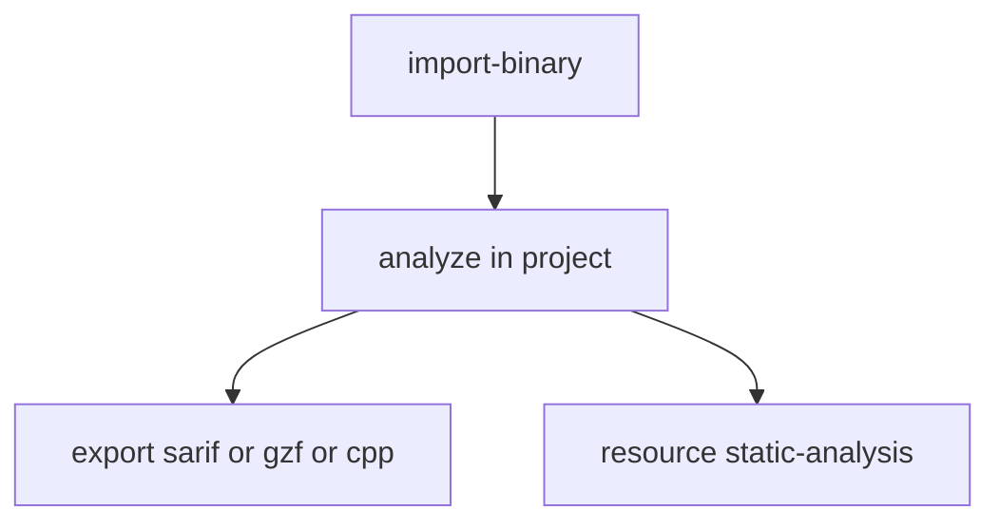

# Quick Start: Import and Export



This page is the shortest current path to importing a binary, exporting results, and reading the SARIF-style analysis resource.

## Supported formats

| Format | Typical use |
|--------|-------------|
| `sarif` | Security analysis output and CI pipelines |
| `gzf` | Portable Ghidra project archive |
| `cpp` or `c` | Decompiled source export |
| `xml` | Structured metadata export |
| `html` | Human-readable report |
| `ascii` | Plain text export |

## 1. Import a binary

```bash
agentdecompile-cli tool import-binary '{
  "path": "/path/to/binary.exe",
  "analyzeAfterImport": true
}'
```

Minimal convenience form:

```bash
agentdecompile-cli import-binary /path/to/binary.exe
```

## 2. Export SARIF

```bash
agentdecompile-cli tool export '{
  "programPath": "/path/to/binary.exe",
  "outputPath": "./analysis.sarif",
  "format": "sarif"
}'
```

## 3. Export a GZF archive

```bash
agentdecompile-cli tool export '{
  "programPath": "/path/to/binary.exe",
  "outputPath": "./analysis.gzf",
  "format": "gzf"
}'
```

## 4. Export decompiled source

```bash
agentdecompile-cli tool export '{
  "programPath": "/path/to/binary.exe",
  "outputPath": "./decompiled.cpp",
  "format": "cpp",
  "createHeader": true,
  "includeTypes": true,
  "includeGlobals": true
}'
```

## 5. Read the static-analysis resource

```bash
agentdecompile-cli resource static-analysis
```

That reads `ghidra://static-analysis-results` without exporting a file first.

## Troubleshooting

- `No Program Loaded`: import the binary first or use the full `programPath` from `list project-files` or `resource programs`.
- Empty SARIF results: re-run with `analyzeAfterImport=true` or analyze the binary before exporting.
- Missing GZF output: export from an imported project program, not an unopened path.

## Read next

- [IMPORT_EXPORT_GUIDE.md](./IMPORT_EXPORT_GUIDE.md) for the full parameter guide.
- [../TOOLS_LIST.md](../TOOLS_LIST.md) for the canonical tool reference.
- [../USAGE.md](../USAGE.md) for the wider CLI and MCP workflows.
