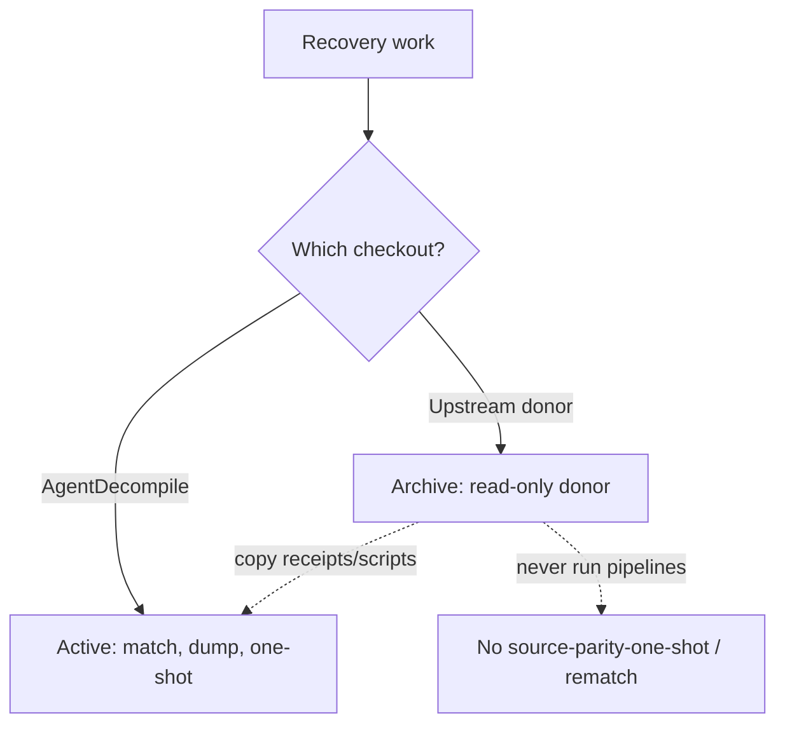

# Upstream donor archive (read-only)

**Status:** archived donor checkout. Not an active recovery product.



## Hard rule

Do **not** run recovery pipelines from the upstream donor checkout:

- No `source-parity-one-shot`
- No `swkotor-match-*` rematches
- No new feature work under that tree

All matching recovery, dumps, and one-shot paths live in **AgentDecompile**:

```bash
cd ~/Workspaces/agentdecompile   # or /run/media/.../Workspaces/agentdecompile
uv run agentdecompile-reconstruct ...
```

## What the upstream donor checkout still is

- Historical receipts, inventories, and matched sources under its `target/` (copy/symlink into AgentDecompile `target/` if needed)
- Donor of scripts and ideas already folded into `src/agentdecompile_recovery/`

## What "done" looks like for swkotor dumps

See [CRITICAL_PATH.md](CRITICAL_PATH.md): `agentdecompile-reconstruct … --dump-source target/swkotor-source-dump` from this repo only.
