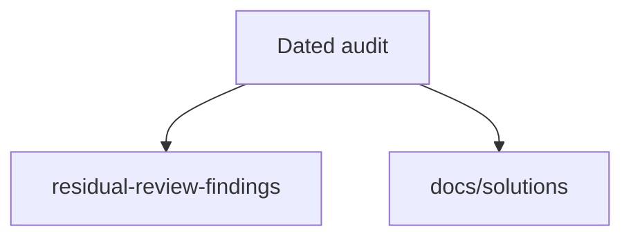

# Audits

Dated scored reviews. Scores and tool counts in these files are **historical**. Current advertised counts live in [README.md](../../README.md) and the [TOOLS_LIST.md](../../TOOLS_LIST.md) preamble.

| File | Role |
|------|------|
| [2026-05-24-agent-native-audit.md](./2026-05-24-agent-native-audit.md) | MCP/CLI/GUI parity scores |

Follow-ups from that audit: [docs/residual-review-findings/impl-agent-native-audit-c2bc.md](../residual-review-findings/impl-agent-native-audit-c2bc.md). Patterns: [docs/solutions/README.md](../solutions/README.md).

Do not rewrite an audit body to match today's registry. Add a new dated audit if scores need a rematch.
