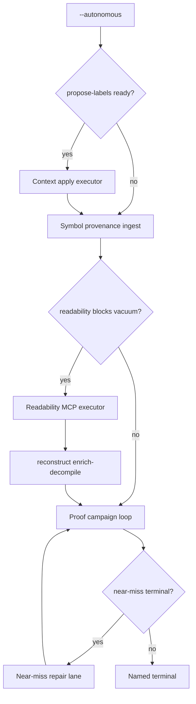

# Agent Loop Closure

## Summary

Close the remaining **manual operator steps** in bounded `--autonomous` recovery by adding four advisory executors that run in a defined order: **context label apply** (placed acquisition → Ghidra via conflict protocol), **symbol provenance** (PDB/DWARF naming evidence before enrich), **readability repair executor** (MCP `toolSeq` for Port gate failures), and **near-miss repair** (bounded permuter/prototype retries after small objdiff deltas). Each phase ends in a named receipt; only objdiff-zero under `verified/` moves the proof ladder.

---

## Problem Frame

Recent slices shipped proof-target queue, multi-campaign loops, near-miss retry ranking, and readability repair **guidance** — but operators and agents still perform four hand steps:

1. Copy `toolSeq` from `readability-repair-run.json` into MCP manually.
2. Re-shell campaigns when synthesis returns small objdiff deltas (`try-nearby-source-shape-or-permuter` exists in policy but is not wired to the campaign driver).
3. Ignore PDB/DWARF when present — naming relies on enrich heuristics only.
4. Read `propose-labels.json` but apply renames to Ghidra by hand.

STRATEGY **Agent loop completion** and **context merge yield** stay flat until these gaps close. Industry pattern (DeGPT, Mizuchi agents): compile/objdiff remains the proof gate, but **naming and repair loops run automatically** with explicit conflict handling and budgets.

---

## Key Decisions

- KTD1. **Integrated loop, phased delivery** — One requirements doc and honesty model; implement in four phases (readability executor → near-miss repair → context apply → symbol provenance). Rationale: readability unblocks vacuum today; PDB ingest is highest integration cost.
- KTD2. **MCP-only mutation** — Context apply and readability repair invoke existing AgentDecompile tools (`rename-function`, `manage-comments`, conflict protocol). No parallel Ghidra write path.
- KTD3. **Symbol provenance is advisory** — PDB/DWARF names feed enrich and module-map evidence with `authorityClass: symbol-provenance`; they never increment proof numerator without objdiff zero.
- KTD4. **Near-miss repair is budgeted** — Extends campaign loop only when `bestDifference` is within threshold; uses existing autonomous policy actions; stops on accept, budget exhaustion, or reject-near-miss.
- KTD5. **Order: context apply before enrich refresh** — Placed context labels land in Ghidra before symbol provenance and enrich-decompile so facts reflect merged names. Symbol provenance runs before readability executor so PDB/DWARF names participate in Port gate scoring.

---

## Requirements

### Shared autonomy contract

- R1. Each executor writes a **named receipt** under `state/` with `status`, `attempted`, `claimBoundary`, and typed stop reason — no silent no-ops.
- R2. Executors respect **autonomy budgets** (`max_functions`, `max_attempts`, `max_campaigns`, wall seconds) and do not bypass readability or proof honesty gates.
- R3. Failed MCP mutations surface `conflictId` and stop or skip per operator policy — never force-overwrite custom Ghidra data.

### Phase A — Readability MCP executor

- R4. When `readability_repair_blocks_vacuum` and repair `toolSeq` is non-empty, an executor runs the sequence via AgentDecompile MCP (or CLI `tool-seq` equivalent) for the top queue entry within budget.
- R5. After successful rename-class repair, trigger **enrich-decompile refresh** (reconstruct resume) before re-entering proof campaign — matching today's command hints.
- R6. Executor receipt references queue head, tools invoked, and conflict outcomes; does not count toward proof numerator.

### Phase B — Near-miss repair lane

- R7. When a proof campaign loop ends `near-miss` with `bestDifference` ≤ configured threshold, seed a **near-miss repair** pass that invokes vacuum/policy `try-nearby-source-shape-or-permuter` for ranked targets before the next campaign iteration.
- R8. Near-miss repair shares synthesis attempt history; does not fabricate verified receipts.
- R9. Loop stops early on objdiff accept, `reject-near-miss` after budget, or unchanged ladder after repair pass.

### Phase C — Context apply executor

- R10. When `acquisition/propose-labels.json` has `ready` rows without conflicts, executor applies renames via MCP using the modification-conflict protocol for each address.
- R11. Conflicting addresses remain in receipt as `skipped:conflict` — not auto-picked.
- R12. Apply receipt is advisory (`authorityClass: context-hint`); proof ladder unchanged.

### Phase D — Symbol provenance (PDB/DWARF)

- R13. When PDB (PE) or DWARF debug info (ELF) is available alongside the analysis binary, ingest **function/symbol names keyed by address** into an advisory provenance receipt consumed by enrich and module-map resolution.
- R14. Provenance rows carry `source: pdb` or `source: dwarf`, `authorityClass: symbol-provenance`, and never override verified objdiff names without explicit conflict flow.
- R15. When symbols are absent, phase is `skipped` with reason — no failure.

---

## Acceptance Examples

- AE1. Covers R4–R6. **Given** readability queue head with rename `toolSeq`, **when** autonomous runs, **then** executor receipt shows tools invoked and campaign either proceeds or stops `readability-blocked` with conflict detail — not silent skip.
- AE2. Covers R7–R9. **Given** campaign loop `near-miss` with `bestDifference: 3`, **when** near-miss repair runs, **then** a subsequent campaign iteration attempts permuter path and receipt shows `nearMissRepair` status without numerator increment unless objdiff zero lands.
- AE3. Covers R10–R12. **Given** two ready propose rows and one conflict row, **when** context apply runs, **then** receipt shows two applied/skipped-with-conflict and one `skipped:conflict` without silent overwrite.
- AE4. Covers R13–R15. **Given** ELF with DWARF function names, **when** provenance ingest runs, **then** receipt lists mapped addresses and enrich facts can reference provenance hints; absent debug info yields `skipped:no-symbols`.

---

## Success Criteria

- A full `--autonomous` run on swkotor (or reference PE) completes readability, proof campaign, and near-miss paths without manual MCP copy-paste when MCP server is available.
- Context merge yield rises: placed seeds result in applied Ghidra names when no conflict.
- Symbol provenance increases `namedCount` / module-resolved share on dumps where PDB/DWARF exist.
- Proof numerator still moves only on objdiff-verified accepts.

---

## Scope Boundaries

### Deferred for later

- Bulk apply without per-conflict confirmation.
- Embedding / fuzzy match for unplaced context pieces.
- SAILR-style control-flow restructuring.
- LLM naming skin.
- CI-gated live MCP on every PR.

### Outside this product's identity

- Treating applied context labels, readability repairs, or PDB names as verified source without objdiff.
- Silent overwrite of custom Ghidra annotations.
- Unbounded permuter retry until arbitrary coverage.

---

## Dependencies / Assumptions

- AgentDecompile MCP server or CLI available for tool-seq execution during autonomous runs.
- Phase 6 propose receipt (`context_propose.py`) and readability repair `toolSeq` builder already exist.
- `autonomous_policy.py` already defines `try-nearby-source-shape-or-permuter` and `reject-near-miss`.
- PDB/DWARF parsing may use existing `elftools` (ELF) and a PE PDB reader — planning chooses libraries; ingest is advisory only.
- Assumption: integrated loop runs in **phase order A → B → C → D** for v1 implementation sequencing (readability and near-miss before heavy symbol ingest).

---

## Outstanding Questions

### Deferred to planning

- PDB reader choice for MSVC PE (llvm-pdbutil vs embedded parser vs Ghidra export).
- Whether near-miss repair runs inside campaign loop iterations or as a sub-stage between iterations.
- Headless enrich-decompile refresh: full reconstruct resume vs targeted PyGhidra session per repair.

---

## Sources / Research

- `STRATEGY.md` — agent loop completion, context merge yield, verified parity rungs.
- `docs/brainstorms/2026-07-25-proof-scale-live-validation-requirements.md` — near-miss repair deferred as approach C.
- `docs/brainstorms/2026-07-25-readability-repair-loop-requirements.md` — executor deferred.
- `docs/plans/2026-07-17-feat-phase6-context-ghidra-propose.md` — apply path deferred.
- `docs/brainstorms/2026-07-25-readable-recovery-quality-requirements.md` — PDB/DWARF deferred.
- DeGPT / SK²Decompile — semantic-guarded rename and skeleton-then-skin with compile gate.
