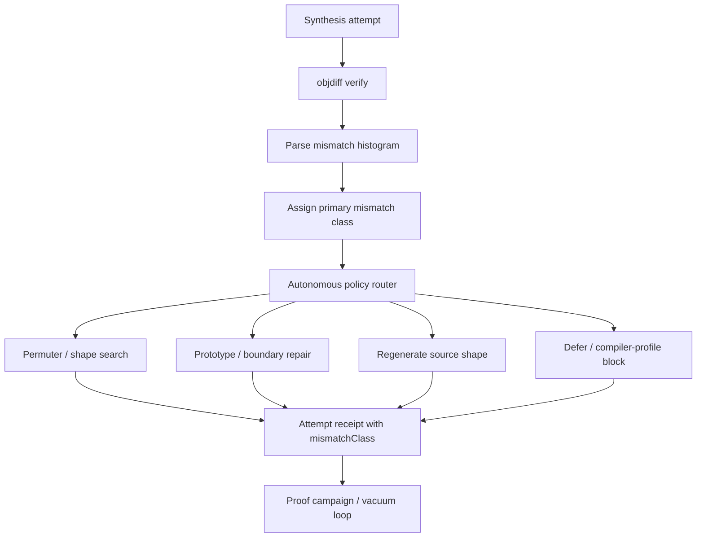

# Mismatch-Class Routing

## Summary

When synthesis fails objdiff, the recovery loop today sees only a scalar
`bestDifference` and routes every near-miss to the same permuter path. This
slice classifies objdiff mismatches into a small, stable taxonomy and routes
the next autonomous repair action by class — so regalloc/operand deltas try
permuter, branch-shape deltas try shape search, prototype/frame suspects try
boundary repair, and unrecoverable classes defer honestly. Classification and
routing stay advisory; only objdiff-zero under `verified/` moves the proof
ladder.

---

## Problem Frame

Agent loop closure shipped executors for readability, context apply, symbol
provenance, and a single near-miss repair lane (`source_shape_search=True` for
all targets with `bestDifference ≤ 8`). `autonomous_policy.choose_next_action`
already distinguishes compile errors, suspect boundaries, objdiff-zero, and
budget exhaustion — but every non-zero objdiff delta still collapses to
`try-nearby-source-shape-or-permuter` when within threshold.

That wastes budget on the wrong repair: an operand/register mismatch is a
permuter problem; a suspect slice boundary is not; a compile rejection is not.
Industry practice (DeGPT compile-and-diff loops, Mizuchi-style agent playbooks,
decomp-goal-harness mismatch typing) routes retries from **instruction-level
diff shape**, not delta count alone.

The repo already stores raw objdiff JSON in verify reports (`output` field) and
documents mismatch kinds in operator prompts (`INSERTION`, `DELETION`,
`REPLACEMENT`, `OPCODE_MISMATCH`, `ARGUMENT_MISMATCH`), but
`objdiff_verification.parse_objdiff_report` collapses all non-match results to
`differences: 1`. Near-miss ranking in `proof_target` and
`near_miss_repair.select_near_miss_targets` sorts by scalar delta only. Operators
cannot see *why* a function is stuck or which playbook to run next.

---

## Key Decisions

- KTD1. **Classify from objdiff evidence, not LLM guesswork.** Primary signal
  is parsed objdiff instruction mismatch types and counts; secondary heuristics
  (boundary quality, compile error text) may break ties. No model-inferred
  mismatch labels in v1.
- KTD2. **Small stable taxonomy.** Ship five primary classes operators can
  remember and receipts can aggregate: `operand`, `opcode`, `insert-delete`,
  `boundary-suspect`, `unclassified`. Finer labels (e.g. string-pool,
  relocation) defer until histogram data proves they change routing.
- KTD3. **Routing overrides scalar near-miss default.** When class is known,
  policy selects a playbook-specific action before the generic permuter action.
  Unknown class preserves today's threshold behavior.
- KTD4. **Honesty unchanged.** `mismatchClass` is metadata on synthesis
  attempts and repair receipts; it never promotes to `verified/` without
  objdiff-zero accept.
- KTD5. **Fail open on parse gaps.** Objdump fallback and empty objdiff JSON
  yield `unclassified` and existing scalar routing — never block the loop.

---

## Requirements

### Mismatch evidence capture

- R1. Each objdiff verify report exposes a **mismatch histogram**: counts per
  objdiff instruction kind (`INSERTION`, `DELETION`, `REPLACEMENT`,
  `OPCODE_MISMATCH`, `ARGUMENT_MISMATCH`) when present in raw JSON.
- R2. When raw JSON lacks instruction detail, histogram is empty and report
  records `detailLevel: scalar-only` without failing verification status
  parsing.
- R3. Synthesis attempt records (`source-synthesis/attempts.jsonl` and plugin
  attempt payloads) include `mismatchClass`, `mismatchHistogram`, and
  `primaryMismatchKind` when classification runs.

### Classification

- R4. A classifier assigns one **primary mismatch class** per attempt from
  histogram + context:
  - `operand` — `ARGUMENT_MISMATCH` dominates or is sole non-zero bucket.
  - `opcode` — `OPCODE_MISMATCH` or `REPLACEMENT` dominates without boundary
    suspect signal.
  - `insert-delete` — `INSERTION` and/or `DELETION` dominate (typical branch
    padding / extra blocks).
  - `boundary-suspect` — target slice `boundaryQuality.status == suspect`
    regardless of histogram (may co-tag histogram class as secondary).
  - `unclassified` — no histogram, fallback verify path, or tie without dominant
    bucket.
- R5. Dominance rule: a bucket must exceed 50% of counted instruction
  mismatches OR be the only non-zero bucket; ties fall through to
  `unclassified`.
- R6. Classification is deterministic for the same inputs (receipt replayable).

### Policy routing

- R7. `choose_next_action` consults `mismatchClass` when `bestDifference` is
  within near-miss threshold and verifier succeeded with non-zero diff:
  - `operand` → `try-nearby-source-shape-or-permuter` (permuter-first).
  - `opcode` → `try-nearby-source-shape-or-permuter` (shape search emphasis).
  - `insert-delete` → `try-nearby-source-shape-or-permuter` with branch-shape
    search flag (distinct receipt reason).
  - `boundary-suspect` → `repair-boundary-before-retry` (preempts permuter).
  - `unclassified` → existing scalar threshold behavior unchanged.
- R8. Classes outside near-miss threshold do not force permuter; existing
  large-mismatch and compiler-profile block paths remain.
- R9. Policy decision payload includes `mismatchClass`, `mismatchHistogram`, and
  `routedPlaybook` for operator surfaces.

### Near-miss repair and queue

- R10. Near-miss repair target selection may **boost** functions whose latest
  attempt class is `operand` or `insert-delete` when diff ≤ threshold (same
  honesty: advisory ordering only).
- R11. `facts/proof-target-queue.json` entries may carry optional
  `nearMissMismatchClass` from latest synthesis summary for campaign seeding.
- R12. Near-miss repair receipt lists per-target `mismatchClass` attempted and
  playbook used.

### Operator surfaces

- R13. `critical_path` next actions for near-miss rows name mismatch class and
  recommended playbook (not only `bestDifference`).
- R14. `docs/CRITICAL_PATH.md` receipt table documents
  `state/mismatch-class-last.json` (or equivalent last-run summary) and fields
  on attempt records.

---

## Acceptance Examples

- AE1. Covers R1–R3, R6. **Given** objdiff raw JSON with three
  `ARGUMENT_MISMATCH` and one `OPCODE_MISMATCH`, **when** verify parses,
  **then** histogram reflects counts and attempt record stores
  `mismatchClass: operand`.
- AE2. Covers R7–R9. **Given** near-miss with `boundary-suspect` slice and diff
  4, **when** policy runs, **then** action is `repair-boundary-before-retry`
  not permuter despite diff ≤ 8.
- AE3. Covers R5, R7. **Given** equal `INSERTION` and `DELETION` counts only,
  **when** classifying, **then** `mismatchClass: insert-delete`.
- AE4. Covers R2, R5, KTD5. **Given** objdump fallback verify (no instruction
  detail), **when** classifying, **then** `unclassified` and policy matches
  pre-slice scalar behavior.
- AE5. Covers KTD4. **Given** routing picks permuter for `operand`, **when**
  repair completes without objdiff zero, **then** proof ladder numerator
  unchanged.

---

## Success Criteria

- Unit tests cover histogram parse, dominance classification, and policy routing
  for each primary class without live objdiff.
- Near-miss autonomous run receipts show `mismatchClass` on attempts; operators
  can see why permuter vs boundary repair was chosen in `critical_path` output.
- No regression in objdiff-zero promotion honesty tests (`test_verifier_honesty`,
  proof campaign accept paths).

---

## Scope Boundaries

### In scope

- Parser enrichment, classifier, policy routing, near-miss/queue metadata,
  operator surfaces, unit tests with fixture objdiff JSON.

### Deferred for later

- PE PDB / relocation-specific subclasses.
- LLM-assisted mismatch explanation or codegen hints from class.
- Live swkotor proof-scale smoke (U6 from proof-scale plan).
- Campaign-level analytics dashboard aggregating class → accept rate.

### Outside this product's identity

- Treating mismatch class as proof tier or promoting non-zero diff to `verified/`.
- Parallel verify stack bypassing objdiff.

---

## Dependencies and Assumptions

- Objdiff JSON in verify reports includes instruction mismatch entries for
  typical compiler output (validated on reference PE/ELF fixtures; unverified on
  all MSVC/GCC edge cases).
- Agent loop closure executors remain the outer `--autonomous` shell; this slice
  refines inner synthesis retry routing only.
- `source_shape_search` / permuter plugins can accept a branch-shape emphasis
  flag or equivalent config without new external tools.

---

## Outstanding Questions

- OQ1. Should `opcode` vs `insert-delete` share one permuter config or require
  separate plugin profiles in v1? (Planning default: shared permuter, distinct
  receipt `routedPlaybook` label only unless permuter flags already exist.)
- OQ2. Minimum histogram sample: classify on any non-zero bucket or require
  ≥2 instruction rows? (Planning default: classify on any non-zero bucket.)

---

## Approaches Considered

| Approach | Summary | Verdict |
|----------|---------|---------|
| A. Scalar-only heuristics | Route from diff magnitude and boundary flags only | Rejected — duplicates today's behavior |
| B. Histogram + classifier (recommended) | Extend verify parse, classify, route playbooks | **Selected** — uses existing raw JSON |
| C. Full instruction playbook library | Per-opcode repair recipes and ML ranking | Deferred — high carrying cost |

**Recommendation:** Approach B — extend objdiff parsing to preserve mismatch
histograms, add a deterministic classifier and policy routes, wire metadata
through near-miss repair and proof-target queue. Reuse agent-loop-closure
honesty model and existing permuter/boundary actions.
