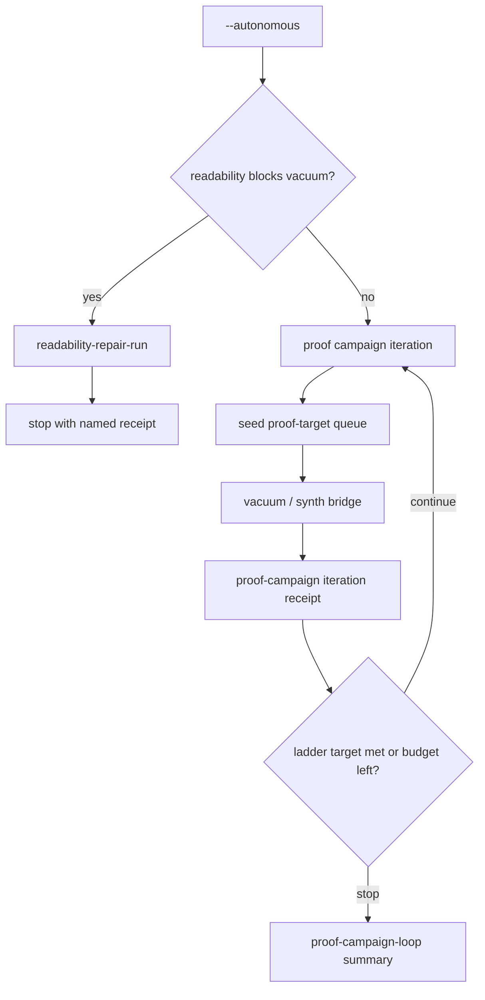

# Autonomous Proof Campaign Loop

## Summary

Turn single-shot `--autonomous` into a **bounded multi-campaign loop** that chases `functionsToNextRung` until objdiff accepts land, a named failure occurs, or budget stops — without weakening proof honesty. Proof-target queue, campaign receipts, and G14/G15 throughput shipped in the prior slice; this slice closes the **agent loop completion** gap by repeating seed → vacuum/synth → ladder check inside one reconstruct invocation (or a documented resume chain).

---

## Problem Frame

STRATEGY tracks **Agent loop completion**: autonomous repair cycles should end in a verified match or a **named failure**, not silence. Proof-ladder scale-up added `facts/proof-target-queue.json`, `state/proof-campaign.json`, and critical-path `proof-scale` — but each `agentdecompile-reconstruct --autonomous` run still executes **one** vacuum bridge. Operators and agents must manually re-invoke `--resume --autonomous` to chase the next accept toward 1%/5%/20%.

Industry pattern (matching recovery harnesses): a prioritized compile+objdiff loop runs until a **typed stop** — accept, near-miss, compile-fail, budget-stop, empty-queue — not an implicit "we're done because the process exited."

---

## Requirements

### Loop behavior

- R1. When `--autonomous` runs and `functionsToNextRung` > 0, reconstruct may execute **multiple proof campaigns** in one invocation until a stop condition fires or a campaign budget is exhausted.
- R2. Each iteration follows autonomy order unchanged: readability repair when it blocks vacuum → proof-target seed → vacuum bridge → campaign receipt.
- R3. Loop stops on the **first** of: at least one new objdiff accept in the loop (optional early stop when `--autonomous-stop-on-accept`), `functionsToNextRung` reaches 0 for current `nextRung`, campaign budget exhausted, empty proof/synth queue, readability-only head (existing repair path), vacuum bridge failure, or wall-clock budget.
- R4. A loop-level receipt (`state/proof-campaign-loop.json`) summarizes iterations: campaign count, total attempted, total accepts, final ladder snapshot, and terminal status (`accepted` / `near-miss` / `budget-stop` / `empty-queue` / `readability-blocked` / `bridge-failed`).

### Budget and safety

- R5. New optional cap `--autonomous-max-campaigns` (default 1 preserves today’s behavior). Function budget (`--autonomous-max-functions`) applies **per campaign iteration**, not multiplied silently across the loop.
- R6. Re-seeding between iterations must skip already-verified or queue-occupied names; proof-target order is preserved.
- R7. Loop must not rematch objdiff-0 functions without `--force-rematch` (inherits existing cache and honesty rules).

### Operator surfaces

- R8. Critical-path `proof-scale` command hint documents multi-campaign flags when `functionsToNextRung` > 1.
- R9. Recovery status embeds loop summary when `proof-campaign-loop.json` exists.
- R10. Append-only `state/proof-campaign-history.jsonl` records one row per iteration for audit (optional but recommended in v1).

### Honesty invariants

- R11. Numerator changes only from new objdiff-verified receipts; loop metadata never increments proof ladder.
- R12. Near-miss and compile-fail outcomes remain distinguishable in loop terminal status; near-miss never promotes to `verified/`.
- R13. Readability repair remains advisory; loop does not auto-apply MCP mutations.

---

## Acceptance Examples

- AE1. Covers R1, R3. **Given** `functionsToNextRung` 3 and `--autonomous-max-campaigns 3 --autonomous-max-functions 1`, **when** the first iteration yields an objdiff accept, **then** loop may stop early (if stop-on-accept) or continue until campaign cap; loop receipt names terminal status and `numeratorDelta` ≥ 1.
- AE2. Covers R4, R12. **Given** three iterations with only near-misses, **when** campaign budget exhausts, **then** loop status is `near-miss`, numerator unchanged, `bestDifference` surfaced.
- AE3. Covers R2, R13. **Given** readability queue head blocks vacuum, **when** loop starts, **then** first action is readability repair path and loop stops with `readability-blocked` without vacuum bridge.
- AE4. Covers R5. **Given** default flags (no `--autonomous-max-campaigns`), **when** `--autonomous` runs, **then** behavior matches current single-campaign semantics.

---

## Success Criteria

- One reconstruct invocation with `--autonomous-max-campaigns` > 1 and proof queue non-empty produces a loop receipt with iteration count > 1 or a single named terminal stop — never silent exit.
- STRATEGY **Agent loop completion** metric is satisfiable without manual re-shelling `--resume --autonomous` for each accept toward `nextRung`.
- Default (`max-campaigns=1`) is backward compatible; honesty tests from proof-ladder scale-up still pass.

---

## Key Decisions

- KTD1. **Extend `proof_campaign.py` + `frontdoor.py`** — No new peer CLI; loop orchestration lives in reconstruct autonomy. Rationale: preserves single product surface.
- KTD2. **Inner loop, not operator-only outer loop** — Same process repeats campaigns; resume remains valid for cross-session continuation. Rationale: agent loop completion in one bounded invocation.
- KTD3. **Default `max-campaigns=1`** — Opt-in multi-campaign; avoids surprise long runs. Rationale: YAGNI on carrying cost for casual users.
- KTD4. **Per-iteration function budget** — `autonomous-max-functions` applies per campaign, not multiplied across iterations. Rationale: predictable spend; matches vacuum budget model.
- KTD5. **History jsonl + loop summary** — Iteration detail in jsonl; operators read one loop receipt. Rationale: audit without bloating critical-path.

---

## Scope Boundaries

### Deferred for later

- Live swkotor.exe KPI chase (validation smoke, separate from loop mechanics).
- Automatic MCP apply for readability repair.
- PDB/DWARF provenance enrichment.
- Cross-session daemon that polls work dirs indefinitely.
- New proof rungs above 20%.

### Outside this product's identity

- Counting advisory or Port output toward numerator.
- Infinite retry until arbitrary coverage percent.
- Whole-binary link in the autonomy loop.

---

## Dependencies / Assumptions

- Shipped: proof-target queue, single campaign receipt, vacuum seed preference, readability repair loop, fail-closed `is_proven_zero`, G14/G15 synth throughput.
- Vacuum bridge and MSVC/Wine toolchain available for PE proof targets when loop enters synthesis.
- `decomp-cli.sh vacuum start` returns deterministically enough to evaluate bridge success per iteration.

---

## Outstanding Questions

- None blocking. Planning may choose exact loop receipt field names and whether early stop on first accept is default-on or opt-in (`--autonomous-stop-on-accept`).
