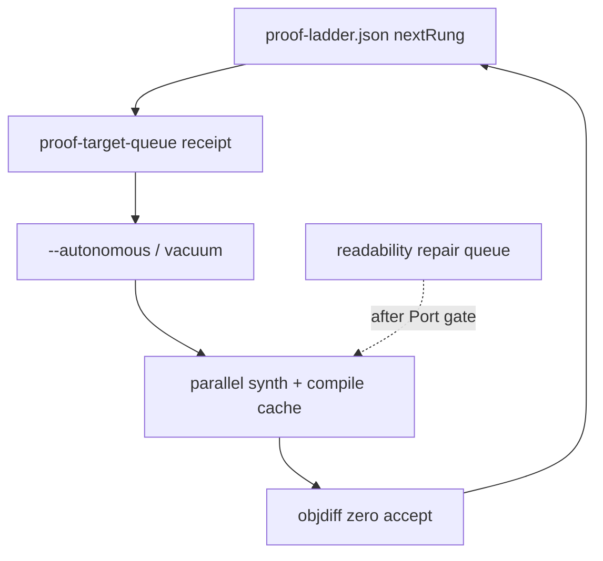

# Proof Ladder Scale-Up

## Summary

Grow the **objdiff-verified numerator** toward STRATEGY rungs (1% → 5% → 20%) without weakening honesty. Today the ladder reports coverage but does not drive autonomous work: synthesis is slow (G15), parallel MSVC can false-mismatch on a shared Wine prefix (G14), and `--autonomous` defaults to one function with no proof-prioritized queue. v1 adds a **proof-target queue**, hierarchical vacuum/synth ordering, compile-result caching, and critical-path actions keyed off `nextRung` — while keeping the numerator definition frozen.

---

## Problem Frame

Phase 5 shipped `proof-ladder.json` (denominator = inventoried functions, numerator = receipt-backed objdiff zero). Readable-recovery and repair-loop closed the advisory lane. The **proof numerator still does not grow operationally**: operators lack a ranked list of which functions to match next; exhaustive MSVC synthesis can take hours per full inventory pass (G15); shared `WINEPREFIX` under parallel workers causes false mismatches (G14); default autonomy seeds one function and does not loop toward `nextRung`.

Industry pattern (Mizuchi, decomp-goal-harness): compile+objdiff loop with **prioritized units**, **bounded parallelism**, and **named failure** — not silent near-misses or inventory skips.

STRATEGY metric **Verified function parity** and **Agent loop completion** depend on this slice.

---

## Requirements

### Proof targeting

- R1. After report (or on demand), reconstruct writes a **proof-target queue** receipt listing inventoried functions not yet objdiff-verified, ranked for matching likelihood (trivial reloc, small `bodyBytes`, existing semantic source, cache miss last).
- R2. Queue entries carry `claimBoundary: proof-target-advisory` and never count as verified until objdiff-zero receipts land under `verified/`.
- R3. `proof-ladder.json` gains **actionable fields**: `functionsToNextRung` (count needed to reach `nextRung`), `nextRungTargetNumerator`, without changing rung thresholds or numerator semantics.

### Autonomous and vacuum coupling

- R4. When `--autonomous` runs and proof-target queue is non-empty, vacuum/synth seeding **prefers proof-target order** over arbitrary task order (after readability repair when that lane applies).
- R5. Autonomous runs record a **proof-campaign receipt** per session: rung before/after, functions attempted, accepts, near-misses, budget exhaustion reason — so loops end in named outcomes per STRATEGY.
- R6. Default autonomy may process **more than one proof target per session** when budget allows (`--autonomous-max-functions` > 1), without dropping inventory coverage.

### Throughput (G15 + G14)

- R7. **Compile/objdiff cache**: repeated synth attempts for the same target slice + compiler flags reuse prior compile/objdiff artifacts when inputs digest-match; cache misses run full pipeline.
- R8. **Per-worker Wine prefix** (G14): parallel MSVC workers use isolated prefixes (or documented equivalent) so parallel load does not produce false objdiff mismatches.
- R9. Stage timings include synth cache hit/miss counts and worker prefix id for operator diagnosis.

### Operator surfaces

- R10. Critical-path `nextActions` include **proof-scale** when `nextRung` is set and queue non-empty, with command hint for resume + autonomous + workers.
- R11. Recovery status and report embed proof-target queue summary (count, top entries, `functionsToNextRung`).

### Honesty invariants

- R12. Numerator remains **receipt-backed objdiff-verified-semantic only**; proof-target queue, compile cache hits, and readability passes do not increment numerator.
- R13. Near-miss (objdiff > 0) never promotes to `verified/`; campaign receipt must distinguish accept vs near-miss vs compile-fail.
- R14. Denominator rules unchanged (inventoried function candidates; no shrinking for speed).

---

## Acceptance Examples

- AE1. Covers R1, R3. **Given** 1000 inventoried functions and numerator 5 at 0.5%, **when** proof-target queue builds, **then** `functionsToNextRung` for `nextRung` `1%` is 5 and queue lists unverified functions ranked with trivial/small-first heuristic.
- AE2. Covers R4, R6. **Given** `--autonomous --autonomous-max-functions 3` and non-empty proof queue, **when** autonomy runs after readability lane, **then** top three proof targets are attempted before lower-priority tasks.
- AE3. Covers R7. **Given** two synth attempts with identical target slice digest and flags, **when** the second runs, **then** compile cache hit is recorded and wall time skips recompile when safe.
- AE4. Covers R8, R12. **Given** parallel workers with distinct prefixes, **when** a known-good trivial match runs, **then** objdiff zero accept lands and numerator increments by one; shared-prefix false mismatch regression test fails if reintroduced.
- AE5. Covers R5, R13. **Given** budget exhaustion after near-miss, **when** campaign receipt is written, **then** status names near-miss with best difference count; numerator unchanged.

---

## Success Criteria

- On a reference PE work dir, one bounded autonomous campaign (`--autonomous-max-functions` ≥ 3, workers ≥ 2) produces at least one new objdiff accept **or** a named campaign outcome (near-miss, compile-fail, budget-stop) — not silence.
- `functionsToNextRung` and proof-target queue give operators/agents a single receipt for “what to match next for 1%.”
- Parallel synth does not regress fail-closed proof gate (G1–G4 from perf living plan).
- Pre-synth wall time measurably improves on repeated attempts via compile cache (G15 partial closure).

---

## Key Decisions

- KTD1. **Proof queue separate from readability queue** — Different ranking (objdiff likelihood vs Port gate). Autonomy order: readability repair when needed → proof targets → generic tasks. Rationale: preserves readable-recovery honesty ordering.
- KTD2. **Campaign metadata, not new rungs** — Keep 1%/5%/20% thresholds; add targeting math only. Rationale: Phase 5 contract frozen in claim copy and tests.
- KTD3. **G14+G15 in same slice** — Per-worker prefixes and compile cache ship together with proof queue; partial G15 alone does not close the operational gap. Rationale: scale-up requires both prioritization and throughput.
- KTD4. **Trivial-first ranking v1** — Reuse existing match heuristics (reloc wrappers, semantic source, body size); no ML prioritization. Rationale: Mizuchi/decomp-goal pattern; low carrying cost.
- KTD5. **No inventory skip** — Full denominator preserved; queue may process subset per budget only. Rationale: STRATEGY and perf living plan rules.

---

## Scope Boundaries

### Deferred for later

- Whole-binary link / rebuild.
- New rungs above 20% or byte-percent denominators.
- LLM-default synth plugins.
- Automatic cross-binary name propagation for proof.
- Atlas UI for ladder visualization.

### Outside this product's identity

- ≥90% whole-binary recovery claims.
- Counting advisory Ghidra or Port output toward numerator.
- Peer CLI brands for proof campaigns.

---

## Dependencies / Assumptions

- Shipped: `proof_ladder.py`, vacuum runner, `verify_pool.py`, autonomy budgets, match cache, fail-closed `is_proven_zero`.
- Readable-repair loop complete; proof autonomy runs after readability lane when queue head requires it.
- MSVC/Wine toolchain available for PE proof targets; ELF uses native clang path where applicable.
- Reference work dirs use local SSD for `target/` when possible (G16 operator guidance, not code).

---

## Outstanding Questions

- None blocking. Planning may choose exact proof-queue receipt schema and cache key fields as long as R1–R14 hold.
