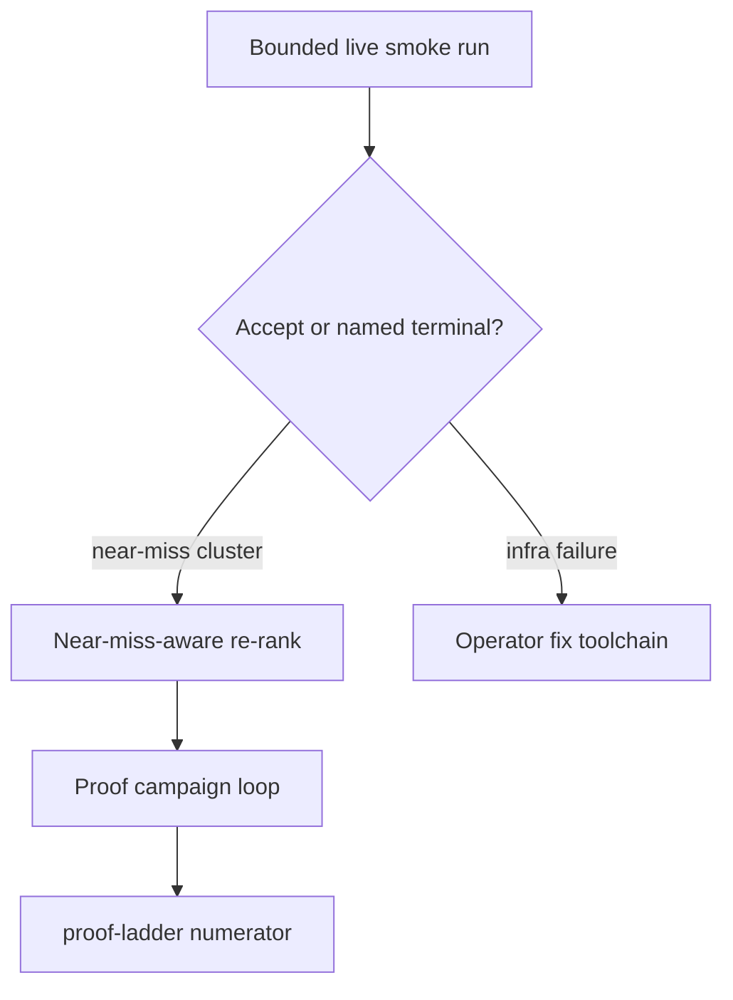

# Proof Scale Live Validation

## Summary

Validate and improve **proof-ladder scale-up** on a live reference binary: run a bounded autonomous campaign that must end in **≥1 objdiff accept** or a **named, auditable terminal** — then raise accept rate by **near-miss–aware proof-target ranking** so campaigns chase functions most likely to convert. Numerator honesty stays frozen; this slice targets meaningful progress toward the **1% rung**, not 5% or 20%.

---

## Problem Frame

Proof-ladder scale-up shipped proof-target queue, campaign receipts, multi-campaign autonomy, compile cache, and per-worker Wine isolation. Unit tests lock honesty invariants. **Live validation on a reference binary was explicitly deferred** — the stack may still fail to move the numerator in practice.

Operators today can run `--autonomous` but lack a **canonical smoke recipe** and **conversion-oriented targeting** when campaigns produce near-misses instead of accepts. STRATEGY metrics **Verified function parity** and **Agent loop completion** need evidence that the ladder climbs on a real target, not only that orchestration receipts exist.

Industry pattern (splat/dtk, decomp.me, Mizuchi-style loops): prioritize units with highest conversion probability, bound parallelism, and **name every stop** — silence and advisory inflation are both failures.

---

## Key Decisions

- **Smoke before more orchestration.** Prove one bounded live run on a reference binary before adding another autonomy layer.
- **Named terminal is success for v1 smoke.** A run that ends `near-miss`, `readability-blocked`, or `bridge-failed` with complete receipts counts as a successful smoke when it surfaces an actionable blocker — not only `accepted`.
- **Near-miss retry priority over cold targets.** Functions with recent small objdiff deltas rank ahead of never-attempted functions in the proof-target queue.
- **Challenger lane deferred.** Autonomous permuter/prototype repair after near-miss (approach C) stays out of v1 unless smoke shows a dense cluster of small-diff near-misses.

---

## Requirements

### Live smoke validation

- R1. Document a **bounded reference-binary smoke** in `docs/CRITICAL_PATH.md`: resume through report, then `--autonomous` with proof-target seeding and multi-campaign flags appropriate to `functionsToNextRung`.
- R2. Smoke success is **≥1 new objdiff-verified accept** under `verified/` **or** a **named campaign-loop terminal** (`accepted`, `near-miss`, `readability-blocked`, `bridge-failed`, `empty-queue`, `budget-stop`) with receipts at `state/proof-campaign-loop.json` and per-iteration history.
- R3. Smoke run records **before/after ladder snapshot** (`numerator`, `rung`, `functionsToNextRung`) so operators can tell whether the rung moved.
- R4. Smoke must not weaken honesty: near-miss metadata, queue ranking, and campaign summaries never increment the numerator.

### Near-miss–aware targeting

- R5. Proof-target queue ranking **boosts functions with recent near-miss evidence** (small objdiff delta from synthesis attempts) ahead of never-attempted functions at equal size/heuristic tier.
- R6. Near-miss boost is **advisory only** — entries retain `claimBoundary: proof-target-advisory`; only objdiff-zero receipts under `verified/` count.
- R7. After a campaign loop ends `near-miss`, refreshing the proof-target queue surfaces **retry candidates first** so the next autonomous run does not restart from cold inventory order.
- R8. Ranking still prefers existing heuristics (semantic source present, smaller `bodyBytes`, synthesis-eligible) within each tier — near-miss boost adjusts order, it does not skip readability or Port gates.

### Operator surfaces

- R9. Critical-path `proof-scale` action references the smoke recipe when queue is ready and `functionsToNextRung > 0`.
- R10. Recovery status exposes enough near-miss signal (campaign loop `bestDifference`, last campaign `nearMisses`) for operators to see whether targeting should help on the next run.

### Honesty invariants

- R11. Numerator remains **receipt-backed objdiff-verified-semantic only**; near-miss boost and smoke metadata do not promote to `verified/`.
- R12. Denominator rules unchanged — inventoried function candidates; no shrinking for speed.

---

## Acceptance Examples

- AE1. Covers R2, R4. **Given** a reference work dir at 0% with non-empty proof-target queue, **when** bounded smoke runs, **then** loop receipt has non-empty `status` and `claimBoundary`; numerator increases only if `verified/` gains a new objdiff-zero receipt.
- AE2. Covers R5, R7. **Given** function A has `bestDifference: 2` in the last campaign and function B was never attempted, **when** proof-target queue rebuilds, **then** A ranks above B at equal synthesis eligibility.
- AE3. Covers R2. **Given** smoke ends `readability-blocked`, **when** operator reads loop receipt, **then** `campaignCount` is 0 and readability repair run receipt exists — smoke still passes as named terminal.
- AE4. Covers R3. **Given** smoke produces one accept, **when** ladder rebuilds, **then** `numeratorDelta` in loop receipt matches `verified/` count change.

---

## Success Criteria

- One documented smoke on a pinned reference binary completes with **accept or named terminal** — not silence or partial receipts.
- If near-misses dominate, a follow-up campaign seeded from refreshed queue **attempts boosted targets first** without manual queue editing.
- No regression to honesty tests: near-miss and loop metadata never inflate numerator.

---

## Scope Boundaries

### Deferred for later

- Autonomous permuter/prototype repair lane after near-miss (approach C) unless smoke proves a small-diff cluster.
- Readability auto-apply, PDB/DWARF naming, context-merge into Ghidra.
- Claiming 5% or 20% rungs in this slice.
- CI-gated live smoke on every PR (manual or scheduled smoke only for v1).

### Outside this product's identity

- Treating near-miss count or campaign attempts as proof coverage.
- Near-term whole-binary semantic parity claims.
- Unbounded retry until arbitrary coverage.

---

## Dependencies / Assumptions

- Proof-target queue, campaign loop, compile cache, and per-worker Wine prefixes from proof-ladder scale-up are available on the active branch.
- **Reference binary:** `swkotor.exe` (full KOTOR PE target) anchors the live smoke — authoritative but slower; operator must supply toolchain (`--vc-root`, Wine prefix) per `docs/CRITICAL_PATH.md`.
- Assumption: live smoke has not yet been run end-to-end on swkotor; blockers are unknown until smoke executes.
- Assumption: near-miss attempt history is readable from existing synthesis receipts (`source-synthesis/attempts.jsonl` or campaign summaries).

---

## Outstanding Questions

### Deferred to planning

- Exact near-miss delta threshold for ranking boost (e.g. differences ≤ 4 vs ≤ 8).
- Whether smoke lives as a script, documented command block only, or optional `make smoke-proof` helper.

---

## Sources / Research

- `STRATEGY.md` — verified parity rungs 1% → 5% → 20%; agent loop completion metric.
- `docs/brainstorms/2026-07-25-proof-ladder-scale-up-requirements.md` — shipped targeting/orchestration; live smoke deferred.
- `docs/plans/2026-07-25-proof-campaign-loop.md` — multi-campaign loop terminals and honesty constraints.
- `docs/CRITICAL_PATH.md` — autonomous repair entrypoints and receipt inventory.
- Industry: compile+objdiff prioritized units (splat/dtk, decomp.me, Mizuchi agent matching) — conversion over exhaustive inventory passes.
