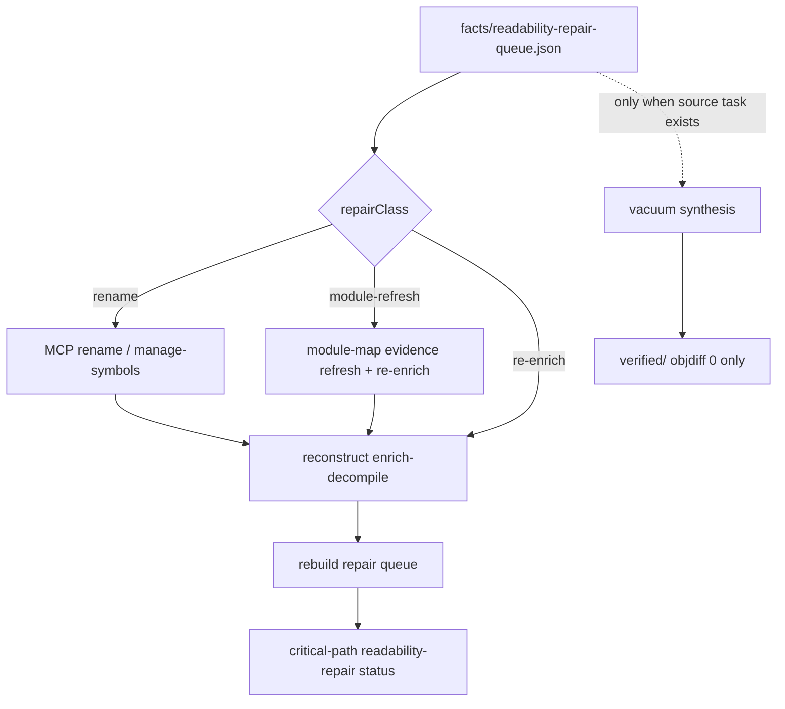

# Readability Repair Loop Closure

## Summary

Close the gap between the advisory **readability repair queue** and actual repair work. Today `--autonomous` seeds queue entries into the vacuum synthesis path even when they have no source task, so `FUN_*` rename work ends in `missing-task` instead of progress. v1 routes each `repairClass` to the right executor, rebuilds the queue after re-enrich, and keeps proof-ladder / `verified/` semantics unchanged.

---

## Problem Frame

Readable-recovery-quality and readability-score-repair shipped enrich-before-decompile, the Port gate, and a ranked repair queue with `repairClass` hints (`rename`, `module-refresh`, `re-enrich`). Critical-path exposes a text `commandHint` only. `--autonomous` prefers the repair queue for vacuum seeding, but `vacuum_runner` requires a `source-generation/tasks.jsonl` row — readability-only entries fail with `missing-task`. Agents and operators still manually bridge MCP rename → re-enrich → queue refresh.

Industry pattern (Mizuchi, decomp-goal-harness): separate **readability/naming fixes** from **compile+objdiff matching loops**; each cycle ends in verified match or a named failure, not silence.

STRATEGY metric **Agent loop completion** depends on this closure.

---

## Requirements

### Routing and seed policy

- R1. Vacuum seeding **must not** enqueue readability-repair entries that lack a matching source-generation task **unless** `repairClass` is explicitly eligible for synthesis (future: only when a task exists). Rename/module-refresh/re-enrich entries without tasks stay off the synthesis vacuum queue.
- R2. A **readability repair executor** surfaces the top queue entry with `repairClass`-specific action guidance: MCP tool names and arguments shape for `rename`; module-map refresh steps for `module-refresh`; reconstruct resume hint for `re-enrich`.
- R3. Executor output is advisory metadata under the work dir (`state/readability-repair-run.json` or equivalent receipt) with `claimBoundary: readability-repair-advisory`. It does not auto-apply MCP mutations without the existing conflict protocol.

### Feedback loop

- R4. After operator or agent completes an MCP rename (or module evidence update), reconstruct **re-enrich** (`--stop-after enrich-decompile` or `--resume` through that stage) rebuilds `facts/readability-repair-queue.json`.
- R5. Critical-path `readability-repair` action transitions to `complete` when `queueCount` reaches zero; to `ready` with updated top entries when queue shrinks but remains non-empty.
- R6. A bounded **repair attempt receipt** records each cycle: entry, repairClass, executor status, queue count before/after — so autonomous runs end in named success or failure per STRATEGY.

### Autonomous coupling

- R7. When `--autonomous` runs and the top queue entry is readability-only (no source task), the runner executes the readability repair path first — not `vacuum_runner` synthesis — subject to existing autonomy budgets.
- R8. When the top entry has both a readability gap **and** a source task, synthesis vacuum behavior is unchanged (objdiff path only).

### Honesty invariants

- R9. Readability repair success (queue shrink, Port gate pass) does not increment proof-ladder numerator or write to `verified/` without objdiff zero.
- R10. Executor receipts never imply objdiff verification.

---

## Acceptance Examples

- AE1. Covers R1, R7. **Given** queue head `FUN_00401000` / `repairClass: rename` with no source task, **when** `--autonomous --autonomous-max-functions 1` runs, **then** vacuum synthesis is not attempted and a readability repair run receipt is written (not `missing-task`).
- AE2. Covers R2, R3. **Given** queue head with `repairClass: rename`, **when** executor runs, **then** receipt includes MCP tool-seq guidance (rename-function / manage-symbols) and `claimBoundary`.
- AE3. Covers R4, R5. **Given** MCP rename applied out-of-band and reconstruct re-enrich completes, **when** queue rebuilds, **then** renamed function is absent from queue or `queueCount` drops.
- AE4. Covers R8, R9. **Given** queue entry with source task and objdiff accept, **when** vacuum runs, **then** verified promotion follows existing synthesis path; proof ladder numerator unchanged by rename-only repair elsewhere.

---

## Success Criteria

- One autonomous or guided cycle on a `FUN_*` queue head produces a named outcome (queue shrink, Port pass, or explicit blocked reason) — not `missing-task` silence.
- Readability repair and objdiff synthesis are visibly separated in receipts and critical-path actions.
- Proof-ladder and `verified/` semantics unchanged by repair-loop metadata alone.

---

## Key Decisions

- KTD1. **RepairClass-aware routing over unified vacuum** — Readability repair and objdiff synthesis share `--autonomous` budgets but not the same runner. Rationale: Mizuchi/decomp-goal pattern; avoids synthesis on functions with no candidate source.
- KTD2. **Agent-native executor, not auto-apply** — Emit tool-seq / MCP guidance and attempt receipts; apply via existing rename/manage-* + resolve-modification-conflict. Rationale: matches Phase 6 propose-labels honesty; lower carrying cost than headless Ghidra mutation in reconstruct.
- KTD3. **Re-enrich is the feedback gate** — Queue refresh runs after enrich-decompile, not after every MCP call. Rationale: facts JSONL is the source of truth for gate/score; matches existing pipeline stage.
- KTD4. **Synthesis vacuum unchanged when task exists** — Proof work stays on objdiff path. Rationale: preserves readable-recovery honesty ordering.

---

## Scope Boundaries

### Deferred for later

- Automatic MCP apply without human/agent confirmation.
- LLM-assisted rename as default repair action.
- Batch repair of entire queue in one Ghidra session.
- Cross-binary name propagation.
- Proof-ladder scale-up (1%→5%→20%) and G15 synth perf (separate track).

### Outside this product's identity

- Treating Port readability pass as verified recovery.
- New peer CLI brand for repair (executor is reconstruct/autonomy metadata + MCP hints).

---

## Dependencies / Assumptions

- Shipped: `facts/readability-repair-queue.json`, `infer_repair_class`, critical-path action, vacuum seed preference ([docs/plans/2026-07-25-readability-score-repair.md](docs/plans/2026-07-25-readability-score-repair.md)).
- Agents/operators have MCP access to rename-function, manage-symbols, manage-comments, and reconstruct resume.
- PyGhidra enrich-decompile remains the facts writer after repair.

---

## Outstanding Questions

- None blocking. Planning may choose exact executor receipt schema and whether `--autonomous` invokes agentdecompile-cli tool-seq directly or only writes runnable hints for an outer agent.
