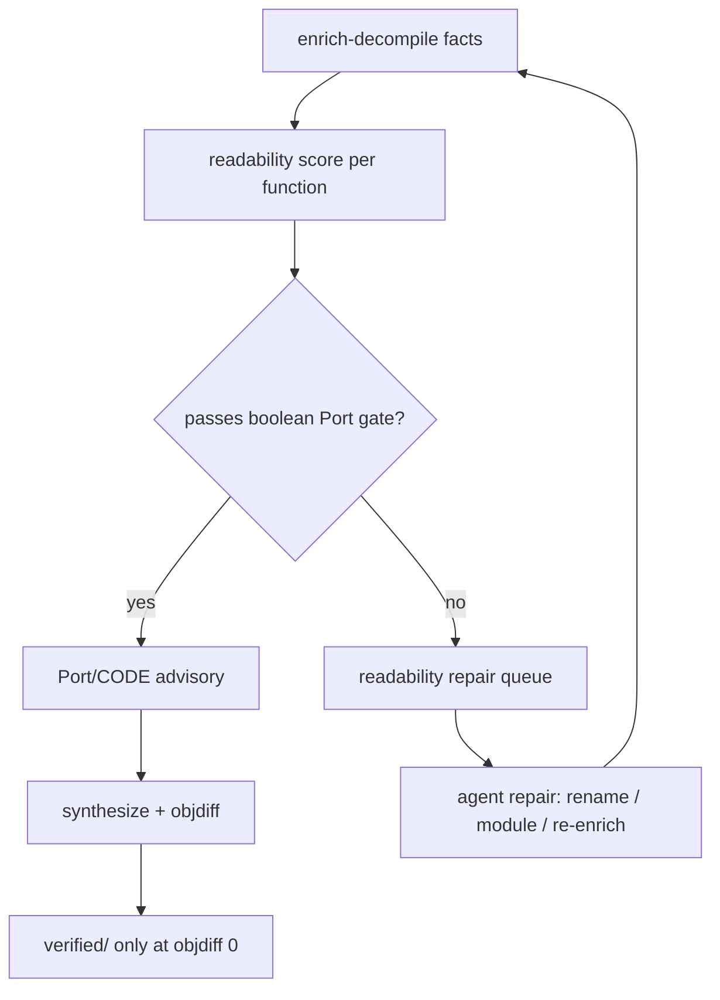

# Readability Score and Agent Repair Queue

## Summary

Add an advisory readability scoring layer and a ranked repair queue so agents and operators know which functions to improve next — without changing what counts as verified. The boolean Port gate stays; numeric scores and queue ordering drive bounded rename, re-enrich, and vacuum repair. Objdiff zero remains the only path into `verified/`.

---

## Problem Frame

Readable-recovery-quality shipped enrich-before-decompile, the boolean Port gate (named + evidence-backed module), and noise stripping. A numeric `readabilityScore` already lands on enrich facts but does not drive operator or agent behavior. Today, improving readability is manual: scan the dump manifest, pick `FUN_*` rows, and run MCP rename tools ad hoc.

Research consensus (QRS, D-SCORE, auto-re-agent): readability metrics must sit **below** compile and objdiff. Pretty advisory code earns zero credit toward proof. The product's honesty promise requires keeping that ordering explicit.

---

## Requirements

### Scoring and gates

- R1. Every function fact emitted by enrich carries a stable **readability score** in the closed interval 0–1, derived from evidence already on the fact (name quality, module resolution, provenance strength).
- R2. The **boolean Port gate** (`passes_readability_gate`: non-`FUN_` name plus non-fallback module with evidence-backed module provenance) remains the sole governor for `Port/CODE` inclusion in v1. Numeric score does not replace or weaken this gate.
- R3. Score computation is **advisory only**: it must not increment proof-ladder numerator, promote artifacts into `verified/`, or change claim-report objdiff counts.

### Repair queue

- R4. After enrich and dump, reconstruct writes a **readability repair queue** receipt listing functions that failed the Port gate, ranked by ascending score (worst first), with enough metadata for an agent to act (entry, current name, module, score, suggested repair class).
- R5. Repair classes are limited to v1-safe actions: **rename**, **module hint refresh**, **re-enrich/decompile** — all advisory. Compile/objdiff synthesis is out of queue scope unless the function already has a source task.
- R6. Queue entries carry `claimBoundary: readability-repair-advisory` and never imply objdiff verification.

### Operator and agent surfaces

- R7. Dump manifest and work-dir status expose score **distribution bands** (e.g. Port-ready count, repair-queue count, median score) alongside existing `namedCount`, `moduleResolvedCount`, and `readabilityExcludedFromPort`.
- R8. Critical-path nextActions include a **readability-repair** action when the queue is non-empty, with a command hint pointing at reconstruct resume or MCP repair — not a new peer CLI brand.
- R9. When `--autonomous` runs after core stages, vacuum seeding **prefers readability-repair queue order** over arbitrary source-task order, subject to existing autonomy budgets (`--autonomous-max-functions`, attempts, wall seconds).

### Honesty invariants

- R10. A function may appear in Port, advisory, and repair queue simultaneously only when roles differ (Port = passed gate; queue = failed gate pending repair). Verified shard presence always implies objdiff zero regardless of score.
- R11. High readability score alone never writes to `verified/` or changes proof-ladder rung.

---

## Acceptance Examples

- AE1. Covers R1, R2. **Given** a function named `LoadArea` with module `game/clientcore` and provenance `assert-string`, **when** scored, **then** score ≥ 0.8 and it passes the boolean Port gate.
- AE2. Covers R2, R4. **Given** a function `FUN_00401000` with fallback module, **when** the repair queue is built, **then** it appears near the top ranked by low score and is excluded from Port.
- AE3. Covers R3, R11. **Given** a function with score 1.0 but no objdiff accept, **when** proof ladder runs, **then** numerator is unchanged.
- AE4. Covers R9. **Given** `--autonomous --autonomous-max-functions 1` and a non-empty repair queue, **when** vacuum seeds, **then** the highest-priority repair-queue function is chosen before lower-priority source tasks.

---

## Success Criteria

- Operators and agents can open one receipt and know **which functions to fix first** for Port readability without reading all of `advisory/ghidra/`.
- Port gate behavior is unchanged from readable-recovery-quality — no regression in `readabilityExcludedFromPort` semantics.
- Proof ladder and `verified/` counts are unchanged by scoring or queue generation alone.
- After one bounded autonomous repair cycle on a queued function, re-enrich produces a measurably higher score or Port gate pass when evidence exists.

---

## Key Decisions

- KTD1. **Queue over threshold** — Rank sub-gate functions for repair instead of lowering the Port bar with a numeric cutoff. Rationale: preserves honesty; readability improves through iteration.
- KTD2. **Heuristic v1 score** — Extend the existing name/module/provenance heuristic before investing in multi-axis QRS sub-scores. Rationale: score already exists on facts; ship agent workflow first.
- KTD3. **Autonomous coupling** — Default vacuum seed prefers repair-queue order. Rationale: compounds enrich + autonomy without new CLI surface.
- KTD4. **Boolean gate frozen in v1** — Numeric score is explanatory and prioritization-only. Rationale: deferred explicitly from readable-recovery-quality; avoids promoting weakly-evidenced names into Port.

---

## Scope Boundaries

### Deferred for later

- Multi-axis QRS-style sub-scores (naming, CFG similarity, goto density, hex literals).
- Numeric Port threshold replacing the boolean gate.
- LLM-assisted rename as a default repair action.
- PDB/DWARF or cross-binary score inputs.
- Automatic MCP apply without conflict protocol (reuse existing rename/manage-* + resolve-modification-conflict when applying).

### Outside this product's identity

- Treating high readability score as matched or verified recovery.
- Proof-ladder marketing beyond 1% → 5% → 20% rungs.
- Peer CLI brands for repair (queue is reconstruct/status/autonomy metadata).

---

## Dependencies / Assumptions

- Enrich-before-decompile on default reconstruct is available (`enrich-decompile` stage, `readabilityScore` on facts).
- Boolean Port gate and dump noise strip from readable-recovery-quality remain in place.
- Vacuum/autonomy bridge via `scripts/decomp-cli.sh` and existing budget receipts continues to be the repair executor — this slice adds prioritization, not a new engine.
- Agents have MCP access to rename-function, manage-comments, and re-run reconstruct enrich when repairing.

---

## Outstanding Questions

- None blocking. Planning may choose exact queue receipt schema and score band labels as long as R1–R11 hold.
