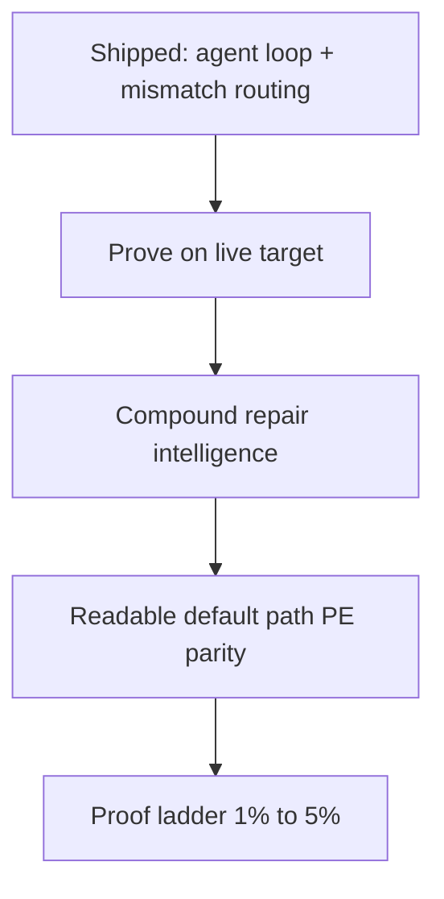
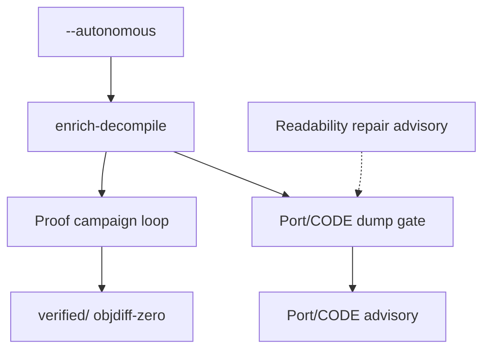

# Recovery Improvement Backlog

## Summary

AgentDecompile’s honest core (Ghidra ground truth → compile/objdiff → `verified/`) is in place; recent slices closed the autonomous agent loop and mismatch-class routing. The highest-leverage improvements now are **proving the loop on a real target**, **closing PE readability gaps**, and **compounding repair intelligence** (playbooks, checkpoints, pattern memory) — not more scalar near-miss retries.

---

## Problem Frame

STRATEGY metrics still point at gaps the latest code has not validated end-to-end:

| Metric | Gap today |
|--------|-----------|
| Verified function parity | Ladder numerator may be flat until live campaign converts near-misses |
| Agent loop completion | Executors exist; smoke on swkotor not recorded |
| Context merge yield | PE PDB provenance deferred; swkotor is PE |
| Readability | Default reconstruct path thinner than ELF one-shot; PE RTTI parity open |

Industry convergence (objdiff/permuter/MCP agents, DeGPT/DecLLM compile-diff loops, enrich-before-decompile, decomp-goal-harness verifier-gated campaigns) matches our architecture — but we are past “build the loop” and into “prove it moves the ladder” and “route repairs smarter than one permuter knob.”

**External alignment (2024–2026):** objdiff as compile-diff oracle; enrich-before-decompile context (Kong, ReCopilot, pyghidra-mcp); near-miss routing by mismatch class (decomp-goal-harness, meteor-decomp); PE PDB→module provenance chains (pdbwalker, rikune); explicit readability vs proof lanes (Decompile-Bench tri-axis); verifier-gated checkpoints (decomp-goal-harness, auto-re-agent parity gates).

---

## Recently Shipped (do not re-plan)

- Agent loop closure: readability MCP executor, near-miss repair, context apply, ELF DWARF provenance
- Mismatch-class routing: histogram parse, classifier, policy playbooks, queue metadata
- Proof campaign loop, proof-target queue, near-miss ranking

---

## Key Decisions (2026-07-25 update)

**Decouple proof campaigns from Port readability gate (Approach A).** Run3 swkotor smoke showed enrich succeeded (12,845 functions, 12,750 named) but proof never started: `readability-blocked` fired because 95 `FUN_*` repair-queue heads lacked synthesis tasks while 12,837/12,845 functions failed Port gate on fallback module `recovered/unmapped`. Port gate (`passes_readability_gate`) governs `Port/CODE` export only; objdiff proof uses `proof-target-queue` independently. Readability repair emits advisory receipts; it no longer hard-stops `run_proof_campaign_loop`.

---

## Improvement Themes (prioritized)

### T0. Proof-scale perf + MCP hygiene — **immediate, low effort**

**What:** Fix hot paths blocking live smoke: O(n²) proof-target queue build (`entry_has_source_task` per candidate), MCP tool-seq per-step parsing, Ghidra project reuse (enrich session vs fresh import).

**Run4 evidence:** Gate decoupling worked (advisory readability receipt at 06:06) but first campaign hung ~3min+ rebuilding queue — ~12,845 candidates × full `tasks.jsonl` scan per row.

**Success:** Proof-target queue rebuild <10s on swkotor work dir; MCP receipts reflect per-step success; smoke reaches vacuum bridge within minutes.

---

### T1. Live proof-scale validation — **highest leverage, medium effort**

**What:** Run documented swkotor smoke (`--autonomous`, multi-campaign) and record terminal, `numeratorDelta`, mismatch classes, blockers.

**Industry:** Mizuchi/decomp-goal-harness treat named campaign terminals as success signals, not only silent runs.

**Gap:** Unit tests pass; no receipt-backed proof the loop promotes functions on a real PE work dir.

**Success:** ≥1 objdiff-zero accept **or** named terminal with honest receipts; threshold tuning informed by real near-miss classes.

**Run3 evidence (2026-07-25):** Enrich complete (`facts/enrich-receipt.json`, 12,845 functions). Smoke still `readability-blocked` — root cause was gate coupling, not missing enrich. **Run4b in flight** after gate decoupling + queue-build perf fix.

**Deferred from:** `docs/plans/2026-07-25-proof-scale-live-validation.md` U6.

---

### T2. Mismatch playbook execution — **medium effort, compounds T1**

**What:** Mismatch routing today labels playbooks (`permuter-operand`, etc.) but uses one permuter path. Next: class-specific repair actions (declaration reorder, boundary repair executor, permuter profile flags) wired to `routedPlaybook`.

**Industry:** decomp-goal-harness / meteor-decomp symptom→fix tables; permuter as last-mile only when class says regalloc/branch.

**Gap:** Labels without differentiated behavior leave routing as telemetry only.

**Success:** Near-miss campaigns show class→action receipts; at least two classes trigger distinct repair paths.

---

### T3. PE symbol provenance (PDB) — **medium effort, swkotor-critical**

**What:** Ingest MSVC PDB function names keyed by address; feed enrich and module-map like ELF DWARF.

**Industry:** Standard RE practice; Kong/BTIGhidra show types/names before decompile dominate output quality.

**Gap:** Agent loop closure shipped ELF DWARF only; KOTOR targets are PE.

**Success:** `facts/symbol-provenance.json` with `source: pdb`; enrich consumes hints; Port gate scores improve on PDB-backed names.

---

### T4. Readable recovery default path — **medium–high, product-facing**

**What:** Default `agentdecompile-reconstruct` runs enrich-before-decompile, PE RTTI parity, module map, noise strip, readability gate — per `docs/brainstorms/2026-07-25-readable-recovery-quality-requirements.md`.

**Industry:** SK²Decompile skeleton-then-skin; Ghidra enrichment extensions.

**Gap:** Readable dump is ELF-heavy; operators opening `Port/CODE` still see thin output on default path.

**Success:** Named/module-resolved counts rise on default run; proof ladder unchanged.

---

### T5. Monotonic best-so-far checkpoints — **low effort**

**What:** Per-function campaign state: best diff, mismatch class, attempt id; policy never accepts regressions; operator sees “stuck at operand/3” not opaque retries.

**Industry:** decomp-goal checkpoint-on-improvement; melee-agent commit thresholds.

**Gap:** Attempt history exists but no first-class “best-so-far” surface for agents/operators.

---

### T6. Pattern memory keyed by mismatch signature — **medium, longer horizon**

**What:** After objdiff-zero, store (compiler, arch, mismatch class, fix shape); retrieve before LLM/permuter on similar diffs.

**Industry:** decomp-mcp-server pattern DB; compounding community knowledge.

**Gap:** Same MSVC regalloc tricks rediscovered per function.

**Defer until:** T1–T2 produce enough classified near-miss data.

---

### T7. Tiered proof ladder (syntax → compile → execute → objdiff) — **medium–high**

**What:** Route failures to compile-fix before objdiff; optional execution oracle for semantic recovery (not byte-match claims).

**Industry:** Agent4Decompile / DecLLM L1–L3 gates.

**Gap:** Jumping to objdiff on uncompilable candidates wastes budget.

**Defer until:** Playbooks and live smoke characterize dominant failure modes.

---

### T8. Dual-agent generator/checker — **medium, optional**

**What:** Separate MCP roles: editor proposes, checker only sees verifier/diff output.

**Industry:** DeGPT operator/referee; auto-re-agent reverser/checker.

**Gap:** Single agent conflates edit and judge.

**Defer:** Policy/playbook routing may absorb much of the value cheaper.

---

## Recommended Sequencing

1. **T0** — queue-build perf (shipped), MCP step parsing + Ghidra session reuse (next).
2. **T1 re-smoke (run4b)** — validate `campaignCount > 0` on swkotor.
3. **T3 + T4 in parallel** — PE module-map/PDB for Port quality.
4. **T2** — when smoke shows classified near-misses.
5. **T5** — cheap polish anytime.
6. **T6–T8** — after ladder moves.

---

## Scope Boundaries

### In scope for this backlog

Prioritization and sequencing of recovery/autonomous/proof/readability tracks above.

### Deferred for later

- LLM-default naming skin
- SAILR / advanced CFG structuring
- Cross-binary name propagation
- Whole-binary semantic parity marketing claims

### Outside product identity

- Promoting non-zero diff or readable-only output to `verified/`
- Second product brands or Mizuchi parallel surfaces

---

## Success Criteria (backlog level)

- A prioritized track is chosen with clear acceptance criteria before `ce-plan`.
- Chosen track advances at least one STRATEGY metric without weakening honesty gates.
- Deferred tracks stay explicit — no silent scope creep into the chosen slice.

---

## Outstanding Questions

- OQ1. Primary target binary for proof smoke: existing swkotor work dir vs fresh reconstruct? **Resolved:** reuse `target/agentdecompile-reconstruct/swkotor-parity`.
- OQ2. PE readability vs repair intelligence priority? **Resolved (run3):** Both — proof decoupled from Port gate; T3/T4 module-map is parallel track, not campaign prerequisite.

## Selected Next Track (2026-07-25)

**T0 + T1 re-smoke (run4b).** Gate decoupling shipped; queue-build O(n²) fix shipped. **Acceptance:** `campaignCount > 0`, terminal ≠ stale `readability-blocked`. Log: `target/agentdecompile-reconstruct/swkotor-parity/state/smoke-run4b.log`.
