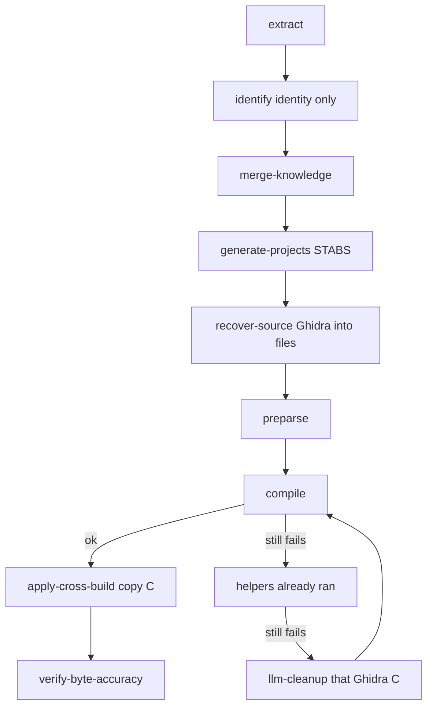

# docs/corpus

This folder is the written form of the corpus pipeline. The code lives in
`src/agentdecompile_recovery/corpus/`.

| Stage | What it does | What it does not do |
|---|---|---|
| extract | Read functions already pulled from each binary | Invent names |
| identify | Bind the same function across builds with scores | Copy C |
| merge-knowledge | Apply name, type, and STABS precedence | Claim a match |
| generate-projects | Make folders from the donor's debug paths | Decompile |
| recover-source | Write Ghidra C into those files; reject shims | Preparse or copy C |
| preparse | Flatten Ghidra trash (thiscall, templates, CONCAT) | Call an LLM |
| compile | Compile units and link one complete executable | Prove bytes |
| apply-cross-build | Place compiling C onto bound functions | Place failing C |
| llm-cleanup | Edit leftover Ghidra C with `claude -p` (needs `--llm`) | Rewrite from scratch |
| verify-byte-accuracy | Compare output to the shipped binary | Confuse compile with match |

Parent document: [CORPUS_PIPELINE.md](../CORPUS_PIPELINE.md).
