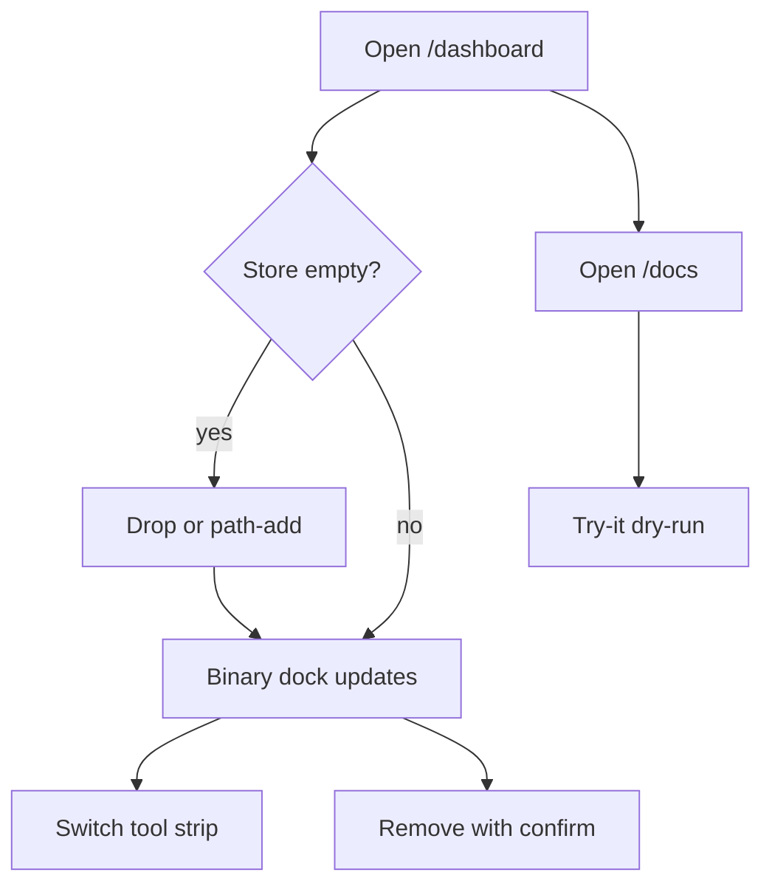

# Dogfood Report — feat/corpus-kotorxid-library

> Diff-scoped browser QA of `feat/corpus-kotorxid-library` vs the trunk. Generated by `ce-dogfood` on 2026-08-31.

## Diff Summary

- One AgentDecompile workbench is now the default `/dashboard` on the MCP HTTP app (8080), with a Ghidra-style tool strip, binary dock, windowed functions, and inspector.
- Public corpus / recover / reconstruct / Click `cli.*` / advertised MCP verbs are typed `/docs` operations that share the job runner.
- Operators can path-register, copy-in upload, confirm-remove, and edit role/label on binaries.
- Dual bars are decomp (none/asm/C) and validate (none/obj/linked). Leftover :5173 is unused.

## Personas

Source: STRATEGY.md "Who it's for".

- **Operator** — needs one 8080 surface to add binaries, run public tools, and read honest decomp/validate state.
- **Agent client** — same catalog via `/docs` and `/mcp`; never invents argv.

## Flows Tested

## Test Matrix & Results

| # | Flow | Journey / Scenario | Status | Issue | Fix | Commit |
|---|------|--------------------|--------|-------|-----|--------|
| 1 | Open | `/dashboard` shows AgentDecompile, tool strip, dropzone, no tablist, no Mizuchi | Pass | - | - | f0c11db |
| 2 | Empty | Empty dock, no kotorxid/product-path strings | Pass | - | - | f0c11db |
| 3 | Ingest | Path-register a tiny PE; it appears in the dock (`demo.exe` / `keep.exe`) | Pass | - | - | f0c11db |
| 4 | Swagger | `/docs` lists corpus/cli/mcp ops; `POST /api/v1/actions/corpus/stages` dry-run returns argv | Pass | - | - | f0c11db |
| 5 | Strip | MCP groups render corpus/recover/reconstruct/cli/mcp-* in the stage | Pass | First MCP click via stale ref missed; eval click worked | - | f0c11db |
| 6 | Remove | Confirm-remove deletes; without confirm the API refuses | Pass | - | - | f0c11db |
| 7 | Catalog load | `/dashboard/api/actions` must be JSON | Fixed | Click `Path` defaults 500'd the dock catalog | Stringify non-JSON field defaults | e330333 |

## What Was Fixed

### Click path defaults 500 the action catalog — `e330333`
- **Symptom:** Opening `/dashboard` logged `GET /dashboard/api/actions?page=home` 500; Jobs dock could not load actions.
- **Root cause:** Click `Path` field defaults stayed as `PosixPath` in `FieldSpec.to_dict()`.
- **Fix:** `src/agentdecompile_recovery/corpus/dashboard/actions/catalog.py` stringifies non-JSON defaults.
- **Regression test:** `tests/test_dashboard_openapi_catalog.py::test_legacy_actions_api_serializes_click_defaults`

## Paper Cuts (by persona)

- **Operator** — The path/slug/role form is tall, so a registered binary can sit below the fold in the dock. Severity: medium. Deferred (layout, not a contract miss).
- **Operator** — `/favicon.ico` 404 on 8080. Severity: low. Deferred.
- **Agent client** — This dogfood host is the pages/Swagger mount only; `GET /mcp` is 404 until `agentdecompile-server` is the process on 8080. Severity: informational. Expected for this launch.

## Console Errors

- Before `e330333`: `/dashboard/api/actions` 500 (`PosixPath` not JSON serializable). Resolved.
- After the fix: `/dashboard/api/actions` 200. `/favicon.ico` 404 remains.

## Human Verifications

Not applicable (no OAuth/email/payments). Drag/drop of a real desktop file was not driven (agent-browser upload was not required; path-register and multipart API were).

## Decisions for a Human

None. The pages-only 8080 host is enough to dogfood the workbench; a full `agentdecompile-server` process is the production way to get `/mcp` on the same port.

## Learnings

- Generated Click catalogs must JSON-sanitize defaults before any browser catalog endpoint returns them.
- Do not treat leftover :5173 as the Atlas; 8080 `/atlas` and Swagger `/docs` are the product links.

## Final Status

Workbench AIO on 8080 is ready for operator use of the page, binary manage, and Swagger catalog. Automated contract suite is green (`tests/test_workbench_binaries.py`, `tests/test_dashboard_openapi_catalog.py`, plus the plan's dashboard/unified/link-stamp tests). Server left running at `http://127.0.0.1:8080/dashboard`. Leftover Atlas on :5173 was not touched. Code review for a PR was not run in this pass.
