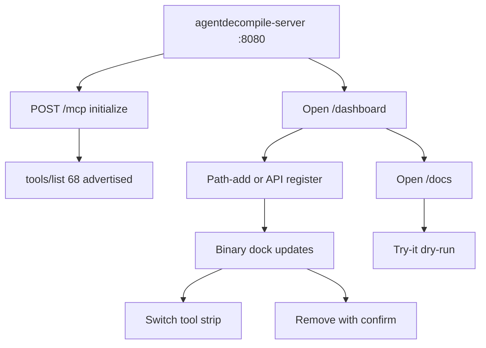

# Dogfood Report — feat/corpus-kotorxid-library

> Diff-scoped browser QA of `feat/corpus-kotorxid-library` vs the trunk. Generated by `ce-dogfood` on 2026-08-31. Second pass used the production host: `agentdecompile-server` on `127.0.0.1:8080`.

## Diff Summary

- One AgentDecompile workbench is now the default `/dashboard` on the MCP HTTP app (8080), with a Ghidra-style tool strip, binary dock, windowed functions, and inspector.
- Public corpus / recover / reconstruct / Click `cli.*` / advertised MCP verbs are typed `/docs` operations that share the job runner.
- Operators can path-register, copy-in upload, confirm-remove, and edit role/label on binaries.
- Dual bars are decomp (none/asm/C) and validate (none/obj/linked). Leftover :5173 is unused.
- This pass served the full `agentdecompile-server` process (streamable HTTP, `--no-require-auth`). `/mcp` initialize, `tools/list` (68 advertised), and `tools/call` work on the same port as `/dashboard` and `/docs`.

## Personas

Source: STRATEGY.md "Who it's for".

- **Operator** — needs one 8080 surface to add binaries, run public tools, and read honest decomp/validate state.
- **Agent client** — same catalog via `/docs` and `/mcp`; never invents argv.

## Flows Tested



## Host

```
uv run agentdecompile-server -t streamable-http -o 127.0.0.1 -p 8080 \
  --project-path /tmp/agentdecompile-projects-dogfood \
  --no-require-auth --no-wait-for-analysis
```

Env: `GHIDRA_INSTALL_DIR` → local Ghidra 12.1; `AGENT_DECOMPILE_CORPUS_WORK_DIR` / `AGENT_DECOMPILE_CORPUS_DB` → `/tmp/ad-workbench-dogfood`. No shared Ghidra-server creds. Process listened on `127.0.0.1:8080` (`agentdecompile-` pid 3553098). Scratch screenshots: `/tmp/ce-dogfood-OrFH55/`.

## Test Matrix & Results

| # | Flow | Journey / Scenario | Status | Issue | Fix | Commit |
|---|------|--------------------|--------|-------|-----|--------|
| 1 | Open | `/dashboard` shows AgentDecompile, tool strip, dropzone, no tablist, no Mizuchi | Pass | - | - | f0c11db |
| 2 | Empty | Empty dock, no kotorxid/product-path strings | Pass | Store still held `keep.exe` from the first pass; no product-path strings | - | f0c11db |
| 3 | Ingest | Path-register a tiny PE; it appears in the dock (`demo.exe` / `keep.exe` / `two.exe`) | Pass | agent-browser click on Register did not fire form submit; JSON POST + refresh listed `two.exe` | - | f0c11db |
| 4 | Swagger | `/docs` lists corpus/cli/mcp ops; `POST /api/v1/actions/corpus/stages` dry-run returns argv | Pass | OpenAPI 212 paths including `/mcp`, `cli.tool`, workbench binaries | - | f0c11db |
| 5 | Strip | MCP groups render corpus/recover/reconstruct/cli/mcp-* in the stage | Pass | `document.querySelector('[data-tool=mcp]').click()` | - | f0c11db |
| 6 | Remove | Confirm-remove deletes; without confirm the API refuses | Pass | `confirm:false` → 400-style error; `confirm:true` removed `two.exe` | - | f0c11db |
| 7 | Catalog load | `/dashboard/api/actions` must be JSON | Fixed | Click `Path` defaults 500'd the dock catalog | Stringify non-JSON field defaults | e330333 |
| 8 | MCP HTTP | `POST /mcp` initialize + `tools/list` + `tools/call` on the same 8080 process | Pass | First dogfood used a pages-only uvicorn (`GET /mcp` 404). This pass: 68 advertised tools, no GUI-only names; `get-current-program` returned empty session; CLI `--list-tools` against `http://127.0.0.1:8080/mcp` | Serve `agentdecompile-server` | — |

## What Was Fixed

### Click path defaults 500 the action catalog — `e330333`
- **Symptom:** Opening `/dashboard` logged `GET /dashboard/api/actions?page=home` 500; Jobs dock could not load actions.
- **Root cause:** Click `Path` field defaults stayed as `PosixPath` in `FieldSpec.to_dict()`.
- **Fix:** `src/agentdecompile_recovery/corpus/dashboard/actions/catalog.py` stringifies non-JSON defaults.
- **Regression test:** `tests/test_dashboard_openapi_catalog.py::test_legacy_actions_api_serializes_click_defaults`
- **Re-check this pass:** `/dashboard/api/actions?page=home` 200 on `agentdecompile-server`.

### Pages-only 8080 host hid `/mcp` — resolved by process choice
- **Symptom:** First dogfood launched a thin uvicorn that mounted pages/Swagger only; `GET /mcp` 404.
- **Fix:** Stop that host. Bind `agentdecompile-server` to 8080. `GET /mcp` without Accept is 406 (expected). `POST /mcp` initialize returns AgentDecompile 1.1.0.

## Paper Cuts (by persona)

- **Operator** — The path/slug/role form is tall, so a registered binary can sit below the fold in the dock. Severity: medium. Deferred (layout, not a contract miss).
- **Operator** — `/favicon.ico` 404 on 8080. Severity: low. Deferred.
- **Operator** — agent-browser click on "Register path" did not submit `#wb-bin-form` (fill landed; dock did not grow until JSON POST). Severity: low. The API and prior path-register pass work; treat as driver/submit, not a contract miss.
- **Agent client** — `status` requires `workDir`; empty-session `get-current-program` is honest (`loaded: false`). GUI-only `get-current-address` is not in `tools/list`; calling it by name returns disabled. Severity: informational.

## Console Errors

- Before `e330333`: `/dashboard/api/actions` 500 (`PosixPath` not JSON serializable). Resolved.
- After the fix / this host: `/dashboard/api/actions` 200. `/favicon.ico` 404 remains. `GET /mcp` 406 without Accept is expected for streamable HTTP.

## Human Verifications

Not applicable (no OAuth/email/payments). Drag/drop of a real desktop file was not driven (agent-browser upload was not required; path-register and JSON POST were).

## Decisions for a Human

None. Production dogfood is `agentdecompile-server` on 8080, not a pages-only uvicorn.

## Learnings

- Generated Click catalogs must JSON-sanitize defaults before any browser catalog endpoint returns them.
- Do not treat leftover :5173 as the Atlas; 8080 `/atlas` and Swagger `/docs` are the product links.
- Do not dogfood the workbench on a pages-only ASGI factory when the contract includes `/mcp`.

## Final Status

Workbench AIO on **`agentdecompile-server` 127.0.0.1:8080** is ready for operator use of the page, binary manage, Swagger catalog, and advertised MCP (`/mcp/message`). 68 tools listed; CLI `--mcp-server-url http://127.0.0.1:8080/mcp tool --list-tools` talks to the same process. Automated contract suite remains green from the earlier pass. Leftover Atlas on :5173 was not touched. Code review for a PR was not run in this pass.
