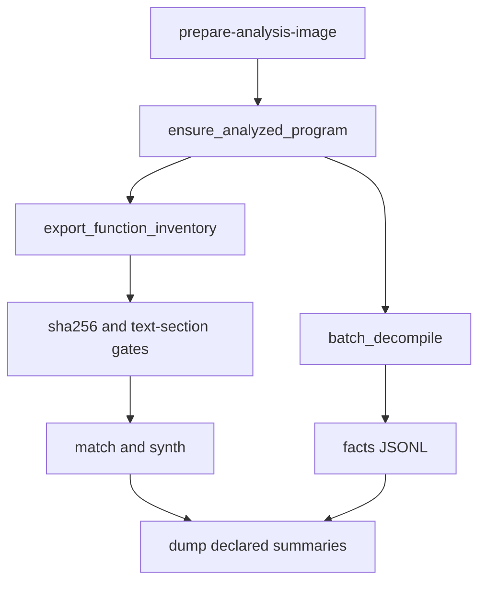

# One-shot recovery performance and proof gate fixes

## Summary

After dump batching and embedded `sourceText`, the remaining work is: tighten objdiff verification, run one shared Ghidra analysis for inventory + decompile, raise decompile thread counts, and stop fresh runs from silently eating leftover JSONL — without skipping inventoried functions.

## Background

Cold swkotor-class recovery still pays for two full Ghidra analyses, under-threaded batch decompile, undeclared dump inputs, and a verifier that can treat empty or fallback objdiff output as proof. Source-producing runs must write their own receipts ([STRATEGY.md](../../STRATEGY.md), [AGENTS.md](../../AGENTS.md)).

## Requirements

1. Verified promotion requires parsed objdiff `differences==0`; empty stdout and objdump fallback never enter `verified/`.
2. One durable analyzed Ghidra project per analysis-image SHA; inventory and decompile reuse it (`-noanalysis` / `force_analysis=False`).
3. Batch decompile thread count is configurable; default above 2 on multi-core hosts.
4. Fresh reconstruct path produces facts + match receipts with `sourceText` in the same run that dumps.
5. Fresh dump mode takes only declared receipt/facts paths.
6. Match cache keys include analysis-image digest; cache hits re-embed `sourceText` when missing.
7. No stage skips inventory coverage gates or drops functions for speed.

## Decisions

| Topic | Choice | Why |
|-------|--------|-----|
| Shared analysis | ghidrecomp-style durable `project_path` + content-addressed name | Skips re-analysis when already marked analyzed |
| Inventory | `analyzeHeadless -process -noanalysis` + existing Java exporter | Keep exporter; drop `-deleteProject` on shared path |
| Decompile | `mcp_utils.batch_decompile` from recovery | One Tier-1 path; tune `thread_count` there |
| Fresh vs resume | Explicit fresh mode; resume stays operator-only | Idempotency without removing incremental flags |
| Proof gate | Fix code, not docs only | [2026-07-24 verifier finding](../doc-review-findings/2026-07-24-critical-path-verifier-honesty.md) |

## Design

## Work units

### U1. Fail-closed proof gate

**Files:** `source_parity_synthesize.py`, `match_cache.py`, `source_dump.py`, `tests/test_verifier_honesty.py`, `tests/test_match_cache_and_dump.py`

Empty objdiff fails; `fallback` excluded from `is_proven_zero`; widen emitter markers; unlink object before compile success.

**Tests:** empty objdiff not proven; fallback not exportable; `_asm` rejected; stale object forces rebuild.

### U2. Shared Ghidra analysis

**Files:** `ghidra_analysis.py` (new), `source_parity_one_shot.py`, `ghidra_context.py`, tests

`ensure_analyzed_program` writes receipt with `analysisBinarySha256`, `projectPath`, `projectName`. Inventory uses `-process -noanalysis`.

**Tests:** same sha skips re-import; sha mismatch re-analyzes; empty `.text` still fails gate.

### U3. Decompile threads + facts wire-up

**Files:** `batch_decompile.py`, `batch_analysis.py`, `tests/test_run_batch_decompile.py`, `frontdoor.py`

`thread_count` default `min(cpu, 16)`; `force_analysis=False` when receipt present; facts JSONL under work-dir for dump.

### U4. Fresh dump and cache integrity

**Files:** `frontdoor.py`, `match_cache.py`, match scripts, `source_parity_synthesize.py`, `docs/CRITICAL_PATH.md`

Fresh mode requires explicit summaries/facts; cache key adds analysis digest; cache hit calls `record_with_source_text`.

### U5. Dump layers and timings

**Files:** `source_dump.py`, frontdoor CLI, stage-timings aggregation

`--dump-layers verified,port,advisory`; one-shot default `verified,port`; write `stage-timings.json` for ensure/inv/decomp/match/dump.

## Scope

**In:** G1–G16 from living plan except treating full unmatched synth as one PR (G15 is ongoing).

**Later:** Single in-process PyGhidra (analyze+inventory+decomp in one JVM) after U2–U3 receipts land.

**Out:** ≥90% whole-binary claims; Mizuchi recovery; skipping inventory for speed.

## Risks

- Two JVMs opening the same `.gpr` — sequence ensure → inv → decomp.
- Wine parallel false mismatches — `--workers 1` retry; do not loosen proof gate.
- Slow USB work-dir — document local SSD for `--work-dir`.

## Acceptance

Living plan "Done when" checklist satisfied; update living plan progress section as each unit lands.
