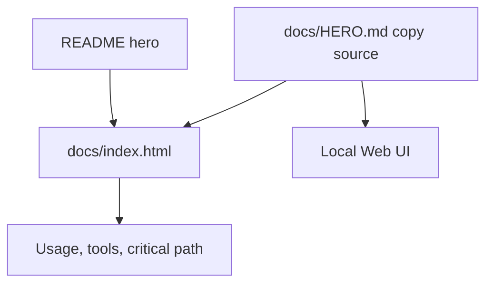

# Plain-language docs landing page

## Objective

- Preserve the useful landing-page work from the earlier uncommitted docs dump.
- Reject the unsafe repository-wide rewrite that damaged commands and inline paths.
- Give README, GitHub Pages, and the local Web UI one consistent plain-language introduction.
- Point public links at the canonical `bodecloud/AgentDecompile` repository.

## Scope

Create the static landing page and stylesheet, add the shared hero-copy document,
refresh the README introduction, and tighten the local Web UI hero/docs hub.

The mass output from `scripts/plain_language_docs.py` is explicitly excluded:
its substitutions changed valid inline paths and commands such as `pip install -e .`.

## Verification

- All landing-page and Web UI repository links target `bodecloud/AgentDecompile`.
- README, landing page, and Web UI use consistent plain-language positioning.
- Existing detailed operational documentation remains unchanged.
- No local test suite is run for this documentation/UI-copy slice, per operator instruction.
