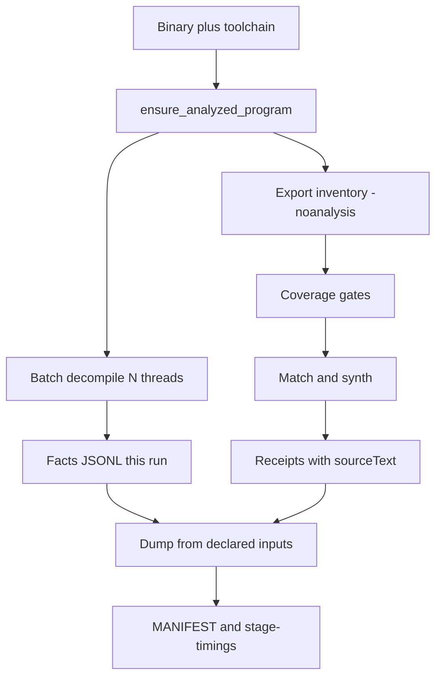

# Living plan: one-shot recovery performance

**Status:** completed  
**Created:** 2026-07-24  
**Last updated:** 2026-07-24  
**Code:** `src/agentdecompile_recovery/`, `src/agentdecompile_cli/mcp_utils/batch_decompile.py`, `scripts/swkotor-match-*.py`  
**Implementation plan:** [2026-07-24-001-feat-idempotent-oneshot-perf-plan.md](2026-07-24-001-feat-idempotent-oneshot-perf-plan.md)

## Goal

One `agentdecompile-reconstruct` run should go from binary → single Ghidra analysis → inventory + batch decompile → match/synth → Borealis dump, using only this run's receipts. It should cover all inventoried functions (no skip-stage fastpath) and run much faster than today's ~20+ minute pre-synth wall. Verified still means objdiff zero — no shortcuts on the proof gate.

## Strategy links

See [STRATEGY.md](../../STRATEGY.md): matching recovery, export claim boundaries, and the one-shot performance track. We are not claiming 90% whole-binary parity, not promoting byte emitters, and not counting leftover artifacts as fresh output.

## Baseline (2026-07-24, reference host)

| Stage | ~Wall | Notes |
|-------|------:|-------|
| Inventory autoanalysis | 185s | Decompiler Switch ~89–102s |
| ghidrecomp 2nd analysis | 205s | Same binary — redundant |
| Decompile 8621 fn | 342s @ 4 threads | `batch_decompile.py` defaults to 2 threads |
| Trivial+reloc match (cached) | 30–33s each | Shared WINEPREFIX under parallel load |
| Dump (pre-batching) | 426s | clang-format ×8k, slow disk |
| Dump (after batching) | tens–low hundreds s | Still dual advisory+Port; path-only rows without `sourceText` |
| Exhaustive MSVC synth | hours | Real coverage, not optional |

## Rules

1. **This run's artifacts.** Inventory, facts, match rows (`sourceText` at accept), and dump come from the current execution. `--resume`, cache, and `--dump-source-only` are operator tools ([AGENTS.md](../../AGENTS.md), [CRITICAL_PATH.md](../CRITICAL_PATH.md)).
2. **No coverage skip.** Shared analysis must not drop functions or bypass inventory gates for speed.
3. **Verified = objdiff zero.** Empty objdiff stdout and objdump fallback must not promote ([verifier honesty note](../doc-review-findings/2026-07-24-critical-path-verifier-honesty.md)).
4. **Declared dump inputs.** Fresh mode must not silently load undeclared sibling JSONL.

## Progress

**Done**

- Batched in-memory dump (`PendingWrites`), format-once-per-file, cached `clang-format` path
- Match writers embed `sourceText`; dump prefers embedded text + sha check
- Idempotency policy documented in AGENTS, `.cursorrules`, CRITICAL_PATH, STRATEGY
- **U1** Fail-closed proof gate: empty/unparseable objdiff, fallback rejected by `is_proven_zero`, emitter denylist, stale-object unlink, ladder denominator = function-candidates only; shell `verify-objdiff.sh` fail-closed
- **U2** Shared Ghidra analysis: `ensure_analyzed_program` + inventory `-process -noanalysis` (no `-deleteProject` on shared path)
- **U3** `thread_count` default `min(cpu,16)`; CLI `--decompile-threads`; `batch-decompile` stage writes facts JSONL with `force_analysis=False`
- **U4** Fresh dump refuses undeclared siblings and unmarked/mismatched digests; match-cache keys include analysis-image digest; synthesize/match pass `--target-sha`
- **U5** `--dump-layers` (default `verified,port`); shared `stage-timings.json` including `dump-source`

**Delta update (2026-07-24)**

| Unit | Result |
|------|--------|
| U1–U5 | Landed on `feat/idempotent-oneshot-perf` |
| Post-review | Shell objdiff fail-closed; synthesize target-sha; dump digest gate; dump timings |
| Remaining scale | ~~G14 per-worker Wine prefixes~~ done; ~~G15 synth wall~~ done; G16 SSD work-dir guidance now has an automated warning (see below) |

**Update (2026-07-30):** G14 and G15 are done — `5000b14` (2026-07-25) shipped U4 (compile/objdiff cache, G15) and U5 (per-worker Wine prefix, G14); `c1bb46b` (2026-07-29) closed a residual G14 gap by threading `--vc-root`/`--source-synthesis-wineprefix` all the way through the autonomous vacuum loop's per-function compile subprocess (previously silently falling back to a shared/wrong `WINEPREFIX`). G16 now has a real code fix: `work_dir_diagnostics.rotational_disk_warning()` (`src/agentdecompile_recovery/work_dir_diagnostics.py`) prints an advisory warning when `--autonomous`'s work dir resolves to a rotational disk, wired into `frontdoor.py`. All three "remaining scale" items are closed; only the "Done when" wall-time measurement below is still open.

**Next** (backlog only — outside U1–U5)

1. ~~Optional per-worker Wine prefixes (G14)~~ — done, see above.
2. ~~Synth wall-time / compile cache (G15) without skipping inventory~~ — done, see above.

## Backlog

### P0 — Proof gate

| ID | Issue | Files |
|----|-------|-------|
| G1 | Empty objdiff stdout counted as zero diff | ~~fixed~~ |
| G2 | objdump fallback in `is_proven_zero` | ~~fixed~~ |
| G3 | Compile ok when stale object exists | ~~fixed~~ |
| G4 | Byte-emitter denylist gaps (`_asm`, MASM db/dw) | ~~fixed~~ |

### P1 — One analysis + faster decompile

| ID | Issue | Files |
|----|-------|-------|
| G5–G8 | Dual analysis / under-threaded decompile | ~~fixed in U2–U3~~ |

### P2 — Idempotent dump / cache

| ID | Issue | Files |
|----|-------|-------|
| G9 | Silent sibling JSONL auto-load | ~~fixed~~ |
| G10 | Cache key missing analysis-image digest | ~~fixed~~ |
| G11 | Cache hit emits path-only rows | ~~fixed~~ |
| G12 | Ladder denominator can shrink | ~~fixed~~ |

### P3 — Throughput (still full coverage)

| ID | Issue | Files |
|----|-------|-------|
| G13 | Always dual advisory + Port write | ~~`--dump-layers`~~ |
| G14 | Shared WINEPREFIX false mismatches | ~~per-worker prefixes (`5000b14` U5, `c1bb46b`)~~ fixed |
| G15 | Exhaustive synth wall time | ~~compile cache (`5000b14` U4)~~ fixed |
| G16 | USB work-dir I/O | ~~automated warning (`work_dir_diagnostics.py`)~~ fixed 2026-07-30; operator still chooses where to point `--work-dir` |

## Done when

- [x] One analysis receipt; inventory + decompile reuse it (`stage-timings` shows single analyze wall)
- [x] Decompile threads configurable; default > 2 on multi-core hosts
- [x] Fresh dump rejects undeclared leftover JSONL; receipts include `sourceText`
- [x] `is_proven_zero` fail-closed; tests for G1–G4
- [x] CRITICAL_PATH separates fresh runs from operator resume/dump-only
- [ ] Pre-synth wall down without dropping inventoried functions (measure on cold host after U2–U3; the compile-cache mechanism (G15) landed in `5000b14` — this item is now the cold-host wall-time *measurement*, not the fix)

## Related plans

[2026-07-13-feat-unified-source-parity-recovery.md](2026-07-13-feat-unified-source-parity-recovery.md) — product fold-in history. **This file** tracked U1–U5 perf/idempotency (now completed). Embed `sourceText` and dump batch I/O are landed here.
