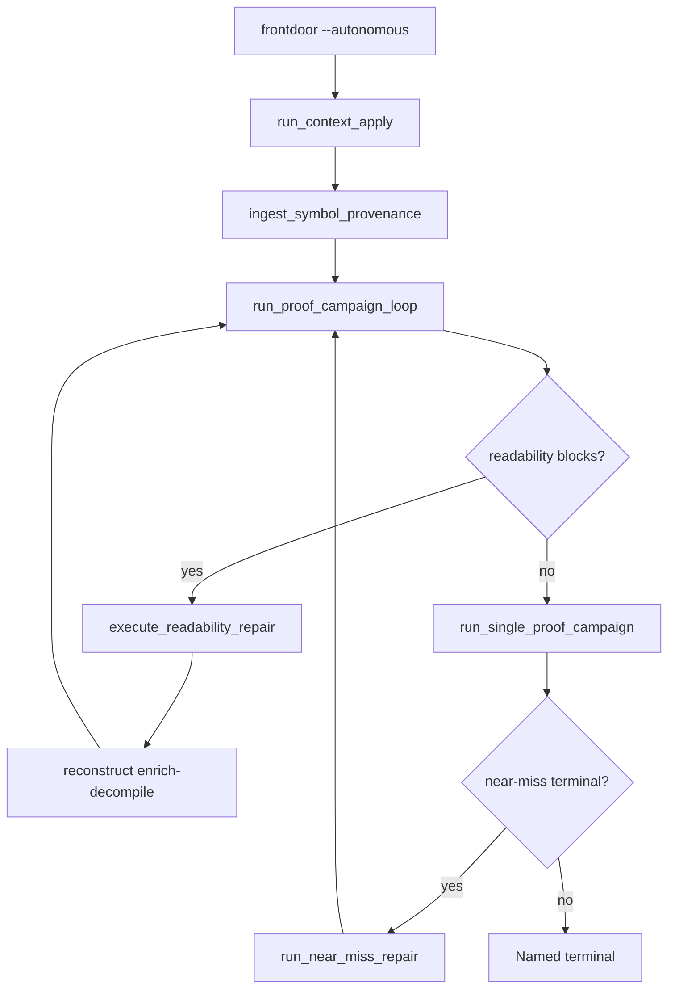

# Agent Loop Closure Plan

## Summary

Close four manual gaps in bounded `--autonomous` recovery by shipping advisory **executors** that run MCP `tool-seq`, near-miss permuter retries, context label apply, and ELF DWARF symbol provenance — each ending in a named receipt under `state/`. Only objdiff-zero under `verified/` moves the proof ladder. Closes STRATEGY **Agent loop completion** and **context merge yield** without weakening honesty gates.

## Problem Frame

Proof campaign loop, near-miss queue ranking, readability repair hints, and context propose receipts already exist — but operators still copy `toolSeq`, re-shell after near-misses, hand-apply `propose-labels.json`, and ignore debug symbols. Origin: `docs/brainstorms/2026-07-25-agent-loop-closure-requirements.md`.

## Requirements Traceability

| ID | Requirement | Plan coverage |
|----|-------------|---------------|
| R1–R3 | Shared autonomy contract (receipts, budgets, conflict safety) | U0, U5, U7 |
| R4–R6 | Readability MCP executor + enrich refresh | U1 |
| R7–R9 | Near-miss repair lane | U2 |
| R10–R12 | Context apply executor | U3 |
| R13–R15 | Symbol provenance PDB/DWARF | U4 |
| AE1–AE4 | Acceptance examples | U1–U4 test scenarios |

## Key Technical Decisions

- KTD1. **Shared `mcp_tool_seq` module** — Extract subprocess `agentdecompile-cli tool-seq` execution from `ghidra_advisory.py` into `src/agentdecompile_recovery/mcp_tool_seq.py` with injectable backend for tests. Rationale: Phases A and C share conflict parsing and receipt fields; avoids duplication (see origin KTD2).
- KTD2. **Implementation sequence A → B → C → D** — Land units in readability → near-miss → context apply → symbol provenance order per origin KTD1; each unit is independently testable before orchestration wiring.
- KTD3. **Runtime orchestration split** — `frontdoor.py` runs context apply (U3) and symbol provenance ingest (U4) once before `run_proof_campaign_loop` when `--autonomous` and MCP available; `proof_campaign.py` runs readability executor (U1) at loop entry and near-miss repair (U2) between campaign iterations. Resolves origin diagram vs KTD1 tension: naming order (context → symbol → enrich) at frontdoor; repair loops inside campaign driver.
- KTD4. **Near-miss repair between campaign iterations** — When loop iteration ends `near-miss` with `bestDifference ≤ 8`, run `run_near_miss_repair()` before next iteration (not mid-vacuum). Rationale: keeps vacuum bridge semantics unchanged; repair pass is a bounded sub-stage with its own receipt.
- KTD5. **Wire `sourceShapeSearch=True` for permuter** — Map `autonomous_policy` action `try-nearby-source-shape-or-permuter` to `SourcePluginRunConfig.source_shape_search=True` in `vacuum_runner.py` / `plugin_pipeline.py` when near-miss repair seeds targets. Rationale: policy exists but vacuum never enables permuter today.
- KTD6. **Enrich refresh via reconstruct resume** — After successful readability rename, subprocess `agentdecompile-reconstruct … --resume --stop-after enrich-decompile` (same operator hint as today). Rationale: origin R5; targeted PyGhidra session deferred to follow-up.
- KTD7. **Symbol provenance v1: ELF DWARF only** — PE PDB via external `llvm-pdbutil` subprocess is follow-up; v1 ships ELF `.debug_info` function names keyed by address. Rationale: origin deferred PDB reader choice; `elftools` already in tree via `eh_frame_inventory.py`.
- KTD8. **Conflict default: skip** — Context apply and readability executor call `resolve-modification-conflict` with `resolution=skip` on conflict unless `AGENTDECOMPILE_AUTO_CONFLICT_OVERWRITE=1`. Rationale: origin R3/R11; matches modification-conflict product semantics.

## High-Level Technical Design

**Executor receipt map**

| Phase | Receipt path | Schema |
|-------|--------------|--------|
| MCP debug | `state/mcp-tool-seq-last.json` | last CLI invocation |
| Readability | `state/readability-repair-run.json` | extended `agentdecompile.readability-repair-run.v1` |
| Near-miss | `state/near-miss-repair-run.json` | `agentdecompile.near-miss-repair-run.v1` |
| Context apply | `state/context-apply-run.json` | `agentdecompile.context-apply-run.v1` |
| Symbol provenance | `facts/symbol-provenance.json` | `agentdecompile.symbol-provenance.v1` |

---

## Implementation Units

### U0. Shared MCP tool-seq executor

**Goal:** One subprocess bridge for recovery-side MCP mutations with testable interface.

**Requirements:** R1, R3

**Dependencies:** None

**Files:**
- Create: `src/agentdecompile_recovery/mcp_tool_seq.py`
- Modify: `src/agentdecompile_recovery/ghidra_advisory.py` (delegate to shared module)
- Test: `tests/test_mcp_tool_seq.py`

**Approach:** `run_tool_seq(steps, *, server_url, work_dir, timeout, run_subprocess=...)` returns `{status, returncode, steps: [{name, ok, conflictId?, error?}], stderr}`. Resolve `server_url` from `AGENTDECOMPILE_MCP_SERVER_URL` / `AGENT_DECOMPILE_MCP_SERVER_URL`. Write `state/mcp-tool-seq-last.json` with `claimBoundary: advisory-mcp-execution`. Parse CLI JSON/markdown error shapes per `tests/test_cli_local_fallback.py` patterns.

**Patterns to follow:** `ghidra_advisory.try_agentdecompile_cli_decompile()`, `scripts/lfg_validation.py` `run_tool_seq`.

**Test scenarios:**
- Mock subprocess success: all steps `ok: true`.
- Mock subprocess conflict payload: step records `conflictId`, overall `status: conflict`.
- Missing server URL: `status: skipped:no-server` without raising.

**Verification:** Unit tests pass; `ghidra_advisory` behavior unchanged (regression via existing ghidra tests).

---

### U1. Readability MCP executor (Phase A)

**Goal:** Execute readability repair `toolSeq` automatically when MCP is available; refresh enrich before re-entering campaign.

**Requirements:** R4–R6, AE1

**Dependencies:** U0

**Files:**
- Modify: `src/agentdecompile_recovery/readability_repair.py`
- Modify: `src/agentdecompile_recovery/proof_campaign.py`
- Test: `tests/test_readability_repair_loop.py`

**Approach:** Add `execute_readability_repair(work_dir, *, budget, run_tool_seq=..., run_enrich_refresh=...)`. Prepend `programPath` to steps when missing (resolve from work-dir analysis metadata or env). On rename success, call enrich refresh subprocess. Extend `readability-repair-run.json` with `toolsInvoked`, `mcpStatus`, `conflicts[]`, `enrichRefresh`. In `run_proof_campaign_loop`, call executor when `readability_repair_blocks_vacuum` before terminal `readability-blocked`; if repair succeeds, continue loop instead of stopping.

**Patterns to follow:** Existing `run_readability_repair()` hint receipt; `build_repair_tool_seq()`.

**Test scenarios:**
- Covers AE1. Queue head with rename `toolSeq`, mocked executor success → receipt shows invoked tools, loop continues (not `readability-blocked`).
- Mock executor conflict → `readability-blocked` with conflict detail; proof numerator unchanged.
- Empty `toolSeq` → `status: deferred-to-synthesis` unchanged.

**Verification:** `test_readability_repair_loop.py` extended; proof ladder numerator frozen in tests.

---

### U2. Near-miss repair lane (Phase B)

**Goal:** Bounded permuter retry pass after campaign `near-miss` before next iteration.

**Requirements:** R7–R9, AE2

**Dependencies:** U0 (optional for MCP-free permuter path)

**Files:**
- Create: `src/agentdecompile_recovery/near_miss_repair.py`
- Modify: `src/agentdecompile_recovery/proof_campaign.py`
- Modify: `src/agentdecompile_recovery/vacuum_runner.py`
- Modify: `src/agentdecompile_recovery/source_plugins.py`
- Test: `tests/test_near_miss_repair.py`

**Approach:** `run_near_miss_repair(work_dir, *, threshold=8, budget, run_decomp_cli_bridge=...)` selects targets from `facts/proof-target-queue.json` with `nearMissBestDifference ≤ threshold` and recent `source-synthesis/attempts.jsonl` rows. Seed vacuum with `source_shape_search=True` for those functions only. In `source_plugins.prepare_retry`, set `context["sourceShapeSearch"] = True` when policy action is `try-nearby-source-shape-or-permuter`. Hook in `run_proof_campaign_loop`: after iteration with `near-miss` and `bestDifference ≤ threshold`, run repair if budget remains, then continue loop. Write `state/near-miss-repair-run.json`.

**Patterns to follow:** `proof_target.NEAR_MISS_MAX_DIFF`, `autonomous_policy.choose_next_action()`, `run_single_proof_campaign` bridge injection.

**Test scenarios:**
- Covers AE2. Campaign `near-miss` with `bestDifference: 3` → repair receipt written, `sourceShapeSearch` passed to vacuum config (mock bridge).
- `bestDifference > threshold` → repair skipped with reason.
- Repair pass with zero ladder change → loop stops `reject-near-miss` per policy; numerator unchanged.

**Verification:** New test file; extend `test_proof_campaign_loop.py` for repair-between-iterations hook.

---

### U3. Context apply executor (Phase C)

**Goal:** Apply `ready` rows from `acquisition/propose-labels.json` via MCP rename + conflict protocol.

**Requirements:** R10–R12, AE3

**Dependencies:** U0

**Files:**
- Create: `src/agentdecompile_recovery/context_apply.py`
- Modify: `src/agentdecompile_recovery/frontdoor.py`
- Test: `tests/test_context_apply.py`

**Approach:** `build_apply_tool_seq(propose_labels) -> list[dict]` for `status: ready` rows only (`rename-function` at `addressHex`). `run_context_apply(work_dir, *, limit, run_tool_seq=...)` executes with per-step conflict handling (KTD8 default skip). Write `state/context-apply-run.json` with `applied`, `skipped:conflict`, `errors`. Call from `frontdoor` when `--autonomous` and `--context` before proof campaign loop.

**Patterns to follow:** `context_propose.py`, `docs/CONTEXT_FUSION.md` conflict protocol.

**Test scenarios:**
- Covers AE3. Two ready + one conflict row in propose JSON → receipt counts applied/skipped correctly; no overwrite of conflict row.
- Empty ready set → `status: skipped:no-ready`.
- MCP unavailable → `status: skipped:no-server`.

**Verification:** New test file; `test_critical_path_next_actions.py` still passes.

---

### U4. Symbol provenance ingest (Phase D, ELF v1)

**Goal:** Advisory function names from ELF DWARF for enrich/module-map consumption.

**Requirements:** R13–R15, AE4

**Dependencies:** None (consumption wiring can follow ingest)

**Files:**
- Create: `src/agentdecompile_recovery/symbol_provenance.py`
- Modify: `src/agentdecompile_recovery/pyghidra_enrich.py` (read provenance facts when present)
- Modify: `src/agentdecompile_recovery/frontdoor.py`
- Test: `tests/test_symbol_provenance.py`

**Approach:** `ingest_symbol_provenance(work_dir, *, binary_path)` parses DWARF subprograms via `elftools`, emits `facts/symbol-provenance.json` with rows `{address, name, source: dwarf, authorityClass: symbol-provenance}`. Skip PE or missing debug with `status: skipped:no-symbols`. Enrich reads file and prefers provenance names when no verified name exists.

**Patterns to follow:** `eh_frame_inventory.py` elftools usage; `module_resolver.py` provenance fields.

**Test scenarios:**
- Covers AE4. ELF fixture with DWARF → receipt lists mapped addresses.
- Stripped ELF / PE binary → `skipped:no-symbols`.
- Provenance row does not increment proof numerator (honesty test).

**Verification:** Fixture under `tests/fixtures/elf/`; unit tests only (no live Ghidra).

---

### U5. Frontdoor orchestration and budget ledger

**Goal:** Wire all executors in KTD3 order with shared autonomy budgets.

**Requirements:** R1–R2

**Dependencies:** U1, U2, U3, U4

**Files:**
- Modify: `src/agentdecompile_recovery/frontdoor.py`
- Modify: `src/agentdecompile_recovery/autonomy_budget.py`
- Test: `tests/test_proof_campaign_loop.py` (integration smoke with mocks)

**Approach:** Add `run_agent_closure_stages(work_dir, budget, ...)` called from autonomous path: context apply → symbol provenance → `run_proof_campaign_loop`. Each stage decrements shared budget counters (`max_functions`, wall seconds) and short-circuits on budget exhaustion with typed receipt. Optional `--skip-closure-executors` for operators mirroring `--skip-enrichment`.

**Test scenarios:**
- Mock all executors: autonomous path invokes stages in order once.
- Budget exhausted after readability: later stages skipped with reason in loop receipt.

**Verification:** Integration test with full mock chain.

---

### U6. Operator surfaces and runbook

**Goal:** Expose executor receipts on critical path and recovery status.

**Requirements:** R1 (operator visibility)

**Dependencies:** U1–U4

**Files:**
- Modify: `src/agentdecompile_recovery/critical_path.py`
- Modify: `src/agentdecompile_recovery/recovery_status.py`
- Modify: `docs/CRITICAL_PATH.md`

**Approach:** Mirror proof-campaign / readability blocks: `nextActions` for `context-apply`, `near-miss-repair`, `symbol-provenance`; `recovery_status` summaries for new receipt paths.

**Test scenarios:**
- `test_critical_path_next_actions.py`: new action ids when receipts indicate pending work.
- `test_critical_path_receipts.py`: new receipt paths listed.

**Verification:** Existing critical-path test suites green.

---

### U7. Honesty regression suite

**Goal:** Lock proof numerator and verified promotion invariants across all executors.

**Requirements:** R1–R3, success criteria

**Dependencies:** U1–U5

**Files:**
- Modify: `tests/test_readability_repair_loop.py`
- Modify: `tests/test_proof_campaign_loop.py`
- Create or extend: `tests/test_agent_loop_closure_honesty.py`

**Approach:** Parametric tests: after each executor run (mocked MCP), assert `proof_ladder` numerator unchanged unless objdiff-zero accept in same test fixture. Assert all receipts carry `claimBoundary` advisory labels.

**Test scenarios:**
- Readability executor success without objdiff accept → numerator delta 0.
- Context apply success → no new `verified/` entries.
- Symbol provenance ingest → enrich facts reference provenance but ladder unchanged.

**Verification:** `uv run pytest` on affected tests.

---

## Scope Boundaries

### Deferred to Follow-Up Work

- PE PDB ingest via `llvm-pdbutil` subprocess (origin Phase D PE path).
- Targeted PyGhidra enrich session per repair (vs full reconstruct resume).
- Unified `run_agent_closure_loop()` single driver (origin approach C).
- CI-gated live MCP smoke on every PR.
- Bulk conflict auto-pick without operator flag.

### Carried from origin (non-goals)

- Treating advisory names as verified without objdiff.
- Silent overwrite of custom Ghidra annotations.
- Unbounded permuter retry.

---

## Risks & Dependencies

| Risk | Mitigation |
|------|------------|
| MCP server down during autonomous run | Named terminal `mcp-unavailable`; critical-path command hints |
| `programPath` ambiguity | Resolve from work-dir metadata; document env override |
| Enrich refresh latency | Budget wall seconds; single refresh per repair pass |
| Permuter false positives | Cap repair targets per pass; threshold 8 bytes |
| ELF DWARF without PE parity | PE skipped gracefully; document in CRITICAL_PATH |

**Prerequisites:** AgentDecompile MCP server or local `agentdecompile-cli`; existing propose/readability/campaign receipts.

---

## Sources & Research

- Origin: `docs/brainstorms/2026-07-25-agent-loop-closure-requirements.md`
- Institutional: `docs/doc-review-findings/2026-07-24-critical-path-verifier-honesty.md`
- Patterns: `docs/plans/2026-07-25-proof-campaign-loop.md`, `docs/plans/2026-07-25-readability-repair-loop.md`
- Runbook: `docs/CRITICAL_PATH.md`, `docs/CONTEXT_FUSION.md`
- External: DeGPT / Mizuchi / decomp-permuter — compile gate + advisory naming loops
