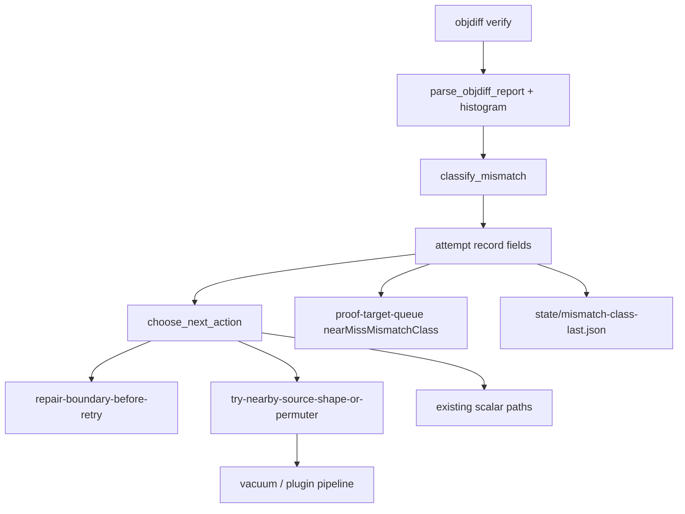

# Mismatch-Class Routing Plan

## Summary

Extend objdiff verification to preserve instruction-level mismatch histograms, classify each synthesis attempt into a stable primary class (`operand`, `opcode`, `insert-delete`, `boundary-suspect`, `unclassified`), and route autonomous repair playbooks by class instead of sending every near-miss to the same permuter path. Classification and routing stay advisory; only objdiff-zero under `verified/` moves the proof ladder. Builds on completed agent-loop-closure executors (see origin).

## Problem Frame

`autonomous_policy.choose_next_action` and `near_miss_repair` route on scalar `bestDifference` only. `parse_objdiff_report` collapses all non-match results to `differences: 1` even though raw objdiff JSON (stored in `output`) carries instruction kinds (`INSERTION`, `DELETION`, `REPLACEMENT`, `OPCODE_MISMATCH`, `ARGUMENT_MISMATCH`). Operators cannot see *why* a function is stuck or which repair to try next. Origin: `docs/brainstorms/2026-07-25-mismatch-class-routing-requirements.md`.

## Requirements Traceability

| ID | Requirement | Plan coverage |
|----|-------------|---------------|
| R1–R3 | Mismatch evidence on verify reports and attempt records | U0, U2 |
| R4–R6 | Deterministic classifier + dominance rules | U1 |
| R7–R9 | Policy routing by class with decision payload fields | U3 |
| R10–R12 | Near-miss repair + proof-target queue metadata | U4 |
| R13–R14 | Operator surfaces and receipt documentation | U5 |
| AE1–AE5 | Acceptance examples | U0–U6 test scenarios |
| KTD1–KTD5 | Honesty, taxonomy size, fail-open | U0, U1, U6 |

## Key Technical Decisions

- KTD1. **Parser-first, classifier-second** — Extend `objdiff_verification.parse_objdiff_report` to emit `mismatchHistogram`, `detailLevel`, and preserve scalar `differences` semantics for existing consumers. Rationale: origin R1–R2; avoids breaking `proof_campaign`, `proof_target`, and honesty gates that read `differences` today.
- KTD2. **New `mismatch_classify.py` module** — Single `classify_mismatch(histogram, boundary_quality) -> MismatchClassification` consumed by plugins, policy, and queue builders. Rationale: origin R4–R6; keeps dominance rules testable in isolation.
- KTD3. **Boundary-suspect preempts histogram** — When `boundaryQuality.status == suspect`, primary class is `boundary-suspect` regardless of histogram (origin R4). Policy routes to existing `repair-boundary-before-retry` before near-miss permuter (origin R7, AE2).
- KTD4. **`routedPlaybook` label, shared permuter flag (OQ1 default)** — v1 uses one `sourceShapeSearch=True` path but records distinct `routedPlaybook` values (`permuter-operand`, `permuter-opcode`, `permuter-insert-delete`, `boundary-repair`, `scalar-default`) on policy decisions and repair receipts. Separate permuter CLI profiles deferred unless `source_plugins` already exposes mode flags cheaply.
- KTD5. **Classify on any non-zero bucket (OQ2 default)** — A single `ARGUMENT_MISMATCH` row is enough for `operand` when it is the only non-zero bucket; dominance rule still applies when multiple buckets exist.
- KTD6. **Unify attempt visibility for plugin engine** — Stamp mismatch fields on plugin attempt records and teach `proof_target.load_near_miss_maps` to read both `source-synthesis/attempts.jsonl` and per-vacuum `plugin-attempts.jsonl` (or summary `attemptsPath`). Rationale: default pipeline uses plugin engine; near-miss maps today only scan legacy `attempts.jsonl`.
- KTD7. **Fail-open on fallback** — Reports with `fallback: objdump-disassembly-byte-compare` or empty histogram → `unclassified`, `detailLevel: scalar-only`; scalar routing unchanged (origin KTD5, AE4).

## High-Level Technical Design

**Primary classes → playbooks (v1)**

| Class | Policy action | routedPlaybook |
|-------|---------------|----------------|
| `boundary-suspect` | `repair-boundary-before-retry` | `boundary-repair` |
| `operand` | `try-nearby-source-shape-or-permuter` | `permuter-operand` |
| `opcode` | `try-nearby-source-shape-or-permuter` | `permuter-opcode` |
| `insert-delete` | `try-nearby-source-shape-or-permuter` | `permuter-insert-delete` |
| `unclassified` | existing scalar threshold behavior | `scalar-default` |

---

## Implementation Units

### U0. Objdiff histogram parsing

**Goal:** Preserve instruction mismatch counts in verify reports without breaking fail-closed scalar semantics.

**Requirements:** R1–R3, AE1, AE4, KTD1, KTD7

**Dependencies:** None

**Files:**
- Modify: `src/agentdecompile_recovery/objdiff_verification.py`
- Create: `tests/fixtures/objdiff/instruction-mismatch-sample.json` (minimal canonical fixture; validate field names against one live `verify.raw.json` during implementation)
- Test: `tests/test_objdiff_mismatch_histogram.py`

**Approach:** Walk parsed objdiff JSON via existing `iter_json_objects`. Collect instruction rows with a `kind` in the five known mismatch types; build `mismatchHistogram` dict and `instructionMismatchCount`. Set `detailLevel: instruction` when histogram non-empty, else `scalar-only`. Keep current `match_percent` → `differences` logic unchanged. Reject histogram-based promotion — `is_proven_zero` unchanged.

**Execution note:** Capture one real objdiff JSON from a near-miss case before finalizing fixture field names.

**Patterns to follow:** `tests/test_verifier_honesty.py`, `scripts/lib/verify-objdiff.sh` match_percent parsing.

**Test scenarios:**
- Covers AE1. JSON with 3× `ARGUMENT_MISMATCH` + 1× `OPCODE_MISMATCH` → histogram counts correct; scalar `differences` still 1.
- Empty stdout → `status: error`, no histogram (existing honesty).
- Objdump fallback report → no histogram, `detailLevel: scalar-only`.
- Valid match_percent 100 → `differences: 0`, histogram empty or omitted.

**Verification:** New unit tests pass; `test_verifier_honesty.py` unchanged outcomes.

---

### U1. Mismatch classifier

**Goal:** Deterministic primary-class assignment from histogram + boundary context.

**Requirements:** R4–R6, AE2, AE3, KTD2

**Dependencies:** U0

**Files:**
- Create: `src/agentdecompile_recovery/mismatch_classify.py`
- Test: `tests/test_mismatch_classify.py`

**Approach:** `classify_mismatch(*, histogram: dict[str, int], boundary_quality: dict | None, detail_level: str, fallback: str | None) -> dict` returning `mismatchClass`, `primaryMismatchKind`, `mismatchHistogram` echo. Dominance: bucket >50% of total instruction mismatches OR sole non-zero bucket. `boundary-suspect` when boundary status is `suspect`. Ties → `unclassified`. Empty histogram or `detail_level == scalar-only` → `unclassified`.

**Patterns to follow:** Small pure functions like `proof_target.optional_int` style; no I/O.

**Test scenarios:**
- Covers AE2. `boundary-suspect` + operand histogram → class `boundary-suspect`.
- Covers AE3. Equal INSERTION/DELETION only → `insert-delete`.
- Sole `ARGUMENT_MISMATCH` → `operand`.
- Empty histogram → `unclassified`.

**Verification:** Unit tests cover all five classes and tie-break.

---

### U2. Stamp attempts with mismatch metadata

**Goal:** Every synthesis/plugin attempt carries class fields for downstream policy and queue.

**Requirements:** R3, R6

**Dependencies:** U0, U1

**Files:**
- Modify: `src/agentdecompile_recovery/source_plugins.py`
- Modify: `src/agentdecompile_recovery/source_parity_synthesize.py` (legacy attempts.jsonl path)
- Modify: `src/agentdecompile_recovery/plugin_pipeline.py` (pass boundary quality into classifier context)
- Test: extend `tests/test_plugin_autonomy_policy.py` or add `tests/test_mismatch_attempt_metadata.py`

**Approach:** After objdiff verify in `SourceCandidateObjdiffPlugin`, run classifier on report fields; attach `mismatchClass`, `mismatchHistogram`, `primaryMismatchKind`, `detailLevel` to attempt dict before append to `plugin-attempts.jsonl`. Mirror for synthesize `append_jsonl` rows when verify report present.

**Patterns to follow:** Existing attempt schema `agentdecompile.source-parity-synthesis-attempt.v1`; additive fields only.

**Test scenarios:**
- Stub verify report with operand histogram → attempt row includes `mismatchClass: operand`.
- Missing verify detail → `mismatchClass: unclassified`.

**Verification:** Attempt JSON in tmp_path contains new fields; no change to promote path without objdiff zero.

---

### U3. Policy routing by mismatch class

**Goal:** `choose_next_action` selects playbook from class before generic near-miss default.

**Requirements:** R7–R9, AE2, KTD3, KTD4

**Dependencies:** U1, U2

**Files:**
- Modify: `src/agentdecompile_recovery/autonomous_policy.py`
- Modify: `src/agentdecompile_recovery/source_plugins.py` (`prepare_retry` sets `routedPlaybook` / `sourceShapeSearch` from policy decision)
- Test: extend `tests/test_autonomy_budget.py`, `tests/test_plugin_autonomy_policy.py`

**Approach:** Read `mismatchClass` from latest attempt or verifier plugin data. Priority order unchanged for budget, generator exhausted, compile errors. Insert class routing after boundary-suspect check on slice quality and before scalar `best_diff <= 8` branch. Decision payload adds `mismatchClass`, `mismatchHistogram`, `routedPlaybook`. `boundary-suspect` class forces `repair-boundary-before-retry` even when diff ≤ 8.

**Patterns to follow:** Existing action strings; `agentdecompile.autonomous-policy-decision.v1` additive fields.

**Test scenarios:**
- Covers AE2. Near-miss diff 4 + `boundary-suspect` → `repair-boundary-before-retry`, not permuter.
- Operand class + diff 3 → `try-nearby-source-shape-or-permuter`, `routedPlaybook: permuter-operand`.
- Unclassified + diff 3 → same action as today (scalar default).
- Objdiff zero → `promote-or-export` regardless of class.

**Verification:** Policy unit tests; proof numerator tests still pass.

---

### U4. Near-miss repair and queue metadata

**Goal:** Rank and repair near-miss targets using class metadata; expose class on queue entries.

**Requirements:** R10–R12, AE5

**Dependencies:** U2, U3

**Files:**
- Modify: `src/agentdecompile_recovery/proof_target.py`
- Modify: `src/agentdecompile_recovery/near_miss_repair.py`
- Test: extend `tests/test_proof_target.py`, `tests/test_near_miss_repair.py`

**Approach:** `load_near_miss_maps` also tracks latest `mismatchClass` per function from attempts (both jsonl paths per KTD6). Queue builder sets optional `nearMissMismatchClass`. `select_near_miss_targets` boosts `operand` and `insert-delete` within threshold (additive score, same honesty). `run_near_miss_repair` records per-target `mismatchClass` and `routedPlaybook` in `attempted[]`; pass `routedPlaybook` into vacuum context when seeding.

**Patterns to follow:** Existing near-miss score boost (+80/+40); `NEAR_MISS_MAX_DIFF = 8`.

**Test scenarios:**
- Queue entry with `nearMissMismatchClass: operand` sorts ahead of equal diff unclassified (when scores tie-break).
- Repair receipt lists class per attempted target.
- Covers AE5. Repair without objdiff zero → ladder numerator unchanged.

**Verification:** Extended unit tests; `test_proof_campaign_loop.py` still passes.

---

### U5. Operator surfaces

**Goal:** Operators see mismatch class and recommended playbook in next actions and runbook.

**Requirements:** R13–R14

**Dependencies:** U3, U4

**Files:**
- Modify: `src/agentdecompile_recovery/critical_path.py`
- Modify: `src/agentdecompile_recovery/recovery_status.py` (if near-miss summary surfaced there)
- Modify: `docs/CRITICAL_PATH.md`
- Create: write path `state/mismatch-class-last.json` from classifier/policy hot path (last classified attempt summary)

**Approach:** Extend `_action_near_miss_repair` and related next-action builders to include `mismatchClass` and `routedPlaybook` when present. Document receipt schema in CRITICAL_PATH table. `mismatch-class-last.json` schema `agentdecompile.mismatch-class-last.v1` with `functionName`, `mismatchClass`, `histogram`, `routedPlaybook`, `writtenAt`, `claimBoundary`.

**Patterns to follow:** Agent-loop-closure receipt table entries in `docs/CRITICAL_PATH.md`.

**Test scenarios:**
- `build_next_actions` with synthetic near-miss + class → action text mentions class/playbook.
- Test expectation: none for pure doc edit — behavior covered by `tests/test_critical_path_next_actions.py` extension.

**Verification:** `test_critical_path_next_actions.py` updated assertions.

---

### U6. Honesty regression and attempt-path unification

**Goal:** Guard proof gates; ensure plugin attempts feed near-miss maps.

**Requirements:** Success criteria, KTD6, KTD7

**Dependencies:** U0–U5

**Files:**
- Modify: `src/agentdecompile_recovery/proof_target.py` (attempt path merge if not complete in U4)
- Test: `tests/test_verifier_honesty.py`, `tests/test_proof_campaign_loop.py`, `tests/test_mismatch_classify.py` (integration smoke)

**Approach:** Run full relevant pytest subset. Add test that `mismatchClass` on attempt does not satisfy `is_objdiff_zero_accept`. Confirm `infer_near_misses` sees plugin attempts. Document in plan completion note if live objdiff field names required fixture tweak.

**Test scenarios:**
- Attempt with `mismatchClass: operand` and `differences: 3` does not promote.
- Campaign near-miss terminal still does not increment ladder without accept.
- Plugin `plugin-attempts.jsonl` row visible in near-miss map.

**Verification:** `uv run pytest tests/test_verifier_honesty.py tests/test_proof_campaign_loop.py tests/test_objdiff_mismatch_histogram.py tests/test_mismatch_classify.py tests/test_autonomy_budget.py tests/test_near_miss_repair.py tests/test_proof_target.py tests/test_critical_path_next_actions.py -q`

---

## Scope Boundaries

### In scope

U0–U6 as above.

### Deferred to Follow-Up Work

- Separate permuter CLI profiles per class (beyond `routedPlaybook` labels).
- PE relocation / string-pool subclasses.
- LLM mismatch explanation for agents.
- Shell `verify-objdiff.sh` histogram parity (only if operators depend on it for gates).
- Live swkotor proof-scale smoke (proof-scale plan U6).

### Outside this product's identity

- Using mismatch class as proof tier or promoting non-zero diff to `verified/`.

---

## Risks and Dependencies

| Risk | Mitigation |
|------|------------|
| Objdiff JSON field names differ by version | Capture live sample in U0; fixture + fail-open to `unclassified` |
| Plugin vs legacy attempts.jsonl split | KTD6 unification in U4/U6 |
| Policy priority regression | Extend existing autonomy tests; preserve priority order |
| False confidence from class labels | `claimBoundary` on all new receipts; honesty tests |

**Assumption:** Instruction mismatch kinds appear on nested instruction objects in objdiff JSON-pretty output (to be validated in U0).

---

## Open Questions

- OQ1 resolved for v1: shared permuter, distinct `routedPlaybook` (KTD4).
- OQ2 resolved for v1: classify on any non-zero bucket (KTD5).
