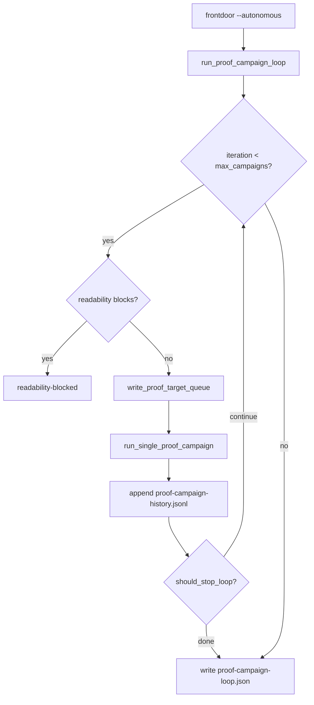

# Proof Campaign Loop Plan

## Summary

Extend `--autonomous` with a **bounded inner loop** that repeats proof-target seed → vacuum bridge → campaign receipt until a typed stop fires or `--autonomous-max-campaigns` is exhausted. Default `max-campaigns=1` preserves today's single-shot behavior. Closes STRATEGY **Agent loop completion** without weakening objdiff honesty.

## Problem Frame

Proof-ladder scale-up shipped `facts/proof-target-queue.json`, per-session `state/proof-campaign.json`, and critical-path `proof-scale` — but operators still re-shell `--resume --autonomous` for each accept toward `nextRung`. Origin: `docs/brainstorms/2026-07-25-proof-campaign-loop-requirements.md`.

## Requirements Traceability

| ID | Requirement | Plan coverage |
|----|-------------|---------------|
| R1–R3 | Multi-campaign loop + stop conditions | U2, U3 |
| R2 | Autonomy order preserved per iteration | U2 |
| R4 | Loop-level receipt | U3 |
| R5–R7 | Campaign budget + re-seed safety + honesty | U1, U2, U6 |
| R8–R10 | Operator surfaces + history | U4, U5 |
| R11–R13 | Honesty invariants | U6 |

## Key Technical Decisions

- KTD1. **`run_proof_campaign_loop()` in `proof_campaign.py`** — Extract single-campaign body from `frontdoor.py` into `run_single_proof_campaign()`; loop orchestrator colocated with existing receipt writers. Rationale: origin KTD1; keeps frontdoor thin.
- KTD2. **`AutonomyBudget.max_campaigns` default 1** — New field on existing dataclass + CLI `--autonomous-max-campaigns`. Rationale: origin KTD3 backward compatibility.
- KTD3. **Stop-on-accept opt-in** — `--autonomous-stop-on-accept` defaults **false**; loop also stops when `functionsToNextRung == 0`, bridge fails, empty queue, or readability blocks. Rationale: allows multi-accept campaigns when operator sets `max-campaigns` > 1 without forcing early exit after first accept.
- KTD4. **Refresh proof-target queue each iteration** — Call `write_proof_target_queue(work_dir)` before seed so ladder targeting and verified subtraction stay current. Rationale: satisfies R6 after accepts land mid-loop.
- KTD5. **History jsonl append per iteration** — `state/proof-campaign-history.jsonl` one row per campaign; `state/proof-campaign-loop.json` is the operator summary. Rationale: origin KTD5.

## High-Level Technical Design

---

## Implementation Units

### U1. Campaign budget flags

**Goal:** CLI and budget model for multi-campaign autonomy.

**Requirements:** R5

**Dependencies:** None

**Files:**
- Modify: `src/agentdecompile_recovery/autonomy_budget.py`
- Modify: `src/agentdecompile_recovery/frontdoor.py` (argparse + programmatic API)
- Test: `tests/test_proof_campaign_loop.py` (new, budget defaults)

**Approach:** Add `max_campaigns: int = 1` and `stop_on_accept: bool = False` to `AutonomyBudget` and `budget_from_args()`. Add `--autonomous-max-campaigns` (default 1) and `--autonomous-stop-on-accept` (store_true) to reconstruct argparse; thread through `build_reconstruct_argv` / SDK helpers.

**Test scenarios:**
- Default budget: `max_campaigns == 1`, `stop_on_accept is False`.
- Parsed args: `--autonomous-max-campaigns 3` reflected in budget JSON.

**Verification:** Unit test on `budget_from_args`.

---

### U2. Single-campaign runner extraction

**Goal:** Move autonomous vacuum bridge into reusable function.

**Requirements:** R2, R6

**Dependencies:** U1

**Files:**
- Modify: `src/agentdecompile_recovery/proof_campaign.py`
- Modify: `src/agentdecompile_recovery/frontdoor.py`
- Test: `tests/test_proof_campaign_loop.py`

**Approach:** Add `run_single_proof_campaign(work_dir, budget, *, run_decomp_cli_bridge=...)` returning a structured result: `status`, `reason`, `seed_receipt`, `bridge_returncode`, `attempted`, `campaign_receipt`. Body is today's frontdoor block (readability check stays in loop driver — see U3). Before seed: `write_proof_target_queue(work_dir)`. Reuse existing `write_proof_campaign`, `seed_vacuum_queue_from_work_dir`, `write_autonomy_budget_receipt`.

**Patterns to follow:** `run_readability_repair()` return shape in `readability_repair.py`.

**Test scenarios:**
- Mock bridge: empty seed → result status `empty-queue`, no bridge call.
- Mock bridge success: campaign receipt written, `attempted` matches seeded count.

**Verification:** Unit tests with temp work dir + injected bridge callable.

---

### U3. Loop orchestrator + stop logic

**Goal:** Repeat campaigns until typed stop or budget exhausted.

**Requirements:** R1, R3, R4, R10

**Dependencies:** U2

**Files:**
- Modify: `src/agentdecompile_recovery/proof_campaign.py`
- Test: `tests/test_proof_campaign_loop.py`

**Approach:** Add `run_proof_campaign_loop(work_dir, budget, ...)`:
1. Snapshot ladder at loop start.
2. If `readability_repair_blocks_vacuum` and `max_functions > 0`: run readability repair once, write loop receipt `readability-blocked`, return (matches today — no vacuum in readability-only head case).
3. For `i in range(max_campaigns)`:
   - If `functionsToNextRung == 0` (from fresh `build_proof_ladder`): stop `accepted` or `complete`.
   - Run `run_single_proof_campaign`.
   - Append iteration row to `state/proof-campaign-history.jsonl`.
   - Accumulate accepts / near-misses.
   - Stop if: bridge failed; empty queue on seed; `stop_on_accept` and iteration had `accepts > 0`; near-miss with no accepts and last iteration (optional: continue — prefer stop only on campaign cap per AE2).
4. Write `state/proof-campaign-loop.json`: `campaignCount`, `totalAttempted`, `totalAccepts`, `numeratorDelta`, `terminalStatus`, `iterations` summary, ladder before/after.

**Stop precedence (first match wins):** readability-blocked (pre-loop) → bridge-failed → empty-queue → `functionsToNextRung == 0` → stop-on-accept with accept → campaign budget exhausted (terminal: `near-miss` if any near-miss and zero accepts, else `budget-stop`).

**Test scenarios:**
- Covers AE1. `max_campaigns=3`, mock bridge, inject accept on iteration 2 → loop stops early when `stop_on_accept=True`.
- Covers AE2. Three near-miss iterations → terminal `near-miss`, numerator unchanged.
- Covers AE3. Readability blocks → no vacuum bridge, `readability-blocked`.
- Covers AE4. `max_campaigns=1` → exactly one `run_single_proof_campaign` call.

**Verification:** pytest with mocks; no live Wine.

---

### U4. Frontdoor wiring

**Goal:** Replace inline autonomous block with loop driver.

**Requirements:** R1, R5

**Dependencies:** U3

**Files:**
- Modify: `src/agentdecompile_recovery/frontdoor.py`
- Test: `tests/test_proof_campaign_loop.py` (integration-style with monkeypatch)

**Approach:** Replace lines ~504–595 autonomous body with `run_proof_campaign_loop(work_dir, budget, run_decomp_cli_bridge=run_decomp_cli_bridge)`. Preserve dump-source after loop when requested.

**Verification:** Monkeypatched loop returns expected rc; dump still runs.

---

### U5. Operator surfaces

**Goal:** Document multi-campaign flags in critical-path and status.

**Requirements:** R8, R9

**Dependencies:** U3

**Files:**
- Modify: `src/agentdecompile_recovery/critical_path.py` (`_action_proof_scale`)
- Modify: `src/agentdecompile_recovery/recovery_status.py`
- Modify: `docs/CRITICAL_PATH.md`
- Test: `tests/test_critical_path_next_actions.py`

**Approach:** When `functionsToNextRung > 1`, extend `commandHint` with `--autonomous-max-campaigns N` (cap N at min(functionsToNextRung, 10)). Recovery status adds `proofCampaignLoop` block from `state/proof-campaign-loop.json`.

**Test scenarios:**
- `functionsToNextRung=5` → command hint contains `--autonomous-max-campaigns`.

**Verification:** Critical-path fixture test.

---

### U6. Honesty regression tests

**Goal:** Lock numerator invariants under loop.

**Requirements:** R7, R11, R12

**Dependencies:** U3

**Files:**
- Test: `tests/test_proof_campaign_loop.py`
- Extend: `tests/test_proof_target.py` if needed

**Approach:** Loop with mocked bridge and near-miss attempts jsonl → `build_proof_ladder` numerator unchanged. Loop metadata does not write fake verified receipts.

**Verification:** pytest unit markers.

---

## Scope Boundaries

### In scope

U1–U6; `docs/CRITICAL_PATH.md` loop receipt row.

### Deferred for later

Live swkotor smoke; auto MCP readability apply; PDB/DWARF; infinite polling daemon.

### Outside this product's identity

Advisory counts in numerator; unbounded retry until arbitrary coverage.

---

## Risks & Dependencies

| Risk | Mitigation |
|------|------------|
| Long runs when `max-campaigns` high | Default 1; document wall-clock `--autonomous-max-wall-seconds` per iteration |
| Stale queue mid-loop | `write_proof_target_queue` each iteration (KTD4) |
| Vacuum bridge non-deterministic | Named terminal on bridge-failed; history jsonl audit |

**Depends on:** Shipped proof-target queue, single campaign receipt, vacuum seed, readability repair loop, fail-closed `is_proven_zero`.

---

## Execution Posture

Characterization-first: U1 budget defaults + U6 honesty tests before frontdoor wiring. Mock `run_decomp_cli_bridge` in unit tests; optional live vacuum smoke manual only.
